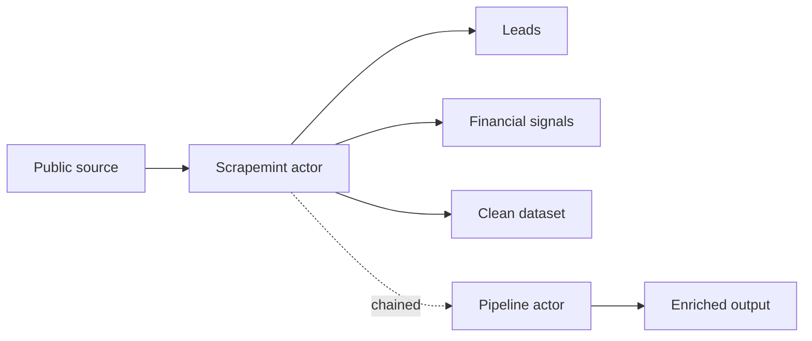

# Scrapemint

**Pay per use data actors on [Apify](https://apify.com/scrapemint).** Each one turns a public source into something you can act on: B2B leads, an early financial signal, or a clean dataset. You run it, you pay per result, no subscription.

There are **85 actors** live right now, and a new one ships every few days.

- Full catalog and runs: https://apify.com/scrapemint
- Community and new drops: https://discord.gg/Ed2VNSHbr
- Build notes and write ups: https://dev.to/scrapemint

## Catalog

### Lead generation

- [Open Source Maintainer Leads: npm & PyPI](https://apify.com/scrapemint/oss-maintainer-leads)
- [Google Play Developer Lead Scraper](https://apify.com/scrapemint/google-play-developer-leads)
- [WordPress Plugin & Theme Developer Leads](https://apify.com/scrapemint/wordpress-plugin-developer-leads)
- [Funded Startup Lead Pipeline: Form D Plus Contacts](https://apify.com/scrapemint/funded-startup-lead-pipeline)
- [Local Business Lead Pipeline: Maps + Domain + Email Intel](https://apify.com/scrapemint/local-lead-pipeline)
- [Lead Enrichment Pipeline: Emails, Phones, Socials, Company](https://apify.com/scrapemint/lead-enrichment-pipeline)
- [Hiring Velocity B2B Pipeline: Indeed + Domain + Email](https://apify.com/scrapemint/hiring-velocity-pipeline)
- [Buyer Intent Radar: Reddit, Stack Overflow, HN Leads](https://apify.com/scrapemint/buyer-intent-radar-pipeline)
- [Reddit Lead Monitor: Subreddit and Keyword Alert Feed](https://apify.com/scrapemint/reddit-lead-monitor)
- [Hacker News Keyword Alert Monitor and Lead Feed](https://apify.com/scrapemint/hn-lead-monitor)
- [Stack Overflow Question Monitor and Tag Alert Feed](https://apify.com/scrapemint/stackoverflow-lead-monitor)
- [Freelance Lead Radar: Upwork Job and Client Filter Engine](https://apify.com/scrapemint/upwork-opportunity-alert)
- [Google Maps Local Business Lead Finder, Places and Contacts](https://apify.com/scrapemint/google-maps-scraper)
- [LinkedIn Hiring Tracker Pro and Recruiter Contact Finder](https://apify.com/scrapemint/linkedin-jobs-scraper-pro)
- [LinkedIn Events Discovery and Lead Feed (No Cookies)](https://apify.com/scrapemint/linkedin-events-scraper)
- [LinkedIn Company Hiring Signal Tracker](https://apify.com/scrapemint/linkedin-company-hiring-tracker)

### Financial signals

- [SEC Form 4 Insider Trading Tracker: Every Insider Buy and Sell](https://apify.com/scrapemint/sec-form4-insider-tracker)
- [SEC 8-K Tracker: Earnings, Exec Changes, M&A, Cyber Events](https://apify.com/scrapemint/sec-8k-event-tracker)
- [SEC Insider Conviction Pipeline: Form 4 Buys + 8-K Catalysts](https://apify.com/scrapemint/sec-insider-conviction-pipeline)
- [SEC 13F Whale Tracker: New Buys, Adds, Trims, Exits](https://apify.com/scrapemint/sec-13f-whale-tracker)
- [Activist Stake Catalyst: 13D/13G Plus Insider Buying](https://apify.com/scrapemint/activist-stake-catalyst-pipeline)
- [Buyback Insider Conviction: 8-K Repurchase Plus Insider Buys](https://apify.com/scrapemint/buyback-insider-conviction-pipeline)
- [Corporate Catalyst: Material 8-K Plus Insider Buying](https://apify.com/scrapemint/corporate-catalyst-pipeline)
- [Smart Money Buzz: Insider Buying Plus Reddit and HN Chatter](https://apify.com/scrapemint/smart-money-buzz-pipeline)
- [Event Buzz Radar: Material 8-K Plus Reddit and HN Chatter](https://apify.com/scrapemint/event-buzz-radar-pipeline)
- [FDA Approval Catalyst: Approvals Plus Insider Buying](https://apify.com/scrapemint/fda-approval-catalyst-pipeline)
- [Clinical Catalyst Radar for Biotech](https://apify.com/scrapemint/clinical-catalyst-pipeline)
- [Federal Contract Momentum: Gov Awards + Insider Buying](https://apify.com/scrapemint/federal-contract-momentum-pipeline)
- [Macro Event Edge: Calendar, Trader Sentiment, Market Odds](https://apify.com/scrapemint/macro-event-edge-pipeline)
- [Emerging Launch Radar: GitHub Trending + Hacker News Momentum](https://apify.com/scrapemint/emerging-launch-radar-pipeline)
- [Crypto Whale Tracker: DEX Token Launches + Wallet Alerts](https://apify.com/scrapemint/crypto-whale-token-launch-tracker)
- [TradingView Ideas Intelligence Feed (No Login)](https://apify.com/scrapemint/tradingview-ideas-scraper)
- [ForexFactory Economic Calendar Feed (No Login)](https://apify.com/scrapemint/forexfactory-economic-calendar)
- [Polymarket Prediction Market Tracker by Category](https://apify.com/scrapemint/polymarket-market-monitor)
- [Polymarket Trade Intelligence: Order Book and Prices](https://apify.com/scrapemint/polymarket-scraper)
- [Sports Odds Live Feed: DraftKings, Pinnacle, FanDuel, BetMGM](https://apify.com/scrapemint/sports-odds-scraper) ([source](https://github.com/Ken-Mutisya/sports-odds-scraper))
- [Sports Odds Movement and Arbitrage Tracker](https://apify.com/scrapemint/sports-odds-movement-tracker)

### Reviews & reputation

- [App Store and Play Store Review Intelligence](https://apify.com/scrapemint/app-review-intelligence)
- [TripAdvisor Review Intelligence and Hotel Reputation Monitor](https://apify.com/scrapemint/tripadvisor-review-intelligence)
- [Steam Game and Review Intelligence Monitor](https://apify.com/scrapemint/steam-game-review-intelligence)

### Social & content

- [Instagram Influencer Analyzer & Sponsored Post Tracker](https://apify.com/scrapemint/instagram-scraper)
- [YouTube Channel Intelligence Pro: Videos, Comments, Transcripts](https://apify.com/scrapemint/youtube-scraper)
- [Threads Brand Mentions, Keyword Alerts & Influencer Discovery](https://apify.com/scrapemint/meta-threads-intelligence)
- [Substack Newsletter Intelligence: Top Writer Tracker](https://apify.com/scrapemint/substack-newsletter-intelligence)
- [Product Hunt Launch Tracker and Topic Alert Feed](https://apify.com/scrapemint/producthunt-launch-tracker)
- [LinkedIn Hashtag & Topic Post Tracker (No Cookies)](https://apify.com/scrapemint/linkedin-hashtag-posts-scraper)

### Research, jobs & dev

- [Google Patents Intelligence: Claims, Citations, Family Tree](https://apify.com/scrapemint/google-patents-scraper) ([source](https://github.com/Ken-Mutisya/google-patents-scraper))
- [Pharma Research & Clinical Trial Monitor](https://apify.com/scrapemint/pubmed-clinical-trials-intelligence)
- [Research to Patent Commercialization Radar](https://apify.com/scrapemint/research-patent-radar-pipeline)
- [GitHub Issue and PR Alert Monitor by Keyword](https://apify.com/scrapemint/github-issue-monitor)
- [Indeed Hiring Tracker Pro: Salaries and Company Intel](https://apify.com/scrapemint/indeed-jobs-scraper)
- [LinkedIn Hiring Tracker & Salary Intelligence](https://apify.com/scrapemint/linkedin-jobs-scraper)
- [LinkedIn Job Market Trend Intelligence](https://apify.com/scrapemint/linkedin-job-market-trend-scraper)

### Travel, ecommerce & local

- [Vacation Rental Revenue Estimator & Competitor Intelligence](https://apify.com/scrapemint/airbnb-market-intelligence)
- [Zillow Home Price Intelligence: Sale History, Rentals](https://apify.com/scrapemint/zillow-home-price-scraper)
- [Flight Price Tracker: Google Flights Fares by Route](https://apify.com/scrapemint/flight-price-tracker)
- [Flight Delay & Cancellation Tracker](https://apify.com/scrapemint/flight-delay-tracker)
- [TripAdvisor Travel Intelligence: Hotels and More](https://apify.com/scrapemint/tripadvisor-scraper)
- [TripAdvisor Property Rank & Competitor Benchmark Tracker](https://apify.com/scrapemint/tripadvisor-property-rank-tracker)
- [Viator Tours Intelligence: Activities, Prices, Reviews](https://apify.com/scrapemint/viator-tours-tracker)
- [Marketplace Arbitrage Radar, Local Resale Deal Intelligence](https://apify.com/scrapemint/facebook-marketplace-deal-finder)

### Web utilities

- [Domain Intelligence: WHOIS + DNS Bulk Lookup](https://apify.com/scrapemint/domain-intelligence)

---

Built with Node, Crawlee, and Playwright. Pricing is pay per event on Apify, so a small test run costs only a few cents before you scale.
