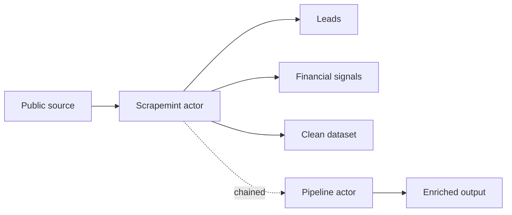

# Scrapemint

**Pay per use data actors on [Apify](https://apify.com/scrapemint).** Each one turns a public source into something you can act on: B2B leads, an early financial signal, or a clean dataset. You run it, you pay per result, no subscription.

- Full catalog and runs: https://apify.com/scrapemint
- Community and new drops: https://discord.gg/Ed2VNSHbr
- Build notes and write ups: https://dev.to/scrapemint

## Catalog

<!-- CATALOG:START -->

There are **243** actors live right now, and a new one ships every few days.

### Lead generation

- [Open Source Maintainer Leads: npm & PyPI](https://apify.com/scrapemint/oss-maintainer-leads)
- [Google Play Developer Lead Scraper](https://apify.com/scrapemint/google-play-developer-leads)
- [Apple App Store Developer Leads](https://apify.com/scrapemint/apple-app-developer-leads)
- [WordPress Plugin & Theme Developer Leads](https://apify.com/scrapemint/wordpress-plugin-developer-leads)
- [Shopify App Store Developer Leads](https://apify.com/scrapemint/shopify-app-developer-leads)
- [Chrome Extension Developer Leads: Publisher Contacts](https://apify.com/scrapemint/chrome-extension-developer-leads)
- [VS Code Extension Developer Leads: Publisher Contacts](https://apify.com/scrapemint/vscode-extension-developer-leads)
- [Steam Game Studio Lead Scraper](https://apify.com/scrapemint/steam-game-studio-leads)
- [Twitch Streamer Leads Scraper: Contacts by Game & Followers](https://apify.com/scrapemint/twitch-streamer-leads)
- [Podcast Host Lead Scraper](https://apify.com/scrapemint/podcast-host-leads)
- [Y Combinator Startup Lead Scraper](https://apify.com/scrapemint/yc-startup-leads)
- [Funded Startup Lead Pipeline: Form D Plus Contacts](https://apify.com/scrapemint/funded-startup-lead-pipeline)
- [Hacker News Who is Hiring Company Leads](https://apify.com/scrapemint/hn-hiring-company-leads)
- [Local Business Lead Pipeline: Maps + Domain + Email Intel](https://apify.com/scrapemint/local-lead-pipeline)
- [Lead Enrichment Pipeline: Emails, Phones, Socials, Company](https://apify.com/scrapemint/lead-enrichment-pipeline)
- [Hiring Velocity B2B Pipeline: Indeed + Domain + Email](https://apify.com/scrapemint/hiring-velocity-pipeline)
- [Buyer Intent Radar: Reddit, Stack Overflow, HN Leads](https://apify.com/scrapemint/buyer-intent-radar-pipeline)
- [Reddit Lead Monitor: Subreddit and Keyword Alert Feed](https://apify.com/scrapemint/reddit-lead-monitor)
- [Hacker News Keyword Alert Monitor and Lead Feed](https://apify.com/scrapemint/hn-lead-monitor)
- [Stack Overflow Question Monitor and Tag Alert Feed](https://apify.com/scrapemint/stackoverflow-lead-monitor)
- [Freelance Lead Radar: Upwork Job and Client Filter Engine](https://apify.com/scrapemint/upwork-opportunity-alert)
- [Google Maps Local Business Lead Finder, Places and Contacts](https://apify.com/scrapemint/google-maps-scraper)
- [LinkedIn Hiring Tracker Pro and Recruiter Contact Finder](https://apify.com/scrapemint/linkedin-jobs-scraper-pro)
- [LinkedIn Company Hiring Signal Tracker](https://apify.com/scrapemint/linkedin-company-hiring-tracker)
- [ATS Hiring-Signal Tracker (Greenhouse + Lever)](https://apify.com/scrapemint/ats-hiring-signal-tracker)
- [Website Contact Scraper: Emails, Phones & Social Profiles](https://apify.com/scrapemint/website-contact-scraper)
- [Aircraft Owner Leads: FAA Registration Lookup](https://apify.com/scrapemint/aircraft-owner-leads)
- [Building Permit Leads Scraper: New Permits by City & Trade](https://apify.com/scrapemint/building-permit-leads)
- [Healthcare Provider Leads Scraper: NPI Contacts by Specialty](https://apify.com/scrapemint/healthcare-provider-leads)
- [FDA Medical Device Manufacturer Leads: Registered Firms](https://apify.com/scrapemint/fda-device-manufacturer-leads)
- [Restaurant Inspection Leads: Health Violations by City](https://apify.com/scrapemint/restaurant-inspection-leads)
- [Nonprofit Leads Scraper: IRS 990 Revenue, Assets & Contacts](https://apify.com/scrapemint/nonprofit-leads-scraper)
- [New Business Registration Leads: Fresh LLC & Corp Filings](https://apify.com/scrapemint/new-business-registration-leads)
- [Newly Registered Domain Leads: Daily New Domains by Keyword](https://apify.com/scrapemint/newly-registered-domain-leads)
- [Government Contract Winner Leads: New Federal Contract Awards](https://apify.com/scrapemint/government-contract-winner-leads)

### Financial signals & SEC filings

- [SEC Form 4 Insider Trading Tracker: Every Insider Buy and Sell](https://apify.com/scrapemint/sec-form4-insider-tracker)
- [SEC 8-K Tracker: Earnings, Exec Changes, M&A, Cyber Events](https://apify.com/scrapemint/sec-8k-event-tracker)
- [SEC 13F Whale Tracker: New Buys, Adds, Trims, Exits](https://apify.com/scrapemint/sec-13f-whale-tracker)
- [SEC Company Filings Feed: Every Filing by Ticker](https://apify.com/scrapemint/sec-company-filings-feed)
- [SEC Filing Full-Text Search Scraper](https://apify.com/scrapemint/sec-filing-fulltext-scraper)
- [SEC Insider Conviction Pipeline: Form 4 Buys + 8-K Catalysts](https://apify.com/scrapemint/sec-insider-conviction-pipeline)
- [Activist Stake Catalyst: 13D/13G Plus Insider Buying](https://apify.com/scrapemint/activist-stake-catalyst-pipeline)
- [Buyback Insider Conviction: 8-K Repurchase Plus Insider Buys](https://apify.com/scrapemint/buyback-insider-conviction-pipeline)
- [Corporate Catalyst: Material 8-K Plus Insider Buying](https://apify.com/scrapemint/corporate-catalyst-pipeline)
- [Smart Money Buzz: Insider Buying Plus Reddit and HN Chatter](https://apify.com/scrapemint/smart-money-buzz-pipeline)
- [Event Buzz Radar: Material 8-K Plus Reddit and HN Chatter](https://apify.com/scrapemint/event-buzz-radar-pipeline)
- [FDA Approval Catalyst: Approvals Plus Insider Buying](https://apify.com/scrapemint/fda-approval-catalyst-pipeline)
- [Clinical Catalyst Radar for Biotech](https://apify.com/scrapemint/clinical-catalyst-pipeline)
- [Federal Contract Momentum: Gov Awards + Insider Buying](https://apify.com/scrapemint/federal-contract-momentum-pipeline)
- [Macro Event Edge: Calendar, Trader Sentiment, Market Odds](https://apify.com/scrapemint/macro-event-edge-pipeline)
- [Emerging Launch Radar: GitHub Trending + Hacker News Momentum](https://apify.com/scrapemint/emerging-launch-radar-pipeline)
- [Upcoming Insider Stock Sales: SEC Form 144 Notices](https://apify.com/scrapemint/insider-planned-stock-sales)
- [Institutional Ownership Tracker: Who Owns a Stock](https://apify.com/scrapemint/institutional-ownership-tracker)
- [Short Selling Data Tracker (FINRA)](https://apify.com/scrapemint/short-selling-data-tracker)
- [CFTC Commitments of Traders (COT) Tracker](https://apify.com/scrapemint/cftc-cot-tracker)

### Stocks & markets

- [Stock Market Price History Scraper](https://apify.com/scrapemint/stock-price-history-scraper)
- [Stock Market Fundamentals Scraper](https://apify.com/scrapemint/stock-market-fundamentals-scraper)
- [Stock Earnings Calendar Scraper](https://apify.com/scrapemint/stock-earnings-calendar-scraper)
- [Stock Earnings Estimates & Results: EPS Forecast vs Actual](https://apify.com/scrapemint/stock-earnings-estimates)
- [Stock Analyst Ratings: Price Targets, Upgrades & Downgrades](https://apify.com/scrapemint/stock-analyst-ratings)
- [Stock Dividend Calendar Scraper](https://apify.com/scrapemint/stock-dividend-calendar-scraper)
- [US Stock Market Movers & Screener](https://apify.com/scrapemint/stock-market-movers)
- [Stock Options Scraper: Unusual Activity, IV & Open Interest](https://apify.com/scrapemint/stock-options-scraper)
- [Stock Trading Halts: Why a Stock Is Halted and When It Resumes](https://apify.com/scrapemint/stock-trading-halts-tracker)
- [Premarket & After-Hours Stock Prices: Gaps Before the Open](https://apify.com/scrapemint/premarket-after-hours-prices)
- [IPO Calendar Scraper](https://apify.com/scrapemint/ipo-calendar-scraper)
- [ETF & Mutual Fund Holdings: Every Stock a Fund Owns](https://apify.com/scrapemint/fund-etf-holdings)
- [TradingView Stock Screener Scraper (No Login)](https://apify.com/scrapemint/tradingview-stock-screener-scraper)
- [TradingView Ideas Intelligence Feed (No Login)](https://apify.com/scrapemint/tradingview-ideas-scraper)
- [ASX Company Announcements and Data Tracker (Australia)](https://apify.com/scrapemint/asx-announcements-tracker)
- [Commodity Futures Prices: Gold, Oil, Grains and Rates](https://apify.com/scrapemint/commodity-futures-settlements)
- [Credit Spreads, VIX & Financial Stress: Market Risk Data](https://apify.com/scrapemint/credit-spreads-market-stress)
- [Treasury Auction Results Scraper](https://apify.com/scrapemint/treasury-auction-results)

### Crypto

- [Crypto Market Data Scraper (No Login)](https://apify.com/scrapemint/crypto-market-data-scraper)
- [Crypto Fear & Greed Index, Market Cap & Trending Coins](https://apify.com/scrapemint/crypto-fear-greed-index)
- [Crypto New Coin Listings Tracker: OKX, Gate, Bitget, KuCoin](https://apify.com/scrapemint/crypto-new-listings-tracker)
- [Crypto Funding Rates & Open Interest Tracker](https://apify.com/scrapemint/crypto-funding-rates-tracker)
- [Crypto Futures vs Spot: Premium by Expiry and Annual Yield](https://apify.com/scrapemint/crypto-futures-basis-tracker)
- [Crypto Liquidations Tracker: Forced Long & Short Closeouts](https://apify.com/scrapemint/crypto-liquidations-tracker)
- [Crypto Order Book Depth: Liquidity and Slippage by Exchange](https://apify.com/scrapemint/crypto-order-book-depth)
- [Crypto Token Security Check: Honeypot, Taxes and Owner Risk](https://apify.com/scrapemint/crypto-token-security-check)
- [Crypto Whale Tracker: DEX Token Launches + Wallet Alerts](https://apify.com/scrapemint/crypto-whale-token-launch-tracker)
- [DeFi TVL, Yields & Stablecoin Tracker](https://apify.com/scrapemint/defi-tvl-tracker)
- [Deribit Crypto Options & Derivatives Tracker](https://apify.com/scrapemint/deribit-options-tracker)
- [DEX Pool Prices: History, Liquidity and Trade Flow](https://apify.com/scrapemint/dex-pool-price-tracker)
- [Hyperliquid Data: Futures Prices, Funding Rates and Positions](https://apify.com/scrapemint/hyperliquid-data)
- [Bitcoin Network Data: Fees, Hashrate, Mining Pools and Blocks](https://apify.com/scrapemint/bitcoin-network-data)
- [Ethereum & Layer 2 Gas Fees: Transaction Cost by Chain](https://apify.com/scrapemint/gas-fees-by-chain)

### Economy, rates & energy

- [World Economic Indicators Scraper: GDP, Inflation & More](https://apify.com/scrapemint/world-economic-indicators-scraper)
- [IMF Forecasts: GDP, Inflation and Debt by Country](https://apify.com/scrapemint/imf-economic-forecasts)
- [European Economic Indicators: Inflation, Jobs and Growth](https://apify.com/scrapemint/european-economic-indicators)
- [Canada Economic Data: Prices, Housing, Jobs and GDP](https://apify.com/scrapemint/canada-economic-data)
- [Australia House Prices, Inflation and Wage Growth](https://apify.com/scrapemint/australia-economic-data)
- [Labor Statistics Scraper (BLS): Inflation, Jobs & Wages](https://apify.com/scrapemint/bls-labor-statistics-scraper)
- [Central Bank Interest Rates: Policy Rates and Rate Changes](https://apify.com/scrapemint/central-bank-policy-rates)
- [Fed Rate Expectations: Meeting Odds and Rate Path](https://apify.com/scrapemint/fed-rate-expectations)
- [US Treasury Yields & Interest Rates Scraper](https://apify.com/scrapemint/us-treasury-rates-scraper)
- [Government Bond Yields Worldwide: Yield Curves by Country](https://apify.com/scrapemint/government-bond-yields-worldwide)
- [SOFR & Money Market Rates: Benchmarks and Fed Operations](https://apify.com/scrapemint/money-market-rates-tracker)
- [US Loan and Mortgage Rates: Current and History](https://apify.com/scrapemint/us-loan-mortgage-rates)
- [Currency Exchange Rates: Live & History for 160+ Currencies](https://apify.com/scrapemint/currency-exchange-rates-scraper)
- [ForexFactory Economic Calendar Feed (No Login)](https://apify.com/scrapemint/forexfactory-economic-calendar)
- [European Electricity Prices: Day-Ahead Rates and Power Mix](https://apify.com/scrapemint/european-electricity-prices)
- [Oil & Gas Inventory Report: Weekly Stocks and Draws](https://apify.com/scrapemint/oil-gas-inventory-report)
- [US Gas & Diesel Prices: Weekly Retail by Region and Grade](https://apify.com/scrapemint/us-gas-diesel-prices)

### Real estate & housing

- [Zillow Home Price Intelligence: Sale History, Rentals](https://apify.com/scrapemint/zillow-home-price-scraper)
- [Home Prices & Listings Scraper: Redfin Homes by Area](https://apify.com/scrapemint/home-listings-scraper)
- [US Rent and Home Price Index by Metro, City and Zip](https://apify.com/scrapemint/us-rent-home-price-index)
- [UK House Prices by Region and Property Type](https://apify.com/scrapemint/uk-house-prices)
- [Europe House Prices: Index and Change by Country](https://apify.com/scrapemint/europe-house-prices)

### Prediction markets, sports & betting

- [Polymarket Prediction Market Tracker by Category](https://apify.com/scrapemint/polymarket-market-monitor)
- [Polymarket Trade Intelligence: Order Book and Prices](https://apify.com/scrapemint/polymarket-scraper)
- [Kalshi Prediction Market Scraper: Live Event Odds](https://apify.com/scrapemint/kalshi-prediction-market-scraper)
- [Prediction Market Odds: Kalshi, Polymarket and PredictIt](https://apify.com/scrapemint/prediction-market-odds-comparison)
- [Sports Odds Scraper: NFL, NBA, MLB & Soccer Lines](https://apify.com/scrapemint/sports-odds-scraper)
- [Sports Odds Movement and Arbitrage Tracker](https://apify.com/scrapemint/sports-odds-movement-tracker)
- [Sportsbook Odds Tracker: Moneyline, Spread and Totals](https://apify.com/scrapemint/sportsbook-odds-tracker)
- [Player Prop Bets: Odds by Player, Stat and Line](https://apify.com/scrapemint/sportsbook-player-props)
- [Sports Futures Odds: Who Is Favored to Win the Title & Awards](https://apify.com/scrapemint/sports-futures-odds)
- [Sports Betting Results: Closing Odds vs Final Scores](https://apify.com/scrapemint/sports-betting-results)
- [Sports Scores, Fixtures & Standings Scraper](https://apify.com/scrapemint/sports-scores-scraper)
- [Sports Player Stats & Rosters Scraper](https://apify.com/scrapemint/sports-player-stats-scraper)
- [Lottery Results Scraper: Powerball, Mega Millions & More](https://apify.com/scrapemint/lottery-results-scraper)

### Jobs & hiring

- [LinkedIn Hiring Tracker & Salary Intelligence](https://apify.com/scrapemint/linkedin-jobs-scraper)
- [LinkedIn Job Market Trend Intelligence](https://apify.com/scrapemint/linkedin-job-market-trend-scraper)
- [Indeed Hiring Tracker Pro: Salaries and Company Intel](https://apify.com/scrapemint/indeed-jobs-scraper)
- [Company Job Openings Scraper: Greenhouse, Lever, Ashby & More](https://apify.com/scrapemint/company-job-openings-scraper)
- [Remote Jobs Scraper: RemoteOK, Remotive, WeWorkRemotely](https://apify.com/scrapemint/remote-jobs-scraper)
- [Startup Jobs Search: Roles at Top Tech Companies](https://apify.com/scrapemint/startup-jobs-search)
- [H-1B Salary Data: Employer, Job Title and Base Pay](https://apify.com/scrapemint/h1b-salary-data)

### Reviews & reputation

- [App Store and Play Store Review Intelligence](https://apify.com/scrapemint/app-review-intelligence)
- [Google Play Reviews Scraper](https://apify.com/scrapemint/google-play-reviews-scraper)
- [TripAdvisor Review Intelligence and Hotel Reputation Monitor](https://apify.com/scrapemint/tripadvisor-review-intelligence)
- [Steam Game and Review Intelligence Monitor](https://apify.com/scrapemint/steam-game-review-intelligence)
- [Brand Mention Monitor: News, Reddit, HN & Telegram](https://apify.com/scrapemint/brand-mention-monitor)

### Social, news & content

- [Instagram Influencer Analyzer & Sponsored Post Tracker](https://apify.com/scrapemint/instagram-scraper)
- [YouTube Channel Intelligence Pro: Videos, Comments, Transcripts](https://apify.com/scrapemint/youtube-scraper)
- [YouTube Video & Channel Scraper](https://apify.com/scrapemint/youtube-video-scraper)
- [Bluesky Scraper: Profiles, Posts & Followers](https://apify.com/scrapemint/bluesky-scraper)
- [Threads Brand Mentions, Keyword Alerts & Influencer Discovery](https://apify.com/scrapemint/meta-threads-intelligence)
- [Telegram Channel Scraper (No Login)](https://apify.com/scrapemint/telegram-channel-scraper)
- [Substack Newsletter Intelligence: Top Writer Tracker](https://apify.com/scrapemint/substack-newsletter-intelligence)
- [Product Hunt Launch Tracker and Topic Alert Feed](https://apify.com/scrapemint/producthunt-launch-tracker)
- [Hacker News Scraper: Stories, Comments & Search](https://apify.com/scrapemint/hacker-news-scraper)
- [Google News Scraper (No Login)](https://apify.com/scrapemint/google-news-scraper)
- [Global News & Media Monitor (GDELT)](https://apify.com/scrapemint/global-news-media-monitor)
- [RSS Feed Scraper](https://apify.com/scrapemint/rss-feed-scraper)
- [Wikipedia Trends Scraper: Top Articles by Country](https://apify.com/scrapemint/wikipedia-trends-scraper)
- [Wikipedia Article Data: Summary, Facts & Images](https://apify.com/scrapemint/wikipedia-article-data)
- [Music Charts Tracker: Apple Music Ranks by Country](https://apify.com/scrapemint/music-charts-tracker)
- [Podcast Charts Tracker: Apple Ranks by Country & Genre](https://apify.com/scrapemint/podcast-charts-tracker)
- [Streaming Availability Scraper: Where to Watch by Country](https://apify.com/scrapemint/streaming-availability-scraper)
- [TV Schedule & Shows Scraper](https://apify.com/scrapemint/tv-schedule-scraper)

### Research, science & patents

- [Google Patents Intelligence: Claims, Citations, Family Tree](https://apify.com/scrapemint/google-patents-scraper)
- [Google Scholar Intelligence: Papers, Citations, BibTeX](https://apify.com/scrapemint/google-scholar-scraper)
- [arXiv Papers Scraper: AI & Science Research Tracker](https://apify.com/scrapemint/arxiv-papers-scraper)
- [Research Papers Scraper: Citations, Authors & Experts](https://apify.com/scrapemint/research-papers-scraper)
- [Pharma Research & Clinical Trial Monitor](https://apify.com/scrapemint/pubmed-clinical-trials-intelligence)
- [Research to Patent Commercialization Radar](https://apify.com/scrapemint/research-patent-radar-pipeline)
- [NIH Research Grant Finder: Awards & PIs](https://apify.com/scrapemint/nih-grant-finder)
- [Grant Opportunity Finder: US Federal Grants with Deadlines](https://apify.com/scrapemint/grant-opportunity-finder)
- [US College Finder: Filter by Admission Barriers & State](https://apify.com/scrapemint/us-college-finder)
- [Satellite Tracking Data: Orbits, Constellations, Launches](https://apify.com/scrapemint/satellite-tracking-data)
- [Book Data Scraper: ISBN & Title Lookup](https://apify.com/scrapemint/book-data-scraper)

### Government, legal & company records

- [Federal Register Monitor: New Rules & Notices](https://apify.com/scrapemint/federal-register-monitor)
- [Government Tenders Scraper: EU TED, UK & World Bank](https://apify.com/scrapemint/government-tender-finder)
- [World Bank Projects & Tenders: Funded Work by Country](https://apify.com/scrapemint/world-bank-projects-tenders)
- [Lobbying Disclosure Scraper (US Senate)](https://apify.com/scrapemint/lobbying-disclosure-scraper)
- [Court Records Scraper: Case Law & Dockets](https://apify.com/scrapemint/court-records-scraper)
- [Crime Data Scraper (US Cities)](https://apify.com/scrapemint/crime-data-scraper)
- [Sanctions & Watchlist Screening Scraper: OFAC + UK](https://apify.com/scrapemint/sanctions-watchlist-scraper)
- [Import Duty & Tariff Calculator, HS Code Lookup](https://apify.com/scrapemint/import-duty-tariff-calculator)
- [Customs Ruling Finder, HTS Classification Precedent](https://apify.com/scrapemint/customs-ruling-finder)
- [Antidumping Duty Checker, AD/CVD Orders & Case Status](https://apify.com/scrapemint/antidumping-duty-tracker)
- [Consumer Complaints Scraper (CFPB)](https://apify.com/scrapemint/cfpb-complaints-scraper)
- [Financial Advisor & Broker Check (FINRA)](https://apify.com/scrapemint/financial-advisor-check)
- [US Bank Data Finder: FDIC Banks, Branches & Failures](https://apify.com/scrapemint/us-bank-data-finder)
- [Global Company Verification: Registry & Ownership Lookup](https://apify.com/scrapemint/global-company-verification)
- [Company Data Worldwide: Industry, Owners and Listings](https://apify.com/scrapemint/company-data-worldwide)
- [Business Locations Worldwide: Shops, Restaurants, Services](https://apify.com/scrapemint/business-locations-worldwide)

### Health, safety & environment

- [FDA Drug Adverse Events & Side Effects (openFDA)](https://apify.com/scrapemint/fda-drug-adverse-events)
- [Prescription Drug Price Tracker (CMS NADAC)](https://apify.com/scrapemint/drug-price-tracker)
- [Doctor Payments Scraper (CMS Open Payments)](https://apify.com/scrapemint/doctor-payments-scraper)
- [Doctor Prescribing Patterns (Medicare Part D)](https://apify.com/scrapemint/doctor-prescribing-patterns)
- [Care Facility Ratings Scraper (CMS)](https://apify.com/scrapemint/care-facility-ratings-scraper)
- [Product Recall Finder: Unsafe Food, Drugs, Toys & More](https://apify.com/scrapemint/product-recall-finder)
- [Vehicle Defect Tracker, Complaints & Recall Gaps](https://apify.com/scrapemint/vehicle-defect-tracker)
- [Car Info & Safety Check: VIN Decoder & Recalls](https://apify.com/scrapemint/car-safety-check)
- [Environmental Violations Scraper (EPA ECHO)](https://apify.com/scrapemint/environmental-violations-scraper)
- [Natural Disaster & Earthquake Tracker](https://apify.com/scrapemint/natural-disaster-tracker)
- [US Weather Alerts & Warnings Tracker](https://apify.com/scrapemint/weather-alerts-tracker)
- [Weather Scraper: Forecast, Current & History](https://apify.com/scrapemint/weather-forecast-scraper)
- [Food Product Data Scraper: Barcode & Name Lookup](https://apify.com/scrapemint/food-product-data-scraper)

### Travel & local

- [Vacation Rental Revenue Estimator & Competitor Intelligence](https://apify.com/scrapemint/airbnb-market-intelligence)
- [Flight Price Tracker: Google Flights Fares by Route](https://apify.com/scrapemint/flight-price-tracker)
- [Flight Delay & Cancellation Tracker](https://apify.com/scrapemint/flight-delay-tracker)
- [Cheapest Flight Fares: Ryanair One-Way & Round-Trip Prices](https://apify.com/scrapemint/ryanair-cheapest-fares)
- [TripAdvisor Travel Intelligence: Hotels and More](https://apify.com/scrapemint/tripadvisor-scraper)
- [TripAdvisor Property Rank & Competitor Benchmark Tracker](https://apify.com/scrapemint/tripadvisor-property-rank-tracker)
- [Viator Tours Intelligence: Activities, Prices, Reviews](https://apify.com/scrapemint/viator-tours-tracker)
- [Public Holidays Finder: 187 Countries, Any Year](https://apify.com/scrapemint/public-holidays-finder)

### Ecommerce & retail

- [Ecommerce Intelligence Pro: Multi Marketplace Product Monitor](https://apify.com/scrapemint/ecommerce-scraper)
- [Shopify Store Products Scraper: Full Catalog, Prices, Stock](https://apify.com/scrapemint/shopify-store-products-scraper)
- [Shopify Price & Stock Monitor: Change Alerts Any Store](https://apify.com/scrapemint/shopify-price-monitor)
- [Marketplace Arbitrage Radar, Local Resale Deal Intelligence](https://apify.com/scrapemint/facebook-marketplace-deal-finder)
- [App Store Top Charts Tracker: Ranks by Country & Category](https://apify.com/scrapemint/app-store-top-charts-tracker)
- [Car Fuel Economy Scraper: MPG, EV Range & CO2 by Model](https://apify.com/scrapemint/car-fuel-economy-scraper)

### Developer & security tools

- [GitHub Repo Stats: Stars, Forks, Issues & More](https://apify.com/scrapemint/github-repo-stats)
- [GitHub Issue and PR Alert Monitor by Keyword](https://apify.com/scrapemint/github-issue-monitor)
- [GitHub Trending and Repo Mover Tracker](https://apify.com/scrapemint/github-trending-scraper)
- [Stack Overflow Scraper: Questions, Answers & Tags](https://apify.com/scrapemint/stackoverflow-scraper)
- [Package Adoption Tracker: npm & PyPI Download Trends](https://apify.com/scrapemint/package-adoption-tracker)
- [Hugging Face Scraper: Trending AI Models, Datasets & Spaces](https://apify.com/scrapemint/huggingface-ai-models-scraper)
- [AI Model Prices: Cost, Speed and Uptime by Provider](https://apify.com/scrapemint/ai-model-prices)
- [Security Vulnerability Tracker (CVE)](https://apify.com/scrapemint/cve-vulnerability-tracker)
- [Open Source Dependency Vulnerability Scanner](https://apify.com/scrapemint/dependency-vulnerability-scanner)
- [Ransomware Victims Tracker: Who Got Hit, By Which Group](https://apify.com/scrapemint/ransomware-victims-tracker)
- [Internet Infrastructure Data: Networks, IP Ranges, Peering](https://apify.com/scrapemint/internet-infrastructure-data)
- [Internet Outage Alerts: Connectivity Drops by Country](https://apify.com/scrapemint/internet-outage-alerts)

### SEO & marketing

- [Google Trends Scraper (No Login)](https://apify.com/scrapemint/google-trends-scraper)
- [Google Keyword Suggestions Scraper (Autocomplete)](https://apify.com/scrapemint/google-keyword-suggestions-scraper)
- [Google Ads Transparency Scraper (No Login)](https://apify.com/scrapemint/google-ads-transparency-scraper)
- [SEO Site Audit Scraper: On-Page Issues for Every Page](https://apify.com/scrapemint/seo-site-audit-scraper)
- [Sitemap Change Monitor: New & Removed Page Alerts](https://apify.com/scrapemint/sitemap-change-monitor)
- [Website Change Monitor: Track Page Changes, Pay Per Change](https://apify.com/scrapemint/website-change-monitor)
- [Website Technology Stack Detector (BuiltWith Alternative)](https://apify.com/scrapemint/website-tech-stack-detector)
- [Company Logo & Brand Asset Scraper](https://apify.com/scrapemint/company-logo-scraper)

### Web utilities & lookups

- [Website Content Scraper: Clean Markdown for AI and RAG](https://apify.com/scrapemint/website-content-scraper)
- [Website History Checker (Wayback Machine)](https://apify.com/scrapemint/website-history-checker)
- [Domain Intelligence: WHOIS + DNS Bulk Lookup](https://apify.com/scrapemint/domain-intelligence)
- [Domain WHOIS & Age Checker: Bulk RDAP Registration Data](https://apify.com/scrapemint/domain-whois-checker)
- [DNS Records Checker: Full DNS Report for Any Domain](https://apify.com/scrapemint/dns-records-checker)
- [SSL Certificate & Subdomain Finder for Any Website](https://apify.com/scrapemint/ssl-subdomain-finder)
- [Lookalike Domain Finder: Typosquat & Phishing Detection](https://apify.com/scrapemint/lookalike-domain-finder)
- [IP Address Lookup: Location, Company & Proxy Check](https://apify.com/scrapemint/ip-address-lookup)
- [Email List Checker: Valid, Disposable & Dead Emails](https://apify.com/scrapemint/email-list-checker)
- [Phone Number Checker: Validate, Format & Find Country](https://apify.com/scrapemint/phone-number-checker)
- [Postal Code Checker: Global ZIP & Postcode Lookup](https://apify.com/scrapemint/postal-code-checker)
- [US Address Checker & GPS Finder: Verify & Geocode](https://apify.com/scrapemint/us-address-checker)
- [EU VAT Number Checker: Validate & Get Company Details](https://apify.com/scrapemint/vat-number-checker)
- [IBAN Checker: Validate Bank Account Numbers in Bulk](https://apify.com/scrapemint/iban-checker)
- [Bulk QR Code Generator: URLs & Text to PNG or SVG](https://apify.com/scrapemint/bulk-qr-code-generator)
- [Bulk Barcode Generator: EAN, UPC, Code 128 to PNG or SVG](https://apify.com/scrapemint/bulk-barcode-generator)

<!-- CATALOG:END -->

---

Built with Node, Crawlee, and Playwright. Pricing is pay per event on Apify, so a small test run costs only a few cents before you scale.
