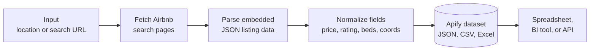
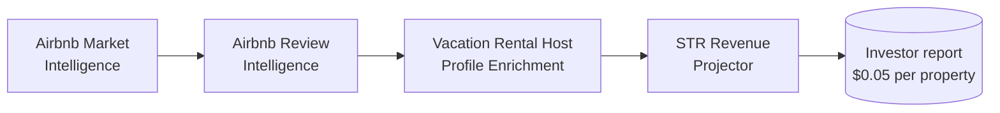

# Vacation Rental Revenue Estimator and Airbnb Competitor Intelligence

The fastest way to run an Airbnb market scan for short term rental revenue research. This Apify actor returns a clean dataset of nightly rates, total prices, bedrooms, beds, ratings, review counts, coordinates, and badges for every listing in any market you point it at. Built for short term rental investors, property managers, and STR analysts who need live Airbnb market data without paying for a monthly subscription dashboard.

**Use it to**
* Benchmark your nightly rate against the real competitive set
* Research a new short term rental market before you buy
* Track seasonal pricing moves across a portfolio
* Feed live Airbnb data into a BI tool, spreadsheet, or internal API
* Build automated client reports for vacation rental consulting

---

## How the Airbnb market scan works



The actor reads Airbnb search result pages, parses the JSON payload the page ships with, and returns one structured record per property. One call gives you every field a vacation rental analyst actually uses. No Airbnb account, no CAPTCHA wrangling, no stale monthly snapshots.

---

## Sample output

One record per listing. Currency is pinned to USD so benchmarks stay consistent regardless of where the actor runs.

```json
{
  "id": "1618298236649214789",
  "name": "Reflections By Homestead Modern",
  "title": "Home in Joshua Tree",
  "url": "https://www.airbnb.com/rooms/1618298236649214789",
  "latitude": 34.178,
  "longitude": -116.353,
  "bedrooms": 3,
  "beds": 3,
  "rating": 4.7,
  "reviewsCount": 10,
  "priceLabel": "$2,279 for 5 nights",
  "priceTotalLabel": "$2,278.90",
  "priceBreakdownDescription": "5 nights x $455.78",
  "badges": ["Luxe"],
  "pictureUrl": "https://a0.muscache.com/im/pictures/..."
}
```

---

## Quick start

Pass a location and get a market scan:

```bash
curl -X POST "https://api.apify.com/v2/acts/scrapemint~airbnb-market-intelligence/run-sync-get-dataset-items?token=YOUR_TOKEN" \
  -H "Content-Type: application/json" \
  -d '{
    "location": "Austin, TX",
    "checkIn": "2026-05-15",
    "checkOut": "2026-05-18",
    "adults": 4,
    "maxProperties": 100
  }'
```

Or pass Airbnb search URLs directly:

```json
{
  "startUrls": [
    { "url": "https://www.airbnb.com/s/Joshua-Tree--CA/homes" },
    { "url": "https://www.airbnb.com/s/Big-Bear-Lake--CA/homes" }
  ],
  "maxProperties": 250
}
```

---

## Inputs

| Field | Type | Default | Purpose |
|---|---|---|---|
| `startUrls` | array | `[]` | Airbnb search URLs. Pagination followed automatically. |
| `location` | string | `null` | Used when no URLs given. Example: `Nashville, TN`. |
| `checkIn` | `"YYYY-MM-DD"` | `null` | Optional. Affects nightly price. |
| `checkOut` | `"YYYY-MM-DD"` | `null` | Optional. |
| `adults` | integer | `2` | Guest count for pricing. |
| `maxProperties` | integer | `50` | Hard cap to prevent runaway charges. |

---

## Pricing

Pay per property. Every run has a free tier so you can test the output before you spend.

| Tier | Price | Best for |
|---|---|---|
| Free | 20 properties per run | Trying the output |
| Standard | $0.01 per property | City scans, listing benchmarks |
| Pipeline bundle | $0.05 per enriched property | Investor due diligence reports |

---

## Why it beats the alternatives

| Option | Cost for 500 properties | Freshness | Setup |
|---|---|---|---|
| Manual spreadsheet research | 8 to 12 analyst hours | Stale in 48 hours | Ongoing |
| AirDNA monthly subscription | $40 to $100 per city per month | Daily snapshot | Account signup |
| **This actor** | **$5 once** | Live at query time | Seconds |

---

## Related products in the STR data suite

Chain this actor with three companions to build a full investor report per listing.



* **Airbnb Review Intelligence**: sentiment and keyword breakdown per listing
* **Vacation Rental Host Profile Enrichment**: super host signals, portfolio size, response rate
* **Short Term Rental Revenue Projector**: seasonal occupancy model on top of the competitive set

---

## Frequently asked questions

**What is a vacation rental revenue estimator?**
It is a tool that pulls live competitive data from platforms like Airbnb so you can see what similar properties charge, how well they rate, and how to price your own listing. This actor gives you the raw competitive dataset you feed into that calculation.

**How is this different from AirDNA or Transparent?**
Those services sell monthly market subscriptions that start at $40 per city. This actor charges per property scanned, so you only pay for the markets you actually research. Data comes straight from Airbnb at query time, not from a modeled projection.

**Can I use it for Airbnb competitor analysis?**
Yes, that is the primary use case. Filter the dataset by bedroom count, guest capacity, and neighborhood to benchmark your listing against the real competitive set in any city.

**Does it work for international markets?**
Any city Airbnb indexes. Currency is pinned to USD regardless of where the actor runs, so your benchmarks stay consistent.

**How fresh is the pricing data?**
Live at query time. Every run hits Airbnb directly. No cached dashboards, no stale monthly snapshots.

**What fields are in the dataset?**
Property ID, name, title, URL, latitude, longitude, bedrooms, beds, rating, review count, full price label, total price, nightly breakdown, badges, and hero picture URL.

---

## Limits

* Public search pages only. No private host data or authenticated scraping.
* If Airbnb rotates the page shape, a DOM fallback keeps the actor working while the JSON parser gets patched. Tests run before every deploy.
* Datacenter proxies handle most markets. Residential fallback available for high intensity scans.
* Same input returns the same records within a 60 minute window.
