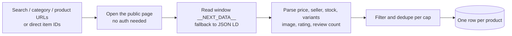
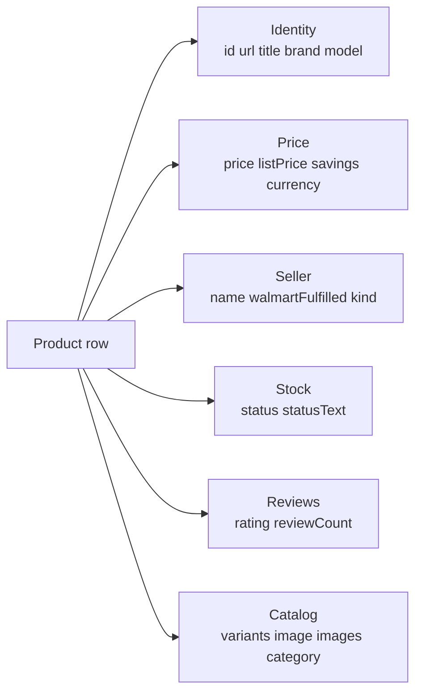

# Walmart Product Scraper (Amazon Alternative)

Scrape Walmart's public product catalog by search URL, category URL, or direct item URL as an Amazon-alternative product intel feed. Each row ships title, price, list price, savings, brand, model, seller (Walmart Fulfilled vs marketplace), in-stock signal, rating, review count, variants, and image. No cookies. No login. No Amazon SP-API. Pay per product.

**Why Walmart instead of Amazon:** Amazon's Akamai plus Captcha-Enforced PerimeterX defense blocks public scraping at scale on residential proxy, so Amazon-data scrapers either need an SP-API developer seat (which most buyers don't want to apply for) or an enterprise anti-bot service. Walmart is the closest US-marketplace analog: same buyer pool (DTC researchers, FBA sourcers, retail arbitrage, brand monitors), lighter defense, no developer account.

**Built for** retail arbitrage and FBA sourcers benchmarking real Walmart prices, brand operators monitoring MAP compliance on Walmart Marketplace, DTC operators tracking competitor SKUs and stock, repricing engines pulling current Walmart prices, affiliate marketers building product feeds, and BI analysts ingesting Walmart catalog rows into a warehouse.

**Keywords this actor ranks for:** walmart product scraper, walmart api, walmart price scraper, amazon alternative scraper, walmart marketplace scraper, walmart sourcing api, retail arbitrage walmart, walmart competitor pricing, walmart catalog api, MAP compliance walmart.

---

## Why this actor

| Other Walmart scrapers | **This actor** |
|---|---|
| Need a Walmart Connect cookie | Zero cookies, zero login |
| Charge $99 to $499 a month for the same public data | Pay per product, no contract |
| Return one HTML blob per page | ID, title, price, list price, savings, seller, stock, variants parsed |
| Skip seller intel | Seller name plus Walmart Fulfilled vs marketplace flag on every row |
| Get rate limited after a hundred rows | Built on residential proxy with session pooling for sustained runs |

---

## How it works



The actor walks Walmart's public Next.js data tree on each page. No internal API is touched; everything is what a logged-out browser visitor sees.

---

## What you get per row



Pipe straight into a repricer, a sourcing comp tracker, a MAP compliance monitor, or a competitor SKU watcher.

---

## Quick start

**Sourcing scan: top 25 ninja blenders right now**

```json
{
  "startUrls": ["https://www.walmart.com/search?q=ninja+blender"],
  "maxResultsPerStartUrl": 25,
  "extractSeller": true,
  "extractStock": true
}
```

**MAP compliance: pull current price on a list of items**

```json
{
  "itemIds": ["592159451", "10450519", "55303213"],
  "extractSeller": true,
  "deliveryZipcode": "10001"
}
```

**Category sweep with stock and variants**

```json
{
  "startUrls": ["https://www.walmart.com/browse/electronics-3944"],
  "maxResultsPerStartUrl": 100,
  "extractVariants": true,
  "extractStock": true
}
```

---

## Sample output

```json
{
  "id": "592159451",
  "url": "https://www.walmart.com/ip/592159451",
  "title": "Ninja Professional Plus Blender with Auto-iQ",
  "brand": "Ninja",
  "model": "BN701",
  "price": { "value": 99.0, "currency": "USD" },
  "listPrice": { "value": 129.99, "currency": "USD" },
  "savings": { "amount": 30.99, "percent": 23.84 },
  "rating": 4.6,
  "reviewCount": 8214,
  "seller": { "name": "Walmart.com", "walmartFulfilled": true, "kind": "walmart" },
  "stock": { "status": "in_stock", "statusText": "In stock" },
  "variants": [{ "id": "592159452", "name": "1400 watts", "price": 119.0 }],
  "image": "https://i5.walmartimages.com/.../ninja.jpg",
  "category": ["Home", "Kitchen", "Blenders"],
  "scrapedAt": "2026-05-12T23:30:00.000Z"
}
```

---

## Who uses this

| Role | Use case |
|---|---|
| FBA sourcer / retail arbitrage | Benchmark Walmart price vs Amazon to find sourcing arbitrage |
| Repricer engineer | Pull current Walmart prices for repricing logic |
| Brand operator | Monitor MAP compliance across Walmart Marketplace sellers |
| DTC competitive intel | Track a rival's Walmart SKUs, prices, and stock state weekly |
| Affiliate marketer | Build a Walmart product feed without a Walmart Connect seat |
| BI analyst | Ingest Walmart catalog rows into a data warehouse |

---

## Input reference

| Field | Type | What it does |
|---|---|---|
| `startUrls` | string[] | Walmart search, category, or product URLs. |
| `itemIds` | string[] | Direct Walmart item IDs as an alternative input. |
| `maxResultsPerStartUrl` | integer | Cap per start URL. Default 25. Zero means take everything Walmart exposes. |
| `deliveryZipcode` | string | US zipcode for delivery-aware pricing and availability. |
| `extractVariants` | boolean | Pull child item IDs, sizes, colors, prices. Default true. |
| `extractSeller` | boolean | Capture seller name + Walmart Fulfilled vs marketplace flag. Default true. |
| `extractStock` | boolean | Capture in_stock / out_of_stock / limited signal. Default true. |
| `extractRatingHistogram` | boolean | Capture 5 / 4 / 3 / 2 / 1 star count split. Default false. |
| `dedupe` | boolean | Skip item IDs already pushed in previous runs. |
| `concurrency` | integer | Pages processed in parallel. Default 3. |
| `proxyConfiguration` | object | Apify proxy. Residential is required. |

---

## API call

```bash
curl -X POST \
  "https://api.apify.com/v2/acts/YOUR_USER~amazon-product-scraper/runs?token=YOUR_TOKEN" \
  -H "Content-Type: application/json" \
  -d '{
    "startUrls": ["https://www.walmart.com/search?q=ninja+blender"],
    "maxResultsPerStartUrl": 25
  }'
```

The actor slug `amazon-product-scraper` is kept for buyers who already linked or bookmarked it; the target marketplace is Walmart.

---

## Pricing

The first 20 products per run are free so you can validate output before paying. After that, each product row is charged.

---

## FAQ

### Why is this called amazon-product-scraper if it scrapes Walmart?

The slug was originally an Amazon scraper. Amazon's Akamai plus PerimeterX defense blocks public scraping at meaningful volume on residential proxy, and the only reliable replacement (Amazon SP-API) needs a developer account most buyers will not apply for. Walmart is the closest analog with a softer defense and no developer signup, so the actor was rebuilt for Walmart while keeping the slug to preserve existing links and integrations.

### Do I need a Walmart account or cookie?

No. The actor only reads what a logged-out browser visitor sees.

### Why are some products missing from listings?

Walmart hides some restricted or geo-fenced SKUs from logged-out visitors. Pass a `deliveryZipcode` to unlock geo-aware pricing and availability.

### How accurate is the seller flag?

The actor reads the rendered "Sold and shipped by" string plus internal fulfillment badges and flips `walmartFulfilled` to true when Walmart is the seller of record. Marketplace third-party sellers get `kind: "marketplace"`.

### Is scraping Walmart allowed?

This actor reads HTML any anonymous web visitor can see. Respect Walmart's terms and rate limit sensibly. Do not redistribute data you have no lawful basis to process.

---

## Related actors

- **Mercari Sold Listings Scraper (eBay Alternative)** — completed resale comps for sneaker, vintage, electronics
- **Etsy Listings & Seller Intel Scraper** — competing handmade and POD catalog data
- **Glassdoor Company Salary Scraper** — pair employer firmographics with product catalogs
- **Facebook Ads Library Scraper** — see what creatives competitors run alongside their Walmart catalog
