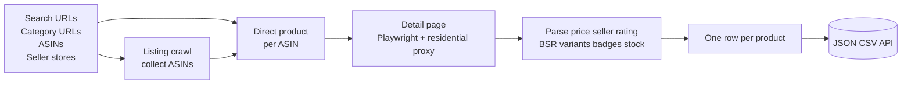
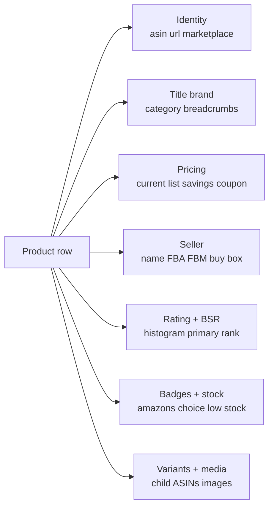

# Amazon Product Scraper

Scrape Amazon products from search URLs, category URLs, ASINs, or seller stores. Each row ships pricing intelligence, seller details, BSR breakdown, variants, ratings histogram, badges, stock signals, and shipping estimates. Works on 10 Amazon marketplaces. Pay per product.

**Built for** Amazon FBA sellers benchmarking competitors, ecommerce ops teams pulling pricing for repricers, brand operators monitoring MAP compliance, product researchers vetting new categories, affiliate marketers building product feeds, and BI analysts ingesting Amazon catalog data into a warehouse.

**Keywords this actor ranks for:** amazon product scraper, amazon scraper api, amazon search results scraper, amazon asin scraper, amazon product details api, amazon product data extractor, amazon FBA research tool, amazon BSR tracker, amazon variant scraper, amazon price monitor, amazon seller scraper, amazon to JSON, amazon to CSV, amazon multi marketplace scraper.

---

## Why this actor

| Other Amazon scrapers | **This actor** |
|---|---|
| Single input (URL only) | Four input modes: search URLs, category URLs, direct ASINs, seller stores |
| US only | 10 marketplaces (US, UK, DE, FR, IT, ES, CA, AU, JP, IN) |
| Title and price only | Pricing intel: list, savings, coupon, subscribe and save, prime exclusive |
| No seller info | Seller name, profile URL, sold by vs ships from, FBA vs FBM detection |
| Single rank field | BSR breakdown by primary and subcategory |
| No variant data | Full variant matrix with child ASINs |
| No badges | Amazon's Choice, Bestseller, Climate Pledge, New Release |
| Stock as boolean | Low stock count parsed ("Only 3 left") |

---

## How it works



Pages render with Playwright behind residential proxy with browser fingerprinting and session rotation. Amazon CAPTCHAs trigger a session swap and retry, not a failed row.

---

## What you get per row



Toggle on `extractFrequentlyBoughtTogether` and the row carries the FBT bundle ASINs. Toggle on `extractAPlusContent` and the brand A+ description is captured for content teams.

---

## Quick start

**Scrape a search URL with full enrichment**

```json
{
  "startUrls": ["https://www.amazon.com/s?k=mechanical+keyboard"],
  "maxResultsPerStartUrl": 100,
  "extractVariants": true,
  "extractBSR": true
}
```

**Direct ASIN lookup across the catalog**

```json
{
  "asins": ["B08N5WRWNW", "B0BZYCJK89", "B0BSHF7WHW"],
  "marketplace": "US",
  "extractRatingHistogram": true
}
```

**Multi marketplace (UK + DE)**

```json
{
  "startUrls": [
    "https://www.amazon.co.uk/s?k=running+shoes",
    "https://www.amazon.de/s?k=laufschuhe"
  ],
  "maxResultsPerStartUrl": 50
}
```

**Track a single seller's catalog**

```json
{
  "startUrls": ["https://www.amazon.com/stores/AnkerDirect/page/0F47A78D-1FAC-4E5E-9F70-7B02F5F95F33"],
  "maxResultsPerStartUrl": 200,
  "extractFrequentlyBoughtTogether": true
}
```

---

## Sample output

```json
{
  "asin": "B08N5WRWNW",
  "url": "https://www.amazon.com/dp/B08N5WRWNW",
  "marketplace": "US",
  "title": "Echo Dot (4th Gen) | Smart speaker with Alexa",
  "brand": "Amazon",
  "category": {
    "primary": "Electronics",
    "breadcrumbs": ["Electronics", "Smart Home Devices", "Speakers"]
  },
  "price": {
    "current": 29.99,
    "currency": "USD",
    "list": 49.99,
    "savings": 20.00,
    "savingsPercent": 40,
    "perUnit": null,
    "coupon": "Save $5 with coupon",
    "subscribeSavePercent": null,
    "primeExclusive": true
  },
  "rating": {
    "stars": 4.7,
    "reviewCount": 458912,
    "questionCount": 1024,
    "histogram": { "5": 78, "4": 14, "3": 4, "2": 2, "1": 2 }
  },
  "badges": {
    "amazonsChoice": true,
    "bestseller": true,
    "climatePledgeFriendly": true,
    "newRelease": false
  },
  "availability": {
    "inStock": true,
    "stockText": "In Stock",
    "lowStockCount": null,
    "deliveryText": "FREE delivery Tomorrow"
  },
  "seller": {
    "name": "Amazon.com",
    "url": null,
    "soldBy": "Amazon.com",
    "shipsFrom": "Amazon.com",
    "fulfillmentType": "amazon"
  },
  "rank": {
    "primary": { "rank": 12, "category": "Electronics" },
    "all": [
      { "rank": 12, "category": "Electronics" },
      { "rank": 1, "category": "Computers & Accessories > Speakers" }
    ]
  },
  "variants": {
    "options": [
      { "value": "Charcoal", "asin": "B08N5WRWNW" },
      { "value": "Glacier White", "asin": "B084J4KZK1" }
    ],
    "totalCount": 4
  },
  "media": {
    "images": ["https://m.media-amazon.com/images/I/..."]
  },
  "details": {
    "bulletPoints": ["Meet the Echo Dot...", "Voice control your music..."],
    "specifications": {
      "item weight": "12 ounces",
      "product dimensions": "3.9 x 3.9 x 3.5 inches"
    }
  },
  "scrapedAt": "2026-04-26T08:00:00.000Z"
}
```

---

## Who uses this

| Role | Use case |
|---|---|
| Amazon FBA seller | Spot competitors winning Buy Box, track BSR, find low stock signals to time launches. |
| Brand operator | MAP compliance monitoring across marketplaces. Pull every reseller and their listed price. |
| Product researcher | Sourcing new categories. Filter by BSR rank and rating count to find proven demand. |
| Repricer | Pull current price + variants daily to feed a dynamic repricing engine. |
| Affiliate marketer | Build product feeds with images, descriptions, and discount badges for review sites. |
| BI analyst | Pipe Amazon catalog data into Snowflake or BigQuery. Each row is API ready. |

---

## Input reference

| Field | Type | What it does |
|---|---|---|
| `startUrls` | string[] | Amazon search, category, product, or seller URLs. |
| `asins` | string[] | Direct 10 character ASINs. Combined with `marketplace`. |
| `marketplace` | enum | US, UK, DE, FR, IT, ES, CA, AU, JP, IN. |
| `maxResultsPerStartUrl` | integer | Cap per listing URL. 0 means everything. |
| `extractVariants` | boolean | Pull child ASINs, sizes, colors. |
| `extractBSR` | boolean | Best Sellers Rank by category. |
| `extractRatingHistogram` | boolean | Percentage split across 5/4/3/2/1 stars. |
| `extractFrequentlyBoughtTogether` | boolean | FBT bundle ASINs. |
| `extractAPlusContent` | boolean | Brand A+ content blocks. |
| `deliveryZipcode` | string | US zipcode for delivery location cookie. |
| `dedupe` | boolean | Skip ASINs from previous runs. |
| `concurrency` | integer | Parallel pages. Three to four is safe. |
| `proxyConfiguration` | object | Apify proxy. Residential is required. |

---

## API call

```bash
curl -X POST \
  "https://api.apify.com/v2/acts/YOUR_USER~amazon-product-scraper/runs?token=YOUR_TOKEN" \
  -H "Content-Type: application/json" \
  -d '{
    "startUrls": ["https://www.amazon.com/s?k=wireless+earbuds"],
    "maxResultsPerStartUrl": 50,
    "extractBSR": true
  }'
```

---

## Pricing

The first few products per run are free so you can validate output before paying. After that, one charge per product row. Variants, BSR, ratings histogram, and badges are all included at no extra cost.

---

## FAQ

### What is the difference between this and other Amazon scrapers?

Four input modes (search URLs, category URLs, direct ASINs, seller stores), 10 marketplaces, full pricing intelligence (list, savings, coupon, subscribe and save, prime exclusive), seller intel including FBA vs FBM detection, BSR breakdown by category, variant matrix with child ASINs, low stock count parsed from "Only 3 left" text, and badges (Amazon's Choice, Bestseller, Climate Pledge, New Release).

### Why does Amazon block the actor sometimes?

Amazon serves CAPTCHAs to traffic that looks robotic. The actor uses fingerprinted Chrome with rotating residential proxies and detects CAPTCHA pages, marks the session bad, and retries on a fresh session. Most CAPTCHAs resolve within two retries.

### Can I scrape products from amazon.de or amazon.co.uk?

Yes. Pass any Amazon URL from the supported marketplaces (US, UK, DE, FR, IT, ES, CA, AU, JP, IN). The actor parses the host and returns a `marketplace` field on every row. ASINs passed directly use the `marketplace` input field to pick the host.

### How accurate is the price field?

Prices come straight from the Buy Box. The parser handles US format ($1,299.99), European format (€1.299,99), and Japanese yen (no decimals). Coupon, subscribe and save, and prime exclusive deals are captured as separate fields so you can model the final paid price yourself.

### What does the BSR field carry?

`rank.primary` is the top level Best Sellers Rank with category. `rank.all` is the full breakdown including subcategory ranks. Useful for FBA sourcing where subcategory rank is a stronger signal than the noisy top level rank.

### Can I detect FBA vs FBM sellers?

Yes. The actor parses "Sold by" and "Ships from" lines from the Buy Box. `seller.fulfillmentType` is set to `amazon` (Amazon Retail), `fba` (third party seller, Amazon ships), or `fbm` (third party seller, merchant ships).

### Does it pull all child ASINs for variants?

When `extractVariants` is on, the actor walks the size, color, and style swatches and returns every variant value with its child ASIN where available. Useful for repricers that need the full SKU map.

### Can I run this on a schedule?

Yes. Use the Apify scheduler for hourly, daily, or weekly runs. Combined with `dedupe: true`, only new ASINs are pushed. Great for category monitoring, repricing, and inventory alerts.

### Is scraping Amazon allowed?

This actor reads HTML any anonymous web visitor can see. Respect Amazon's terms and rate limit sensibly. Do not redistribute product images or descriptions you have no lawful basis to publish.

---

## Related actors

- **Amazon Product Review Export and Sentiment Monitor** — every review with rating, text, verified purchase flag, helpful votes
- **Website Content Crawler** — websites to clean Markdown with token counts and RAG ready chunks
- **Google Maps Scraper** — local business data with reviews
- **TripAdvisor Property Rank Tracker** — daily rank, rating drift, competitor signals for hotels and restaurants
- **LinkedIn Jobs Scraper Pro** — search URL, company URL, and recruiter contact extraction
