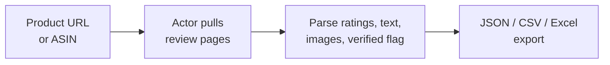
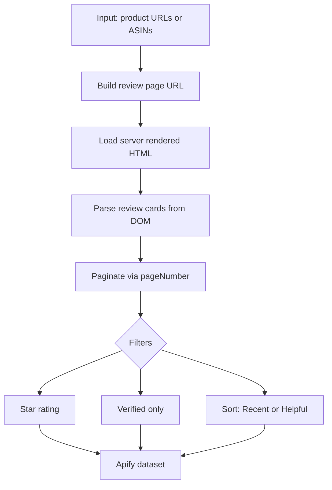
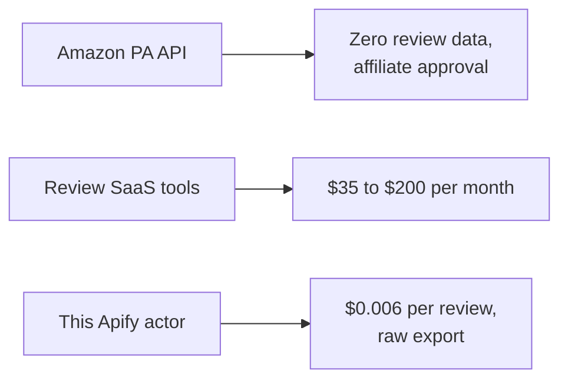

# Amazon Review Scraper: Export Product Reviews to CSV, Excel, JSON

Scrape every Amazon product review into a clean CSV, Excel, or JSON file. Pull star ratings, full review text, titles, verified purchase flags, helpful votes, reviewer names, dates, locations, and images across 10 Amazon marketplaces. Pay per review. No subscription.

**Keywords this actor is built for:** Amazon review scraper, scrape Amazon reviews, Amazon review API, Amazon review export, Amazon FBA review monitor, Amazon product reviews CSV, Amazon review tool.

---

## What you get in 30 seconds



Paste an ASIN. Set a review cap. Get every review field Amazon shows, in any format, across any Amazon domain.

---

## Who this Amazon review scraper is for

| You are a... | You use this to... |
|---|---|
| **Amazon FBA seller** | Catch 1 and 2 star complaints before they tank your listing |
| **Ecommerce brand** | Benchmark your product against 5 competitors in one dataset |
| **DTC company** | Mine real customer language for ads, bullet points, A+ content |
| **Marketing agency** | Pull review data for 20 client products in one session |
| **Product researcher** | Read 1 star reviews for the top 3 products in a category, find the roadmap |

---

## How it works



1. Paste product URLs or ASINs. The actor extracts the ASIN automatically.
2. Server rendered HTML is parsed directly, no headless browser needed, so it runs fast and cheap.
3. Pagination walks `?pageNumber=N` until your cap or Amazon's ceiling.
4. Results land in the dataset as JSON, exportable to CSV or Excel with one click.

---

## Quick start

**Export 100 recent reviews for one product:**

```json
{
  "productUrls": [{ "url": "https://www.amazon.com/dp/B0D1XD1ZV3" }],
  "maxReviews": 100,
  "sortBy": "RECENT"
}
```

**Compare your product against 3 competitors, 1 star reviews only:**

```json
{
  "asins": "B0D1XD1ZV3, B09V3KXJPB, B0BSHF7WHW, B07FZ8S74R",
  "maxReviews": 100,
  "filterByRating": "1"
}
```

**Scrape Amazon UK instead of US:**

```json
{
  "productUrls": [{ "url": "https://www.amazon.co.uk/dp/B0D1XD1ZV3" }],
  "maxReviews": 100,
  "amazonDomain": "amazon.co.uk"
}
```

Or call it from the command line:

```bash
curl -X POST "https://api.apify.com/v2/acts/scrapemint~amazon-review-intelligence/run-sync-get-dataset-items?token=YOUR_TOKEN" \
  -H "Content-Type: application/json" \
  -d '{"asins":"B0D1XD1ZV3","maxReviews":50}'
```

---

## This scraper vs Amazon PA API vs SaaS tools



| Feature | Amazon PA API | Review SaaS | This actor |
|---|---|---|---|
| Review text | Not returned | Yes, dashboard | Yes, raw export |
| Star ratings | Not returned | Yes | Yes |
| Helpful votes | Not returned | Sometimes | Yes |
| Verified purchase flag | Not returned | Sometimes | Yes |
| Reviewer images | Not returned | Rarely | Yes |
| Marketplaces | Limited | US only usually | 10 Amazon domains |
| Price | Affiliate approval required | $35 to $200 per month | $0.006 per review, first 50 free |

---

## Supported Amazon marketplaces

amazon.com, amazon.ca, amazon.co.uk, amazon.de, amazon.fr, amazon.it, amazon.es, amazon.co.jp, amazon.in, amazon.com.au. Set `amazonDomain` to any of these. Output format is identical across all 10.

---

## Sample output

One review record:

```json
{
  "rating": 5,
  "reviewTitle": "Best purchase this year",
  "reviewText": "Battery lasts 2 full days with heavy use...",
  "reviewerName": "Tech Enthusiast",
  "reviewDate": "March 15, 2026",
  "reviewLocation": "United States",
  "isVerifiedPurchase": true,
  "helpfulVotes": 42,
  "imageCount": 3,
  "images": ["https://images-na.ssl-images-amazon.com/images/I/71abc.jpg"],
  "asin": "B0D1XD1ZV3",
  "productTitle": "Samsung Galaxy S26 Ultra 256GB",
  "productPrice": "$1,199.99",
  "averageRating": 4.4,
  "totalReviewCount": 8472,
  "amazonDomain": "amazon.com"
}
```

Every record carries product rollup fields (`asin`, `productTitle`, `averageRating`) so multi product exports group cleanly in Excel or Sheets.

---

## Pricing

First 50 reviews per run are free. After that: **$0.006 per review**. A 1,000 review run across 10 products costs $5.70 once. Review SaaS tools cost $35 to $200 per month.

---

## FAQ

**How do I scrape Amazon reviews into a CSV or Excel file?**
Run this actor with a product URL or ASIN and a review cap. Export the dataset as CSV or Excel from the Apify console or via the API.

**Is there an Amazon API for product reviews?**
No. The official Amazon Product Advertising API does not return review data. This actor reads the public review pages directly.

**Can I scrape Amazon UK, Germany, or Japan?**
Yes. Set `amazonDomain` to `amazon.co.uk`, `amazon.de`, `amazon.co.jp`, or any of the 10 supported marketplaces.

**How do I export only negative reviews?**
Set `filterByRating` to `1` or `2`.

**How do I get only verified purchase reviews?**
Set `verifiedOnly: true`.

**Can I compare multiple Amazon products in one run?**
Yes. Pass multiple URLs or a comma separated list of ASINs. Every record includes `asin` and `productTitle` for grouping.

**How many reviews per product can I pull?**
Amazon shows roughly 100 reviews per sort order through the public review pages. Set `maxReviews` to control the cap.

**Can I use ASINs instead of URLs?**
Yes. Paste them into the `asins` field.

**How do I monitor my FBA reviews automatically?**
Schedule this actor to run daily or weekly on Apify. Diff against the previous run to catch new complaints.

**Why residential proxies?**
Amazon blocks datacenter IPs within a few requests. The actor defaults to residential. If you see "Robot Check" in the logs, leave the default proxy on.

**How fresh is the data?**
Live at query time. Every run pulls straight from Amazon.

---

## Related Scrapemint actors

- **Google Reviews Intelligence** for Google Maps business reviews
- **Facebook Review Intelligence** for page recommendations and reactions
- **Yelp Review Intelligence** for Yelp reviews with elite reviewer tracking
- **TripAdvisor Review Intelligence** for hotel, restaurant, attraction reviews
- **Booking Review Intelligence** for hotel guest reviews with category scores
- **Trustpilot Brand Reputation** for brand trust scores and verification
- **Airbnb Market Intelligence** for rental pricing and guest reviews
- **Indeed Company Review Intelligence** for employer branding signals

Run several to watch every review surface that mentions your brand in one pipeline.
