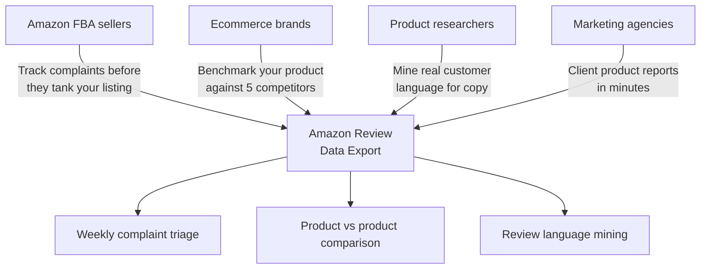
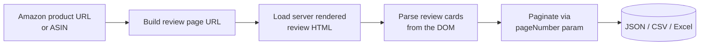
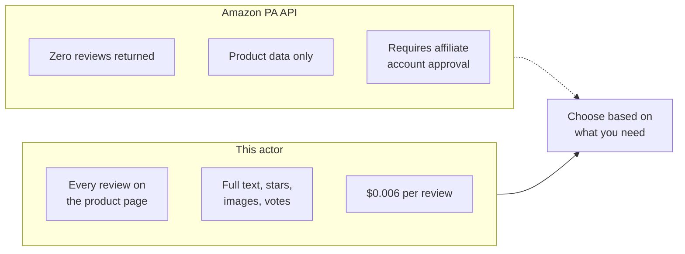
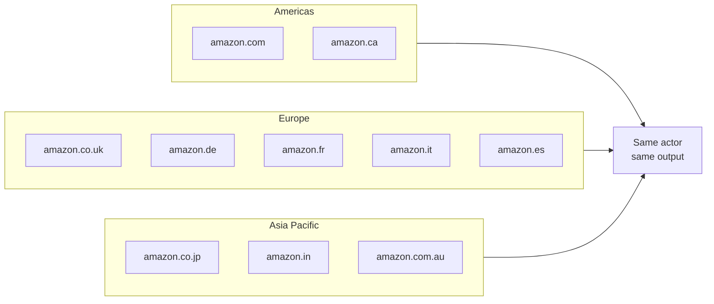
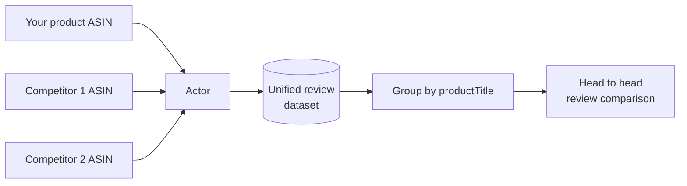

# Amazon Review Scraper and Export Tool for Amazon Products

Export every Amazon product review into a clean JSON, CSV, or Excel file. Pull star ratings, review titles, full text, verified purchase flags, helpful vote counts, reviewer names, dates, locations, and attached images for any product on 10 Amazon marketplaces.

Built for Amazon FBA sellers, ecommerce brands, product researchers, DTC companies, and marketing agencies who need Amazon review data without building a scraper from scratch or paying for a $35 per month subscription tool.

---

## Who uses this Amazon review scraper



| Role | What the export unlocks |
|---|---|
| **Amazon FBA seller** | Every 1 and 2 star review text so you can fix product issues before they snowball |
| **Ecommerce brand** | Side by side review comparison against your top 5 competitors |
| **Product researcher** | Real customer language for ad copy, listing optimization, and product development |
| **DTC company** | Amazon reviews for your product plus private label competitors in one dataset |
| **Marketing agency** | Pull review data for 20 client products in one session, generate reports from the same file |

---

## How the Amazon review export works



The actor takes your product URL or raw ASIN, builds the review listing page, and parses the server rendered HTML directly. Amazon renders reviews as static HTML, so extraction is fast and reliable. It paginates through `?pageNumber=N` until your review cap is reached or the reviews run out.

---

## Amazon Product Advertising API vs this scraper



| Feature | Amazon PA API | This actor |
|---|---|---|
| Review data | None (not available) | Full review history |
| Review text | Not returned | Complete text |
| Star ratings | Not returned | 1 to 5 per review |
| Helpful votes | Not returned | Yes |
| Verified purchase flag | Not returned | Yes |
| Reviewer images | Not returned | Yes |
| Marketplaces | Limited | 10 Amazon domains |
| Price | Affiliate approval required | $0.006 per review, first 50 free |

---

## Quick start

Export recent reviews for one Amazon product:

```bash
curl -X POST "https://api.apify.com/v2/acts/scrapemint~amazon-review-intelligence/run-sync-get-dataset-items?token=YOUR_TOKEN" \
  -H "Content-Type: application/json" \
  -d '{
    "productUrls": [
      { "url": "https://www.amazon.com/dp/B0D1XD1ZV3" }
    ],
    "maxReviews": 100,
    "sortBy": "RECENT"
  }'
```

Compare your product against 3 competitors, pulling only 1 and 2 star reviews:

```json
{
  "productUrls": [
    { "url": "https://www.amazon.com/dp/B0D1XD1ZV3" },
    { "url": "https://www.amazon.com/dp/B09V3KXJPB" },
    { "url": "https://www.amazon.com/dp/B0BSHF7WHW" },
    { "url": "https://www.amazon.com/dp/B07FZ8S74R" }
  ],
  "maxReviews": 100,
  "filterByRating": "1"
}
```

Use ASINs directly instead of full URLs:

```json
{
  "asins": "B0D1XD1ZV3, B09V3KXJPB, B0BSHF7WHW",
  "maxReviews": 100,
  "sortBy": "HELPFUL",
  "verifiedOnly": true
}
```

Scrape reviews from Amazon UK instead of the US store:

```json
{
  "productUrls": [
    { "url": "https://www.amazon.co.uk/dp/B0D1XD1ZV3" }
  ],
  "maxReviews": 100,
  "amazonDomain": "amazon.co.uk"
}
```

---

## What one review record looks like

```json
{
  "rating": 5,
  "reviewTitle": "Best purchase this year",
  "reviewText": "Battery lasts 2 full days with heavy use. Screen is bright enough for outdoor reading. Camera is solid for the price point.",
  "reviewerName": "Tech Enthusiast",
  "reviewerUrl": "https://www.amazon.com/gp/profile/amzn1.account.ABC123",
  "reviewDate": "March 15, 2026",
  "reviewLocation": "United States",
  "isVerifiedPurchase": true,
  "helpfulVotes": 42,
  "imageCount": 3,
  "images": [
    "https://images-na.ssl-images-amazon.com/images/I/71abc123.jpg"
  ],
  "asin": "B0D1XD1ZV3",
  "productTitle": "Samsung Galaxy S26 Ultra 256GB",
  "productPrice": "$1,199.99",
  "averageRating": 4.4,
  "totalReviewCount": 8472,
  "amazonDomain": "amazon.com",
  "productUrl": "https://www.amazon.com/dp/B0D1XD1ZV3",
  "scrapedAt": "2026-04-16T18:30:01.112Z"
}
```

Every record carries both the review fields and the product rollup, so multi product exports group cleanly by `productTitle` or `asin` in any spreadsheet.

---

## Inputs

| Field | Type | Default | What it does |
|---|---|---|---|
| `productUrls` | array | `[]` | Amazon product or review page URLs. The actor extracts the ASIN automatically. |
| `asins` | string | `""` | Comma separated ASINs (alternative to URLs) |
| `maxReviews` | integer | `100` | Hard cap per product. Controls cost. |
| `sortBy` | string | `RECENT` | `RECENT` or `HELPFUL` |
| `filterByRating` | string | `""` | Only return reviews with this star rating (`1`, `2`, `3`, `4`, or `5`) |
| `verifiedOnly` | boolean | `false` | Only return verified purchase reviews |
| `amazonDomain` | string | `amazon.com` | Which Amazon marketplace to scrape (10 domains supported) |
| `proxyConfiguration` | object | Residential | Apify proxy settings |

---

## Supported Amazon marketplaces



Set `amazonDomain` to any of these 10 marketplaces. The output format is identical across all domains.

---

## Pricing

Pay per review. Free tier lets you verify the output before spending anything.

| Tier | Price | Best for |
|---|---|---|
| Free | First 50 reviews per run | Verifying the output format |
| Standard | $0.006 per review | Ongoing monitoring and competitor research |

1,000 reviews across 10 products: **$5.70 once**. Review monitoring SaaS tools: $35 to $200 per month.

---

## Compare products in one run



Every record includes `asin`, `productTitle`, and `averageRating`, so grouping in Excel, Sheets, or a BI tool takes seconds. Filter by `filterByRating` to compare only negative reviews across products.

---

## Common workflows

- **Weekly complaint triage.** Schedule this actor on your own ASIN every Monday. Pull only 1 star reviews. Fix the top complaint before it snowballs into a listing demotion.
- **Competitor review mining.** Pull your product plus 5 competitors. Read what customers praise about the rival product. Use that language in your own listing.
- **Ad copy research.** Pull 5 star verified reviews. Extract the exact phrases customers use to describe why they love the product. Drop those into your PPC headlines.
- **Product development.** Pull 1 and 2 star reviews for the top 3 products in your category. The recurring complaints are your product roadmap.
- **Listing optimization.** Pull helpful reviews sorted by votes. The most upvoted reviews tell you what features buyers care about most.

---

## Related tools in the review intelligence suite

* [**Google Reviews Intelligence**](https://apify.com/scrapemint/google-reviews-intelligence): Google Maps reviews with full history export
* [**Facebook Review Intelligence**](https://apify.com/scrapemint/facebook-review-intelligence): Facebook business page recommendations with reaction counts
* [**Yelp Review Intelligence**](https://apify.com/scrapemint/yelp-review-intelligence): Yelp reviews with elite reviewer tracking and vote counts
* [**TripAdvisor Review Intelligence**](https://apify.com/scrapemint/tripadvisor-review-intelligence): hotel, restaurant, and attraction reviews with trip type
* [**Booking Review Intelligence**](https://apify.com/scrapemint/booking-review-intelligence): hotel guest reviews with sentiment and category scores
* [**Trustpilot Brand Reputation**](https://apify.com/scrapemint/trustpilot-brand-reputation): brand trust scores and verification status
* [**Airbnb Market Intelligence**](https://apify.com/scrapemint/airbnb-market-intelligence): rental pricing and guest review data

Eight actors covering Amazon, Google, Facebook, Yelp, TripAdvisor, Booking, Trustpilot, and Airbnb.

---

## Frequently asked questions

**How do I scrape Amazon reviews into a CSV or Excel file?**
Run this actor with a product URL or ASIN and a review cap. Export the dataset as CSV or Excel from the Apify console or pull it via the API.

**Is there an Amazon API that returns product reviews?**
No. The official Amazon Product Advertising API does not return review data at all. This actor scrapes the public review pages directly.

**Can I scrape reviews from Amazon UK, Germany, or Japan?**
Yes. Set `amazonDomain` to `amazon.co.uk`, `amazon.de`, `amazon.co.jp`, or any of the 10 supported marketplaces. The output format is the same across all domains.

**How do I export only negative Amazon reviews?**
Set `filterByRating` to `1` or `2` to pull only reviews with that star rating.

**How do I get only verified purchase reviews?**
Set `verifiedOnly` to `true`. The actor adds the `reviewerType=avp_only_reviews` parameter to the Amazon review page.

**Can I compare multiple Amazon products in one run?**
Yes. Pass multiple URLs in `productUrls` or multiple ASINs in the `asins` field. Every record includes `asin` and `productTitle` for easy grouping.

**How many reviews can I get per product?**
Amazon shows approximately 100 reviews per sort order through their public review pages. Set `maxReviews` to control the cap.

**Can I use ASINs instead of full URLs?**
Yes. Paste comma separated ASINs into the `asins` field. The actor builds the correct review URL for each one.

**How do I find competitor product language for my listing?**
Pull 5 star reviews for the top 3 competitors in your category. Search the text for recurring praise phrases. Use those exact words in your bullet points and A+ content.

**How fresh is the data?**
Live at query time. Every run pulls straight from Amazon.

**Why residential proxies?**
Amazon blocks datacenter IPs within a few requests. Residential proxies keep runs clean, and the actor ships with residential defaults.

**What does "Robot Check" mean in the logs?**
Amazon detected the request as automated and served a CAPTCHA page. Switch `proxyConfiguration.apifyProxyGroups` to `["RESIDENTIAL"]` in the input. The actor logs a warning and skips the blocked page.
