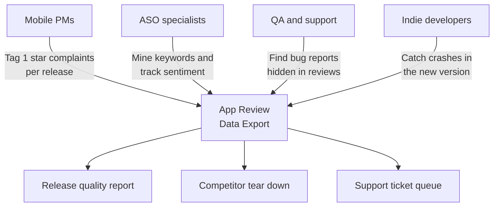
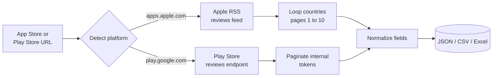
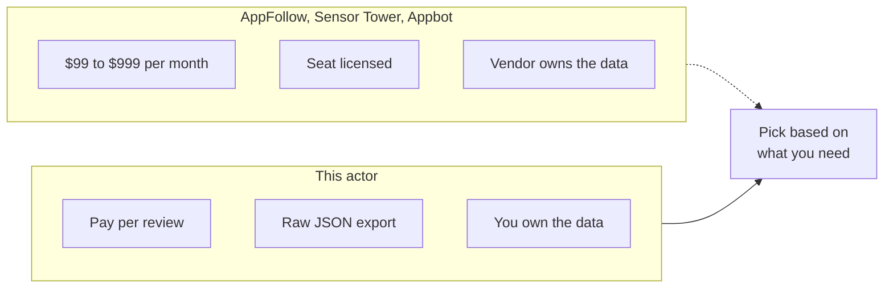

# App Store Review Intelligence and Google Play Review Export Tool

Export every review for any iOS App Store or Google Play app into a clean JSON, CSV, or Excel file. Pull star ratings, review titles, full text, app version, country storefront, developer replies, and reviewer names for your app and every competitor in one run.

Built for mobile product managers, ASO specialists, QA leads, indie developers, and user research teams who need App Store and Play Store review data without building a intelligence from scratch or paying $299 per month for an ASO dashboard.

---

## Who uses this app review intelligence



| Role | What this intelligence unlocks |
|---|---|
| **Mobile PM** | Review count and star trend per app version, so you see which release regressed |
| **ASO specialist** | Full review corpus for keyword mining and sentiment tracking |
| **QA lead** | Crash and bug reports grouped by app version, pulled same day as a release |
| **Indie developer** | App Store reviews signal without paying for AppFollow or Sensor Tower |
| **User research team** | Real user language for onboarding copy, interview prep, and product briefs |

---

## How the app review intelligence works



Paste one or more App Store or Google Play URLs. The actor auto detects the platform from the hostname, pulls the public review feeds both stores already expose, and returns one normalized dataset. No login, no captcha, no fragile DOM pulling.

iOS uses Apple's RSS customer reviews feed. Up to 500 reviews per country storefront. Loop multiple countries in one run.

Android uses the same reviews endpoint the Play Store web UI uses. Pagination is automatic, so popular apps return thousands of reviews per pull.

---

## ASO dashboards vs this intelligence



| Feature | ASO SaaS dashboards | This actor |
|---|---|---|
| Pricing | $99 to $999 per month, flat | Pay per review, first 2 per run free |
| iOS coverage | Limited countries per plan tier | All 155 iOS country storefronts |
| Android coverage | Capped by plan | Full pagination, thousands of reviews |
| Data ownership | Vendor hosts behind a login | Raw JSON in your account |
| Scheduling | Built in, but locked in | Apify Scheduler, plus webhooks to Slack or your DB |
| Export format | CSV or PDF, often paywalled | JSON, CSV, Excel, or API |

---

## Quick start

Export recent reviews for one iOS app across 3 country storefronts:

```bash
curl -X POST "https://api.apify.com/v2/acts/scrapemint~app-review-intelligence/run-sync-get-dataset-items?token=YOUR_TOKEN" \
  -H "Content-Type: application/json" \
  -d '{
    "appUrls": [
      { "url": "https://apps.apple.com/us/app/instagram/id389801252" }
    ],
    "iosCountries": ["us", "gb", "de"],
    "maxReviewsPerApp": 500
  }'
```

Compare your app against 2 Android competitors, filter for 1 and 2 star reviews:

```json
{
  "appUrls": [
    { "url": "https://play.google.com/store/apps/details?id=com.yourapp" },
    { "url": "https://play.google.com/store/apps/details?id=com.competitor.one" },
    { "url": "https://play.google.com/store/apps/details?id=com.competitor.two" }
  ],
  "maxReviewsPerApp": 1000,
  "androidCountry": "us",
  "androidLanguage": "en",
  "filterByRating": ["1", "2"],
  "sortBy": "NEWEST"
}
```

Mix iOS and Android URLs in the same run. The actor detects each platform from the URL.

---

## What one review record looks like

```json
{
  "platform": "ios",
  "appId": "389801252",
  "appName": "Instagram",
  "developer": "Instagram, Inc.",
  "appCategory": "Photo & Video",
  "reviewId": "13971286458",
  "rating": 1,
  "title": "Keeps crashing on 345.0",
  "text": "App crashes every time I open Reels after the last update...",
  "author": "t4351278",
  "appVersion": "425.0.0",
  "helpfulVotes": 12,
  "updated": "2026-04-18T14:22:00.000Z",
  "country": "us",
  "developerResponse": null,
  "developerResponseDate": null,
  "sourceUrl": "https://apps.apple.com/us/app/instagram/id389801252",
  "scrapedAt": "2026-04-19T19:30:00.000Z"
}
```

Every row: platform (ios or android), star rating, title, full body, author, app version at time of review, helpful votes, published date, country, developer reply, and source URL.

---

## Pricing

First 2 reviews per run are free. After that you pay per review extracted. No seat licenses. No tier gating. 1000 reviews lands under $2 on the Apify free plan.

---

## FAQ

**Can this pull App Store reviews for any app?**
Yes. Any iOS or Android app with a public store listing. Paste the URL, the actor pulls the review feed.

**How many reviews can I get per app?**
iOS caps at 500 per country storefront. Across 10 countries that is 5000 per app. Android returns up to a few thousand per call depending on the app's total review count.

**Is pulling App Store reviews legal?**
Both feeds are public and Apple and Google expose them openly. The iOS RSS feed is documented by Apple. The Play Store reviews endpoint is the same one Google's own web UI uses.

**How do I track review sentiment per release?**
Each review includes the app version field. Group by version in a spreadsheet and you see which release caused a drop in stars.

**Does it pull developer responses?**
Yes. The `developerResponse` and `developerResponseDate` fields include the reply you posted from App Store Connect or Play Console.

**Can I run this on a schedule?**
Yes. Use the Apify Scheduler to run every hour, every day, or on your own cron. Add a webhook to push new 1 star reviews straight to Slack.

**Does it work for games, fintech, utilities, and B2B apps?**
Yes. The feed shape is the same across every category on both stores.

**What about apps with reviews in many languages?**
iOS ships reviews per country storefront, so set `iosCountries` to match the markets you care about. Android accepts a single `androidLanguage` per run, so run the actor once per language.

---

## Related actors by Scrapemint

- **Trustpilot Brand Reputation** for DTC and ecommerce brands
- **Amazon Review Intelligence** for product reviews and listings
- **Google Reviews Intelligence** for local businesses
- **Yelp Review Intelligence** for restaurants and service businesses
- **TripAdvisor Review Intelligence** for hotels and attractions
- **Indeed Company Review Intelligence** for employer branding

Stack these to cover every review surface one brand touches.
