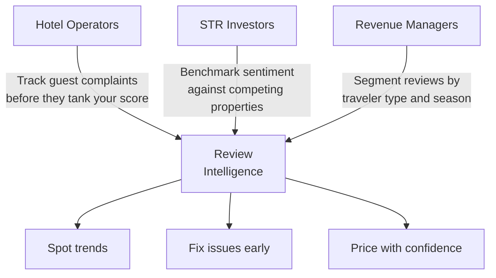
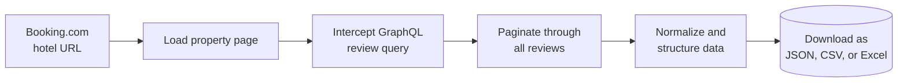
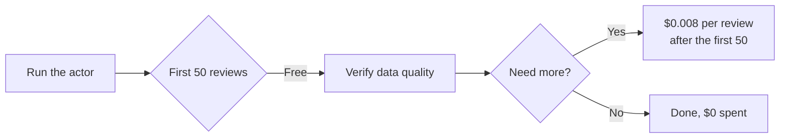
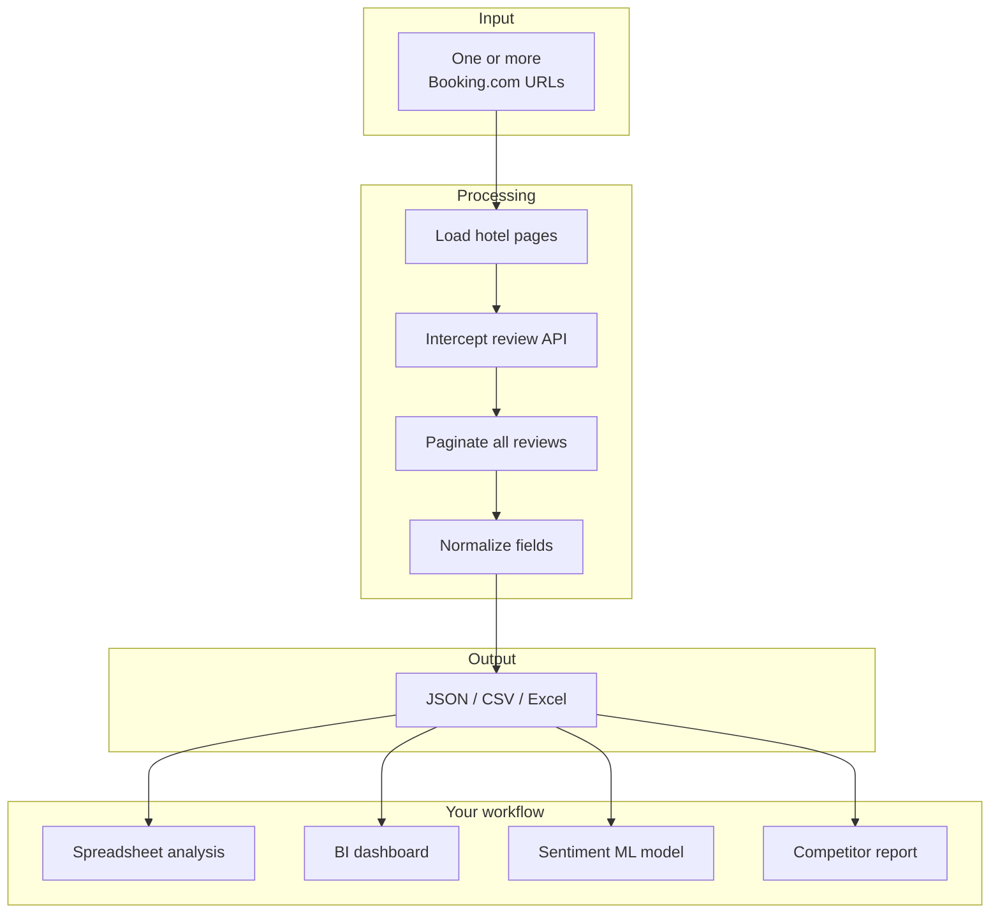
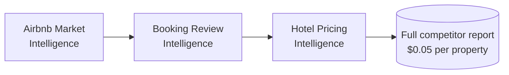

# Booking.com Hotel Review Analysis and Competitor Sentiment Intelligence

Extract structured review data from any Booking.com property in minutes. Get review scores, positive and negative sentiment, reviewer demographics, room types, stay dates, category breakdowns, and management responses for hotels, apartments, hostels, and villas.

Built for hospitality operators, STR managers, and travel analysts who need guest sentiment data without reading thousands of reviews by hand.

---

## Who uses this and why



| Role | What you get |
|---|---|
| **Hotel operator** | Recurring complaint patterns (noise, cleanliness, value) ranked by frequency |
| **STR investor** | Side by side sentiment comparison of properties in a target market |
| **Revenue manager** | Review trends segmented by families, couples, solo, business travelers |
| **Travel analyst** | Structured review datasets ready for BI dashboards or sentiment models |

---

## How it works



The actor loads the Booking.com hotel page and intercepts the internal GraphQL query that powers the review section. It then paginates through reviews using the same API the Booking.com frontend uses. This returns richer data than page scraping: booking details, room types, check in and check out dates, management responses, helpful votes, and category score breakdowns.

---

## What one review record looks like

```json
{
  "reviewScore": 7,
  "title": "Excellent location, comfortable room and cozy atmosphere.",
  "positiveText": "Ace hotel is located in a really good location, walking distance to multiple subway stops...",
  "negativeText": "Room had strange smell at time, probably due to being stuffy.",
  "reviewerName": "Tran",
  "reviewerCountry": "Vietnam",
  "travelerType": "Group",
  "roomType": "Single",
  "checkinDate": "2026-04-03",
  "checkoutDate": "2026-04-06",
  "numNights": 3,
  "reviewedDate": "2026-04-12",
  "helpfulVotes": 0,
  "hasPartnerReply": false,
  "categoryScores": [
    { "category": "Staff", "score": 8.6 },
    { "category": "Facilities", "score": 7.6 },
    { "category": "Cleanliness", "score": 7.9 },
    { "category": "Location", "score": 9.2 }
  ]
}
```

Every review includes: score (1 to 10), title, positive text, negative text, language, reviewer name, country, traveler type, room type, check in date, check out date, nights stayed, review date, helpful votes, whether management replied, reply text, photo count, and category scores (staff, facilities, cleanliness, comfort, value, location, wifi).

---

## Quick start

Extract the latest 200 reviews from a hotel:

```bash
curl -X POST "https://api.apify.com/v2/acts/scrapemint~booking-review-intelligence/run-sync-get-dataset-items?token=YOUR_TOKEN" \
  -H "Content-Type: application/json" \
  -d '{
    "hotelUrl": "https://www.booking.com/hotel/us/ace-new-york.html",
    "maxReviews": 200
  }'
```

Compare reviews across competing properties:

```json
{
  "hotelUrls": [
    { "url": "https://www.booking.com/hotel/us/ace-new-york.html" },
    { "url": "https://www.booking.com/hotel/us/pod-39.html" }
  ],
  "maxReviews": 500,
  "travelerType": "BUSINESS_TRAVELLERS",
  "sortBy": "NEWEST_FIRST"
}
```

---

## Inputs

| Field | Type | Default | What it does |
|---|---|---|---|
| `hotelUrls` | array | `[]` | Booking.com hotel page URLs. Add multiple to compare properties. |
| `hotelUrl` | string | `null` | Single URL shortcut. Used when hotelUrls is empty. |
| `maxReviews` | integer | `500` | Cap per hotel to control cost. |
| `sortBy` | string | `NEWEST_FIRST` | Options: `NEWEST_FIRST`, `OLDEST_FIRST`, `MOST_RELEVANT`, `SCORE_DESC`, `SCORE_ASC` |
| `travelerType` | string | `ALL` | Filter: `ALL`, `FAMILIES`, `COUPLES`, `SOLO_TRAVELLERS`, `GROUP_OF_FRIENDS`, `BUSINESS_TRAVELLERS` |

---

## Pricing

Pay per review extracted. Every run includes a free tier so you can verify data quality first.

| Tier | Price | Best for |
|---|---|---|
| Free | First 50 reviews per run | Testing the output format and data quality |
| Standard | $0.008 per review | Competitor benchmarking and trend tracking |



---

## Cost comparison: Booking.com hotel review analysis

| Method | Cost for 1,000 reviews | Data depth | Time |
|---|---|---|---|
| Read them on Booking.com manually | 3 to 5 hours of analyst time | Notes in a spreadsheet | Hours |
| Review aggregator subscription | $50+ per property per month | Scores only, no text | Delayed |
| **This actor** | **$7.60 once** | Full text, metadata, scores, replies | Minutes |

---

## Data flow: from raw reviews to actionable intelligence



---

## Related tools in the hospitality intelligence suite



* [**Airbnb Market Intelligence**](https://apify.com/scrapemint/airbnb-market-intelligence): live pricing, beds, ratings, and GPS coordinates for every Airbnb listing in a market
* **Hotel Pricing Intelligence**: nightly rate tracking across Booking.com properties (coming soon)

---

## Frequently asked questions

**How do I analyze Booking.com reviews without reading them one by one?**
Run this actor with a hotel URL and a review cap. It returns every review as a structured record with score, text, reviewer info, and category breakdowns. Export as JSON, CSV, or Excel and sort, filter, or visualize in any tool you already use.

**What data do I get per review?**
Score (1 to 10), title, positive text, negative text, language, reviewer name and country, traveler type, room type, check in and check out dates, number of nights, helpful vote count, whether management replied, the reply text, photo count, and category scores for staff, facilities, cleanliness, comfort, value, location, and wifi.

**Can I filter Booking.com reviews by traveler type?**
Yes. Set the `travelerType` input to get only reviews from families, couples, solo travelers, groups, or business travelers. Useful for understanding how different guest segments experience the same property.

**How many reviews can I pull from a single hotel?**
Up to the full review history. Set `maxReviews` to control the cap. Properties with 5,000+ reviews take a few minutes to finish.

**Does it work for apartments and hostels, not just hotels?**
Any property with a public review page on Booking.com. Hotels, apartments, hostels, villas, guesthouses.

**How fresh is the data?**
Live at query time. Every run pulls directly from Booking.com. No cached data, no stale monthly exports.

**Can I compare reviews across multiple hotels?**
Yes. Pass multiple URLs in the `hotelUrls` array. Each review record includes a `sourceUrl` field so you can group results by property in your analysis.

**What format is the output?**
JSON, CSV, or Excel. Download from the Apify dataset page or pull via API.
