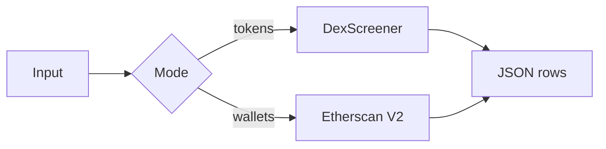
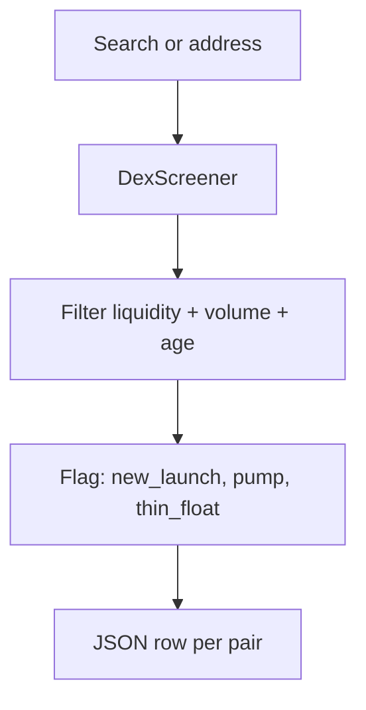
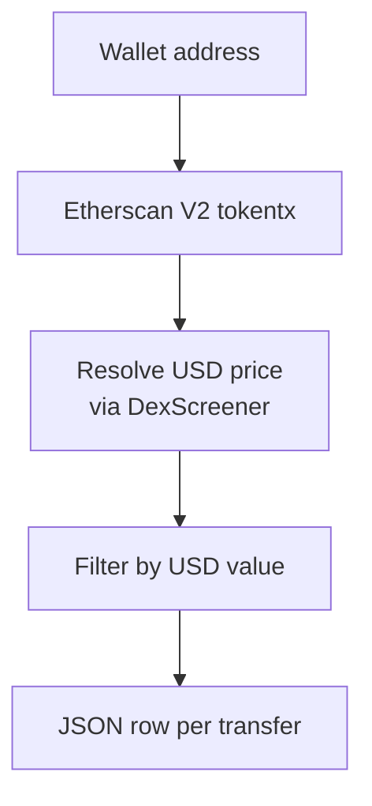

# Crypto Whale Alert API: DEX Token Launches and Wallet Tracker

Whale alert API and DEX token launch scanner in one actor. Pulls new pairs from DexScreener across Uniswap, PancakeSwap, Raydium, Aerodrome, and 40+ DEXs. Monitors whale wallets on Ethereum, Base, Arbitrum, BSC, Polygon via Etherscan V2. One key covers every EVM chain. Returns JSON. Pay per item.

**Ranks for:** whale alert API, DEX scanner, new token listings, DexScreener API, Etherscan whale tracker, ERC20 transfer feed, Base token launch, Solana meme coin scanner, onchain alerts, smart money wallet tracker.

---

## How it works



Two modes, one actor. Tokens mode needs no API key. Wallets mode takes one free Etherscan key for every EVM chain.

---

## Who uses this crypto whale tracker

| Role | Use case |
|---|---|
| **Memecoin trader** | Fresh Base and Solana launches in the last 24h with real volume |
| **Whale follower** | Alert on any $100k+ move from 50 known smart money wallets |
| **DeFi protocol** | Power a trending tokens widget without running RPC |
| **Journalist** | Pull large transfers during a market event for a data story |
| **Compliance** | Flag treasury wallet movements in Slack |

---

## Quick start

**Fresh Base launches with real volume:**

```json
{
  "mode": "tokens",
  "chains": ["base"],
  "maxTokenAgeHours": 48,
  "minLiquidityUsd": 25000,
  "minVolume24hUsd": 100000
}
```

**Search AI narrative tokens:**

```json
{
  "mode": "tokens",
  "searchQueries": ["AI", "agent"],
  "chains": ["ethereum", "base"],
  "sortBy": "priceChange24h"
}
```

**Monitor whale wallets across chains:**

```json
{
  "mode": "wallets",
  "etherscanApiKey": "YOUR_KEY",
  "walletAddresses": ["0x28C6...1d60", "0x21a3...5549"],
  "chains": ["ethereum", "base", "arbitrum"],
  "minTxValueUsd": 100000
}
```

From the command line:

```bash
curl -X POST "https://api.apify.com/v2/acts/scrapemint~crypto-whale-token-launch-tracker/run-sync-get-dataset-items?token=YOUR_APIFY_TOKEN" \
  -H "Content-Type: application/json" \
  -d '{"mode":"tokens","chains":["base"]}'
```

---

## Supported chains

| Chain | Tokens (DexScreener) | Wallets (Etherscan V2) |
|---|---|---|
| Ethereum | Yes | Yes |
| Base | Yes | Yes |
| Arbitrum | Yes | Yes |
| Optimism | Yes | Yes |
| BSC | Yes | Yes |
| Polygon | Yes | Yes |
| Avalanche | Yes | Yes |
| Linea | Yes | Yes |
| Blast | Yes | Yes |
| Solana | Yes | No (not EVM) |

One Etherscan V2 key covers every EVM chain above.

---

## Tokens mode flow



Output flags:
- `new_launch` — pair under 24h old
- `pump` — 24h price change over 100%
- `dump` — 24h price change under minus 50%
- `low_liquidity` — under $5k pool
- `thin_float` — FDV to liquidity ratio over 100

---

## Wallets mode flow



---

## This actor vs the alternatives

| | Whale Alert | Nansen | Arkham | **This actor** |
|---|---|---|---|---|
| Free tier | Twitter feed | No | Limited | 50 items per run |
| Paid | Enterprise | $150 to $1800/mo | $$ | Pay per item |
| Custom wallet watch | No | Yes | Yes | Yes |
| DEX scanner | No | Partial | Partial | Yes |
| JSON output | No | Paid API | Paid | Yes |
| Schedule every 60s | No | Their UI | Their UI | Yes |

---

## Sample output (tokens)

```json
{
  "chain": "base",
  "dex": "aerodrome",
  "baseToken": { "symbol": "EXM", "name": "Example" },
  "priceUsd": 0.0123,
  "priceChange": { "h1": 8.4, "h24": 120.5 },
  "volume24hUsd": 1250000,
  "liquidityUsd": 480000,
  "fdvUsd": 12000000,
  "ageHours": 18.5,
  "flags": ["new_launch", "pump"],
  "url": "https://dexscreener.com/base/0xabc..."
}
```

## Sample output (wallets)

```json
{
  "chain": "base",
  "wallet": "0x28C6...1d60",
  "direction": "out",
  "hash": "0xdef...",
  "timestamp": "2026-04-22T12:30:00Z",
  "tokenSymbol": "USDC",
  "amount": 250000,
  "valueUsd": 250000,
  "url": "https://basescan.org/tx/0xdef..."
}
```

---

## Pricing

First 50 items per run are free. After that you pay per row. A 200 row whale feed lands under $1. Tokens mode needs zero keys. Wallets mode needs one free Etherscan key (100k calls per day).

---

## FAQ

**Do I need an API key?**
Tokens mode: no. Wallets mode: yes, a free Etherscan V2 key at etherscan.io/apis. One key for every EVM chain.

**How do I find whale wallets?**
Nansen smart money lists, Arkham entity pages, or known addresses (Wintermute, Jump, Binance hot wallets). Paste up to 100 per run.

**How are USD values resolved?**
Token price is pulled from DexScreener at scrape time. Stablecoins resolve to $1. Low liquidity tokens may return null and get filtered out.

**Can I run this every minute?**
Yes. Etherscan free tier is 5 calls per second and 100k per day. 50 wallets on 5 chains every minute fits well inside the cap.

**Is this allowed?**
Yes. All data is public onchain and served by licensed providers. Never scrapes a DEX front end.

---

## Related Scrapemint actors

- **Polymarket Market Monitor** for prediction market odds
- **Sports Odds Movement Tracker** for live betting lines
- **SEC Form 4 Insider Trading Tracker** for insider buys and sells
- **SEC 8-K Event Tracker** for earnings and M&A
- **Hacker News Scraper** for stories by keyword
- **Reddit Lead Monitor** for subreddit and brand mentions

Stack these to cover every public financial, prediction, betting, and onchain surface.
