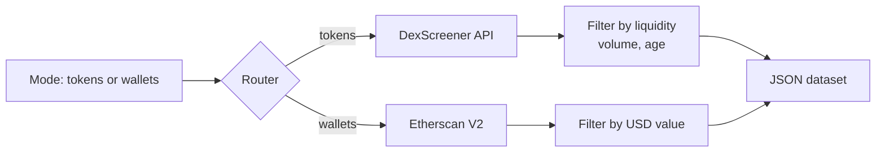
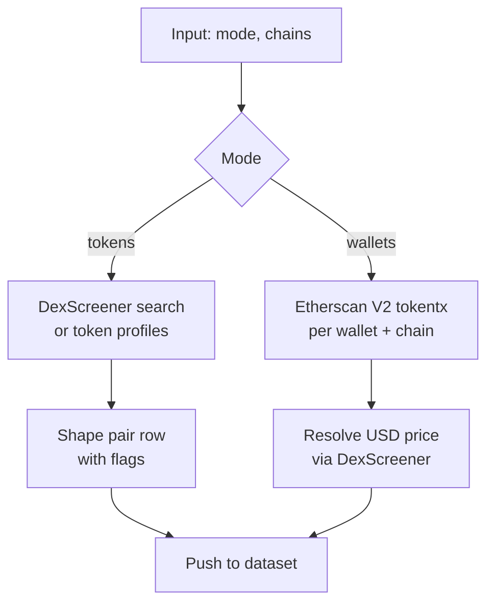

# Crypto Whale Tracker: DEX Token Launches + Wallet Alerts

Track new token launches on Uniswap, PancakeSwap, Raydium, Aerodrome and 40+ DEXs via DexScreener. Monitor whale wallet transactions on Ethereum, Base, Arbitrum, BSC, Polygon, Optimism, Avalanche via Etherscan V2 (one key covers every EVM chain). Filter by liquidity, volume, token age, and USD transfer size. Deduped across runs. Pay per item.

**Searches this actor ranks for:** whale alert API, DEX new listings scraper, token launch tracker, DexScreener API, Etherscan whale monitor, ERC20 transfer feed, Base token scanner, Solana DEX tracker, onchain alerts.

---

## How it works in 30 seconds



Pick tokens mode for DEX discovery (no key needed). Pick wallets mode for address monitoring (bring your own free Etherscan key).

---

## Who this crypto whale tracker is for

| You are a... | You use this to... |
|---|---|
| **Memecoin trader** | Scan fresh Base and Solana launches in the last 24h with real volume. |
| **Whale follower** | Watch 50 known smart money wallets and alert on every $100k+ ERC20 move. |
| **DeFi protocol** | Power a "trending tokens on our chain" feed without running RPC infrastructure. |
| **Journalist or analyst** | Pull large transfers during a market event for a data driven post. |
| **Ops / compliance** | Flag treasury wallet movements or insider token dumps in a Slack channel. |

---

## How to track whale wallets and token launches



1. Choose `mode`: `tokens` (DEX scanner) or `wallets` (address monitor).
2. Actor calls the right public API for your inputs.
3. Rows get liquidity, volume, price change, flags (`new_launch`, `pump`, `low_liquidity`, `thin_float`).
4. Dataset lands as JSON with dedupe keys so you can poll every minute.

---

## Quick start

**Scan fresh Base and Solana launches:**

```json
{
  "mode": "tokens",
  "chains": ["base", "solana"],
  "minLiquidityUsd": 25000,
  "minVolume24hUsd": 100000,
  "maxTokenAgeHours": 48,
  "sortBy": "volume24h"
}
```

**Search for AI narrative tokens:**

```json
{
  "mode": "tokens",
  "searchQueries": ["AI", "agent"],
  "chains": ["ethereum", "base"],
  "minLiquidityUsd": 50000,
  "sortBy": "priceChange24h"
}
```

**Monitor whale wallets across every EVM chain:**

```json
{
  "mode": "wallets",
  "etherscanApiKey": "YOUR_ETHERSCAN_KEY",
  "walletAddresses": [
    "0x28C6c06298d514Db089934071355E5743bf21d60",
    "0x21a31Ee1afC51d94C2eFcCAa2092aD1028285549"
  ],
  "chains": ["ethereum", "base", "arbitrum"],
  "minTxValueUsd": 100000,
  "maxTxAgeHours": 24
}
```

From the command line:

```bash
curl -X POST "https://api.apify.com/v2/acts/scrapemint~crypto-whale-token-launch-tracker/run-sync-get-dataset-items?token=YOUR_APIFY_TOKEN" \
  -H "Content-Type: application/json" \
  -d '{"mode":"tokens","chains":["base"],"minVolume24hUsd":500000}'
```

---

## Supported chains

| Chain | DexScreener (tokens) | Etherscan V2 (wallets) |
|---|---|---|
| **Ethereum** | Yes | Yes (chainid 1) |
| **Base** | Yes | Yes (chainid 8453) |
| **Arbitrum** | Yes | Yes (chainid 42161) |
| **Optimism** | Yes | Yes (chainid 10) |
| **BSC** | Yes | Yes (chainid 56) |
| **Polygon** | Yes | Yes (chainid 137) |
| **Avalanche** | Yes | Yes (chainid 43114) |
| **Linea** | Yes | Yes (chainid 59144) |
| **Blast** | Yes | Yes (chainid 81457) |
| **Solana** | Yes | No (not EVM) |

One Etherscan key covers every EVM chain via the V2 multichain endpoint.

---

## Crypto whale tracker vs the alternatives

| | Whale Alert (Twitter) | Nansen | Arkham | **This actor** |
|---|---|---|---|---|
| Pricing | Free feed | $150 to $1800 / mo | Free + paid tiers | Pay per item, first 50 free |
| Custom wallet watch | No | Yes | Yes | Yes |
| DEX token scanner | No | Partial | Partial | Yes |
| JSON output | No | Paid API | Paid API | Yes, built in |
| Schedule | N/A | Their UI | Their UI | Every 60 seconds |
| Webhook | No | Enterprise | Premium | Any URL |

---

## Sample output (tokens mode)

```json
{
  "source": "dexscreener",
  "chain": "base",
  "dex": "aerodrome",
  "pairAddress": "0xabc...",
  "baseToken": { "address": "0x...", "name": "Example", "symbol": "EXM" },
  "priceUsd": 0.0123,
  "priceChange": { "m5": 2.1, "h1": 8.4, "h24": 120.5 },
  "volume24hUsd": 1250000,
  "liquidityUsd": 480000,
  "fdvUsd": 12000000,
  "pairCreatedAt": "2026-04-21T04:00:00Z",
  "ageHours": 18.5,
  "flags": ["new_launch", "pump"],
  "url": "https://dexscreener.com/base/0xabc..."
}
```

## Sample output (wallets mode)

```json
{
  "source": "etherscan_v2",
  "chain": "base",
  "wallet": "0x28C6...1d60",
  "direction": "out",
  "hash": "0xdef...",
  "timestamp": "2026-04-21T12:30:00Z",
  "from": "0x28C6...1d60",
  "to": "0x9876...",
  "tokenSymbol": "USDC",
  "amount": 250000,
  "priceUsd": 1.0,
  "valueUsd": 250000,
  "url": "https://basescan.org/tx/0xdef..."
}
```

Every field drops into a whale alert bot, a Sheet, a Slack channel, or a trading desk dashboard.

---

## Pricing

First 50 items per run are free. After that you pay per extracted row. A 200 row whale feed lands well under $1. Tokens mode needs zero API keys. Wallets mode requires a free Etherscan key (100k calls per day, one key for every EVM chain).

---

## FAQ

**Do I need an API key?**
Tokens mode: no. DexScreener is public. Wallets mode: yes, a free Etherscan V2 key at `etherscan.io/apis`. One key covers Ethereum, Base, Arbitrum, BSC, Polygon, Optimism, Avalanche, Linea, Blast.

**What chains are supported?**
DexScreener covers 10+ chains including Solana. Etherscan V2 covers every major EVM chain with one key. Solana wallets are not supported in wallets mode (not EVM).

**How do I find whale wallets to watch?**
Nansen "smart money" lists, Arkham entity pages, or known DeFi whale addresses (Wintermute, Jump, Alameda ghost wallets, Binance hot wallets). Paste up to 100 addresses per run.

**How are USD values computed for wallet transfers?**
Token price is resolved via DexScreener at scrape time. Stablecoins resolve to $1.00. Low liquidity tokens may return null and get filtered if you set `minTxValueUsd`.

**Can I run this every minute?**
Yes. DexScreener has no auth limits for modest volume. Etherscan free tier is 5 calls per second and 100k per day, so 50 wallets across 5 chains every minute fits well inside the cap.

**Is scraping onchain data allowed?**
Yes. All data is public, onchain, and served by licensed providers (DexScreener aggregator, Etherscan V2 official API). This actor never scrapes a DEX front end.

---

## Related Scrapemint actors

- **Polymarket Market Monitor** for prediction market odds on politics, crypto, sports
- **Sports Odds Movement Tracker** for live betting lines across 40+ sportsbooks
- **SEC Form 4 Insider Trading Tracker** for every insider buy and sell
- **SEC 8-K Event Tracker** for earnings, exec changes, and M&A filings
- **GitHub Issue Monitor** for devtool category mentions and bug reports
- **Hacker News Scraper** for stories and comments by keyword
- **Reddit Lead Monitor** for subreddit and brand mention tracking

Stack these to cover every public financial, prediction, betting, and onchain surface one desk touches.
