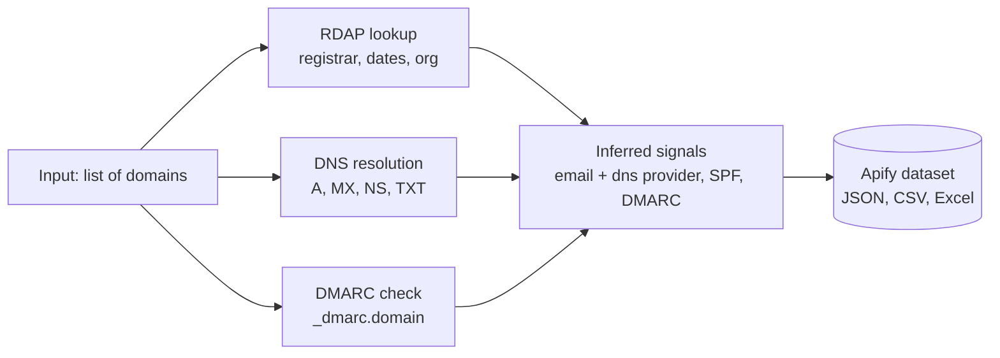

# Domain Intelligence: WHOIS + DNS Bulk Lookup

Pass a list of domains. Get back WHOIS, DNS records, and inferred signals per domain in one row each. Built for sales prospecting, brand protection, and email deliverability audits.

**Use it to**
* Segment a cold outbound list by email platform (Google Workspace vs Microsoft 365)
* Audit DMARC and SPF posture across your customer or partner list
* Check WHOIS expiry dates on a domain portfolio
* Identify the DNS provider (Cloudflare, Route 53, Azure, GoDaddy) for tech-stack research

---

## What you get in 30 seconds



One row per domain. JSON, CSV, or Excel.

---

## Sample output

```json
{
  "domain": "stripe.com",
  "whois": {
    "registrar": "MarkMonitor Inc.",
    "created_at": "1995-09-21",
    "expires_at": "2027-09-20",
    "org": "Stripe, Inc.",
    "country": "US",
    "status": ["client transfer prohibited"]
  },
  "dns": {
    "a": ["3.18.12.63"],
    "mx": ["aspmx.l.google.com", "alt1.aspmx.l.google.com"],
    "ns": ["ns-1098.awsdns-09.org", "ns-2010.awsdns-59.co.uk"],
    "txt": ["v=spf1 include:_spf.google.com ~all", "google-site-verification=..."]
  },
  "signals": {
    "email_provider": "Google Workspace",
    "dns_provider": "AWS Route 53",
    "has_spf": true,
    "has_dmarc": true,
    "dmarc_policy": "reject"
  },
  "scraped_at": "2026-05-07T18:42:11.421Z"
}
```

---

## Who this is for

| Role | What you use it for |
|---|---|
| **SDR / outbound rep** | Segment your prospect list by email platform. Different cold email templates for Google Workspace vs Microsoft 365 inboxes. |
| **Brand protection team** | Bulk audit registrar, expiry dates, and unauthorized lookalike registrations across a domain portfolio. |
| **Email deliverability consultant** | Check SPF and DMARC posture across a client's entire customer base. |
| **Sales engineer** | Identify the DNS or hosting provider on a target account list to tailor pitches. |
| **Security analyst** | Inventory MX and DMARC records across an organization's owned domains. |

---

## Pricing vs typical alternatives

| Tool | Effective price per lookup |
|---|---|
| WhoisXML API | $0.01 to $0.04 |
| Whoxy | $0.0009 (cheap but slow, no DNS, no signals) |
| MXToolbox | $9 a month, capped at 1,000 lookups |
| **This actor** | **$0.005** with first 10 free per run |

You get WHOIS, DNS, and the inferred signals layer in one call. Most alternatives charge separately for each.

---

## Inferred signals reference

**Email provider** is inferred from MX records. Supported labels:
Google Workspace, Microsoft 365, GoDaddy Email, Zoho Mail, Proton Mail, Rackspace, Amazon SES, SendGrid, Mailgun, Proofpoint, McAfee MX, Mimecast, Fastmail, Yandex Mail.

**DNS provider** is inferred from NS records. Supported labels:
Cloudflare, AWS Route 53, Google, Azure DNS, NS1, DNSimple, DNS Made Easy, GoDaddy, Namecheap, Network Solutions, DigitalOcean, Hurricane Electric.

If no rule matches, the signal is `null` and the raw records are still in the row.

---

## Input fields

| Field | Type | Default | Notes |
|---|---|---|---|
| `domains` | array of strings | required | Plain domains or full URLs. Up to 10,000 per run. |
| `includeWhois` | boolean | true | RDAP lookup for registrar and dates. |
| `includeDns` | boolean | true | A, MX, NS, TXT records. |
| `includeDmarc` | boolean | true | DMARC TXT lookup at `_dmarc.<domain>`. |
| `concurrency` | integer | 10 | Parallel lookups. Range 1 to 50. |

---

## Run it from the API

```bash
curl -X POST "https://api.apify.com/v2/acts/scrapemint~domain-intelligence/runs?token=YOUR_TOKEN" \
  -H "Content-Type: application/json" \
  -d '{
    "domains": ["stripe.com", "linear.app", "vercel.com"]
  }'
```

Pull the dataset:

```bash
curl "https://api.apify.com/v2/datasets/RUN_DATASET_ID/items?format=csv&token=YOUR_TOKEN" > domains.csv
```

---

## What this actor does NOT do (yet)

- **Subdomain enumeration.** Input is root domains only.
- **HTTPS certificate inspection.** TLS chain and expiry are out of scope. Pair with a TLS scanner for that.
- **Reverse WHOIS lookups.** No "find all domains owned by Org X" queries.
- **WHOIS history snapshots.** v1 returns the current record. Historical data is not available via RDAP.

---

## Cross sell

Pair this actor with:

- **Lead Enrichment Pipeline** for domain to contacts, then segment by email platform from this actor
- **Website Content Crawler** for full text content per domain
- **GitHub Issue Monitor** for tech-team activity on target accounts

---

## Compliance posture

WHOIS via RDAP and DNS records are public registry data, designed for programmatic access. No authentication or scraping bypasses are involved. Personal data in WHOIS records is redacted by registries per GDPR for individual registrants and is not surfaced by this actor.
