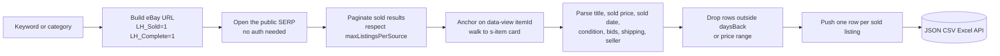
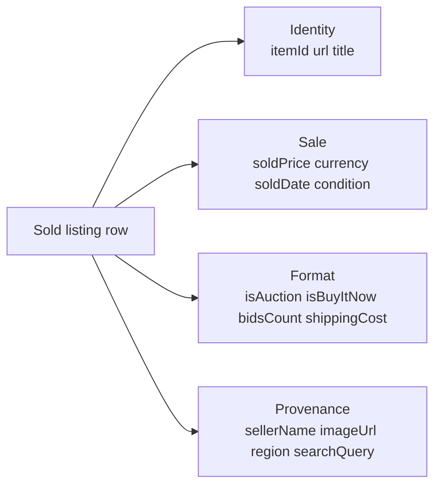

# eBay Sold Listings Scraper (Comp & Resale Price Tracker)

Pull eBay's public sold and completed listings by keyword or category. No cookies. No login. No eBay seller account. Each row ships the item ID, title, the actual sold price (not the asking price), the sold date, condition, bid count for auctions, shipping cost, seller, and image URL. Pay per sold listing.

**Built for** vintage and antique dealers running comp pulls before pricing inventory, sneaker and watch resellers benchmarking the last 90 days of sales, collectible card traders pricing PSA grades, used equipment dealers building bid sheets, probate and estate appraisers documenting fair market value, insurance adjusters validating claims, and ASO consultants tracking price drift across categories.

**Keywords this actor ranks for:** ebay sold listings api, ebay completed listings scraper, ebay comp tracker, terapeak alternative, watchcount alternative, ebay resale price api, ebay flipping tool, antique comp scraper, sneaker resale price api, watch comp tool, collectible card price scraper.

---

## Why this actor

| Other eBay scrapers | **This actor** |
|---|---|
| Pull active listings (asking prices, not sold prices) | Pull only completed and sold listings, real sale data |
| Need a Terapeak subscription | Pay per sold listing, no contract |
| Charge $24 to $99 a month for the same public data | Apify free tier on the first 25 sold listings per run |
| Return one HTML blob per page | Item ID, title, sold price, currency, sold date, condition, bids, shipping parsed |
| Get rate limited at five rows | Built on residential proxy with session pooling for sustained runs |

---

## How it works



The actor anchors extraction on eBay's stable `data-view="mi:1686|iid:<itemId>"` attribute that survives most DOM redesigns, then walks to the surrounding `.s-item` card. Sold price is parsed from the green sale price text rather than any strikethrough original price. Sold date is normalized from "Sold X days ago" or "Sold Mon, Apr 15" to ISO 8601.

---

## What you get per row



Pipe straight into a comp pricing sheet, a resale margin tracker, or a probate fair-market value report.

---

## Quick start

**Track 90 days of sneaker sales**

```json
{
  "queries": ["nike dunk low panda size 10"],
  "maxListingsPerSource": 100,
  "daysBack": 90
}
```

**Watch market comps for graded cards**

```json
{
  "queries": [
    "pokemon charizard psa 9",
    "pokemon pikachu illustrator"
  ],
  "conditions": ["used"],
  "minPrice": 100
}
```

**UK watch market comp**

```json
{
  "queries": ["omega seamaster 2531"],
  "region": "GB",
  "conditions": ["used", "preowned"],
  "minPrice": 1000,
  "maxPrice": 5000
}
```

---

## Sample output

```json
{
  "itemId": "275842310912",
  "url": "https://www.ebay.com/itm/275842310912",
  "title": "Nike Dunk Low Panda Black White DD1391-100 Men's Size 10 Brand New",
  "soldPrice": 112.50,
  "currency": "USD",
  "soldDate": "2026-05-08",
  "condition": "new",
  "isAuction": false,
  "isBuyItNow": true,
  "bidsCount": 0,
  "shippingCost": 0.00,
  "freeShipping": true,
  "sellerName": "kicks_central",
  "imageUrl": "https://i.ebayimg.com/images/g/abc/s-l500.jpg",
  "region": "US",
  "searchQuery": "nike dunk low panda size 10",
  "categoryId": null,
  "scrapedAt": "2026-05-10T09:30:00.000Z"
}
```

---

## Who uses this

| Role | Use case |
|---|---|
| Vintage / antique dealer | Pull comps before pricing inventory or buying at auction |
| Sneaker reseller | Benchmark the last 90 days of size-specific sales |
| Watch trader | Track real sold prices across reference numbers |
| Collectible card flipper | Price PSA / BGS graded cards by recent comps |
| Used equipment dealer | Build bid sheets from completed industrial sales |
| Probate / estate appraiser | Document fair market value with sale-by-sale evidence |
| Insurance adjuster | Validate claim values with comparable sale data |
| Marketplace seller | Set prices that match the market, not aspiration |

---

## Input reference

| Field | Type | What it does |
|---|---|---|
| `queries` | string[] | Search keywords. One eBay sold-items search per query. |
| `categoryIds` | string[] | Optional eBay category IDs. Each category combines with each query. |
| `conditions` | string[] | Filter by condition. Empty includes everything. |
| `minPrice` | integer | Drop listings sold below this price. |
| `maxPrice` | integer | Drop listings sold above this price. Zero disables. |
| `daysBack` | integer | Drop listings sold more than this many days ago. Default 90. |
| `region` | string | Regional eBay storefront. Default US. |
| `maxListingsPerSource` | integer | Max sold listings collected per query or category. Default 60. |
| `concurrency` | integer | Pages processed in parallel. Three is the safe default. |
| `proxyConfiguration` | object | Apify proxy. Residential required at any meaningful volume. |

---

## API call

```bash
curl -X POST \
  "https://api.apify.com/v2/acts/YOUR_USER~ebay-sold-listings-scraper/runs?token=YOUR_TOKEN" \
  -H "Content-Type: application/json" \
  -d '{
    "queries": ["nike dunk low panda"],
    "maxListingsPerSource": 100,
    "daysBack": 90
  }'
```

---

## Pricing

The first 25 sold listing rows per run are free so you can validate output before paying. After that, each sold listing row is charged. No surprise add on charges.

---

## FAQ

### How far back does eBay's sold index go?

eBay typically surfaces the last 90 days of sold and completed listings in the public SERP. Some categories show shorter windows. Set `daysBack` to clip whatever the SERP returns.

### Can I get the actual buyer username?

No. eBay anonymizes buyer IDs on the public completed listings view. The actor returns the seller name where shown.

### Best Offer accepted versus Buy It Now price?

eBay shows the final accepted Best Offer when an offer was accepted. The actor returns that as `soldPrice` because it is the real transaction price, not the listed Buy It Now.

### What about eBay UK / DE / AU?

Set `region` to GB, DE, AU, CA, FR, IT, or ES. Currency follows the regional storefront.

### Is the shipping cost included in the sold price?

No. `soldPrice` is the item price only. `shippingCost` is returned as a separate field, with `freeShipping: true` when applicable.

### How fresh is the data?

Each run hits the live SERP, so sold prices reflect what eBay shows at scrape time. Schedule daily runs to track price drift across a niche.

### Is scraping eBay allowed?

This actor reads HTML any anonymous web visitor can see. Respect eBay's terms and rate limit sensibly. Do not redistribute personal data you have no lawful basis to process.

---

## Related actors

- **Etsy Listings & Seller Intel Scraper** — pull active Etsy listings with shop sales, years active, and star seller status
- **Amazon Product Scraper** — pull product listings, prices, and badges from Amazon storefronts
- **Facebook Marketplace Deal Finder** — pull live Marketplace listings with price, location, and seller
- **G2 Reviews Scraper** — pull SaaS product ratings, top features, top cons, and review snippets
- **Glassdoor Company & Salary Scraper** — pull company rating, headquarters, size, founded year, and salary ranges
