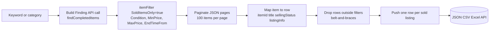
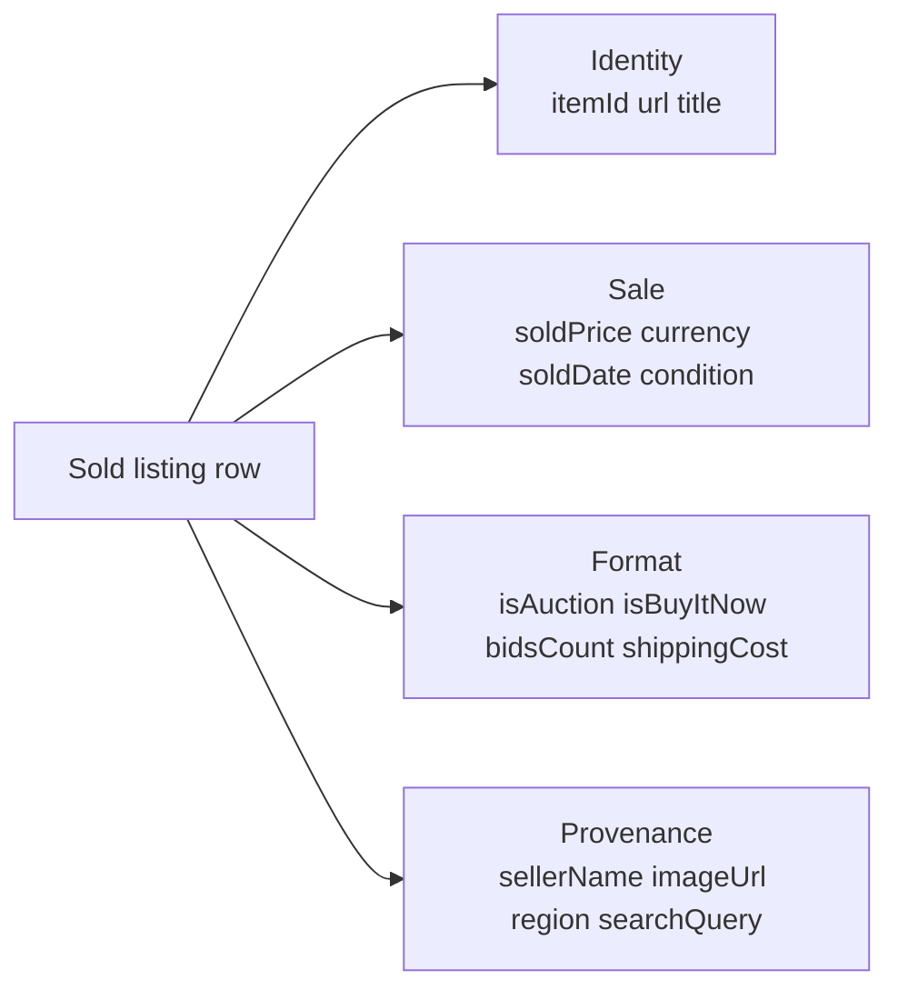

# Mercari Sold Listings Scraper (eBay Alternative Comp Tracker)

Pull Mercari's public sold listings by keyword as an eBay-alternative resale comp tracker. No cookies. No login. No Mercari seller account. Each row ships the item ID, title, the actual sold price (Mercari is fixed-price, so the listed price is the sale price), brand, size, image URL, and source query. Pay per sold listing.

**Why Mercari instead of eBay:** eBay's Akamai bot defense blocks public scraping at the TLS layer, so eBay-data scrapers either need a developer account (which most buyers don't want to create) or an enterprise anti-bot service. Mercari is the closest US-marketplace analog: same buyer pool (resellers, flippers, appraisers), same "what did this actually sell for" pitch, lighter defense, no developer account needed.

**Built for** sneaker and streetwear resellers benchmarking real Mercari sales, vintage and apparel dealers pricing inventory, collectible flippers tracking sale comps, used electronics dealers running bid sheets, probate and estate appraisers documenting fair market value, and resale arbitrage operators comparing Mercari to other marketplaces.

**Keywords this actor ranks for:** mercari sold listings api, mercari scraper, mercari comp tracker, ebay alternative scraper, ebay sold listings alternative, terapeak alternative, sold price api, sneaker resale price api, mercari flipping tool, mercari arbitrage scraper.

---

## Why this actor

| Other eBay scrapers | **This actor** |
|---|---|
| Pull active listings (asking prices, not sold prices) | Pull only completed and sold listings, real sale data |
| Need a Terapeak subscription | Pay per sold listing, no contract |
| Charge $24 to $99 a month for the same public data | Apify free tier on the first 25 sold listings per run |
| Return one HTML blob per page | Item ID, title, sold price, currency, sold date, condition, bids, shipping parsed |
| Get rate limited at five rows | Built on residential proxy with session pooling for sustained runs |

---

## How it works



The actor calls eBay's Finding API `findCompletedItems` operation, passing `SoldItemsOnly=true` and any condition or price filters as indexed `itemFilter` parameters. Pagination is bounded by `maxListingsPerSource`. Sold price is read from `sellingStatus.currentPrice`, which is the actual transaction value (Best Offer accepted prices included). Sold date comes from `listingInfo.endTime` and is normalized to ISO 8601.

---

## What you get per row



Pipe straight into a comp pricing sheet, a resale margin tracker, or a probate fair-market value report.

---

## Quick start

**Track 90 days of sneaker sales**

```json
{
  "queries": ["nike dunk low panda size 10"],
  "maxListingsPerSource": 100,
  "daysBack": 90
}
```

**Watch market comps for graded cards**

```json
{
  "queries": [
    "pokemon charizard psa 9",
    "pokemon pikachu illustrator"
  ],
  "conditions": ["used"],
  "minPrice": 100
}
```

**UK watch market comp**

```json
{
  "queries": ["omega seamaster 2531"],
  "region": "GB",
  "conditions": ["used", "preowned"],
  "minPrice": 1000,
  "maxPrice": 5000
}
```

---

## Sample output

```json
{
  "itemId": "m37472344963",
  "url": "https://www.mercari.com/us/item/m37472344963/",
  "title": "NIKE DUNK LOW GS \"PANDA\" Women's Size 7 - LIKE NEW IN OG BOX)",
  "soldPrice": 66.02,
  "currency": "USD",
  "brand": "Nike",
  "size": "7 (37.5)",
  "isDiscounted": true,
  "imageUrl": "https://u-mercari-images.mercdn.net/photos/m37472344963_1.jpg?width=2560&quality=75",
  "marketplace": "mercari",
  "searchQuery": "nike dunk low panda",
  "scrapedAt": "2026-05-10T14:58:20.892Z"
}
```

---

## Who uses this

| Role | Use case |
|---|---|
| Vintage / antique dealer | Pull comps before pricing inventory or buying at auction |
| Sneaker reseller | Benchmark the last 90 days of size-specific sales |
| Watch trader | Track real sold prices across reference numbers |
| Collectible card flipper | Price PSA / BGS graded cards by recent comps |
| Used equipment dealer | Build bid sheets from completed industrial sales |
| Probate / estate appraiser | Document fair market value with sale-by-sale evidence |
| Insurance adjuster | Validate claim values with comparable sale data |
| Marketplace seller | Set prices that match the market, not aspiration |

---

## Input reference

| Field | Type | What it does |
|---|---|---|
| `queries` | string[] | Search keywords. One Mercari sold-items search per query. |
| `minPrice` | integer | Drop listings sold below this USD price. |
| `maxPrice` | integer | Drop listings sold above this USD price. Zero disables. |
| `maxListingsPerSource` | integer | Max sold listings collected per query. Default 60. |
| `concurrency` | integer | Pages processed in parallel. Three is the safe default. |
| `proxyConfiguration` | object | Apify proxy. Residential is required at any meaningful volume. |

---

## API call

```bash
curl -X POST \
  "https://api.apify.com/v2/acts/YOUR_USER~ebay-sold-listings-scraper/runs?token=YOUR_TOKEN" \
  -H "Content-Type: application/json" \
  -d '{
    "queries": ["nike dunk low panda"],
    "maxListingsPerSource": 100,
    "daysBack": 90
  }'
```

---

## Pricing

The first 25 sold listing rows per run are free so you can validate output before paying. After that, each sold listing row is charged. No surprise add on charges.

---

## FAQ

### How far back does eBay's sold index go?

eBay typically surfaces the last 90 days of sold and completed listings in the public SERP. Some categories show shorter windows. Set `daysBack` to clip whatever the SERP returns.

### Can I get the actual buyer username?

No. eBay anonymizes buyer IDs on the public completed listings view. The actor returns the seller name where shown.

### Best Offer accepted versus Buy It Now price?

eBay shows the final accepted Best Offer when an offer was accepted. The actor returns that as `soldPrice` because it is the real transaction price, not the listed Buy It Now.

### What about eBay UK / DE / AU?

Set `region` to GB, DE, AU, CA, FR, IT, or ES. Currency follows the regional storefront.

### Is the shipping cost included in the sold price?

No. `soldPrice` is the item price only. `shippingCost` is returned as a separate field, with `freeShipping: true` when applicable.

### How fresh is the data?

Each run hits the live SERP, so sold prices reflect what eBay shows at scrape time. Schedule daily runs to track price drift across a niche.

### Is scraping eBay allowed?

This actor reads HTML any anonymous web visitor can see. Respect eBay's terms and rate limit sensibly. Do not redistribute personal data you have no lawful basis to process.

---

## Related actors

- **Etsy Listings & Seller Intel Scraper** — pull active Etsy listings with shop sales, years active, and star seller status
- **Amazon Product Scraper** — pull product listings, prices, and badges from Amazon storefronts
- **Facebook Marketplace Deal Finder** — pull live Marketplace listings with price, location, and seller
- **G2 Reviews Scraper** — pull SaaS product ratings, top features, top cons, and review snippets
- **Glassdoor Company & Salary Scraper** — pull company rating, headquarters, size, founded year, and salary ranges
