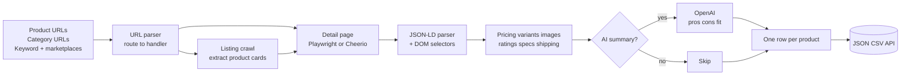
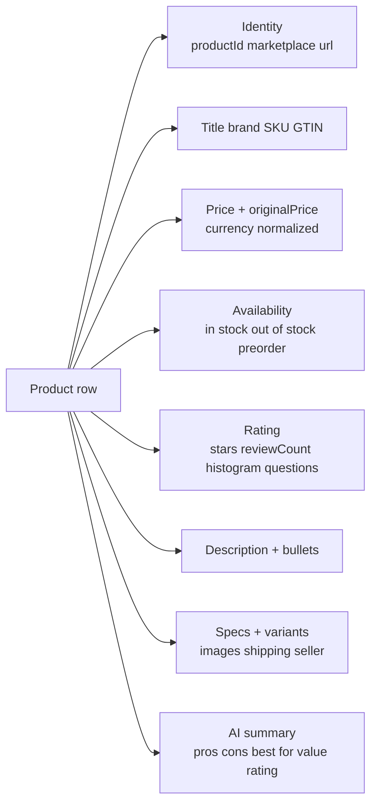

# Ecommerce Intelligence Pro: Multi Marketplace Product Monitor

Pull products across Amazon, Walmart, Target, eBay, Etsy, AliExpress, Best Buy, Costco, Wayfair, Home Depot, IKEA, Zalando, ASOS, plus any Shopify, WooCommerce, BigCommerce, Magento, or Salesforce Commerce storefront. Each row ships pricing, stock, ratings, variants, images, specs, shipping, seller, and optional AI generated pros and cons. Auto detects the retailer. JSON-LD primary parser covers any storefront with Schema.org Product data. Pay per row.

**Built for** price intelligence teams tracking competitor catalogs, dropshippers sourcing winning products, brand managers watching MAP violations across resellers, BI teams piping retail catalogs into a warehouse, content teams powering shopping guides with structured data, lead gen platforms enriching company records with retailer signals, and AI builders training product recommenders on a clean cross marketplace dataset.

**Keywords this actor ranks for:** ecommerce intelligence, product intelligence, amazon intelligence, walmart intelligence, target intelligence, ebay intelligence, etsy intelligence, aliexpress intelligence, best buy intelligence, ikea intelligence, shopify intelligence, woocommerce intelligence, bigcommerce intelligence, product data api, ecommerce data finder, jsonld product intelligence, retail price tracker, MAP monitoring, product catalog to JSON, product catalog to CSV.

---

## Why this actor

| Other product scrapers | **This actor** |
|---|---|
| One marketplace only | Fourteen built in marketplaces plus a JSON-LD fallback that covers any Schema.org storefront |
| Title and price only | Full enrichment: variants, specs, images, shipping, seller, breadcrumbs, ratings histogram |
| Returns broken price strings | Prices normalized to `{ value, currency }` from JSON-LD or meta tags |
| No deduplication | Per product ID dedupe across runs, persisted in a key value store |
| Hard coded selectors that break monthly | JSON-LD primary path with selector fallbacks for fields not in structured data |
| No AI layer | Optional GPT generated pros, cons, target audience, and value rating per row |
| Single category at a time | Mix product URLs, category URLs, and keyword search across 18 marketplace endpoints in one run |
| No bot evasion | Apify residential proxy, Chrome fingerprinting, session pool with cookie persistence |

---

## How it works



Detail pages render with Playwright behind rotating residential proxy and browser fingerprinting. JSON-LD `Product` blocks are the primary source for title, price, brand, SKU, GTIN, rating, and review count. DOM selectors fill in fields not in structured data (variants, specs tables, shipping, Q&A, ratings histogram). Cheerio mode is available for static storefronts (Shopify, WooCommerce, BigCommerce) when speed matters more than coverage.

---

## What you get per row



Toggle `includeAdditionalProperties` for the rich enrichment fields. Toggle `aiSummaryDataPoints` for GPT generated buyer insights.

---

## Quick start

**Track a basket of Amazon, Walmart, and Target products**

```json
{
  "productUrls": [
    "https://www.amazon.com/dp/B0CHX1W1XY",
    "https://www.walmart.com/ip/Apple-AirPods-Pro-2nd-Gen/1810913013",
    "https://www.target.com/p/-/A-87852397"
  ],
  "extractImages": true,
  "extractVariants": true,
  "extractRatingHistogram": true
}
```

**Crawl an entire Best Buy category**

```json
{
  "categoryUrls": [
    "https://www.bestbuy.com/site/laptops/all-laptops/pcmcat138500050001.c"
  ],
  "totalMaxProducts": 100,
  "concurrency": 4
}
```

**Keyword search across multiple marketplaces in one run**

```json
{
  "keyword": "wireless earbuds",
  "marketplaces": ["amazon_us", "walmart_us", "target_us", "bestbuy_us"],
  "totalMaxProducts": 200
}
```

**Shopify or BigCommerce storefront with the cheerio fast path**

```json
{
  "scrapeMode": "cheerio",
  "categoryUrls": [
    "https://www.gymshark.com/collections/all-mens"
  ],
  "totalMaxProducts": 250
}
```

**Add AI summaries for buyer insights**

```json
{
  "productUrls": [
    "https://www.amazon.com/dp/B0CHX1W1XY",
    "https://www.amazon.com/dp/B0BDHWDR12"
  ],
  "aiSummaryDataPoints": ["pros", "cons", "best_for", "avoid_if", "value_rating"],
  "aiSummaryCustomPrompt": "Focus on long term durability and warranty terms."
}
```

The AI summary path requires an `OPENAI_API_KEY` environment variable on the actor run.

---

## Sample output

```json
{
  "productId": "B0CHX1W1XY",
  "marketplace": "amazon",
  "url": "https://www.amazon.com/dp/B0CHX1W1XY",
  "title": "Apple AirPods Pro (2nd Generation) Wireless Earbuds with USB-C",
  "brand": "Apple",
  "sku": "MTJV3AM/A",
  "gtin": "194253397717",
  "productType": "Product",
  "category": "Electronics",
  "breadcrumbs": ["Electronics", "Headphones", "Earbud Headphones"],
  "price": { "value": 189.99, "currency": "USD" },
  "originalPrice": { "value": 249.0, "currency": "USD" },
  "availability": "in_stock",
  "rating": {
    "stars": 4.7,
    "reviewCount": 84231,
    "histogram": { "5": 81, "4": 11, "3": 4, "2": 1, "1": 3 },
    "questionsCount": 1247
  },
  "description": "Active Noise Cancellation reduces unwanted background noise...",
  "bullets": [
    "RICHER AUDIO EXPERIENCE - Custom high excursion driver",
    "PERSONALIZED SPATIAL AUDIO with dynamic head tracking",
    "ACTIVE NOISE CANCELLATION reduces unwanted background noise"
  ],
  "specs": {
    "connectivity technology": "Wireless",
    "battery life": "Up to 6 hours",
    "form factor": "In Ear"
  },
  "variants": [
    { "value": "USB-C", "sku": "MTJV3AM/A" },
    { "value": "Lightning", "sku": "MQD83AM/A" }
  ],
  "images": [
    "https://m.media-amazon.com/images/I/61SUj2aKoEL.jpg",
    "https://m.media-amazon.com/images/I/71zny7BTRlL.jpg"
  ],
  "shipping": {
    "text": "FREE delivery Tomorrow",
    "freeShipping": true,
    "storePickup": false
  },
  "seller": "Amazon.com",
  "aiSummary": {
    "pros": [
      "Class leading active noise cancellation",
      "Rich, balanced sound with strong bass",
      "Excellent integration with Apple ecosystem",
      "USB-C charging case with MagSafe"
    ],
    "cons": [
      "Premium price vs competitors",
      "Limited customization on Android",
      "Ear tips can dislodge during workouts"
    ],
    "best_for": [
      "Apple ecosystem users",
      "Frequent travelers",
      "Podcast and audiobook listeners"
    ],
    "avoid_if": [
      "You use Android primarily",
      "You need an over ear form factor",
      "Budget under $150"
    ],
    "value_rating": {
      "score": 8,
      "reasoning": "Premium price justified by ANC quality and ecosystem integration."
    }
  },
  "scrapedAt": "2026-04-28T10:00:00.000Z"
}
```

---

## Who uses this

| Role | Use case |
|---|---|
| Price intelligence team | Track competitor catalogs daily across Amazon, Walmart, Target. One row per product per snapshot. |
| Dropshipper / reseller | Source winning products from AliExpress, pull demand signals from Amazon and eBay. |
| Brand manager | MAP monitoring across reseller channels. Catch unauthorized discounting. |
| BI / data analyst | Pipe retail catalogs into Snowflake, BigQuery, or Postgres. Each row API ready. |
| Content team | Power shopping guides with structured product data: specs, ratings, images. |
| Lead gen platform | Enrich company records with retailer presence and product portfolio signals. |
| AI builder | Train product recommenders, search relevance models, or shopping assistants on a clean dataset. |
| Investor / analyst | Monitor SKU level demand at retail chains as a leading indicator. |

---

## Input reference

| Field | Type | What it does |
|---|---|---|
| `scrapeMode` | enum | auto, playwright, or cheerio. Auto picks per URL. |
| `productUrls` | string[] | Direct product URLs across any supported marketplace or generic Schema.org storefront. |
| `categoryUrls` | string[] | Category, search, brand, or seller URLs. The actor walks the listing, queues each product. |
| `keyword` | string | Search term applied across selected marketplaces. |
| `marketplaces` | string[] | Which marketplaces to run the keyword search on. Eighteen endpoints supported. |
| `includeAdditionalProperties` | boolean | Variants, specs, ratings histogram, Q&A, shipping. Off keeps rows lean. |
| `aiSummaryDataPoints` | string[] | pros, cons, best_for, avoid_if, value_rating, sentiment_breakdown, feature_highlights, comparison_notes, buyer_questions, fit_recommendation. |
| `aiSummaryCustomPrompt` | string | Optional extra instruction passed to the summarizer. |
| `totalMaxProducts` | integer | Hard cap on rows pushed per run. 0 means unlimited. |
| `currency` | enum | Output currency normalization. Defaults to original. |
| `extractImages` | boolean | Pull primary plus gallery image URLs at original resolution. |
| `maxImagesPerProduct` | integer | Cap on image URLs per row. |
| `extractVariants` | boolean | Variant matrix with value and SKU. |
| `extractRatingHistogram` | boolean | Five star to one star percentage split. |
| `extractQuestionsCount` | boolean | Answered questions count where exposed. |
| `extractShippingInfo` | boolean | Free shipping flag, delivery estimate, store pickup. |
| `dedupe` | boolean | Skip product IDs from previous runs. |
| `concurrency` | integer | Parallel pages. Three to five is safe. |
| `proxyConfiguration` | object | Apify proxy. Residential is required for Amazon, Walmart, Target, AliExpress. |

---

## API call

```bash
curl -X POST \
  "https://api.apify.com/v2/acts/YOUR_USER~ecommerce-scraper/runs?token=YOUR_TOKEN" \
  -H "Content-Type: application/json" \
  -d '{
    "keyword": "standing desk",
    "marketplaces": ["amazon_us", "walmart_us", "wayfair_us"],
    "totalMaxProducts": 60,
    "extractVariants": true,
    "extractImages": true
  }'
```

---

## Pricing

The first few products per run are free so you can validate output before paying. After that, one charge per product row. Variants, specs, images, ratings histogram, and shipping info are all included at no extra cost. AI summary calls bill against your own OpenAI key.

---

## FAQ

### What marketplaces are auto detected?

Amazon (US, UK, DE, FR, JP, IN), Walmart, Target, Best Buy, Costco, Wayfair, Home Depot, eBay, Etsy, AliExpress, IKEA, Zalando, ASOS. Any URL with a Schema.org `Product` JSON-LD block also works (Shopify, WooCommerce, BigCommerce, Magento, Salesforce Commerce, Squarespace, Wix).

### How does the JSON-LD fallback work?

Most modern storefronts ship a `<script type="application/ld+json">` block with a `Product` schema. The actor parses every JSON-LD block on the page, picks the first `Product` (or `@graph` member), and maps name, brand, SKU, GTIN, image, description, offers, and aggregateRating directly. This is why coverage is so wide without per retailer code.

### Why does Amazon block scrapers?

Amazon uses CAPTCHA, request rate analysis, and TLS fingerprinting. The actor uses fingerprinted Chrome with Apify residential proxy and per session cookie persistence. Most retries resolve within two attempts.

### Cheerio versus Playwright?

Cheerio is raw HTTP, ten times faster, but only works on server rendered pages (Shopify, WooCommerce, most boutique storefronts). Playwright renders the page in a real Chromium and handles every retailer including JS heavy ones (Amazon, Walmart, Target). Use auto unless you have a preference.

### Does it pull reviews?

This actor focuses on product data with summary review fields (count, stars, histogram). For full review text with author and timestamps, use the related Amazon Review Intelligence actor.

### Can I get only the price field?

Yes. Set `includeAdditionalProperties` false and `extractImages` false. The row stays lean: title, brand, price, availability, rating, url.

### Does the AI summary work without an OpenAI key?

No. Set `OPENAI_API_KEY` as an environment variable on the actor run. Without it, AI fields are skipped and the rest of the row ships normally. Default model is `gpt-4o-mini`. Override with `OPENAI_MODEL` env if needed.

### Can I pull product variants with their own prices?

Yes. Toggle `extractVariants` and the row ships an array with each color, size, or style and its SKU. Per variant pricing is captured when the marketplace exposes it on the parent product page.

### How accurate is the price field?

Prices come from JSON-LD `offers.price` first, then meta tags, then DOM selectors. Currency comes from `offers.priceCurrency`, then `meta[product:price:currency]`, then symbol detection. Sale price lands in `price`, list price in `originalPrice` when both are present.

### Is ecommerce pulling legal?

This actor reads HTML any anonymous web visitor can see. Respect each retailer's terms and rate limit sensibly. Do not redistribute product images, descriptions, or reviews you have no lawful basis to publish.

---

## Related actors

- **Amazon Product Intelligence**. Same shape, Amazon only, with deeper Amazon specific fields (BSR, A+ content, sponsored signals).
- **Amazon Review Intelligence**. Every review with author, rating, helpful votes, verified purchase, and timestamps.
- **Trustpilot Brand Reputation**. Cross brand reputation tracking with review intelligence.
- **Google Reviews Intelligence**. Local business reviews with sentiment.
- **Zillow Home Price Intelligence**. Same shape applied to real estate listings.
- **Website Content Pipeline**. Generic content crawl when you need raw HTML or text instead of structured product data.
