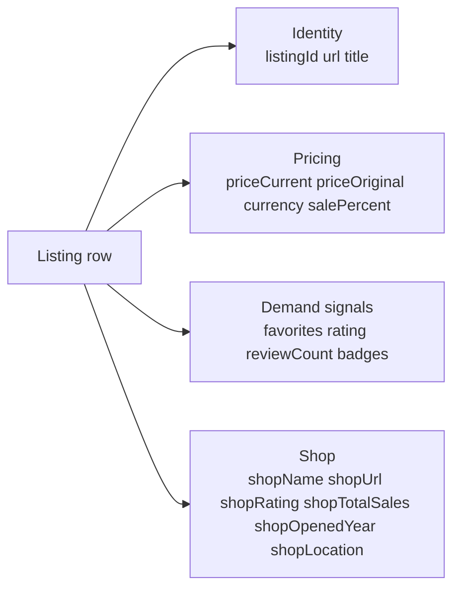

# Etsy Listings & Seller Intel Intelligence (No Login Required)

Pull public Etsy listings and seller intel from any keyword search or shop URL. No cookies. No login. No Etsy seller account. Each row ships the listing ID, title, price (sale and original), favorites, rating, review count, plus shop-level intel like total sales, years on Etsy, location, and star seller status. Pay per listing.

**Built for** dropshippers hunting trending products, niche makers benchmarking competitors, vintage and antique dealers tracking comps, DTC brands sourcing creative angles, and acquirers vetting shop-level seller intel.

**Keywords this actor ranks for:** etsy intelligence, etsy listing intelligence, etsy product api, etsy seller intelligence, etsy shop intel, etsy bestseller tracker, etsy trend intelligence, etsy competitor research, dropshipping etsy, etsy product hunt, etsy keyword research, etsy sales estimator.

---

## Why this actor

| Other Etsy scrapers | **This actor** |
|---|---|
| Need a seller cookie | Zero cookies, zero login |
| Return one HTML blob per page | Listing ID, title, price, sale price, favorites, rating, review count, tags parsed |
| Drop shop-level intel | Shop sales, years active, location, star seller status embedded on every listing row |
| Charge per page hit | Charge per listing row, no contract |
| Get rate limited at five rows | Built on residential proxy with session pooling for sustained runs |

---

## How it works

```mermaid
flowchart LR
    A[Keyword or shop URL] --> B[Build Etsy URL<br/>per region]
    B --> C[Open the public SPA<br/>no auth needed]
    C --> D[Paginate the listing grid<br/>respect maxListingsPerSource]
    D --> E[Anchor on data-listing-id<br/>walk to ad card]
    E --> F[Parse title, price, sale, favorites,<br/>rating, badges]
    F --> G[Lazy fetch shop intel<br/>once per unique shop]
    G --> H[Embed shop intel into row]
    H --> I[Push one row per listing]
    I --> J[(JSON CSV Excel API)]
```



The actor anchors extraction on the public `data-listing-id` attribute that Etsy renders on every listing card. That makes it resilient to the React class name churn that breaks most Etsy scrapers within weeks. Shop-level intel is fetched once per unique shop and embedded onto every listing row from that shop.

---

## What you get per row



Pipe straight into a product hunt sheet, a competitor teardown, or a dropshipping spend tracker.

---

## Quick start

**Hunt a trending category by keyword**

```json
{
  "queries": ["leather wallet", "wedding invitation"],
  "maxListingsPerSource": 100
}
```

**Pull every active listing from a competitor shop**

```json
{
  "shopUrls": [
    "https://www.etsy.com/shop/Beardbrand",
    "https://www.etsy.com/shop/SimpleLoveDecor"
  ],
  "maxListingsPerSource": 200,
  "includeShopIntel": true
}
```

**Comp research for vintage dealers**

```json
{
  "queries": ["vintage typewriter olivetti", "vintage typewriter remington"],
  "country": "US",
  "maxListingsPerSource": 60
}
```

---

## Sample output

```json
{
  "listingId": "1248756093",
  "url": "https://www.etsy.com/listing/1248756093/",
  "title": "Handmade Full Grain Leather Bifold Wallet, Personalized Mens Gift",
  "priceCurrent": 38.50,
  "priceOriginal": 55.00,
  "currency": "USD",
  "salePercent": 30,
  "rating": 4.9,
  "reviewCount": 1384,
  "favorites": 4210,
  "isBestseller": true,
  "isStarSeller": true,
  "freeShipping": true,
  "shopName": "PineLeatherCo",
  "shopUrl": "https://www.etsy.com/shop/PineLeatherCo",
  "imageUrl": "https://i.etsystatic.com/.../il_794xN.123_abcd.jpg",
  "shopRating": 4.9,
  "shopReviewCount": 24320,
  "shopTotalSales": 58410,
  "shopOpenedYear": 2017,
  "shopLocation": "Austin, Texas, United States",
  "shopIsStarSeller": true,
  "shopAnnouncement": "All orders ship within 2 business days. Free monogram on every bifold.",
  "sourceType": "search",
  "searchQuery": "leather wallet",
  "sourceShop": null,
  "country": "US",
  "scrapedAt": "2026-05-10T09:30:00.000Z"
}
```

---

## Who uses this

| Role | Use case |
|---|---|
| Dropshipper | Hunt high-favorites, high-review listings to source via overseas suppliers |
| Niche maker | Benchmark competitor pricing, sale cadence, and badge mix in your category |
| Vintage dealer | Track comparable sold pricing for rare items by keyword |
| DTC brand | Source creative angles and copy patterns from top sellers |
| Etsy seller | Monitor your own bestsellers vs. shop competitors weekly |
| Acquirer | Vet shop-level intel before buying an established Etsy business |
| SEO | Pull keyword search results to map listing tag patterns |

---

## Input reference

| Field | Type | What it does |
|---|---|---|
| `queries` | string[] | Search keywords. One Etsy search per query. |
| `shopUrls` | string[] | Full Etsy shop URLs or raw shop names. Pulls every active listing per shop. |
| `maxListingsPerSource` | integer | Max listings collected per query or shop before pagination stops. Default 60. |
| `country` | string | Etsy regional storefront. Default US. |
| `includeShopIntel` | boolean | Embed shop sales, years active, location, star seller status onto every listing row. Default true. |
| `concurrency` | integer | Pages processed in parallel. Five is the safe default for Etsy. |
| `proxyConfiguration` | object | Apify proxy. Residential is required at any meaningful volume. |

---

## API call

```bash
curl -X POST \
  "https://api.apify.com/v2/acts/YOUR_USER~etsy-listings-seller-intel/runs?token=YOUR_TOKEN" \
  -H "Content-Type: application/json" \
  -d '{
    "queries": ["leather wallet"],
    "maxListingsPerSource": 100
  }'
```

---

## Pricing

The first 30 listing rows per run are free so you can validate output before paying. After that, each listing row is charged. No surprise add on charges.

---

## FAQ

### Do I need an Etsy seller account?

No. The actor only touches Etsy's public search and shop pages. Your account is never touched.

### Can I get sold listing prices?

Etsy hides historical sold prices from anonymous visitors. The actor returns active listing prices, sale prices, and the favorites count, which together give a strong demand signal for trend tracking.

### How many listings can I pull per shop?

Up to `maxListingsPerSource`, capped at 1000. Most Etsy shops surface their full active inventory through the shop grid.

### Can I pull regional Etsy storefronts?

Yes. Set `country` to GB, DE, FR, CA, AU, IN, or JP. Pricing currency and shipping defaults will reflect the chosen storefront.

### What if a shop has no listings or is on vacation?

The actor returns nothing for that source and logs a warning. You only pay per pushed row, so an empty shop is a free lookup.

### How fresh is the data?

Each run hits the live page, so prices, favorites, and badges reflect what Etsy renders at pull time. Schedule weekly runs to track sale cadence and sentiment shifts.

### Is pulling Etsy allowed?

This actor reads HTML any anonymous web visitor can see. Respect Etsy's terms and rate limit sensibly. Do not redistribute personal data you have no lawful basis to process.

---

## Related actors

- **Amazon Product Intelligence** , pull product listings, prices, and badges from Amazon storefronts
- **E-commerce Intelligence Pro** , pull product listings across major shop platforms
- **Facebook Marketplace Deal Finder** , pull live Marketplace listings with price, location, and seller
- **Google Maps Intelligence** , pull local business listings with rating, address, and category
- **Trustpilot Brand Reputation** , pull TrustScore, review count, and review snippets per business
