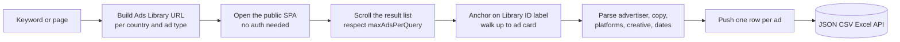
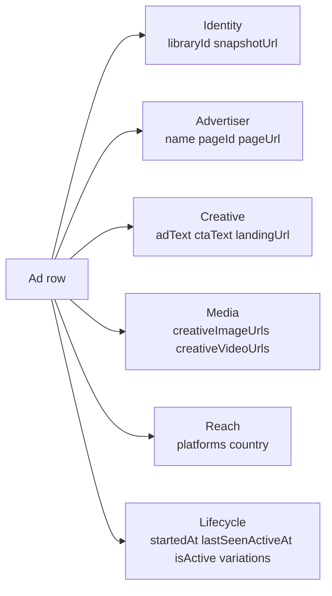

# Facebook Ads Library Scraper (Public, No Login)

Pull live and inactive ads from Meta's public Ads Library by keyword or by advertiser page. No cookies. No login. No app review or token rotation. Each row ships the library ID, advertiser, ad copy, creative URL, started date, platforms, country, ad type, and active status. Pay per ad row.

**Built for** competitive intel teams, media buyers, performance marketing agencies, brand monitoring, PR research, and political/issue analysts who need fast access to every ad an advertiser is running on Facebook, Instagram, Audience Network, and Messenger.

**Keywords this actor ranks for:** facebook ads library scraper, meta ads library api, instagram ads scraper, ad creative intelligence, competitor ad spy, ad creative database, facebook ad copy scraper, political ad scraper, ad transparency api, magicbrief alternative, bigspy alternative, adespresso alternative, adsparo alternative.

---

## Why this actor

| Other Ads Library scrapers | **This actor** |
|---|---|
| Need a Meta developer app and review | Zero auth, zero approval |
| Stop at 100 ads then hit a paywall | Configurable cap up to 2000 ads per query |
| Return raw page HTML | Library ID, advertiser, copy, creative, platforms, dates parsed |
| Charge per seat per month | Charge per ad row, no contract |
| Fail silently when the SPA reflows | Anchored on the public "Library ID:" label, not brittle class names |

---

## How it works



The actor anchors extraction on the public "Library ID:" label that Meta renders on every ad card. That makes it resilient to the React class name churn that breaks most Ads Library scrapers within weeks.

---

## What you get per row



Pipe straight into a creative swipe file, an offer benchmarking sheet, or a spend tracker.

---

## Quick start

**Spy on a category by keyword**

```json
{
  "queries": ["meal kit", "smart mattress"],
  "countries": ["US"],
  "maxAdsPerQuery": 200
}
```

**Pull every ad a competitor is running**

```json
{
  "pageUrls": [
    "https://www.facebook.com/Nike",
    "https://www.facebook.com/Stripe"
  ],
  "countries": ["US", "GB"],
  "maxAdsPerQuery": 500
}
```

**Track political and issue ads**

```json
{
  "queries": ["election 2026"],
  "adType": "POLITICAL_AND_ISSUE_ADS",
  "countries": ["US"],
  "maxAdsPerQuery": 300
}
```

---

## Sample output

```json
{
  "libraryId": "857432109876543",
  "snapshotUrl": "https://www.facebook.com/ads/library/?id=857432109876543",
  "advertiserName": "Nike",
  "advertiserPageId": "15087023444",
  "advertiserPageUrl": "https://www.facebook.com/Nike",
  "adText": "Just Do It. Lace up the new Pegasus 41 and run further than yesterday. Free shipping for members.",
  "ctaText": "Shop Now",
  "landingUrl": "https://www.nike.com/w/pegasus-41",
  "creativeImageUrls": [
    "https://scontent.fbcdn.net/v/t39.../pegasus41_hero.jpg"
  ],
  "creativeVideoUrls": [],
  "platforms": ["Facebook", "Instagram"],
  "startedAt": "Apr 12, 2026",
  "lastSeenActiveAt": null,
  "isActive": true,
  "variations": 14,
  "country": "US",
  "adType": "ALL",
  "activeStatusFilter": "all",
  "searchQuery": null,
  "searchPageId": "15087023444",
  "scrapedAt": "2026-05-10T07:30:00.000Z"
}
```

---

## Who uses this

| Role | Use case |
|---|---|
| Performance marketer | Build a creative swipe file from competitor ads in your category |
| Media buyer | Track which formats and CTAs a brand is running this quarter |
| Brand strategist | Watch positioning shifts in your category month over month |
| Agency | Source winning hooks for client campaigns |
| PR research | Monitor a brand's paid messaging during a crisis or launch |
| Political analyst | Pull funder, copy, and lifecycle data on issue ads |
| Investor | Read ad cadence as a leading signal of growth stage |

---

## Input reference

| Field | Type | What it does |
|---|---|---|
| `queries` | string[] | Search keywords. One Ads Library search per query per country. |
| `pageUrls` | string[] | Advertiser page URLs or numeric page IDs. Pulls every ad on each page. |
| `countries` | string[] | ISO country codes. Default ['US']. |
| `adType` | string | ALL, POLITICAL_AND_ISSUE_ADS, HOUSING_ADS, EMPLOYMENT_ADS, CREDIT_ADS. |
| `activeStatus` | string | all, active, inactive. |
| `maxAdsPerQuery` | integer | Max rows collected per search before scrolling stops. Default 100. |
| `concurrency` | integer | Searches processed in parallel. Three is the safe default for Meta. |
| `proxyConfiguration` | object | Apify proxy. Residential is required at any meaningful volume. |

---

## API call

```bash
curl -X POST \
  "https://api.apify.com/v2/acts/YOUR_USER~facebook-ads-library-scraper/runs?token=YOUR_TOKEN" \
  -H "Content-Type: application/json" \
  -d '{
    "queries": ["meal kit"],
    "countries": ["US"],
    "maxAdsPerQuery": 100
  }'
```

---

## Pricing

The first 20 ad rows per run are free so you can validate output before paying. After that, each ad row is charged. No surprise add on charges.

---

## FAQ

### Do I need a Meta developer account or app review?

No. The actor only touches Meta's public Ads Library surface. The official Meta Ad Library API requires app review, an access token, and rate-limits new accounts hard. This actor sidesteps all of that.

### What ad types are supported?

The full Ads Library surface: ALL (commercial), POLITICAL_AND_ISSUE_ADS, HOUSING_ADS, EMPLOYMENT_ADS, and CREDIT_ADS. Political ads carry funder and spend-range fields; commercial ads carry copy, creative, platforms, and lifecycle fields.

### Can I get spend or impressions data?

Spend ranges and impression ranges are only published by Meta for political and issue ads. For commercial ads, the public surface ships ad copy, creative, runtime, platforms, and variation count, but no spend.

### Can I track a brand over time?

Yes. Schedule weekly runs against the same advertiser pages. Diff the libraryId set against the prior run to detect new and stopped ads.

### Why not use the official Ad Library API?

The official API requires app review, a Meta developer account in good standing, ID verification, and is rate-limited per token. New accounts often wait weeks for approval. This actor returns the same public data without any of that overhead.

### How do I find an advertiser's page ID?

Open the brand's Facebook page and copy the URL. The actor accepts both the slug form (facebook.com/Nike) and the numeric form (facebook.com/15087023444).

### Is pulling the Ads Library allowed?

This actor reads HTML any anonymous web visitor can see. Meta publishes the Ads Library specifically as a transparency tool. Respect Meta's terms and rate limit sensibly. Do not redistribute personal data you have no lawful basis to process.

---

## Related actors

- **Facebook Marketplace Deal Finder** , pull live Marketplace listings with price, location, and seller
- **Threads Intelligence** , pull public Threads posts and creator metrics
- **TripAdvisor Intelligence** , pull hotel, restaurant, and attraction listings with reviews
- **E-commerce Intelligence Pro** , pull product listings across major shop platforms
- **Lead Enrichment Pipeline** , multi source enrichment for a list of company domains
