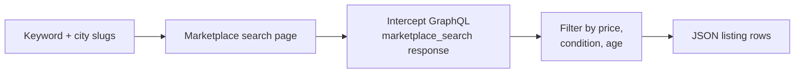
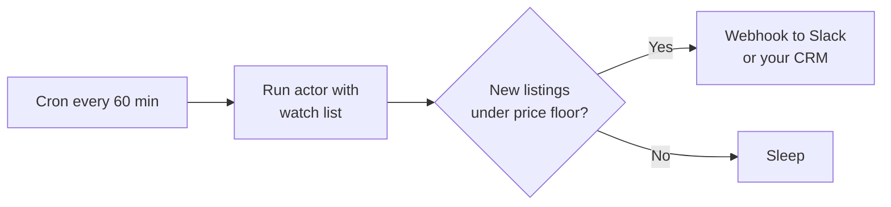

# Marketplace Arbitrage Radar — Local Resale Deal Intelligence

Scan Facebook Marketplace for resale arbitrage opportunities. Every row carries title, price, original price (if marked down), condition, location, distance, posted date, seller, image, and direct listing URL. Inputs: keywords plus city slugs. Built for eBay and Amazon resellers, flippers, retail arbitrage operators, and local commerce researchers. Pay per listing.

**Ranks for:** Facebook Marketplace scraper, Marketplace deal finder, resale arbitrage tool, eBay flipping research, retail arbitrage data, FB Marketplace API, Marketplace alert system, local resale intelligence.

---

## How it works



The actor opens each search URL in a real Chromium with your Facebook session cookies, then captures the GraphQL response that powers the Marketplace UI. Listings are deduped by listing ID across runs so the same item does not show up twice.

---

## Why you need cookies

Facebook Marketplace blocks anonymous traffic. Every public scraper that claims to work without login is either fragile, illegal, or returns nothing. This actor takes the same approach Apify's category leader does: you paste your own session cookies once, the actor uses them for the run, and they never leave the run.

The minimum cookies needed are `c_user`, `xs`, and `datr`. Use a Cookie Editor extension to export them from a logged in browser tab.

---

## Who uses this

| Role | Use case |
|---|---|
| **eBay reseller** | Daily sweeps for under priced electronics, sneakers, lego sets in a 25 mile radius. |
| **Retail arbitrage** | Catch new old stock and damaged box items priced below clearance. |
| **Furniture flipper** | Watch for distressed mid century pieces under 200 USD across multiple metros. |
| **Local commerce analyst** | Build price benchmark datasets for specific brands and models. |
| **Insurance ops** | Track stolen merch reappearing on Marketplace by serial number or distinctive tag. |

---

## Quick start

**Sweep iPhones in San Francisco:**

```json
{
  "keywords": ["iphone"],
  "cities": ["sanfrancisco"],
  "minPrice": 100,
  "maxPrice": 600,
  "fbCookies": [{ "name": "c_user", "value": "...", "domain": ".facebook.com" }]
}
```

**Multi metro Lego deal sweep:**

```json
{
  "keywords": ["lego star wars", "lego technic"],
  "cities": ["sanfrancisco", "losangeles", "newyork", "chicago"],
  "maxPrice": 200,
  "daysListed": 3
}
```

**Used like new tools only:**

```json
{
  "keywords": ["dewalt drill", "milwaukee impact"],
  "cities": ["austin"],
  "condition": "used_like_new",
  "maxItemsPerSearch": 50
}
```

---

## Sample output

```json
{
  "id": "1023456789012345",
  "url": "https://www.facebook.com/marketplace/item/1023456789012345/",
  "title": "iPhone 14 Pro 256GB Unlocked",
  "price": 580,
  "currency": "USD",
  "originalPrice": 700,
  "isMarkedDown": true,
  "condition": "used_like_new",
  "category": "Cell Phones",
  "city": "sanfrancisco",
  "location": "San Francisco, CA",
  "distanceMiles": 4.2,
  "postedAt": "2026-05-03T18:14:22.000Z",
  "postedDaysAgo": 1,
  "seller": {
    "id": "100012345678901",
    "name": "John D.",
    "profileUrl": "https://www.facebook.com/100012345678901"
  },
  "primaryImageUrl": "https://scontent.fsfo3-1.fna.fbcdn.net/...",
  "imageUrls": [
    "https://scontent.fsfo3-1.fna.fbcdn.net/...",
    "https://scontent.fsfo3-1.fna.fbcdn.net/..."
  ],
  "isShippingAvailable": true,
  "deliveryTypes": ["local_pickup", "shipping"],
  "search": "iphone",
  "scrapedAt": "2026-05-04T13:45:00.000Z"
}
```

---

## Filters

| Field | Effect |
|---|---|
| `minPrice`, `maxPrice` | Drop listings outside the price band. 0 means no bound. |
| `daysListed` | Keep only listings posted within the last N days. Use 1 for fresh only. |
| `condition` | Restrict to one condition tier. Resellers usually want `used_like_new` or `used_good`. |
| `maxItemsPerSearch` | Cap per (keyword, city) pair. Default 25. |
| `maxItemsTotal` | Hard cost cap across all searches. Default 100. |

---

## Schedule it

Run hourly to catch fresh listings. Dedupe is on by default so the same listing does not push twice across runs. Pair with the Apify webhook integration to push new listings into Slack, Discord, or a Sheets pricing dashboard the moment they land.



---

## Pricing

The first 30 listings per run are free. After that, $0.005 per listing pushed.

---

## FAQ

### Do I really need to paste my Facebook cookies?

Yes. Marketplace returns 400 to anonymous requests. Every working Marketplace scraper on the Apify store, including the category leader, uses cookie based auth.

### Will my Facebook account get banned?

Cookie based scraping with residential proxies and conservative scroll passes has not historically caused bans for browsing only flows. We do not log in, comment, message sellers, or click reactions. That said, you assume the risk.

### What is a city slug?

It is the part of the FB Marketplace URL between `/marketplace/` and `/search`. For example, `https://www.facebook.com/marketplace/sanfrancisco/search` has slug `sanfrancisco`. Other examples: `newyork`, `losangeles`, `chicago`, `austin`, `london`, `toronto`.

### Can I scan an entire country?

No. Facebook only exposes city scoped Marketplace search. To cover a country, list the major metros as cities. Most resellers care about 5 to 10 metros anyway.

### How fresh is the data?

Real time. Each run hits the live search page so you see the same listings the public site shows.

### What if Facebook rotates the GraphQL shape?

The actor walks the response tree looking for any node that has both a `listing_price` and a `marketplace_listing_title` field. If Facebook renames those, the parser will need a small patch. We monitor and update.

### Can I run this on a schedule?

Yes. Use the Apify scheduler. Hourly catches new listings as they post. Daily is fine for slower categories like furniture.

### What happens if my cookies expire?

Facebook session cookies last weeks to months. The actor returns a clear error if it gets redirected to login. Re paste fresh cookies and rerun.

---

## Related actors

- **Amazon Product Scraper** — Amazon listing pricing and metadata for cross referencing flips
- **Amazon Review Intelligence** — Amazon review analysis for product validation
- **Ecommerce Scraper** — generic Shopify, WooCommerce, BigCommerce product extraction
- **Zillow Home Price Scraper** — local housing comp data for market context
- **Yelp Review Intelligence** — local business reputation data
