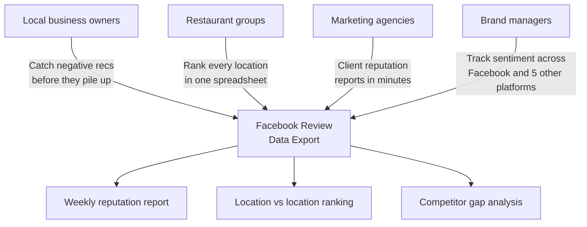
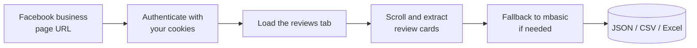
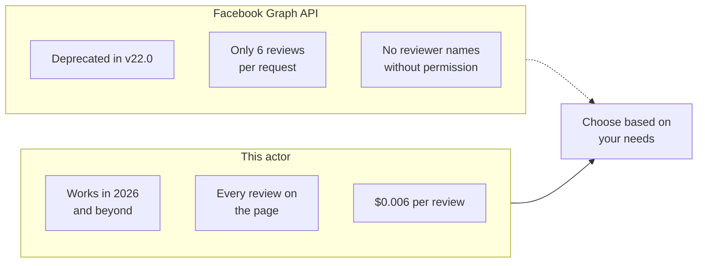
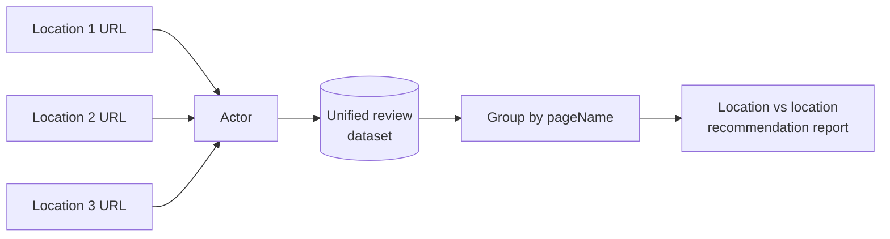

# Facebook Review Scraper and Business Reputation Export Tool

Export every Facebook recommendation for any business page into a clean JSON, CSV, or Excel file. Pull recommendation status (positive or negative), full review text, reviewer names, dates, reaction counts, comment counts, and aggregate page ratings for your business and every competitor.

Built for local business owners, restaurant groups, franchise operators, marketing agencies, and brand managers who need Facebook review data without paying for a reputation SaaS subscription.

---

## Who uses this Facebook review scraper



| Role | What the export unlocks |
|---|---|
| **Local business owner** | Every negative recommendation with full text so you can respond fast |
| **Restaurant group** | Recommendation trends across every location in one dataset |
| **Franchise operator** | Spot the one location dragging down the brand before it spreads |
| **Marketing agency** | Pull 10 client pages in one afternoon, generate reports from the same file |
| **Brand manager** | Facebook recommendations plus Google, Yelp, TripAdvisor, Booking, and Trustpilot in one pipeline |

---

## How the Facebook review export works



The actor opens each Facebook business page in a real browser using your login cookies. It loads the reviews tab, scrolls the infinite feed to load more reviews, and parses each review card from the DOM. If the main page is blocked, it falls back to mbasic.facebook.com which serves simpler server rendered HTML.

---

## Facebook Graph API vs this scraper



| Feature | Facebook Graph API | This actor |
|---|---|---|
| Status | Deprecated (v22.0, Jan 2025) | Working |
| Reviews per page | 6 per request | Full history |
| Reviewer names | Only with user permission | Yes (public display names) |
| Recommendation text | Limited | Full text |
| Reaction counts | No | Yes |
| Comment counts | No | Yes |
| Price | Required app review | $0.006 per review, first 50 free |

---

## Quick start

Export recent Facebook recommendations for one business:

```bash
curl -X POST "https://api.apify.com/v2/acts/scrapemint~facebook-review-intelligence/run-sync-get-dataset-items?token=YOUR_TOKEN" \
  -H "Content-Type: application/json" \
  -d '{
    "pageUrls": [
      { "url": "https://www.facebook.com/InNOut/reviews" }
    ],
    "maxReviews": 200,
    "loginCookies": "[{\"name\":\"c_user\",\"value\":\"YOUR_VALUE\",\"domain\":\".facebook.com\"}, ...]"
  }'
```

Compare your business against 2 competitors:

```json
{
  "pageUrls": [
    { "url": "https://www.facebook.com/YourBusiness/reviews" },
    { "url": "https://www.facebook.com/Competitor1/reviews" },
    { "url": "https://www.facebook.com/Competitor2/reviews" }
  ],
  "maxReviews": 500,
  "loginCookies": "[your cookies here]"
}
```

---

## How to get your Facebook login cookies

Facebook requires login to view reviews. You need to export your cookies once and paste them into the input.

1. Install a browser extension like **Cookie-Editor** or **EditThisCookie** (available for Chrome and Firefox).
2. Go to facebook.com and make sure you are logged in.
3. Click the extension icon. Click "Export" or "Export as JSON."
4. Paste the JSON array into the `loginCookies` field in the actor input.

The most important cookies are `c_user`, `xs`, and `datr`. The actor only uses these to authenticate, it does not store or share them.

---

## What one review record looks like

```json
{
  "recommendation": "positive",
  "reviewText": "Best burgers in California. Drive thru line is always long but it moves fast.",
  "reviewDate": "March 2026",
  "reviewerName": "Sarah K.",
  "reviewerUrl": "https://www.facebook.com/profile.php?id=100001234567",
  "reactionCount": 8,
  "commentCount": 2,
  "pageName": "In-N-Out Burger",
  "pageCategory": "Fast Food Restaurant",
  "pageAddress": "7009 Sunset Blvd, Hollywood, CA 90028",
  "pagePhone": "(800) 786-1000",
  "overallRating": 4.6,
  "totalReviewCount": 12847,
  "sourceUrl": "https://www.facebook.com/InNOut/reviews",
  "scrapedAt": "2026-04-16T14:22:01.445Z"
}
```

Facebook uses a recommendation system instead of star ratings. The `recommendation` field is either `positive` (recommends) or `negative` (doesn't recommend). Every record also carries the page metadata so multi location exports group cleanly.

---

## Inputs

| Field | Type | Default | What it does |
|---|---|---|---|
| `pageUrls` | array | `[]` | Facebook business page URLs (with or without /reviews) |
| `pageUrl` | string | `null` | Single URL shortcut |
| `maxReviews` | integer | `500` | Hard cap per page. Controls cost. |
| `loginCookies` | string | `""` | Your Facebook cookies as a JSON array (required for most pages) |
| `proxyConfiguration` | object | Residential | Apify proxy settings |

---

## Pricing

Pay per review. Free tier lets you verify the output before spending anything.

| Tier | Price | Best for |
|---|---|---|
| Free | First 50 reviews per run | Verifying the output format |
| Standard | $0.006 per review | Ongoing monitoring and benchmarking |

5,000 reviews across 10 pages: **$29.70 once**. Reputation SaaS subscriptions for the same coverage: $200 to $1,000 per month.

---

## Benchmark every location in one run



Every record carries `pageName`, `pageAddress`, and `overallRating`, so a pivot table turns multi location exports into a recommendation ranking in seconds.

---

## Common workflows

- **Weekly reputation check.** Schedule this actor every Monday on your own Facebook page. Skim the negative recommendations. Respond before they spread.
- **Competitor intelligence.** Pull your page plus 3 rivals. Compare who gets more positive recommendations and read what their happy customers mention.
- **Franchise audit.** Pass every location page in one run. Rank by recommendation ratio. Find the underperformer before the quarterly review.
- **Agency reporting.** Pull 10 client pages in one session. Build a quarterly recommendation trend report from a single dataset.
- **Cross platform reputation.** Combine with Google, Yelp, TripAdvisor, Booking, and Trustpilot actors for a full picture across 6 platforms.

---

## Related tools in the review intelligence suite

* [**Google Reviews Intelligence**](https://apify.com/scrapemint/google-reviews-intelligence): Google Maps reviews with full history export
* [**Yelp Review Intelligence**](https://apify.com/scrapemint/yelp-review-intelligence): Yelp reviews with elite reviewer tracking and vote counts
* [**TripAdvisor Review Intelligence**](https://apify.com/scrapemint/tripadvisor-review-intelligence): hotel, restaurant, and attraction reviews with trip type and stay dates
* [**Booking Review Intelligence**](https://apify.com/scrapemint/booking-review-intelligence): hotel guest reviews with sentiment and category scores
* [**Trustpilot Brand Reputation**](https://apify.com/scrapemint/trustpilot-brand-reputation): brand level trust scores, country, and verification status
* [**Airbnb Market Intelligence**](https://apify.com/scrapemint/airbnb-market-intelligence): rental pricing and guest review data

Combine all seven for a full business reputation picture across Google, Facebook, Yelp, TripAdvisor, Booking, Trustpilot, and Airbnb.

---

## Frequently asked questions

**How do I scrape Facebook reviews into a CSV file?**
Run this actor with a Facebook business page URL, your login cookies, and a review cap. Export the dataset as CSV from the Apify console or pull it via the API.

**Is there a Facebook Reviews API that still works in 2026?**
The official Facebook Graph API deprecated its page ratings endpoint in v22.0 (January 2025). This actor scrapes the live Facebook page directly, which works regardless of API changes.

**Why does this actor need my Facebook cookies?**
Facebook requires login to view business page reviews. The actor uses your cookies to authenticate the browser session. It does not store, share, or transmit your cookies anywhere.

**How do I export my Facebook business page recommendations?**
Paste your business page URL into `pageUrls`. The actor loads the reviews tab, scrolls to load all recommendations, and exports them with reviewer info and reaction counts.

**Can I compare multiple Facebook business pages in one run?**
Yes. Pass every URL in `pageUrls`. Every record includes `pageName` and `pageAddress` for easy grouping.

**What is the difference between Facebook reviews and recommendations?**
Facebook replaced star ratings with a recommendation system. Users now select "Recommends" or "Doesn't recommend" and optionally add text. This actor captures both the recommendation status and the text.

**Does this work for any type of Facebook business page?**
Yes. Restaurants, retail stores, salons, clinics, gyms, real estate agencies, any page that has a Reviews or Recommendations tab.

**How fresh is the data?**
Live at query time. Every run pulls straight from Facebook.

**Why residential proxies?**
Facebook blocks datacenter IPs aggressively. Residential proxies keep runs clean, and the actor ships with residential defaults.

**What if mbasic.facebook.com is mentioned in the logs?**
The actor automatically falls back to mbasic.facebook.com (a simpler mobile version of Facebook) when the main page doesn't load reviews properly. This is normal and the output is the same.
