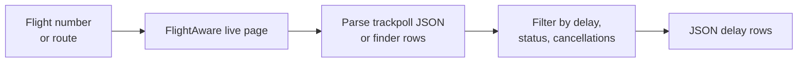
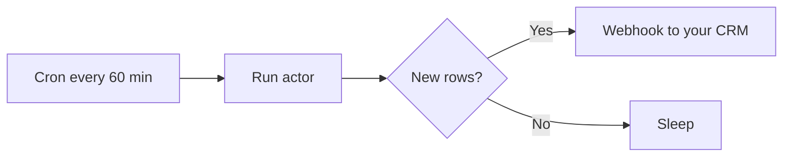

# Flight Delay & Cancellation Tracker for EU 261 Claims and Travel Ops

Monitor flight delays, cancellations, and diversions on FlightAware. Every row carries scheduled vs actual departure and arrival, delay minutes, status, aircraft type, gates, and cancel reason. Inputs: flight number (IATA or ICAO) or origin to destination route. Built for EU 261 compensation firms, travel insurance teams, and travel operations alerts. Pay per flight row.

**Ranks for:** flight delay tracker, flight cancellation tracker, EU 261 compensation API, flight status scraper, travel insurance disruption feed, FlightAware API alternative, airline on time performance monitor, flight diversion alert.

---

## How it works



For flight number inputs, the actor parses the page's embedded `trackpollBootstrap` JSON, the same data feed FlightAware's own UI reads. Times come straight from ASDI and ADS-B, not the airline's PR friendly dashboard. For route inputs, the actor parses the FlightAware Flight Finder result rows.

IATA flight codes (UA1, BA112, AF22) are auto translated to FlightAware's ICAO format (UAL1, BAW112, AFR22) so you can paste what your booking confirmation shows.

---

## Who uses this

| Role | Use case |
|---|---|
| **EU 261 compensation firm** | Auto detect 3 hour plus delays and cancellations to surface eligible claims. |
| **Travel insurance** | Trigger payouts on covered flight disruptions without manual intake. |
| **Corporate travel ops** | Alert booked travelers when their flights slip. Feed Slack and PagerDuty. |
| **OTA refund team** | Reconcile customer disruption claims against the carrier record. |
| **Aviation analyst** | Track on time performance for an airline or route over time. |

---

## Quick start

**Watch one flight number (IATA works, auto translated to ICAO):**

```json
{
  "flightNumbers": ["UA1"],
  "maxItemsPerSource": 25
}
```

**EU 261 eligible delays on a watch list (3 hours plus):**

```json
{
  "flightNumbers": ["BA112", "AF22", "LH400"],
  "minDelayMinutes": 180
}
```

**Cancellations only across a watch list:**

```json
{
  "flightNumbers": ["UA1", "DL100", "AA100"],
  "cancelledOnly": true
}
```

**Scheduled flights on a route:**

```json
{
  "routes": [{ "origin": "JFK", "destination": "LAX", "date": "2026-05-15" }]
}
```

---

## Sample output

A flight number lookup pulls the full trackpoll record for every flight in the activity log, including past completed flights and upcoming scheduled flights:

```json
{
  "ident": "UAL1",
  "origin": "SFO",
  "originIcao": "KSFO",
  "originName": "San Francisco Int'l",
  "originLocation": "San Francisco, CA",
  "originGate": "G7",
  "originTerminal": "I",
  "destination": "SIN",
  "destinationIcao": "WSSS",
  "destinationName": "Singapore Changi",
  "destinationLocation": "Singapore",
  "destinationTerminal": "2",
  "route": "SFO-SIN",
  "scheduledDate": "2026-05-01",
  "scheduledDeparture": "2026-05-01T05:50:00.000Z",
  "actualDeparture": "2026-05-01T06:11:00.000Z",
  "scheduledArrival": "2026-05-01T22:25:00.000Z",
  "actualArrival": "2026-05-01T22:36:00.000Z",
  "departureDelayMin": 21,
  "arrivalDelayMin": 11,
  "status": "delayed",
  "cancelReason": null,
  "aircraft": "B789",
  "aircraftName": "Boeing 787-9 Dreamliner (twin-jet)",
  "duration": "16h 25m",
  "distanceMiles": 7342,
  "permaLink": "https://flightaware.com/live/flight/UAL1/history/20260501/0550Z/KSFO/WSSS",
  "sourceType": "flight",
  "source": "UAL1",
  "scrapedAt": "2026-05-01T17:55:00.000Z"
}
```

---

## Status field

The `status` field is normalized so pipelines do not parse human strings:

| Value | Meaning |
|---|---|
| `scheduled` | Flight is scheduled, has not departed. |
| `on-time` | Flight is on time or arrived on time. |
| `delayed` | Departure or arrival is delayed by 15 minutes or more. |
| `cancelled` | Flight was cancelled. |
| `diverted` | Flight diverted to a different airport. |
| `landed` | Flight has landed. |
| `en-route` | Flight is currently airborne. |
| `unknown` | Status could not be parsed. |

`departureDelayMin` is positive when the flight is late, negative when it left early, null when no actual time is published yet.

---

## EU 261 cheat sheet

| Delay at arrival | Compensation per passenger |
|---|---|
| 3 to 4 hours, short haul (under 1500 km) | EUR 250 |
| 3 to 4 hours, medium haul (1500 to 3500 km) | EUR 400 |
| 4 hours or more, long haul (over 3500 km) | EUR 600 |
| Cancellation under 14 days, no rebooking | EUR 250 to 600 |

Set `minDelayMinutes: 180` to capture every claim eligible delay row in one feed. Combine with `distanceMiles` on the output to bucket by haul length.

---

## Schedule it

Run hourly to catch every disruption on a flight watch list. The `dedupe` flag keeps a per actor key value store so the same `ident + scheduledDeparture` is not pushed twice across runs.



Pair with the Apify webhook integration to push new disruption rows into Salesforce, Hubspot, or a custom claims system the moment they land.

---

## Pricing

The first 10 flight rows per run are free. After that, $0.005 per row pushed. No charge for the FlightAware page fetches themselves, so a flight number watch list only costs for the actual flights returned.

---

## FAQ

### Where does the data come from?

FlightAware live flight pages, scraped per request through Apify residential proxy. The actor reads the same `trackpollBootstrap` JSON the FlightAware UI consumes, which is sourced from ASDI, MLAT, and ADS-B feeds.

### Why FlightAware and not the airline?

FlightAware aggregates ASDI, MLAT, and ADS-B feeds, so the actual departure and arrival times match what the FAA and ground sensors saw, not the carrier's PR friendly dashboard. Airline status pages routinely lag the real ground truth by 10 to 20 minutes.

### Can I use IATA flight codes like UA1 or BA112?

Yes. The actor auto translates the common IATA airline prefixes (UA, AA, DL, BA, AF, LH, KL, SQ, EK, QR, etc.) to FlightAware's ICAO format (UAL, AAL, DAL, BAW, AFR, DLH, KLM, SIA, UAE, QTR). If your carrier is not on the auto translate list, paste the ICAO code directly (e.g., `UAL1`).

### Can I track a flight before it departs?

Yes. Flight number pages show scheduled flights for the next several days. The actor returns `status: "scheduled"` rows so you can subscribe to a flight before it slips.

### Are airport boards supported?

No. FlightAware moved its airport arrivals and departures pages behind a sign-in wall with Cloudflare Turnstile, so airport boards are not scrapeable without an account. Use the flight number input instead. Airport scope can be reconstructed downstream by tracking every flight ident that operates the route you care about.

### Are the times in UTC?

Yes. The bootstrap JSON exposes Unix timestamps which the actor converts to ISO 8601 UTC (`...Z` suffix). Convert to airport local time downstream if your warehouse needs it.

### Will it work for airlines outside the US and EU?

Yes. FlightAware covers global flight idents. The auto translate list covers most major Asian, Middle Eastern, Australian, Canadian, and Latin American carriers. For smaller regional airlines, paste the ICAO code directly.

### What happens if FlightAware blocks the request?

The actor uses fingerprinted Chrome with residential proxy and retries blocked requests up to twice. If a single source is blocked the run continues with the others and the failed request is logged.

### Can I run this on a schedule?

Yes. Use the Apify scheduler. Daily catches yesterday's full disruption picture for a watch list. Hourly catches new delays as they slip.

---

## Related actors

- **Flight Price Tracker** — live Google Flights fares for any route and date
- **Airbnb Market Intelligence** — daily comp set rates and occupancy by neighborhood
- **TripAdvisor Property Rank Tracker** — daily hotel and restaurant rank, rating, and competitor signals
- **Viator Tours Tracker** — tour pricing and availability across regions
