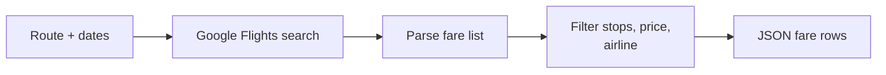
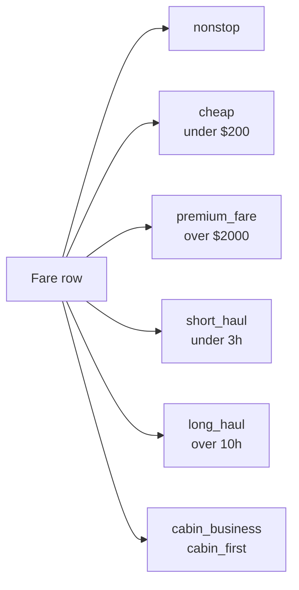

# Flight Price Tracker: Google Flights Fares by Route and Date

Track live Google Flights fares for any route and date. Every row has airline, stops, total duration, price, cabin class, and stop airports. Works for every IATA airport pair (JFK to LHR, SFO to NRT, LHR to DXB). Filter by max stops, max price, preferred airlines, nonstop only. Pay per fare row.

**Ranks for:** flight price tracker, Google Flights scraper, cheap flight alerts, airline fare monitor, route price history, travel deal API, flight price history, nonstop flight search.

---

## How it works



Paste a route like JFK-LHR and a date range. One row per fare option.

---

## Who uses this

| Role | Use case |
|---|---|
| **Travel blogger** | Publish daily best fare tables by route. |
| **Mileage hacker** | Watch for saver awards priced below a threshold. |
| **Corporate travel ops** | Audit paid fares against market median for the route. |
| **Deal site** | Power a "cheap flights from your city" feed without Skyscanner Partner approval. |
| **Fintech travel app** | Feed live price history into a rewards dashboard. |

---

## Quick start

**One way deal watch:**

```json
{
  "routes": ["JFK-LHR", "JFK-CDG", "JFK-FCO"],
  "departDaysAhead": 21,
  "dateWindowDays": 7,
  "maxPriceUsd": 500,
  "maxStops": 1
}
```

**Round trip, specific dates:**

```json
{
  "routes": ["SFO-NRT"],
  "departureDates": ["2026-06-15"],
  "returnDates": ["2026-06-29"],
  "tripType": "round_trip",
  "cabinClass": "business"
}
```

**Nonstop only, preferred airline:**

```json
{
  "routes": ["LHR-DXB"],
  "preferredAirlines": ["BA", "EK"],
  "maxStops": 0
}
```

---

## Output flags



Flags let pipelines filter without parsing titles again.

---

## Flight tracker vs the alternatives

| | Skyscanner Partner API | Amadeus self service | **This actor** |
|---|---|---|---|
| Access | Affiliate approval | Free account + keys | Anyone |
| Setup | Weeks | One hour | 60 seconds |
| Route coverage | Global | Global | Global |
| Price history | No | No | Yes via dedupe off |
| Schedule | Yes | Yes | Every 60s |
| JSON output | Yes | Yes | Yes |
| Pricing | Rev share | Tiered by query | Pay per item |

---

## Sample output

```json
{
  "source": "google_flights",
  "origin": "JFK",
  "destination": "LHR",
  "departureDate": "2026-05-15",
  "returnDate": null,
  "tripType": "one_way",
  "cabinClass": "economy",
  "passengers": 1,
  "airline": "British Airways",
  "airlineCode": "BA",
  "stops": 0,
  "durationMinutes": 425,
  "durationLabel": "7h 5m",
  "priceTotal": 487,
  "pricePerPax": 487,
  "priceCurrency": "USD",
  "departTime": "6:00 PM",
  "arriveTime": "6:25 AM",
  "stopAirports": [],
  "flags": ["nonstop", "long_haul"],
  "sourceUrl": "https://www.google.com/travel/flights?..."
}
```

---

## Pricing

First 50 fares per run are free. After that pay per fare row. A daily snapshot of 10 routes and 14 days lands under $5.

---

## FAQ

**Do I need a Google API key?**
No. The actor reads public Google Flights pages.

**Can I track price changes over time?**
Yes. Set `dedupe: false` and schedule every hour. Each run writes a fresh snapshot with a `scrapedAt` timestamp so you build your own price history table.

**Which airports are supported?**
Every airport with a valid three letter IATA code. JFK, LHR, SFO, NRT, CDG, DXB, SIN, SYD, GRU and so on.

**Does Google block scrapers?**
Google Flights is less aggressive than OTAs but still rate limits. The actor ships with residential proxy by default. Lower concurrency if you run at high volume.

**Is the price total or per passenger?**
Price is the total for the party. `pricePerPax` is the total divided by passenger count.

**Can I get business and first class fares?**
Yes. Set `cabinClass` to premium_economy, business, or first.

**Is scraping Google Flights allowed?**
This actor reads the same public HTML a browser sees. Respect the site's terms and rate limit sensibly.

---

## Related Scrapemint actors

- **Viator Scraper** for tours and activities by city
- **Airbnb Market Intelligence** for short term rental data
- **Booking Review Intelligence** for hotel reviews by city
- **TripAdvisor Review Intelligence** for hotel and restaurant reviews
- **Google Reviews Intelligence** for places reviews

Stack these to cover every public travel surface from research to booking.
