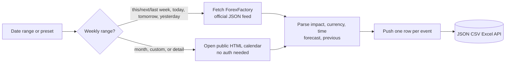
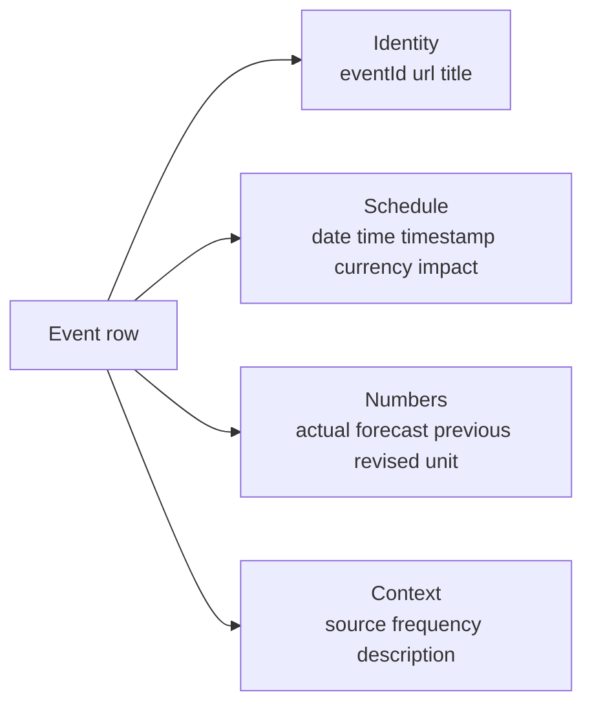

# ForexFactory Economic Calendar Intelligence (No Login Required)

Pull the public ForexFactory economic calendar by any date range. No cookies. No login. No ForexFactory account. Each row ships the event date and UTC timestamp, currency, impact rating (high, medium, low, holiday), event title, actual release, market forecast (consensus), previous reading, revised previous, unit, source agency, and the link to the event detail page. Pay per event.

**Built for** FX traders pricing in NFP and CPI prints, equity desks tracking earnings season alongside macro releases, fixed income analysts modelling rate decisions, fintech newsletter writers shipping a daily macro brief, sentiment quants joining release surprises to candle moves, and crypto desks watching FOMC and SPR data for risk regime shifts.

**Keywords this actor ranks for:** forex factory intelligence, economic calendar api, forex calendar api, nfp intelligence, cpi release intelligence, fomc calendar, macro events api, central bank calendar, economic data api, forecasting calendar.

---

## Why this actor

| Other econ calendar APIs | **This actor** |
|---|---|
| Charge $49 to $499 a month for the same public data | Charge per event row, no contract |
| Lock historical revisions behind a higher tier | Revised previous value on every row by default |
| Return one HTML blob per day | Date, time UTC, currency, impact, actual, forecast, previous, revised parsed |
| Drop the source agency tag | Source agency (BLS, ECB, BOE, BOJ, etc.) embedded on every row |
| Get rate limited at five rows | Reads ForexFactory's own JSON feed for weekly ranges, so runs are fast and cheap |

---

## How it works



For weekly ranges the actor reads ForexFactory's own public JSON feed over plain HTTP, so a typical run needs no browser and no proxy and returns in seconds. For full months, custom multi week spans, or when you ask for per event detail pages, it falls back to parsing the public HTML calendar with a browser. Both paths emit the exact same row schema, so it does not matter which one served your run. Every row carries an ISO 8601 timestamp with the source timezone offset.

---

## What you get per row



Pipe straight into a release surprise dashboard, a candle move attribution sheet, or a daily macro brief.

---

## Quick start

**Pull this week's high and medium impact USD events**

```json
{
  "range": "this_week",
  "currencies": ["USD"],
  "impactLevels": ["high", "medium"]
}
```

**Sweep next month for all G7 currencies**

```json
{
  "range": "next_month",
  "currencies": ["USD", "EUR", "GBP", "JPY", "CAD", "AUD", "CHF"],
  "impactLevels": ["high", "medium"]
}
```

**Custom range with full event detail**

```json
{
  "range": "custom",
  "startDate": "2026-05-01",
  "endDate": "2026-05-31",
  "impactLevels": ["high"],
  "includeDetail": true
}
```

---

## Sample output

```json
{
  "eventId": "20260509-USD-non-farm-employment-change",
  "url": "https://www.forexfactory.com/calendar?day=may9.2026#detail=143829",
  "date": "2026-05-09",
  "time": "08:30",
  "timestamp": "2026-05-09T08:30:00",
  "displayTimezone": "America/New_York",
  "currency": "USD",
  "impact": "high",
  "title": "Non-Farm Employment Change",
  "actual": "175K",
  "actualNumeric": 175000,
  "forecast": "200K",
  "forecastNumeric": 200000,
  "previous": "236K",
  "previousNumeric": 236000,
  "revised": "228K",
  "revisedNumeric": 228000,
  "unit": "K",
  "source": "Bureau of Labor Statistics",
  "frequency": "Released monthly",
  "description": "Change in the number of employed people during the previous month, excluding the farming industry...",
  "isAllDay": false,
  "scrapedAt": "2026-05-10T09:30:00.000Z"
}
```

---

## Who uses this

| Role | Use case |
|---|---|
| FX trader | Price in NFP, CPI, FOMC ahead of the release window |
| Equity desk | Track macro alongside earnings season for cross-asset signals |
| Fixed income analyst | Model rate decisions, GDP, inflation prints across central banks |
| Macro newsletter | Ship a daily brief of high impact events with forecasts |
| Sentiment quant | Join release surprise versus consensus to subsequent candle moves |
| Crypto desk | Watch FOMC and SPR releases for risk regime shifts |
| Algo dev | Avoid running a strategy through high impact event windows |

---

## Input reference

| Field | Type | What it does |
|---|---|---|
| `range` | string | today, tomorrow, yesterday, this_week, next_week, last_week, this_month, next_month, custom. |
| `startDate` | string | YYYY-MM-DD. Required when range is custom. |
| `endDate` | string | YYYY-MM-DD. Required when range is custom. Max span 30 days. |
| `currencies` | string[] | ISO codes to include. Empty pulls every currency. |
| `impactLevels` | string[] | high, medium, low, holiday. Default high+medium. |
| `includeDetail` | boolean | Fetch each event's detail page for description, source, frequency. Default false. |
| `maxEvents` | integer | Stop after this many event rows. Default 1000. |
| `concurrency` | integer | Pages processed in parallel. Three is the safe default. |
| `proxyConfiguration` | object | Apify proxy. Residential required at any meaningful volume. |

---

## API call

```bash
curl -X POST \
  "https://api.apify.com/v2/acts/YOUR_USER~forexfactory-economic-calendar/runs?token=YOUR_TOKEN" \
  -H "Content-Type: application/json" \
  -d '{
    "range": "this_week",
    "currencies": ["USD", "EUR"],
    "impactLevels": ["high"]
  }'
```

---

## Pricing

The first 2 event rows per run are free so you can validate output before paying. After that, each event row is charged. No surprise add on charges.

---

## FAQ

### What timezone are the times in?

The `time` and `timestamp` fields use ForexFactory's display timezone, which defaults to America/New_York (Eastern Time) for unauthenticated visitors. The exact zone in effect is returned on every row as `displayTimezone`. Convert downstream with the IANA zone string and a date library if your pipeline needs UTC.

### How accurate is the actual value?

For month, custom, and detail runs the browser path parses the released `actual` straight from the calendar page at pull time, so it reflects what ForexFactory shows that moment. The fast weekly JSON feed carries only forecast and previous, not the released actual, so for weekly ranges `actual` is null. If you need released actuals for a past week, pull it as a custom range covering those dates.

### What does revised mean?

When a release agency revises the prior period's number after the fact, ForexFactory shows both the original previous value and the revised value. The actor returns both as `previous` and `revised`.

### Can I pull a year of history?

Yes, but split it into monthly windows. The actor caps a single custom range at 30 days to keep request latency predictable. Schedule sequential runs per month and concatenate the dataset.

### What about all-day events like bank holidays?

The actor sets `isAllDay: true` and leaves `time` and `timestamp` null for events that ForexFactory marks as all day or tentative.

### How fresh is the data?

Each run hits the live calendar page, so actual values reflect what ForexFactory shows at pull time. Schedule a run every 30 minutes during high impact event windows for near-live release tracking.

### Is pulling ForexFactory allowed?

This actor reads HTML any anonymous web visitor can see. Respect ForexFactory's terms and rate limit sensibly. Do not redistribute personal data you have no lawful basis to process.

---

## Related actors

- **TradingView Ideas Intelligence** , pull public trade ideas with author, direction, timeframe, and engagement
- **Polymarket Intelligence** , pull live prediction market odds, volume, and resolution metadata
- **Sports Odds Intelligence** , pull live moneyline, spread, and total odds across sportsbooks
- **Crypto Whale Token Launch Tracker** , pull on-chain whale wallet activity around new launches
- **Google Patents Intelligence** , pull patent metadata, claims, and citations by query
