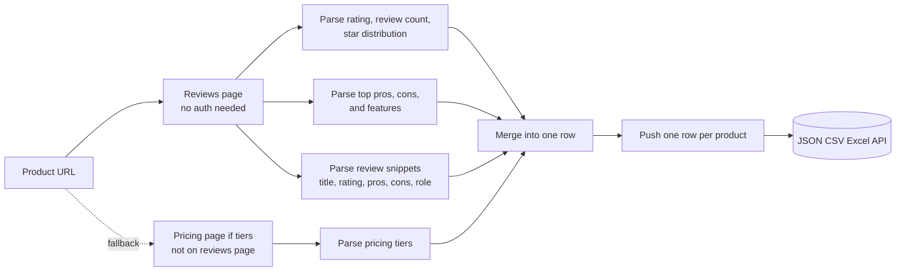
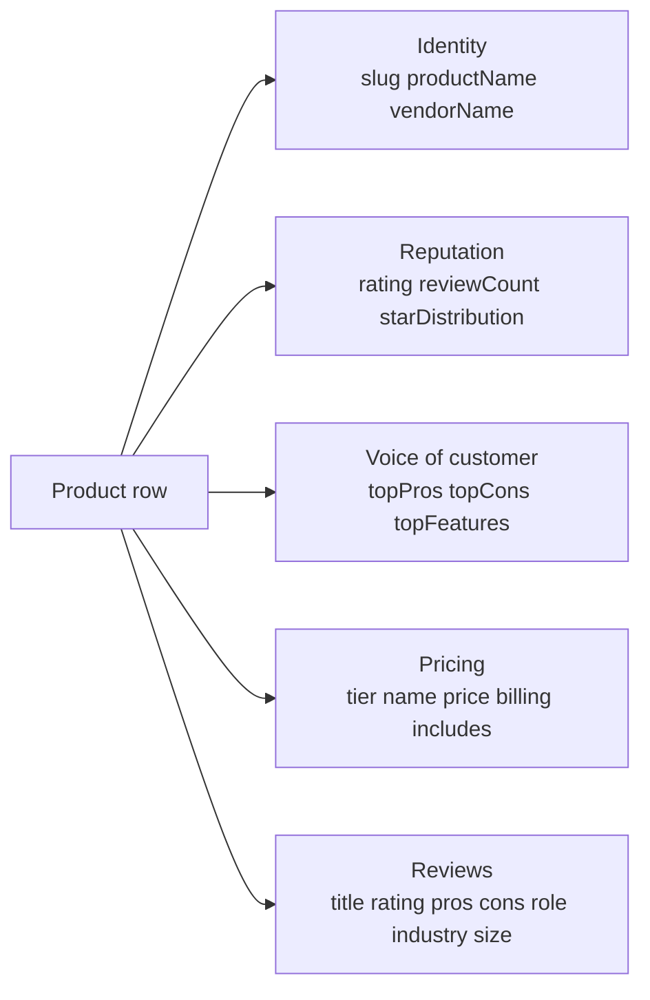

# G2 Product Reviews Intelligence (No Login Required)

Pull public G2 product pages and review snippets from any product. No cookies. No login. No vendor seat. Each row ships the product, vendor, overall rating, review count, star distribution, top features mentioned, pricing tiers when listed, and the most recent review snippets. Pay per product.

**Built for** B2B SaaS competitive marketers, sales enablement teams pulling battlecards, product teams tracking review velocity, and PMM teams sourcing voice-of-customer quotes.

**Keywords this actor ranks for:** g2 intelligence, g2 reviews api, g2 crowd intelligence, b2b review intelligence, sales battlecard data, voice of customer api, competitor review tracker, capterra alternative, trustradius alternative, software review intelligence, b2b saas competitive intelligence, review velocity tracking.

---

## Why this actor

| Other G2 scrapers | **This actor** |
|---|---|
| Need a vendor seat or pulling cookie | Zero cookies, zero login |
| Return one HTML blob per product | Rating, review count, star distribution, top pros, top cons, pricing parsed |
| Drop the most-mentioned pros and cons aggregate | Top pros, top cons, and top features shipped as discrete rows with counts |
| Charge per page hit | Charge per product, get the whole snapshot plus first page of reviews |
| Get rate limited at five rows | Built on residential proxy with session pooling for sustained runs |

---

## How it works



The actor reads JSON-LD schema.org metadata first because G2 ships `aggregateRating`, `Product`, and `Brand` blocks on every product page, then falls back to defensive DOM selectors for the rest. No cookie passes through the actor at any stage.

---

## What you get per row



Pipe straight into a battlecard, a competitive teardown, or a churn-risk dashboard.

---

## Quick start

**Battlecard a head-to-head competitor**

```json
{
  "productUrls": [
    "https://www.g2.com/products/notion/reviews",
    "https://www.g2.com/products/coda/reviews"
  ]
}
```

**Track review velocity for your category**

```json
{
  "productUrls": [
    "https://www.g2.com/products/figma/reviews",
    "https://www.g2.com/products/sketch/reviews",
    "https://www.g2.com/products/adobe-xd/reviews"
  ],
  "includeReviews": true,
  "reviewsPerProduct": 25
}
```

**Sales enablement (just the aggregate, no snippets)**

```json
{
  "productUrls": ["https://www.g2.com/products/salesforce-sales-cloud/reviews"],
  "includeReviews": false,
  "includeFeatures": true
}
```

---

## Sample output

```json
{
  "slug": "notion",
  "url": "https://www.g2.com/products/notion",
  "productName": "Notion",
  "vendorName": "Notion Labs",
  "description": "Notion is the connected workspace where better, faster work happens.",
  "websiteUrl": "https://notion.so",
  "rating": 4.7,
  "reviewCount": 5832,
  "starDistribution": { "5": 78, "4": 17, "3": 3, "2": 1, "1": 1 },
  "topPros": [
    { "label": "Ease of Use", "count": 1820 },
    { "label": "Flexibility", "count": 1340 },
    { "label": "Templates", "count": 980 }
  ],
  "topCons": [
    { "label": "Mobile experience", "count": 410 },
    { "label": "Offline mode", "count": 230 }
  ],
  "topFeatures": [
    { "label": "Document Creation", "count": 2100 },
    { "label": "Collaboration", "count": 1850 }
  ],
  "pricingTiers": [
    { "name": "Free", "price": "$0", "billing": "per user", "includes": ["Unlimited blocks for individuals", "Sync across devices"] },
    { "name": "Plus", "price": "$10", "billing": "per user / month", "includes": ["Unlimited file uploads", "30 day version history"] }
  ],
  "reviews": [
    {
      "title": "Best knowledge base we have used",
      "rating": 5,
      "pros": "Templates, sub-pages, and the database views give us a single source of truth.",
      "cons": "Search inside large workspaces can lag.",
      "useCase": "Replacing Confluence and a chunk of Google Drive.",
      "reviewer": "PM Lead",
      "role": "Product Manager",
      "industry": "Computer Software",
      "companySize": "201 to 500 employees",
      "date": "2026-04-22"
    }
  ],
  "scrapedAt": "2026-05-10T08:30:00.000Z"
}
```

---

## Who uses this

| Role | Use case |
|---|---|
| Product marketing | Track review velocity and sentiment shifts month over month |
| Sales enablement | Pull battlecards with rating, top cons, and pricing for any competitor |
| Product team | Source voice of customer themes for the next quarter's roadmap |
| Demand gen | Monitor your category leaders for pricing and feature changes |
| BD | Score lookalike accounts by review pattern and category |
| Investor | Read review momentum as an early signal of category leader rotation |

---

## Input reference

| Field | Type | What it does |
|---|---|---|
| `productUrls` | string[] | G2 product URLs (overview, reviews, pricing, or features). Required. |
| `includeReviews` | boolean | Pull recent review snippets. Default true. |
| `reviewsPerProduct` | integer | Max review snippets per product. Default 15. |
| `includeFeatures` | boolean | Pull the top features and top pros and cons aggregate. Default true. |
| `concurrency` | integer | Products processed in parallel. Three is the safe default for G2. |
| `proxyConfiguration` | object | Apify proxy. Residential is required at any meaningful volume. |

---

## API call

```bash
curl -X POST \
  "https://api.apify.com/v2/acts/YOUR_USER~g2-reviews-scraper/runs?token=YOUR_TOKEN" \
  -H "Content-Type: application/json" \
  -d '{
    "productUrls": [
      "https://www.g2.com/products/notion/reviews",
      "https://www.g2.com/products/figma/reviews"
    ]
  }'
```

---

## Pricing

The first few products per run are free so you can validate output before paying. After that, each product row is charged. No surprise add on charges.

---

## FAQ

### Do I need a G2 account or vendor seat?

No. The actor only touches G2's public product, reviews, and pricing surfaces. Your account is never touched.

### Can I get every review for a product?

You get the public review snippets that G2 renders to anonymous visitors on the first reviews page, capped by `reviewsPerProduct`. Pagination across many pages of reviews is intentionally skipped to keep cost predictable per row. Aggregate signals (rating, review count, star distribution, top pros, top cons) summarize the full review set.

### G2 has Cloudflare. How does this handle it?

The actor runs through Apify residential proxy with session pooling and stealth flags. Sessions retire after a small number of uses to keep the failure rate low.

### Can I get pricing for a product?

Yes. When pricing tiers are surfaced inline on the reviews page they are captured directly. When they are not, the actor follows up to the dedicated `/pricing` surface and parses tier name, price, billing cadence, and the included items list.

### What if the product is a stub with no reviews?

The actor returns the row with whatever it could parse. Missing fields land as null and arrays land empty. You only pay on push, so a stub product is still one paid row, not a blank charge surprise.

### Can I pull entire G2 categories?

Not from a category URL directly. Pass the product URLs you care about. To enumerate a category, do the category listing externally and feed the resulting product URLs in.

### How fresh is the data?

Each run hits the live page, so rating and review snippets reflect what G2 renders at pull time. Schedule weekly runs to track sentiment and pricing shifts over time.

### Is pulling G2 allowed?

This actor reads HTML any anonymous web visitor can see. Respect G2's terms and rate limit sensibly. Do not redistribute personal data you have no lawful basis to process.

---

## Related actors

- **Glassdoor Company & Salary Intelligence** , pull employer rating, salary ranges, review snippets per company
- **LinkedIn Company Profile Intelligence (No Cookies)** , pull industry, headcount range, HQ, founded year, specialties, website per company
- **Lead Enrichment Pipeline** , multi source enrichment for a list of company domains
- **Domain Intelligence** , pull WHOIS, MX, tech stack, and traffic signals per domain
- **TripAdvisor Intelligence** , pull hotel, restaurant, and attraction listings with reviews
