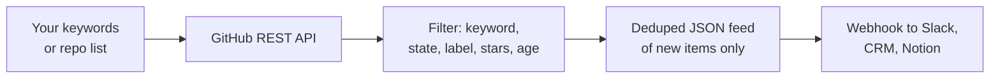
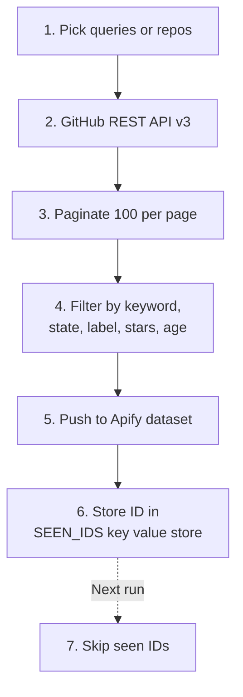
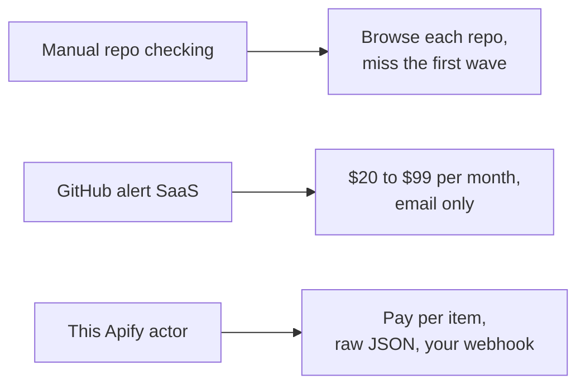

# GitHub Scraper: Track Issues and Pull Requests by Keyword

Scrape GitHub for new issues and pull requests that match your keywords, repos, labels, state, and star floor. Export title, body, author, labels, reactions, repo metadata, and timestamps to JSON, CSV, or Excel. Deduped across runs. Uses the official GitHub REST API. Pay per item.

**Searches this actor is built for:** GitHub scraper, scrape GitHub issues, GitHub issue tracker, GitHub PR monitor, GitHub API alternative, GitHub keyword alert, track GitHub issues, competitor GitHub monitor, GitHub lead generation.

---

## How it works in 30 seconds



Paste a keyword or a `owner/repo` slug. Pick filters. Get a clean JSON feed of new GitHub issues and pull requests every run. That is the whole product.

---

## Who this GitHub scraper is for

| You are a... | You use this to... |
|---|---|
| **Devtool founder** | Catch every issue in your category mentioning your library or a competitor. Turn it into warm outbound. |
| **DevRel engineer** | Build a live queue of mentions ready for a helpful reply or bug fix. |
| **Open source maintainer** | Watch downstream repos for bug reports filed against a library you publish. |
| **Product manager** | Mine real user language from issue bodies to inform your next sprint. |
| **Competitive intel** | Track every issue filed in a competitor's repo, spot pain before their changelog does. |

---

## How to scrape GitHub issues step by step



1. Pass search queries, `owner/repo` slugs, or both.
2. The actor calls the official GitHub REST API v3: `/search/issues` for keyword search, `/repos/{owner}/{repo}/issues` for direct repo watching.
3. Results pass through keyword, state, label, star, and age filters.
4. Matches land in your Apify dataset.
5. Item IDs go into a named key value store so future runs skip duplicates.

Schedule every 10 minutes on Apify Scheduler and you get a live stream of new issues. Add a free personal access token and your rate limit jumps from 60 to 5000 core requests per hour.

---

## Quick start

**Monitor mentions of your library across all of GitHub:**

```json
{
  "searchQueries": ["\"langchain\" in:title,body"],
  "itemType": "issues",
  "state": "open",
  "maxAgeHours": 168,
  "githubToken": "YOUR_GITHUB_TOKEN"
}
```

**Watch 3 competitor repos for new bugs:**

```json
{
  "repos": ["pinecone-io/pinecone-python-client", "weaviate/weaviate", "qdrant/qdrant"],
  "keywords": ["slow", "timeout", "crash"],
  "state": "open",
  "labels": ["bug"]
}
```

**Lead gen on Postgres pain, high signal repos only:**

```json
{
  "searchQueries": ["postgres slow query in:title,body"],
  "minRepoStars": 100,
  "state": "open",
  "maxAgeHours": 72
}
```

Or run it from the command line:

```bash
curl -X POST "https://api.apify.com/v2/acts/scrapemint~github-issue-monitor/run-sync-get-dataset-items?token=YOUR_TOKEN" \
  -H "Content-Type: application/json" \
  -d '{"searchQueries":["langchain vector"],"state":"open","maxAgeHours":168}'
```

---

## GitHub scraper vs the alternatives



| Feature | Manual | Alert SaaS | This actor |
|---|---|---|---|
| Pricing | Free, costs time | $20 to $99 per month | Pay per item, first 50 free |
| Keyword cap | Unlimited if you click | 5 to 50 per tier | Unlimited |
| Repo targeting | Tab hopping | Fixed repo list | Any repo or global search |
| Label filter | Click on GitHub | Premium tier | Built in |
| Reactions data | Hover on GitHub | Not included | Full count per emoji |
| Scheduling | You | Hourly | Every 1 minute |
| Dedup across runs | Your memory | Vendor owned | Yours, in key value store |
| Output | Browser tab | Email | JSON, CSV, Excel, webhook |

---

## Sample output

One issue record:

```json
{
  "issueId": "2387491023",
  "number": 1842,
  "itemType": "issue",
  "title": "Vector search returns empty result for multi lingual input",
  "body": "I'm trying to build a RAG pipeline with LangChain and Pinecone...",
  "state": "open",
  "url": "https://github.com/langchain-ai/langchain/issues/1842",
  "repo": {
    "slug": "langchain-ai/langchain",
    "owner": "langchain-ai",
    "name": "langchain",
    "stars": 98421,
    "language": "Python"
  },
  "author": {
    "login": "devfounder99",
    "url": "https://github.com/devfounder99"
  },
  "labels": [
    { "name": "bug", "color": "d73a4a" },
    { "name": "area: vectorstores", "color": "0075ca" }
  ],
  "commentsCount": 7,
  "reactions": { "total": 12, "plusOne": 8, "heart": 2, "rocket": 1 },
  "createdAt": "2026-04-18T11:14:00Z",
  "updatedAt": "2026-04-19T09:02:00Z",
  "matchedKeywords": ["vector"],
  "sourceKind": "search",
  "sourceValue": "langchain vector"
}
```

Every field is ready to drop into a CRM, a Slack channel, or a Notion database.

---

## Pricing

First 50 items per run are free. After that you pay per extracted item. No seats. No tier gating. A 500 item run lands under $1 on the Apify free plan.

---

## FAQ

**How do I scrape GitHub issues without an API key?**
Run the actor with no token. GitHub caps anonymous requests at 60 core and 10 search per minute. Fine for small keyword batches or one repo. For a scheduled fleet, generate a free token at `github.com/settings/tokens` and paste it into `githubToken`. Your cap jumps to 5000 core and 30 search per minute. Public data only, no scopes needed.

**Can I monitor pull requests too?**
Yes. Set `itemType` to `prs` for pull requests only, `issues` for issues only, or `all` for both. GitHub returns both from the same endpoint because a pull request is technically an issue with a `pull_request` field attached.

**How do I track one keyword across all of GitHub?**
Use `searchQueries` with GitHub's search syntax. Examples: `"vector database" in:title,body`, `stars:>100 language:python label:bug`, `org:openai type:issue`. The actor passes your query straight to `/search/issues`.

**How do I filter out low star repos?**
Set `minRepoStars`. The actor fetches repo metadata once per repo, caches it, and drops issues from repos under the floor. Useful when you only want signal from production grade users.

**Does it support private repos?**
Yes, if the token you provide has `repo` scope and access. By default the actor uses public data only.

**Does it dedupe across runs?**
Yes. Issue IDs are stored under `SEEN_IDS` in a named key value store. Every run skips seen IDs. Set `dedupe: false` to disable.

**Can I schedule it?**
Yes. Apify Scheduler goes down to 1 minute. Pair with a webhook to push new issues to Slack, Discord, Notion, or your CRM.

**What about GitHub Discussions?**
Discussions are GraphQL only on GitHub's API. This actor covers issues and pull requests via REST for speed. A separate discussions actor is on the roadmap.

**Is scraping GitHub allowed?**
Yes. This actor uses the official GitHub REST API v3, which is rate limited and public by design. No HTML scraping.

---

## Related Scrapemint actors

- **Stack Overflow Lead Monitor** for dev question tracking by tag
- **Hacker News Scraper** for stories and comments by keyword
- **Reddit Lead Monitor** for subreddit and brand mention tracking
- **Product Hunt Launch Tracker** for competitor launch monitoring
- **Upwork Opportunity Alert** for freelance lead generation
- **Trustpilot Brand Reputation** for DTC and ecommerce brands
- **Google Reviews Intelligence** for local businesses
- **Amazon Review Intelligence** for product review mining

Stack these to cover every public developer and customer conversation surface one brand touches.
