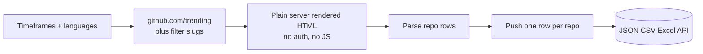
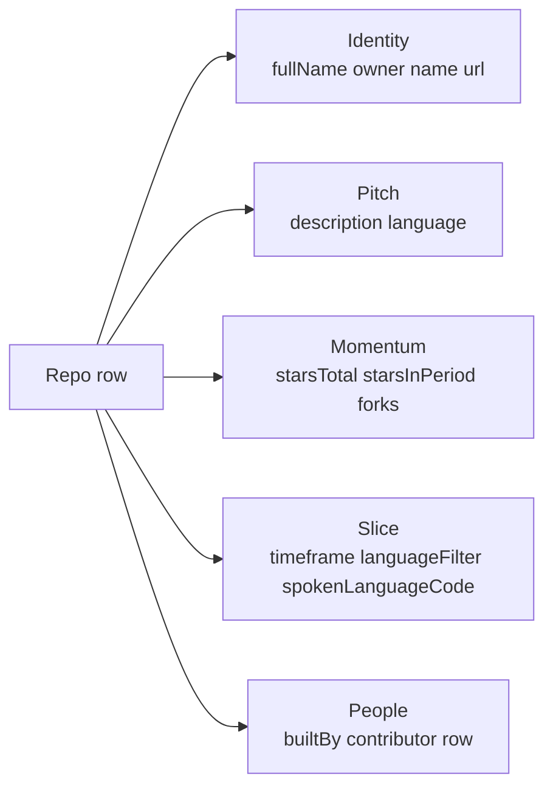

# GitHub Trending and Repo Mover Tracker

Pull the GitHub trending list for any timeframe, programming language, or spoken language. Each row ships the owner, repo name, description, primary language, total stars, stars added in the active window, fork count, and the row of top contributors. Pay per repo. No auth required.

**Built for** investors scouting open source momentum, recruiters watching breakout projects, dev tool founders studying competitive launches, and content teams building "what's hot in OSS this week" newsletters.

**Keywords this actor ranks for:** github trending api, github trending intelligence, github trending json, pull github repos, github mover tracker, github stars tracker, oss momentum tracker, open source intelligence, oss investment scout, github watch list builder, top github repos api, trending repos by language.

---

## Why this actor

| Other GitHub trending tools | **This actor** |
|---|---|
| One web page that scrolls forever | Structured JSON one row per repo |
| All time only | Daily, weekly, and monthly windows |
| English only authors | Filter by spoken language code |
| Drop the contributor row | Top contributor avatars and handles included |
| Drop the period star count | "Stars added this week" parsed as a discrete field |

---

## How it works



Plain HTML, no browser needed. Cheerio parses the trending page and extracts each repo row with owner, name, description, language, stars, forks, and contributor avatars. Datacenter proxy is enough.

---

## What you get per row



---

## Quick start

**Daily trending across all languages**

```json
{
  "timeframes": ["daily"]
}
```

**Weekly trending in TypeScript and Rust**

```json
{
  "timeframes": ["weekly"],
  "languages": ["typescript", "rust"]
}
```

**Monthly trending repos from Chinese authors**

```json
{
  "timeframes": ["monthly"],
  "spokenLanguageCode": "zh"
}
```

**Daily and weekly across Python and Go (4 lists per run)**

```json
{
  "timeframes": ["daily", "weekly"],
  "languages": ["python", "go"]
}
```

---

## Sample output

```json
{
  "rank": 1,
  "fullName": "anthropic/claude-code",
  "owner": "anthropic",
  "name": "claude-code",
  "url": "https://github.com/anthropic/claude-code",
  "description": "The official CLI for Claude",
  "language": "TypeScript",
  "languageColor": "#3178c6",
  "starsTotal": 12500,
  "starsInPeriod": 1230,
  "forks": 850,
  "timeframe": "daily",
  "languageFilter": "typescript",
  "spokenLanguageCode": null,
  "builtBy": [
    { "username": "alice", "profileUrl": "https://github.com/alice", "avatarUrl": "https://avatars.githubusercontent.com/u/123" }
  ],
  "scrapedAt": "2026-05-08T10:00:00.000Z"
}
```

---

## Who uses this

| Role | Use case |
|---|---|
| OSS investor | Scout breakout repos by language and momentum window before VCs do |
| Recruiter | Source senior engineers from the contributor row of trending repos |
| Dev tool founder | Watch competitive launches at the moment they hit the front page |
| Content team | Build a weekly "what's hot in OSS" newsletter from real data, not guesswork |
| Analyst | Track language adoption shifts week over week |
| Recruiter agency | Build prospect lists by language and spoken language for niche searches |

---

## Input reference

| Field | Type | What it does |
|---|---|---|
| `timeframes` | string[] | One or more of daily, weekly, monthly. Default daily. |
| `languages` | string[] | Programming language slugs to filter by. Empty means all languages. |
| `spokenLanguageCode` | string | Two letter ISO code, for example en or zh. |
| `maxReposPerList` | integer | Cap per timeframe and language combination. Max 25. |
| `includeContributors` | boolean | Include the "Built by" avatar row with username and profile URL. |
| `proxyConfiguration` | object | Apify proxy. Datacenter is fine for GitHub. |

---

## API call

```bash
curl -X POST \
  "https://api.apify.com/v2/acts/YOUR_USER~github-trending-scraper/runs?token=YOUR_TOKEN" \
  -H "Content-Type: application/json" \
  -d '{
    "timeframes": ["daily", "weekly"],
    "languages": ["python", "rust"]
  }'
```

---

## Pricing

The first 5 repos per run are free so you can validate output before paying. After that, each repo row is charged. No surprise add on charges.

---

## FAQ

### Do I need a GitHub token?

No. The actor only touches the public trending HTML page that any anonymous web visitor can see.

### How many repos does each list return?

GitHub trending shows up to 25 repos per timeframe and language combination. The actor returns up to that cap per list.

### Can I pull historical trending data?

GitHub does not publish a historical trending archive. Schedule the actor on a daily cron and store snapshots yourself to build your own time series.

### How fresh is the data?

Each run hits the live trending page, so star counts and the contributor row reflect what GitHub renders at pull time.

### Can I track a specific repo over time?

Run the actor on a schedule and filter the resulting dataset by `fullName`. Combine with the Apify scheduler to get a daily or weekly snapshot per repo.

### Is pulling GitHub trending allowed?

This actor reads HTML any anonymous web visitor can see. Respect GitHub's terms and rate limit sensibly.

---

## Related actors

- **GitHub Issue Monitor** , track new issues and PR activity on a watch list of repos
- **HN Lead Monitor** , Hacker News mentions and high intent leads
- **Stack Overflow Lead Monitor** , track buyer questions across tags
- **ProductHunt Launch Tracker** , launches by topic with maker info parsed
