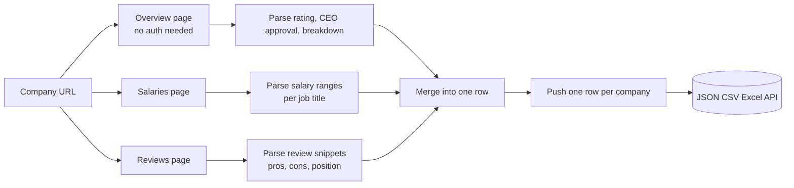
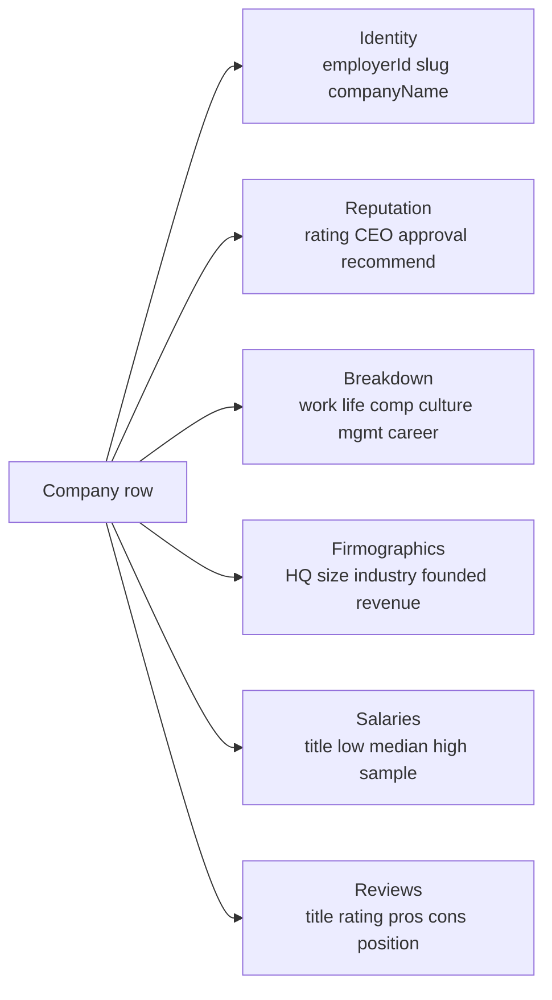

# Glassdoor Company & Salary Scraper (No Login Required)

Pull public Glassdoor company facts and salary intelligence from any company page. No cookies. No login. No employer subscription. Each row ships the rating, CEO approval rate, recommend rate, headquarters, size, industry, founded year, salary ranges by job title, and the most recent review snippets. Pay per company.

**Built for** comp teams pricing offers, recruiters benchmarking pay, sales teams researching target accounts, and HR ops tracking employer brand over time.

**Keywords this actor ranks for:** glassdoor scraper, glassdoor api, glassdoor salary scraper, salary benchmarking api, employer brand tracker, comp benchmarking api, recruiter intelligence, glassdoor company data, glassdoor reviews scraper, payscale alternative, lightcast alternative, salary intelligence api.

---

## Why this actor

| Other Glassdoor scrapers | **This actor** |
|---|---|
| Need an employer account or session | Zero cookies, zero login |
| Return one big HTML blob | Overview, salaries, and reviews parsed into discrete rows |
| Skip salary ranges entirely | Salary ranges per job title shipped with low, median, high, sample size |
| Charge per page hit | Charge per company, get the whole snapshot |
| Get rate limited at 5 rows | Built on residential proxy with session pooling for sustained runs |

---

## How it works



The actor extracts the embedded `__NEXT_DATA__` JSON when Glassdoor renders it, and falls back to defensive DOM selectors when the surface changes. No cookie passes through the actor at any stage.

---

## What you get per row



Pipe straight into a comp planning sheet, an offer-letter builder, or a sales account brief.

---

## Quick start

**Comp benchmarking for a target company list**

```json
{
  "companyUrls": [
    "https://www.glassdoor.com/Overview/Working-at-OpenAI-EI_IE5390716.11,17.htm",
    "https://www.glassdoor.com/Reviews/Stripe-Reviews-E671932.htm",
    "https://www.glassdoor.com/Reviews/Anthropic-Reviews-E6552243.htm"
  ]
}
```

**Pull only salary ranges (skip reviews)**

```json
{
  "companyUrls": ["https://www.glassdoor.com/Reviews/Databricks-Reviews-E954115.htm"],
  "includeReviews": false,
  "salariesPerCompany": 50
}
```

**Account research for a sales rep**

```json
{
  "companyUrls": [
    "https://www.glassdoor.com/Reviews/Snowflake-Reviews-E1226371.htm",
    "https://www.glassdoor.com/Reviews/Datadog-Reviews-E929772.htm"
  ],
  "includeSalaries": true,
  "includeReviews": true,
  "reviewsPerCompany": 20
}
```

---

## Sample output

```json
{
  "employerId": "5390716",
  "slug": "OpenAI",
  "url": "https://www.glassdoor.com/Overview/Working-at-OpenAI-EI_IE5390716.11,17.htm",
  "companyName": "OpenAI",
  "rating": 4.4,
  "ceoApprovalPct": 92,
  "recommendPct": 89,
  "ratingsBreakdown": {
    "workLifeBalance": 3.9,
    "compensationAndBenefits": 4.7,
    "cultureAndValues": 4.5,
    "seniorManagement": 4.0,
    "careerOpportunities": 4.4,
    "diversityAndInclusion": 4.2
  },
  "headquarters": "San Francisco, CA",
  "size": "1001 to 5000 Employees",
  "industry": "Computer Hardware Development",
  "founded": 2015,
  "revenue": "Unknown / Non-Applicable",
  "type": "Company - Private",
  "website": "https://openai.com",
  "ceoName": "Sam Altman",
  "salaries": [
    {
      "title": "Software Engineer",
      "low": 230000,
      "median": 320000,
      "high": 450000,
      "currency": "USD",
      "period": "year",
      "sampleSize": 142
    },
    {
      "title": "Research Scientist",
      "low": 280000,
      "median": 410000,
      "high": 560000,
      "currency": "USD",
      "period": "year",
      "sampleSize": 64
    }
  ],
  "reviews": [
    {
      "title": "Genuine mission, intense pace",
      "rating": 5,
      "pros": "Smart people, real problems, great compensation.",
      "cons": "Hours are long. Roadmap shifts every quarter.",
      "position": "Software Engineer",
      "location": "San Francisco, CA",
      "date": "2026-04-22"
    }
  ],
  "scrapedAt": "2026-05-10T06:00:00.000Z"
}
```

---

## Who uses this

| Role | Use case |
|---|---|
| Comp team | Benchmark base + bonus per title before pricing offers |
| Recruiter | Pull rating and salary range for outbound talking points |
| Sales | Brief reps with employer rating, headcount, and HQ before a discovery call |
| HR ops | Track rating and review velocity month over month |
| Founder | Watch competitor employer brand and comp trajectory |
| Investor | Read employee sentiment and pay shifts as an early signal |

---

## Input reference

| Field | Type | What it does |
|---|---|---|
| `companyUrls` | string[] | Glassdoor Overview, Reviews, or Salary URLs. Required. |
| `includeSalaries` | boolean | Pull salary ranges per job title. Default true. |
| `includeReviews` | boolean | Pull recent review snippets. Default true. |
| `salariesPerCompany` | integer | Max salary rows per company. Default 25. |
| `reviewsPerCompany` | integer | Max review snippets per company. Default 10. |
| `concurrency` | integer | Companies processed in parallel. Four is the safe default for Glassdoor. |
| `proxyConfiguration` | object | Apify proxy. Residential is required at any meaningful volume. |

---

## API call

```bash
curl -X POST \
  "https://api.apify.com/v2/acts/YOUR_USER~glassdoor-company-salary-scraper/runs?token=YOUR_TOKEN" \
  -H "Content-Type: application/json" \
  -d '{
    "companyUrls": [
      "https://www.glassdoor.com/Overview/Working-at-OpenAI-EI_IE5390716.11,17.htm",
      "https://www.glassdoor.com/Reviews/Stripe-Reviews-E671932.htm"
    ]
  }'
```

---

## Pricing

The first few companies per run are free so you can validate output before paying. After that, each company row is charged. No surprise add on charges.

---

## FAQ

### Do I need a Glassdoor account or cookie?

No. The actor only touches Glassdoor's public Overview, Salaries, and Reviews surfaces. Your account is never touched.

### Can I get every salary report for a company?

You get the public salary ranges per job title that Glassdoor renders to anonymous visitors. That covers most of the top titles per company with low, median, high, and the reported sample size. Per-employee report rows are gated behind login and are not exposed.

### How many reviews can I pull?

The first page of public reviews per company, capped by `reviewsPerCompany`. Pagination across many pages of reviews is intentionally skipped to keep cost predictable per row.

### Glassdoor can block scrapers. How does this handle it?

The actor runs through Apify residential proxy with session pooling and stealth flags. Sessions retire after a small number of uses to keep the failure rate low.

### What if a company page is gated for me?

The actor returns the row with whatever it could parse. Missing fields land as null. You only pay for the company on push, so if Glassdoor returns nothing for that ID you get the row with nulls, not a blank charge surprise.

### Can I scrape regional Glassdoor pages?

Yes. Country variants like glassdoor.co.uk, glassdoor.de, and glassdoor.fr all share the employer ID format and are accepted.

### How fresh is the data?

Each run hits the live page, so rating and salary ranges reflect what Glassdoor renders at scrape time. Schedule weekly runs to track sentiment and pay shifts over time.

### Is scraping Glassdoor allowed?

This actor reads HTML any anonymous web visitor can see. Respect Glassdoor's terms and rate limit sensibly. Do not redistribute personal data you have no lawful basis to process.

---

## Related actors

- **LinkedIn Company Profile Scraper (No Cookies)** — pull industry, headcount range, HQ, founded year, specialties, website per company
- **LinkedIn Company Employees Scraper (No Cookies)** — pull headcount, location split, top roles, top skills, top schools per company
- **Indeed Jobs Scraper Pro** — pull live job postings with salary, employer, and location
- **Lead Enrichment Pipeline** — multi source enrichment for a list of company domains
- **Domain Intelligence** — pull WHOIS, MX, tech stack, and traffic signals per domain
