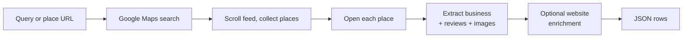
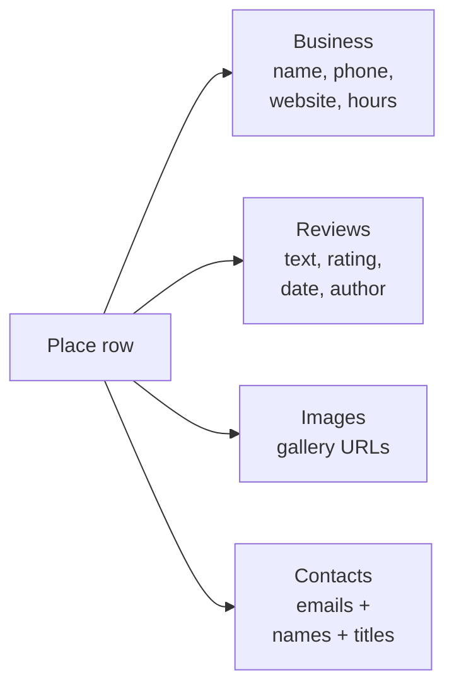

# Google Maps Intelligence: Places, Reviews, and Contact Data to JSON

Pull Google Maps by search query or direct place URL. Every row has business name, address, phone, website, rating, review count, category, price range, opening hours, reviews, and reviewer details. Optional website enrichment pulls email addresses and person names with job titles. Pay per place.

**Ranks for:** Google Maps intelligence, Google Maps API alternative, Maps business intelligence, Maps lead generation, Maps review intelligence, Google Places intelligence, pull Google Maps, Google Maps to CSV.

---

## What this does



Paste a query like "dentists in Miami" or a direct Maps URL. One row per place with everything Google Maps shows, plus reviews and optional contact emails from the business website.

---

## Who uses this

| Role | Use case |
|---|---|
| Sales team | Build a local prospect list with phone, website, and contact email. |
| Agency | Audit competitor ratings and review volume in a target metro. |
| Market analyst | Pull business density by category and zip for a local market report. |
| Review ops | Monitor incoming reviews on a property portfolio. |
| SEO consultant | Track competitor review growth and category positioning. |
| Franchise ops | Benchmark store level ratings across locations. |

---

## Quick start

**Lead list by query:**

```json
{
  "searchQueries": ["dentists in Miami", "dentists in Orlando"],
  "maxPlacesPerQuery": 50,
  "enrichFromWebsite": true
}
```

**Review monitoring for a property:**

```json
{
  "startUrls": ["https://www.google.com/maps/place/.../..."],
  "maxReviewsPerPlace": 100,
  "dedupe": false
}
```

**Bulk local audit:**

```json
{
  "searchQueries": [
    "plumbers Austin",
    "plumbers Dallas",
    "plumbers Houston"
  ],
  "maxPlacesPerQuery": 30,
  "scrapeImages": false
}
```

---

## Sample output

```json
{
  "placeId": "0x88d9b0a20c73b4a7:0x5a6f8a3e12f4d81",
  "name": "Cuvée Coffee",
  "category": "Coffee shop",
  "rating": 4.6,
  "reviewCount": 812,
  "address": "2000 E 6th St, Austin, TX 78702",
  "phone": "+1 512 368 5282",
  "website": "https://cuveecoffee.com",
  "priceLevel": "$$",
  "latitude": 30.263,
  "longitude": -97.722,
  "openState": "Open",
  "hours": [
    { "day": "Monday", "hours": "7 AM to 5 PM" },
    { "day": "Tuesday", "hours": "7 AM to 5 PM" }
  ],
  "reviews": [
    {
      "author": "Jane D.",
      "rating": 5,
      "relativeDate": "2 weeks ago",
      "text": "Best flat white in East Austin. Friendly staff.",
      "reviewerMeta": "12 reviews"
    }
  ],
  "contacts": [
    { "fullName": "Mike McKim", "jobTitle": "Founder" }
  ],
  "emails": ["hello@cuveecoffee.com"],
  "url": "https://www.google.com/maps/place/..."
}
```

---

## What you get back



Contacts and emails come from a best effort scan of the linked business website (homepage + contact or about page). Turn `enrichFromWebsite` on to enable.

---

## Google Maps intelligence vs the alternatives

|  | Google Places API | Paid SaaS scrapers | **This actor** |
|---|---|---|---|
| Access | Key + billing setup | Per seat license | Anyone |
| Review text | Limited to 5 per place | Yes | Yes |
| Reviewer names | Partial | Yes | Yes |
| Website emails | No | Some | Yes (opt in) |
| Scale | Per query rate limit | Seat limited | Pay per row |
| Cost | Per 1000 calls | $99+ per month | Pay per item |

---

## Pricing

First 2 places per run are free. After that you pay per place row. Reviews, images, and enrichment ride along with the place at no extra charge.

---

## FAQ

**Do I need a Google API key?**
No. The actor reads public Maps pages.

**Can it return email addresses?**
Yes. Enable `enrichFromWebsite`. The actor visits the linked business website, scans the homepage plus any contact or about page, and extracts emails and person names with job titles.

**How many reviews per place can I pull?**
Up to 500 per place. The default is 5 so automated test runs finish fast. Raise it when you need deep review history.

**Does it work in any country?**
Yes. Set `language` to your locale code (en, es, fr, de, ja). Address and review translation follow the locale.

**Does Google Maps block scrapers?**
Aggressively on datacenter IPs. The actor ships with residential proxy by default.

**Can I run it on a schedule?**
Yes. Use the Apify scheduler to run this actor on any interval. Flip `dedupe` off if you want a fresh snapshot each run for price or rating tracking.

**What is `placeId` in the output?**
The Google Maps canonical id for the place, read from the URL. Stable across runs. Used as the dedupe key.

**Is pulling Google Maps allowed?**
This actor reads public HTML a browser can see. Respect the site terms and rate limit sensibly.

---

## Related actors

- **Zillow Home Price Intelligence** for listings and Zestimates
- **Flight Price Tracker** for Google Flights fares
- **TripAdvisor Review Intelligence** for hotel and restaurant reviews
- **Google Reviews Intelligence** for places reviews only
- **Viator Intelligence** for tours and activities
