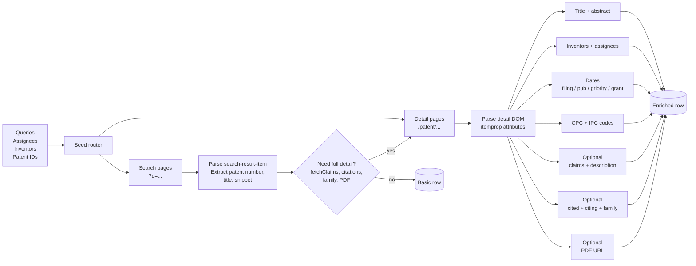
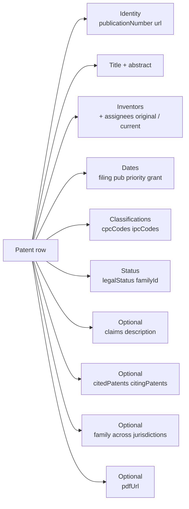

# Google Patents Intelligence: Claims, Citations, Family Tree

Pull Google Patents at scale. Pulls patent metadata (title, abstract, filing / publication / priority dates), inventors and assignees, CPC and IPC classifications, full claims text, full description, forward and backward citations, non-patent literature citations, family members across jurisdictions, legal status, and PDF URLs. One row per patent. Pay per row.

**Built for** patent attorneys and IP firms running prior art sweeps, in-house IP teams managing portfolios, R&D leads tracking competitor filings, M&A due diligence teams scoring target IP estates, IP licensing brokers finding monetizable patents, university tech transfer offices, and AI teams training models on patent corpora.

**Keywords this actor ranks for:** google patents api, google patents scraper, patent search api, USPTO scraper, EPO patent api, prior art search tool, patent citations scraper, patent family lookup, CPC classification search, patent claims extractor, assignee patent portfolio, freedom to operate search, patent prior art tools.

---

## Why this actor

| Other patent tools | **This actor** |
|---|---|
| PatSnap, Innography, Derwent: $5K to $50K per seat per year | Pay per row pulled. No per seat license. |
| USPTO Patent Public Search: free but US only, slow UI | Covers US, EP, WO, CN, JP, KR, DE, GB, FR, CA, AU, IN. JSON output. |
| Lens.org: free but limited bulk export | No row cap. Stream straight to your warehouse. |
| Espacenet: free but no bulk API for full text | Optional fetchClaims and fetchDescription pull full body text per row. |
| One field returned per query | Mix queries with assignee searches, inventor searches, and direct patent IDs in one run. |
| No citation tree | Optional fetchCitations and fetchCitedBy walk both directions of the citation graph. |
| No family lookup | Optional fetchFamily returns every jurisdiction equivalent in one row. |
| Manual PDF download | fetchPdf resolves the patentimages.storage.googleapis.com URL per row. |

---

## How it works



Search results give Google Patents a query and pull paginated results. Detail pages are visited only when an enrichment toggle (claims, description, citations, family, PDF) is on or when the user passes patent IDs directly.

---

## What you get per row



Publication number is the canonical patent identifier across reissues and republications. Use it to dedupe across runs (built in via `dedupe: true`) and to fetch family members or citations on demand.

---

## Quick start

**Prior art sweep on a topic, last 10 years**

```json
{
  "queries": ["solid state lithium battery cathode coating"],
  "yearFrom": 2015,
  "fetchClaims": true,
  "fetchCitations": true,
  "maxPatents": 100
}
```

**Full portfolio of one assignee**

```json
{
  "assignees": ["Tesla, Inc."],
  "fetchFamily": true,
  "maxPatents": 500,
  "maxPagesPerQuery": 50
}
```

**Track recent filings in CPC class H04L (digital information transmission)**

```json
{
  "queries": ["data transmission protocol"],
  "cpcClasses": ["H04L"],
  "yearFrom": 2024,
  "statusFilter": "application",
  "maxPatents": 200
}
```

**Direct patent IDs with full enrichment**

```json
{
  "patentIds": ["US10000000B2", "EP3000000A1", "WO2022123456A1"],
  "fetchClaims": true,
  "fetchDescription": true,
  "fetchCitations": true,
  "fetchCitedBy": true,
  "fetchFamily": true
}
```

**Inventor's full output**

```json
{
  "inventors": ["Yann LeCun"],
  "jurisdictions": ["US", "EP", "WO"],
  "maxPatents": 100
}
```

**Citation graph for a key patent (one hop forward)**

```json
{
  "patentIds": ["US7295961B2"],
  "fetchCitedBy": true,
  "fetchCitations": true
}
```

---

## Sample output

```json
{
  "publicationNumber": "US10000000B2",
  "url": "https://patents.google.com/patent/US10000000B2/en",
  "title": "Coherent ladar using intra-pixel quadrature detection",
  "abstract": "A coherent LADAR uses a frequency modulated (FM) master oscillator (MO) light signal...",
  "inventors": ["Joseph Marron"],
  "assigneesOriginal": ["Raytheon Company"],
  "assigneesCurrent": ["Raytheon Co"],
  "filingDate": "2017-08-30",
  "publicationDate": "2018-06-19",
  "priorityDate": "2017-08-30",
  "grantDate": "2018-06-19",
  "applicationNumber": "US15/691,621",
  "familyId": "62604000",
  "cpcCodes": ["G01S17/325", "G01S7/4912", "G01S17/89"],
  "ipcCodes": ["G01S17/00", "G01S7/491"],
  "legalStatus": "Active",
  "claims": "1. A coherent light detection and ranging (LADAR) system, comprising: a master oscillator...",
  "citedPatents": [
    {
      "publicationNumber": "US4830486A",
      "priorityDate": "1984-03-16",
      "publicationDate": "1989-05-16",
      "assignee": "Goodman Joseph M",
      "title": "Frequency modulated lasar radar"
    }
  ],
  "citedNonPatentLiterature": [
    "Stutzki et al., \"FMCW LiDAR with electrically chirped semiconductor laser\", Optics Express 2018"
  ],
  "citingPatents": [
    {
      "publicationNumber": "US11486986B2",
      "publicationDate": "2022-11-01",
      "assignee": "Aurora Innovation Inc",
      "title": "LIDAR system with sample integration"
    }
  ],
  "family": [
    { "publicationNumber": "EP3676631A1", "country": "EP", "publicationDate": "2020-07-08", "title": "Coherent LIDAR" },
    { "publicationNumber": "WO2019046011A1", "country": "WO", "publicationDate": "2019-03-07", "title": "Coherent LIDAR" }
  ],
  "pdfUrl": "https://patentimages.storage.googleapis.com/c2/13/.../US10000000B2.pdf",
  "scrapedAt": "2026-04-29T17:30:00.000Z"
}
```

---

## Who uses this

| Role | Use case |
|---|---|
| Patent attorney | Prior art sweep across journals + conferences + patents. Export to IDS docket. |
| In-house IP team | Track competitor filings weekly. Score portfolio overlap. |
| R&D lead | Find prior work in a CPC class before greenlighting a project. |
| M&A diligence | Score target's IP estate. Walk family + citations to find true coverage. |
| Licensing broker | Find monetizable patents by assignee + age + cited-by count. |
| University tech transfer | Track university filings and citations. Find licensees in cited-by lists. |
| Trademark / IP analyst | Build patent portfolio reports per industry and jurisdiction. |
| AI / LLM team | Train domain models on patent corpora. Use family relationships as positives. |
| Litigation support | Build prior art trees back from a target patent. Walk citingPatents for invalidation candidates. |

---

## Input reference

| Field | Type | What it does |
|---|---|---|
| `queries` | string[] | Free text Google Patents queries. Supports operators: "exact phrase", inventor:Smith, assignee:Apple, CPC=H04L. |
| `patentIds` | string[] | Direct patent publication numbers. Example: US10000000B2. |
| `assignees` | string[] | Company names. Returns every patent assigned to that company. |
| `inventors` | string[] | Inventor names. Returns every patent listing the named inventor. |
| `yearFrom` / `yearTo` | integer | Filing year window. 0 means no bound. |
| `jurisdictions` | string[] | Patent offices: US, EP, WO, CN, JP, KR, DE, GB, FR, CA, AU, IN. Empty means all. |
| `statusFilter` | enum | any (default), grant, or application. |
| `cpcClasses` | string[] | CPC codes to filter by. Example: ["H04L", "G06N3/08"]. |
| `language` | enum | Patent text language. Affects search and display. |
| `fetchClaims` | boolean | Pull full claims text per patent. |
| `fetchDescription` | boolean | Pull full description. Body can run to tens of thousands of characters. |
| `fetchCitations` | boolean | Walk backward references. Adds citedPatents[] and citedNonPatentLiterature[]. |
| `fetchCitedBy` | boolean | Walk forward references. Adds citingPatents[]. |
| `fetchFamily` | boolean | Patent family across jurisdictions. Adds family[]. |
| `fetchPdf` | boolean | Resolve PDF URL. On by default. |
| `maxPatents` | integer | Hard cap on rows per run. 0 means unlimited. |
| `maxPagesPerQuery` | integer | Pages of 10 results per query. Cap is 100. |
| `dedupe` | boolean | Skip publication numbers from previous runs. |
| `navigationDelayMs` | integer | Pause between page loads. 3000 to 6000 ms is the safe band. |
| `concurrency` | integer | Parallel browser pages. Keep at 1 to 2 unless you have a residential pool. |
| `proxyConfiguration` | object | Apify proxy. Datacenter works for low volume. Residential past a few hundred requests. |

---

## API call

```bash
curl -X POST \
  "https://api.apify.com/v2/acts/YOUR_USER~google-patents-scraper/runs?token=YOUR_TOKEN" \
  -H "Content-Type: application/json" \
  -d '{
    "queries": ["lithium iron phosphate cathode coating"],
    "yearFrom": 2015,
    "fetchClaims": true,
    "fetchCitations": true,
    "fetchFamily": true,
    "maxPatents": 100
  }'
```

---

## Pricing

The first few rows per run are free so you can validate the schema before paying. After that, one charge per patent row regardless of how many enrichment fields you turn on. Claims, description, citations, family, and PDF fetches are included at no extra per row charge.

---

## FAQ

### Why pull patents instead of using a paid database?

Commercial patent databases (PatSnap, Derwent, Innography) charge $5,000 to $50,000 per seat per year. For most teams running occasional prior art searches, portfolio reviews, or competitor sweeps, pay per row beats a per seat license by an order of magnitude.

### How is this different from USPTO Patent Public Search?

USPTO is free but covers US only and has a slow UI. Google Patents covers US, EP, WO (PCT), CN, JP, KR, DE, GB, FR, CA, AU, IN, and more. The actor ships JSON output instead of HTML pages and supports bulk runs without a session limit.

### Does it cover patent applications or only granted patents?

Both by default. Filter with `statusFilter: "grant"` for granted only or `statusFilter: "application"` for pending only.

### Can I find every patent assigned to a company?

Yes. Pass the company name in `assignees[]`. The actor wraps it in `assignee:"Name"` and walks paginated results. Set `maxPagesPerQuery: 50` to get up to 500 rows per assignee.

### How do I do a prior art search?

Three approaches and you can mix all three in one run. (1) `queries` with technical terms describing the invention. (2) `cpcClasses` filtering to the relevant CPC subclass. (3) `patentIds` of known relevant patents combined with `fetchCitations: true` to walk backward references. The combination gives a full prior art tree.

### What is patent family?

A patent family is the set of equivalent patents filed in different jurisdictions for the same invention. A US patent often has EP, WO, CN, and JP family members. `fetchFamily: true` returns these so you can map global coverage in one row.

### How fast is the actor?

With `concurrency: 2` and `navigationDelayMs: 3500` the actor processes about 30 to 50 rows per minute on Apify residential proxy. Detail pages are slower than search pages because they render more DOM. Disable `fetchDescription` if you don't need the long body, it's the slowest enrichment.

### Will Google Patents block me?

The actor uses Apify residential proxy by default. Datacenter IPs are accepted for low volume. Past a few hundred requests in a short window Google Patents will throttle datacenter ranges. Residential rotates per request and stays clean.

### Can I get the patent's PDF?

Yes. `fetchPdf: true` (the default) resolves the direct PDF URL hosted on patentimages.storage.googleapis.com. Pipe that URL into Apify's Website Content Pipeline to extract the full PDF text if you need OCR.

### Does it work for non-English patents?

Yes. Set `language` to de, fr, es, ja, ko, or zh. The actor pulls the patent in that language. Most CN and JP patents have machine translation available, which Google Patents shows by default.

---

## Related actors

- **Google Scholar Intelligence**. Pair patents with the academic literature side of prior art. Same shape applied to papers.
- **SEC 8-K Event Tracker**. Catch material patent events disclosed in 8-K filings.
- **Website Content Pipeline**. Pipe `pdfUrl` from each patent row into the pipeline for full text extraction with OCR.
- **GitHub Issue Monitor**. Catch open source projects implementing techniques described in your patents.
- **HN Lead Monitor**. Track Hacker News mentions of competitor patents for licensing leads.
- **Reddit Lead Monitor**. Same applied to Reddit, useful for tracking patent enforcement chatter.
