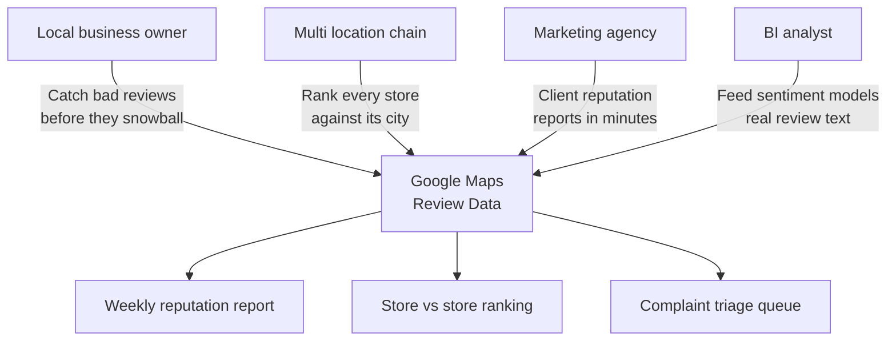
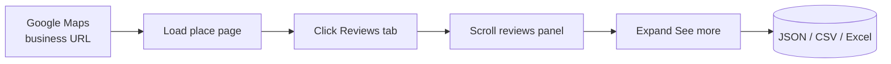
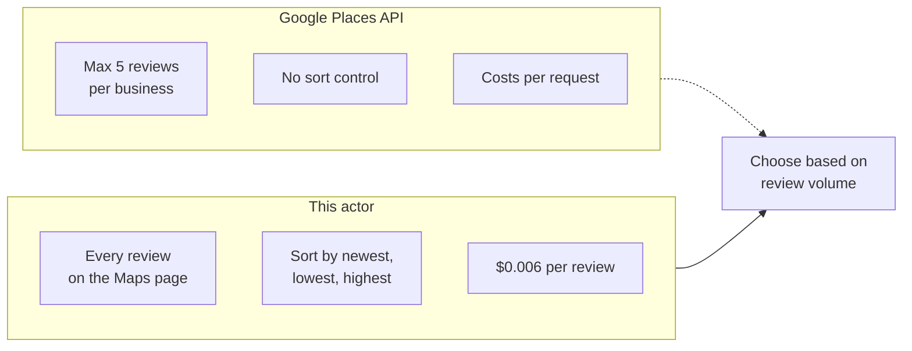
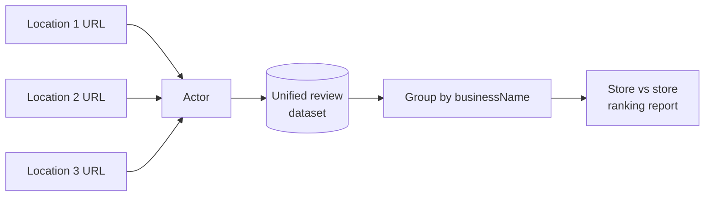

# Google Reviews Scraper and Export Tool for Google Maps

Export every Google review for any business into a clean JSON, CSV, or Excel file. Pull star ratings, full review text, reviewer names, dates, photos, owner responses, and aggregate ratings for your business and every competitor. Works past the 5 review cap of the official Google Places API.

Built for local business owners, multi location chains, marketing agencies, and BI teams who need Google Maps review data without a $400 per month reputation SaaS.

---

## Who uses this Google reviews scraper



| Role | What the export unlocks |
|---|---|
| **Local business owner** | Weekly star trend, 1 star spike alerts, owner reply coverage |
| **Multi location chain** | Every store's reviews in one dataset, grouped by city |
| **Marketing agency** | Client reputation reports pulled in minutes, not days |
| **BI analyst** | Clean JSON or CSV feed for sentiment models and dashboards |

---

## How the Google reviews export works



The actor opens each Google Maps listing in a real browser, clicks the Reviews tab, applies your sort order, and scrolls the panel until your review cap is reached. Residential proxies keep every run past Google's anti bot defenses.

---

## Google Places API vs this scraper



| Feature | Places API | This actor |
|---|---|---|
| Reviews per business | 5 | Full history |
| Sort order | Fixed | Newest, most relevant, highest, lowest |
| Filter by star rating | No | Yes |
| Filter by language | No | Yes |
| Photo URLs | Limited | Yes |
| Owner responses | No | Yes |
| Price | Per request | $0.006 per review, first 100 free |

---

## Quick start

Export 200 recent Google reviews for one restaurant:

```bash
curl -X POST "https://api.apify.com/v2/acts/scrapemint~google-reviews-intelligence/run-sync-get-dataset-items?token=YOUR_TOKEN" \
  -H "Content-Type: application/json" \
  -d '{
    "placeUrl": "https://www.google.com/maps/place/Eleven+Madison+Park",
    "maxReviews": 200,
    "sortBy": "NEWEST"
  }'
```

Pull complaints only across 3 chain locations:

```json
{
  "placeUrls": [
    { "url": "https://www.google.com/maps/place/Shake+Shack+Madison+Square" },
    { "url": "https://www.google.com/maps/place/Shake+Shack+Times+Square" },
    { "url": "https://www.google.com/maps/place/Shake+Shack+Brooklyn" }
  ],
  "maxReviews": 500,
  "filterByRating": ["1", "2"]
}
```

Search by business name and city instead of pasting URLs:

```json
{
  "searchQueries": [
    "Eleven Madison Park New York",
    "Gramercy Tavern New York"
  ],
  "maxReviews": 300
}
```

---

## What one review record looks like

```json
{
  "reviewId": "ChdDSUhNMG9nS0VJQ0FnSUNoMnUtcjVRRRAB",
  "rating": 5,
  "text": "Best anniversary dinner ever. Tomato tasting menu in summer is a highlight of the city.",
  "reviewerName": "Marissa K.",
  "reviewerReviewCount": "12 reviews",
  "writtenDate": "2 weeks ago",
  "photoUrls": ["https://lh5.googleusercontent.com/p/AF1Q..."],
  "hasOwnerResponse": true,
  "ownerResponseText": "Marissa, thank you for celebrating with us.",
  "ownerResponseDate": "1 week ago",
  "businessName": "Eleven Madison Park",
  "businessCategory": "Fine dining restaurant",
  "businessAddress": "11 Madison Ave, New York, NY 10010",
  "businessAggregateRating": 4.6,
  "businessReviewCount": 6184
}
```

Every record carries both the review fields and the business rollup, so multi location exports group cleanly by `businessName` in any spreadsheet.

---

## Inputs

| Field | Type | Default | What it does |
|---|---|---|---|
| `placeUrls` | array | `[]` | Google Maps place URLs |
| `placeUrl` | string | `null` | Single URL shortcut |
| `searchQueries` | array | `[]` | Business name plus city, resolves to the first Maps match |
| `maxReviews` | integer | `500` | Hard cap per business, controls cost |
| `sortBy` | string | `NEWEST` | `NEWEST`, `MOST_RELEVANT`, `HIGHEST_RATING`, `LOWEST_RATING` |
| `filterByRating` | array | `[]` | Ratings to keep, e.g. `["1","2"]` |
| `language` | string | `""` | Filter by language code (`en`, `es`, `fr`, `de`) |

---

## Pricing

Pay per review. First 100 reviews every run are free so you can verify the output before spending.

| Tier | Price | Best for |
|---|---|---|
| Free | First 100 reviews per run | Verifying output format |
| Standard | $0.006 per review | Ongoing monitoring and benchmarking |

5,000 reviews across 10 locations: **$29.40 once**. Reputation SaaS like Yext or Podium: $300 to $1,200 per month per location.

---

## Benchmark every location in one run



Every record carries `businessName`, `businessAddress`, and `businessAggregateRating`, so a pivot table turns multi location exports into a city by city ranking in seconds.

---

## Related tools in the review intelligence suite

* [**TripAdvisor Review Intelligence**](https://apify.com/scrapemint/tripadvisor-review-intelligence): hotel, restaurant, and attraction reviews with trip type, stay dates, and owner responses
* [**Trustpilot Brand Reputation**](https://apify.com/scrapemint/trustpilot-brand-reputation): e-commerce review data with trust scores, country, and verification status
* [**Booking Review Intelligence**](https://apify.com/scrapemint/booking-review-intelligence): hotel and STR reviews with sentiment, category scores, and management replies
* **Roadmap:** Yelp, OpenTable, Facebook reviews

---

## Frequently asked questions

**How do I scrape Google reviews into a CSV file?**
Run this actor with a Google Maps place URL and a review cap. Export the dataset as CSV from the Apify console or pull it via the API.

**Is there a Google Reviews API alternative with more than 5 reviews?**
Yes. The official Google Places API caps results at 5 reviews per business. This actor pulls the full review history from the public Maps UI for pennies per run.

**How do I export my Google My Business reviews?**
Paste your business's Google Maps URL into `placeUrl` or `placeUrls`. The actor pulls every review the public page shows in your chosen sort order.

**How do I monitor Google reviews without Yext or Podium?**
Schedule this actor weekly. Diff the latest export against last week in a spreadsheet. Replaces a $300+ monthly subscription.

**Can I compare multiple business locations in one run?**
Yes. Pass every URL in `placeUrls`. Every record includes `businessName` and `businessAddress` for grouping.

**How do I analyze only negative Google reviews?**
Set `filterByRating` to `["1","2"]` to pull only 1 and 2 star reviews.

**Does this scraper work for any kind of business?**
Yes. Restaurants, hotels, retail, services, healthcare, any listing that appears on Google Maps.

**Can I search by business name instead of pasting a URL?**
Yes. Use `searchQueries` with `Business Name City`. Each query resolves to the first Maps match.

**How fresh is the data?**
Live at query time. Every run pulls straight from Google Maps.

**Why residential proxies?**
Google Maps blocks datacenter IPs within a few requests. Residential proxies keep runs clean, and the actor ships with residential defaults.
