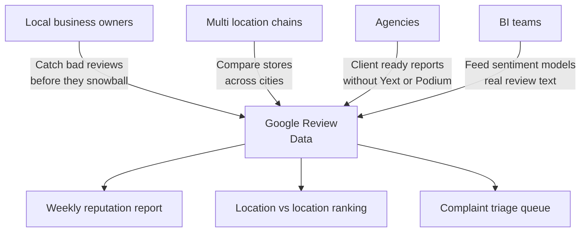
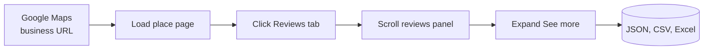
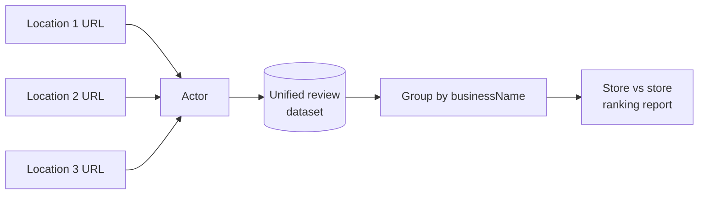

# Google Reviews Export and Local Business Reputation Monitor

Download every Google review for any business into a clean JSON or CSV file. Star ratings, full review text, reviewer names, review dates, photos, owner responses, and aggregate ratings for your business and your competitors.

Built for local business owners, multi location brands, agencies, and BI teams who need Google review data without paying for a reputation SaaS or hitting the Places API 5 review cap.

---

## Who uses this and why



| Role | What this gives you |
|---|---|
| **Local business owner** | Weekly review volume, star trends, owner reply coverage |
| **Multi location brand** | Every store's reviews in one dataset, grouped by city |
| **Agency** | Client reputation reports pulled in minutes, not days |
| **BI analyst** | Clean JSON or CSV feed for sentiment models and dashboards |

---

## How it works



Opens each Google Maps listing in a real browser, clicks the Reviews tab, applies your sort order, and scrolls the reviews panel until your cap is reached. Residential proxies keep you past Google's anti bot defenses.

---

## Quick start

Export 200 recent reviews for one restaurant:

```bash
curl -X POST "https://api.apify.com/v2/acts/scrapemint~google-reviews-intelligence/run-sync-get-dataset-items?token=YOUR_TOKEN" \
  -H "Content-Type: application/json" \
  -d '{
    "placeUrl": "https://www.google.com/maps/place/Eleven+Madison+Park",
    "maxReviews": 200,
    "sortBy": "NEWEST"
  }'
```

Compare 3 chain locations, pulling only complaints:

```json
{
  "placeUrls": [
    { "url": "https://www.google.com/maps/place/Shake+Shack+Madison+Square" },
    { "url": "https://www.google.com/maps/place/Shake+Shack+Times+Square" },
    { "url": "https://www.google.com/maps/place/Shake+Shack+Brooklyn" }
  ],
  "maxReviews": 500,
  "filterByRating": ["1", "2"]
}
```

Or search by business name instead of pasting URLs:

```json
{
  "searchQueries": [
    "Eleven Madison Park New York",
    "Gramercy Tavern New York"
  ],
  "maxReviews": 300
}
```

---

## What one review record looks like

```json
{
  "reviewId": "ChdDSUhNMG9nS0VJQ0FnSUNoMnUtcjVRRRAB",
  "rating": 5,
  "text": "Best anniversary dinner ever. Tomato tasting menu in summer is a highlight of the city.",
  "reviewerName": "Marissa K.",
  "reviewerReviewCount": "12 reviews",
  "writtenDate": "2 weeks ago",
  "photoUrls": ["https://lh5.googleusercontent.com/p/AF1Q..."],
  "hasOwnerResponse": true,
  "ownerResponseText": "Marissa, thank you for celebrating with us.",
  "ownerResponseDate": "1 week ago",
  "businessName": "Eleven Madison Park",
  "businessCategory": "Fine dining restaurant",
  "businessAddress": "11 Madison Ave, New York, NY 10010",
  "businessAggregateRating": 4.6,
  "businessReviewCount": 6184
}
```

Every record carries both the review fields and the business rollup, so multi location pulls group cleanly in any spreadsheet.

---

## Inputs

| Field | Type | Default | What it does |
|---|---|---|---|
| `placeUrls` | array | `[]` | Google Maps place URLs. |
| `placeUrl` | string | `null` | Single URL shortcut. |
| `searchQueries` | array | `[]` | Business name plus city. Resolves to the first Maps match. |
| `maxReviews` | integer | `500` | Hard cap per business. Controls cost. |
| `sortBy` | string | `NEWEST` | `NEWEST`, `MOST_RELEVANT`, `HIGHEST_RATING`, `LOWEST_RATING` |
| `filterByRating` | array | `[]` | Ratings to keep (e.g. `["1","2"]`). |
| `language` | string | `""` | Filter by language code (`en`, `es`, `fr`, `de`). |

---

## Pricing

Pay per review. Free tier lets you verify the output before spending anything.

| Tier | Price | Best for |
|---|---|---|
| Free | First 100 reviews per run | Verifying output format |
| Standard | $0.006 per review | Ongoing monitoring and benchmarking |

5,000 reviews across 10 locations: **$29.40 once**. Reputation SaaS like Yext or Podium: $300 to $1,200 per month per location.

---

## Compare locations in one run



Every record includes `businessName`, `businessAddress`, and `businessAggregateRating`, so grouping by location takes one pivot table.

---

## Common workflows

- **Weekly reputation report.** Cron this actor. Diff the latest run. Email the owner when 1 or 2 star volume spikes.
- **Multi location benchmarking.** Pull all your stores plus 3 competitors. Sort by stars. Show ops which locations are slipping.
- **Complaint triage.** Push 1 and 2 star reviews into your helpdesk so CS sees issues before they spread.
- **Marketing copy mining.** Search 5 star reviews for the exact phrases customers use. Reuse them in ads and landing pages.

---

## Related tools in the review intelligence suite

* [**TripAdvisor Review Intelligence**](https://apify.com/scrapemint/tripadvisor-review-intelligence): hotel, restaurant, and attraction reviews with trip type, stay dates, and owner responses
* [**Trustpilot Brand Reputation**](https://apify.com/scrapemint/trustpilot-brand-reputation): e-commerce review data with trust scores, country, and verification status
* [**Booking Review Intelligence**](https://apify.com/scrapemint/booking-review-intelligence): hotel and STR reviews with sentiment, category scores, and management replies
* **Roadmap:** Yelp, OpenTable, Facebook reviews

---

## Frequently asked questions

**How do I download Google reviews to a CSV file?**
Run this actor with a Google Maps place URL and a review cap. Export the dataset as CSV from the Apify console or pull it via the API.

**Is there a Google Reviews API alternative that returns more than 5 reviews?**
Yes. The official Places API caps results at 5 reviews per business and charges per request. This actor pulls the full review history from the public Maps UI for cents per run.

**How do I export my Google My Business reviews?**
Paste your business's Google Maps URL into `placeUrl` or `placeUrls`. The actor pulls every review the public page shows, in the sort order you pick.

**How do I monitor Google reviews without paying for Yext or Podium?**
Schedule this actor weekly against your Maps URL. Diff the output against last week in a spreadsheet. Replaces a $300+ monthly subscription.

**Can I compare multiple business locations in one run?**
Yes. Pass every URL in `placeUrls`. Every record includes `businessName` and `businessAddress` for grouping.

**How do I analyze only negative Google reviews?**
Set `filterByRating` to `["1", "2"]` to pull just 1 and 2 star reviews.

**Does this work for any kind of business?**
Yes. Restaurants, hotels, retail, services, healthcare, any business with a Google Maps listing.

**Can I search by business name instead of pasting a URL?**
Yes. Use `searchQueries` with "Business Name City". Each query resolves to the first Maps match.

**How fresh is the data?**
Live at query time. Every run pulls straight from Google Maps.

**Why residential proxies?**
Google Maps blocks datacenter IPs within a few requests. Residential proxies keep runs clean. The actor ships with residential defaults.
