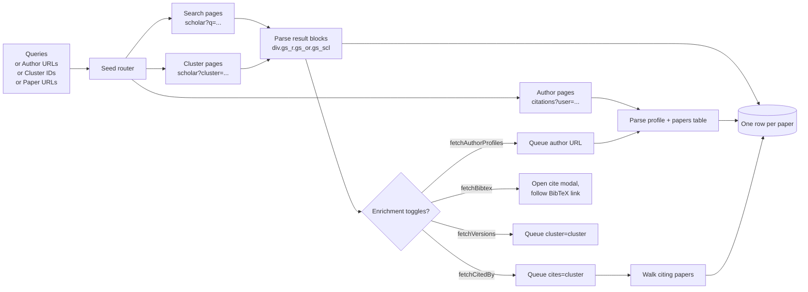
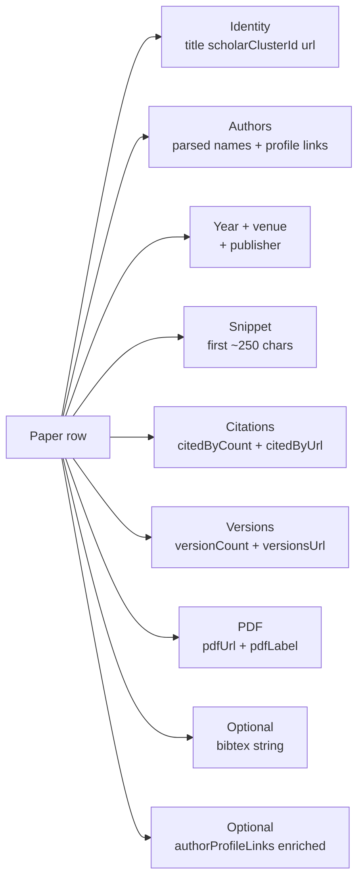

# Google Scholar Research Intelligence: Papers, Authors, Citations, BibTeX

Pull Google Scholar at scale. Pulls paper metadata (title, authors, year, venue, snippet), author profile data (affiliation, h-index, i10-index, total citations), citing paper lists, full BibTeX exports, all-versions clusters, and PDF links. One row per paper. Pay per row.

**Built for** academic researchers running literature reviews, PhD students chasing prior work, patent attorneys hunting prior art, bibliometricians measuring institutional output, science journalists tracing claims, AI teams building research copilots and training corpora, librarians enriching catalogs, and grant writers finding precedent.

**Keywords this actor ranks for:** google scholar api, google scholar scraper, scholar search api, academic paper scraper, citation count scraper, h-index lookup, prior art search, bibliometrics api, literature review automation, paper metadata extractor, BibTeX export, citing papers list, scholar author profile, research paper api.

---

## Why this actor

| Other Scholar tools | **This actor** |
|---|---|
| SerpAPI Google Scholar engine: $75 / month for 5K searches | Pay per row pulled. No monthly minimum. |
| Semantic Scholar API: free but covers a smaller corpus | Walks the live Google Scholar index, broader coverage |
| OpenAlex: free but uses Crossref + MAG snapshots, lags behind | Live page parse, fresh citation counts |
| scholarly Python lib: breaks on Scholar HTML changes, no proxy | Maintained selectors plus residential proxy out of the box |
| One result format (paper or author) | Mixed seed types in one run: queries, author URLs, cluster IDs, paper URLs |
| No author enrichment | Optional fetchAuthorProfiles flag adds h-index, i10, affiliation per row |
| No citing papers | Optional fetchCitedBy flag pulls the citing paper list per source paper |
| No BibTeX | Optional fetchBibtex flag attaches the BibTeX export per row |

---

## How it works



Scholar is fingerprinted aggressively against datacenter IPs. The actor runs Playwright with bundled Chromium, defaults to Apify residential proxy, and paces requests with `navigationDelayMs` so the session looks like a careful human reader rather than a burst client.

---

## What you get per row



Cluster ID is Scholar's stable identifier for a paper across reprints, preprints, and repository copies. Use it to dedupe across runs (built in via `dedupe: true`) and to fetch the citing paper list.

---

## Quick start

**Literature review on a topic, last 3 years**

```json
{
  "queries": ["graph neural network drug discovery"],
  "yearFrom": 2023,
  "sortBy": "relevance",
  "maxPapers": 100,
  "maxPagesPerQuery": 10
}
```

**One author's full publication record**

```json
{
  "authorUrls": [
    "https://scholar.google.com/citations?user=JicYPdAAAAAJ"
  ]
}
```

**High citation papers with citing list, ready for impact analysis**

```json
{
  "queries": ["transformer language model"],
  "yearFrom": 2017,
  "yearTo": 2020,
  "fetchCitedBy": true,
  "minCitationsForCitedBy": 1000,
  "maxCitedByPapers": 50,
  "maxPapers": 25
}
```

**Prior art sweep with patents included**

```json
{
  "queries": ["lithium iron phosphate cathode coating"],
  "includePatents": true,
  "yearFrom": 2010,
  "fetchBibtex": true,
  "maxPapers": 200
}
```

**Build a BibTeX library from a topic**

```json
{
  "queries": ["retrieval augmented generation"],
  "yearFrom": 2020,
  "fetchBibtex": true,
  "maxPapers": 50
}
```

**All Scholar versions of a single paper (preprint + published + repository copies)**

```json
{
  "clusterIds": ["17784817748666649498"]
}
```

---

## Sample output

```json
{
  "title": "Attention Is All You Need",
  "url": "https://proceedings.neurips.cc/paper/2017/hash/3f5ee243547dee91fbd053c1c4a845aa.html",
  "scholarClusterId": "2960712678066186980",
  "authors": ["A Vaswani", "N Shazeer", "N Parmar", "J Uszkoreit", "L Jones"],
  "authorProfileLinks": [
    { "name": "A Vaswani", "url": "https://scholar.google.com/citations?user=oR9V4YkAAAAJ" }
  ],
  "year": 2017,
  "venue": "Advances in neural information processing systems",
  "publisher": "papers.nips.cc",
  "snippet": "The dominant sequence transduction models are based on complex recurrent or convolutional neural networks...",
  "citedByCount": 142318,
  "citedByUrl": "https://scholar.google.com/scholar?cites=2960712678066186980",
  "versionCount": 38,
  "versionsUrl": "https://scholar.google.com/scholar?cluster=2960712678066186980",
  "relatedUrl": "https://scholar.google.com/scholar?q=related:abc/scholar",
  "pdfUrl": "https://proceedings.neurips.cc/paper/2017/file/3f5ee243547dee91fbd053c1c4a845aa-Paper.pdf",
  "pdfLabel": "[PDF] neurips.cc",
  "bibtex": "@inproceedings{vaswani2017attention,\n  title={Attention is all you need},\n  author={Vaswani, Ashish and ...},\n  booktitle={Advances in Neural Information Processing Systems},\n  year={2017}\n}",
  "scrapedAt": "2026-04-29T11:30:00.000Z"
}
```

Author rows ship with `type: "author"` and the full profile + papers table:

```json
{
  "type": "author",
  "name": "Geoffrey Hinton",
  "affiliation": "Emeritus Prof. Computer Science, University of Toronto",
  "verifiedEmailDomain": "cs.toronto.edu",
  "homepage": "http://www.cs.toronto.edu/~hinton",
  "interests": ["machine learning", "psychology", "artificial intelligence", "cognitive science"],
  "stats": {
    "totalCitations": 802145,
    "citationsSince5Years": 412338,
    "hIndex": 174,
    "hIndexSince5Years": 134,
    "i10Index": 470,
    "i10IndexSince5Years": 350
  },
  "papersCount": 451,
  "papers": [
    { "title": "Deep learning", "authors": "Y LeCun, Y Bengio, G Hinton", "venue": "Nature", "year": 2015, "citedBy": 89243 }
  ]
}
```

---

## Who uses this

| Role | Use case |
|---|---|
| Academic researcher | Build a literature review feed for a thesis or grant proposal. Track new citations on key papers daily. |
| PhD student | Find prior work on your method. Pull author h-index to gauge a venue's signal. |
| Patent attorney | Prior art sweep across journals + conferences + patents. Export BibTeX into the prior art docket. |
| Bibliometrician | Measure institutional or country level output. Walk every author profile under one institution. |
| AI / LLM team | Build research copilot training data. Pull citing papers to construct citation graphs. |
| Science journalist | Trace a viral claim back to the primary source. Verify how cited it actually is. |
| Librarian | Enrich an institutional repository with venue + citation counts on every paper. |
| Grant writer | Cite the seminal works in your field with accurate counts. Find precedent across funders. |
| Reference manager | Replace SerpAPI's Scholar engine. Same data, no monthly minimum. |

---

## Input reference

| Field | Type | What it does |
|---|---|---|
| `queries` | string[] | Free text Scholar queries. Supports operators: "exact", author:Hinton, intitle:transformer. |
| `authorUrls` | string[] | Direct Scholar citations profile URLs. Returns the author's full publication record. |
| `clusterIds` | string[] | Scholar cluster IDs. Use to fetch all versions of one paper. |
| `paperUrls` | string[] | Direct Scholar result URLs to enrich. Useful when you already have a list. |
| `yearFrom` / `yearTo` | integer | Publication year window. 0 means no bound. |
| `sortBy` | enum | relevance (default) or date (newest first). |
| `language` | enum | Scholar interface language. Affects venue parsing. |
| `includePatents` | boolean | Include patent results. Off by default. |
| `includeCaseLaw` | boolean | Include legal case law. Off by default. |
| `fetchAuthorProfiles` | boolean | Per paper, fetch each author's profile (h-index, affiliation). One extra request per unique author. |
| `fetchCitedBy` | boolean | Per paper above the citation threshold, walk the citing papers list. |
| `minCitationsForCitedBy` | integer | Threshold for triggering cited by fetch. Avoids wasting requests on low cited papers. |
| `maxCitedByPapers` | integer | Cap on how many citing papers to collect per source paper. |
| `fetchBibtex` | boolean | Pull BibTeX export per paper. |
| `fetchVersions` | boolean | Pull every Scholar cluster version (preprint, published, repository copies). |
| `maxPapers` | integer | Hard cap on rows per run. 0 means unlimited. |
| `maxPagesPerQuery` | integer | Pages of 10 results per query. Scholar caps at 100. |
| `dedupe` | boolean | Skip cluster IDs from previous runs. |
| `navigationDelayMs` | integer | Pause between page loads. 4000 to 8000 ms is the safe band. |
| `concurrency` | integer | Parallel browser pages. Keep at 1 to 2 unless you have a residential pool. |
| `proxyConfiguration` | object | Apify proxy. Residential strongly recommended. |

---

## API call

```bash
curl -X POST \
  "https://api.apify.com/v2/acts/YOUR_USER~google-scholar-scraper/runs?token=YOUR_TOKEN" \
  -H "Content-Type: application/json" \
  -d '{
    "queries": ["large language model alignment"],
    "yearFrom": 2022,
    "fetchAuthorProfiles": true,
    "fetchBibtex": true,
    "maxPapers": 50,
    "maxPagesPerQuery": 5
  }'
```

---

## Pricing

The first few rows per run are free so you can validate the schema before paying. After that, one charge per paper row regardless of how many enrichment fields you turn on. Author profile rows count as one row each. BibTeX, citing papers, and version fetches are included at no extra per row charge.

---

## FAQ

### Why does this need a residential proxy?

Google Scholar fingerprints datacenter IP ranges hard. Five queries from a datacenter IP triggers a CAPTCHA. The actor defaults to Apify residential proxy, which rotates per request and matches a real user fingerprint.

### What is a cluster ID?

Scholar groups every version of a paper (preprint on arXiv, published version, university repository copy) under one cluster ID. The actor exposes it as `scholarClusterId` so you can dedupe across runs and fetch versions or citations on demand.

### Can I get the full citation graph?

Yes, in two passes. First pass: search your topic with `fetchCitedBy: true`. Each paper ships with a `citingPapers[]` list. Second pass: feed those citing paper cluster IDs back in as `clusterIds` to walk one more level deep. Two passes give you a complete one hop neighborhood for ~50 seed papers.

### Does it respect Scholar's rate limits?

The default `navigationDelayMs` of 4500 paces requests at roughly the speed of an attentive human reader. Scholar will still throttle aggressive concurrency. Keep `concurrency` at 1 or 2 unless you have a wide residential proxy pool.

### How is this different from SerpAPI's Scholar engine?

SerpAPI charges $75 / month for 5,000 searches and ships a flattened result schema. This actor charges per row pulled (no monthly floor), exposes the full result block including cluster ID, version count, and PDF labels, and lets you mix queries with author profiles and cluster fetches in one run.

### How is this different from Semantic Scholar API?

Semantic Scholar's free API is excellent but covers Semantic Scholar's own indexed corpus, which is smaller than Google Scholar's. Use Semantic Scholar for breadth in CS / biomedical, use this actor when you need the long tail Scholar covers (humanities, social sciences, regional venues, working papers).

### Will it find papers behind a paywall?

The result row always includes Scholar's metadata (title, authors, citation count, abstract snippet) regardless of access. The `pdfUrl` field is populated only when Scholar finds a free hosted copy (preprint server, repository, author page). For the actual PDF text, use Apify's Website Content Pipeline against the `pdfUrl`.

### Can I track citation changes over time?

Yes. Schedule the actor on a daily cron with the same query and `dedupe: false`. Each row carries `scrapedAt`. Diff `citedByCount` between snapshots to track citation velocity.

### Does fetchAuthorProfiles work for every author?

Only authors who have set up a Scholar profile have a profile link. The actor follows links found on the result block. Authors without a profile ship as a name string in the `authors` array with no profile URL.

### Will I get blocked?

The actor avoids the most common detection signals (datacenter IPs, missing user agent, no delays). Scholar still occasionally throws a CAPTCHA. The actor logs and retries with a fresh proxy session. If you see repeated CAPTCHA errors, raise `navigationDelayMs` to 8000 and drop `concurrency` to 1.

---

## Related actors

- **SEC 8-K Event Tracker**. Same temporal shape applied to corporate disclosures.
- **SEC Form 4 Insider Tracker**. Daily insider trades from the same SEC EDGAR pipeline.
- **GitHub Issue Monitor**. Triage filter applied to open source repos. Pairs with Scholar to map paper to code.
- **Website Content Scraper: Clean Markdown for AI and RAG**. Pipe `pdfUrl` from each Scholar row into the pipeline for full text extraction.
- **HN Lead Monitor**. Catch new mentions of any paper or author on Hacker News.
- **Reddit Lead Monitor**. Same applied to Reddit, useful for tracking social discussion of a paper.
