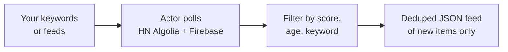
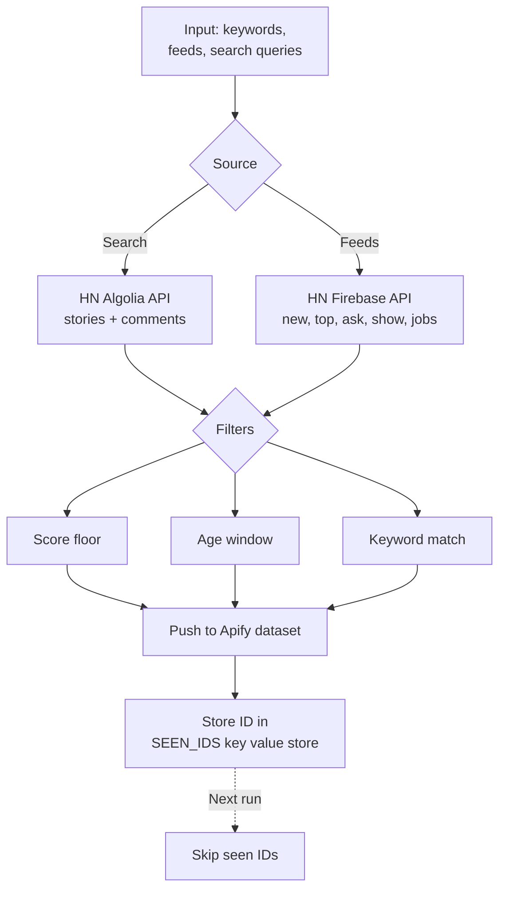
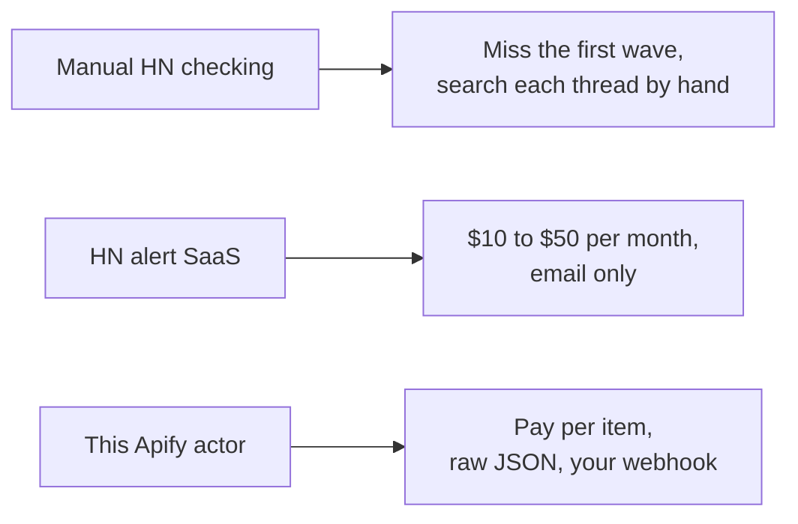

# Hacker News Intelligence: Monitor Show HN, Ask HN, and Keyword Mentions

Pull Hacker News stories and comments matching your keywords, score floor, and age window. Export item ID, title, body, author, URL, permalink, points, comment count, parent link, and timestamp to JSON, CSV, or Excel. Deduped across runs so you only see new items. No auth. No API key. Pay per item.

**Keywords this actor is built for:** Hacker News intelligence, HN API, Show HN monitor, Ask HN intelligence, HN keyword alert, Hacker News lead generation, HN Algolia API, pull Hacker News comments.

---

## What you get in 30 seconds



Paste a keyword. Pick a feed. Get a clean JSON feed of new matching HN stories and comments every run. That is the whole product.

---

## Who this HN intelligence is for

| You are a... | You use this to... |
|---|---|
| **Founder** | Alert on every Show HN in your category so you are in the thread before page two |
| **Devtool marketer** | Catch category keywords and reply in the first 30 minutes, when threads still gain traction |
| **Recruiter** | Pull "Who is Hiring" and "Seeking Freelancer" threads, filter by stack, route to ATS |
| **Market researcher** | Export Ask HN threads in your category and mine for onboarding pain |
| **DevRel engineer** | Spot every mention of your library before the "alternatives" branch takes over |

---

## How it works



1. Pass search queries, HN feeds (`new`, `top`, `ask`, `show`, `jobs`), or both.
2. Actor calls two official HN endpoints: Algolia for full text search, Firebase for raw feeds.
3. Results get filtered by keyword, score floor, comment count, and age.
4. Matching items land in the dataset.
5. Every item ID is stored in a key value store so future runs skip duplicates.

Schedule every 10 minutes on Apify Scheduler and you get a deduped stream of new matching items. No auth, no key, no OAuth. Both endpoints are public and rate limit friendly.

---

## Quick start

**Watch HN for vector database mentions, last 7 days:**

```json
{
  "searchQueries": ["vector database", "pinecone alternative"],
  "searchType": "both",
  "sortBy": "newest",
  "maxAgeHours": 168
}
```

**Catch every Show HN launch with 5+ points, last 24 hours:**

```json
{
  "feeds": ["show"],
  "maxAgeHours": 24,
  "minScore": 5,
  "maxItemsPerSource": 100
}
```

**Recruiter pull on "Who is Hiring", filter by stack:**

```json
{
  "searchQueries": ["who is hiring"],
  "searchType": "comments",
  "keywords": ["golang", "rust", "postgres"],
  "maxAgeHours": 720
}
```

Or run it from the command line:

```bash
curl -X POST "https://api.apify.com/v2/acts/scrapemint~hn-lead-monitor/run-sync-get-dataset-items?token=YOUR_TOKEN" \
  -H "Content-Type: application/json" \
  -d '{"searchQueries":["vector database"],"searchType":"both","maxAgeHours":168}'
```

---

## This intelligence vs the alternatives



| Feature | Manual checking | HN alert SaaS | This actor |
|---|---|---|---|
| Pricing | Free, costs time | $10 to $50 per month | Pay per item, first 50 per run free |
| Keyword cap | Unlimited | 5 to 20 per tier | Unlimited |
| Source coverage | Front page only | Search only | Search plus firehose feeds |
| Comment body pull | Manual read | Usually no | Yes, full text and parent link |
| Scheduling | You | Hourly | Every 1 minute |
| Dedup across runs | Your memory | Vendor owned | Yes, in your key value store |
| Output | Browser tab | Email or Slack | JSON, CSV, Excel, webhook, API |

---

## Sample output

One item record:

```json
{
  "itemId": "39847291",
  "itemType": "story",
  "title": "Show HN: Open source alternative to AppFollow",
  "text": "Hey HN, we built a free tool that pulls App Store reviews...",
  "url": "https://github.com/user/project",
  "permalink": "https://news.ycombinator.com/item?id=39847291",
  "author": "pg_fan_99",
  "points": 42,
  "numComments": 18,
  "parentId": null,
  "storyId": null,
  "createdAt": "2026-04-19T14:22:00.000Z",
  "tags": ["story", "show_hn"],
  "matchedKeywords": ["app store", "review"],
  "sourceKind": "search",
  "sourceValue": "app store review"
}
```

Every field ready to drop into a CRM, a Slack channel, or a Notion database.

---

## Pricing

First 50 items per run are free. After that you pay per extracted item. No seat licenses. No tier gating. A 500 item run lands under $1 on the Apify free plan.

---

## FAQ

**Does this pull all of Hacker News?**
Yes. The Algolia API indexes every story and comment ever posted. The Firebase feeds cover the current 500 newest, top, best, Ask HN, Show HN, and jobs lists.

**How fresh is the data?**
Algolia indexes new items within 30 to 90 seconds of posting. Firebase feeds update in real time.

**Is pulling HN allowed?**
Yes. The Algolia API is run by HN's search partner for programmatic access. The Firebase API is maintained by Y Combinator for the same reason. No rate limit, no key required.

**Does it return comment bodies?**
Yes. Set `searchType: "comments"` or `"both"`. Each comment row has the full HTML stripped body, the parent ID, and a link back to its story.

**Will it catch every Show HN?**
Set `feeds: ["show"]` with no keyword filter. You get every Show HN, filtered only by age and score.

**What about the "Who is Hiring" thread?**
Use `searchType: "comments"` and search `"who is hiring"`. Filter comments by stack keywords for a recruiter ready list.

**Does it dedupe?**
Yes. Item IDs are stored under `SEEN_IDS`. Every run skips seen IDs. Set `dedupe: false` to disable.

**Can I run it on a schedule?**
Yes. Apify Scheduler goes down to 1 minute. Pair with a webhook to push new matches to Slack, Discord, Notion, or a CRM.

---

## Related Scrapemint actors

- **GitHub Issue Monitor** for issue and PR tracking by keyword and repo
- **Stack Overflow Lead Monitor** for dev question tracking by tag
- **Reddit Lead Monitor** for subreddit and keyword mention tracking
- **Product Hunt Launch Tracker** for competitor launch monitoring
- **Upwork Opportunity Alert** for freelance lead generation
- **App Store Review Intelligence** for mobile apps on iOS and Android
- **Trustpilot Brand Reputation** for DTC and ecommerce brands
- **Google Reviews Intelligence** for local businesses
- **Amazon Review Intelligence** for product review mining

Stack these to cover every public developer and customer surface one brand touches.
