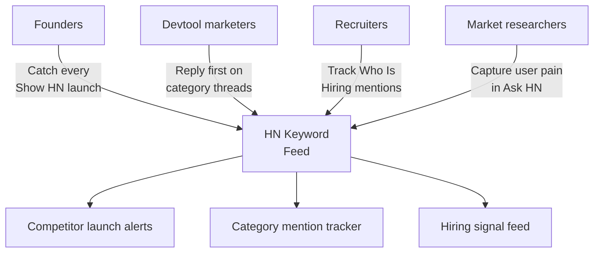
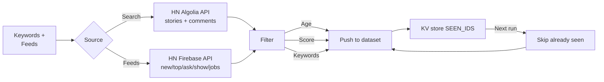
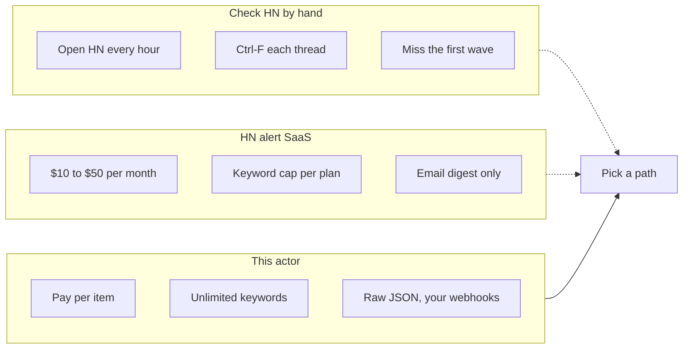

# Hacker News Scraper and Keyword Alert Monitor

Watch Hacker News for stories and comments that match your keywords, score floor, and age window. Export item ID, title, body, author, URL, permalink, points, comment count, and timestamp. Dedupes across runs so you only ever see new matches.

Built for founders who need to catch every "Show HN" in their category, devtool marketers who want to be first in the thread, recruiters tracking "Who is Hiring" and "Ask HN" signals, and market researchers who need raw HN data without scraping the site by hand.

---

## Who uses this Hacker News scraper



| Role | What this HN scraper unlocks |
|---|---|
| **Founder** | Alert when any competitor posts a Show HN, so you are in the thread before page two |
| **Devtool marketer** | Track your category keywords and reply in the first 30 minutes, when threads still get traction |
| **Recruiter** | Pull "Who is Hiring" and "Seeking Freelancer" threads, filter by stack, route to ATS |
| **Market researcher** | Export Ask HN threads matching your product category, mine for onboarding pain |
| **DevRel** | Spot every mention of your library and jump in before the "alternatives" thread branches |

---

## How the Hacker News scraper works



Pass a list of search queries, a set of HN firehose feeds (new, top, Ask HN, Show HN, jobs), or both. The actor calls two HN endpoints that Y Combinator runs officially:

1. **HN Algolia Search API** for full text search across every HN story and comment. Paginated, 100 results per page, up to 1000 total per query.
2. **HN Firebase API** for the raw firehose: `newstories`, `topstories`, `askstories`, `showstories`, `jobstories`. Up to 500 IDs per list.

Matches are filtered locally by your keywords, score floor, comment count, and age. Every item ID it pushes is stored in the key value store under `SEEN_IDS`. On the next run, already seen IDs are skipped. Schedule the actor every 10 minutes and you get a deduped feed of new matching items, nothing else.

No auth, no API key, no OAuth. Both endpoints are fully public and rate limit friendly.

---

## HN tools vs this scraper



| Feature | HN alert SaaS | This actor |
|---|---|---|
| Pricing | $10 to $50 per month, flat | Pay per item, first 50 per run free |
| Keyword cap | 5 to 20 per plan tier | Unlimited |
| Source coverage | Search only | Search plus full firehose feeds |
| Dedup across runs | Yes, vendor owned | Yes, in your own key value store |
| Scheduling | Hourly at best | Apify Scheduler every 1 minute |
| Output | Email or Slack | JSON, CSV, Excel, API, or webhook |
| Comment body pull | Usually no | Yes, full text and parent link |

---

## Quick start

Watch HN for any new story or comment that mentions your category. Algolia search, last 7 days:

```bash
curl -X POST "https://api.apify.com/v2/acts/scrapemint~hn-lead-monitor/run-sync-get-dataset-items?token=YOUR_TOKEN" \
  -H "Content-Type: application/json" \
  -d '{
    "searchQueries": ["vector database", "pinecone alternative"],
    "searchType": "both",
    "sortBy": "newest",
    "maxAgeHours": 168,
    "minScore": 0,
    "dedupe": true
  }'
```

Catch every Show HN launch, last 24 hours, 5+ points:

```json
{
  "feeds": ["show"],
  "keywords": [],
  "maxAgeHours": 24,
  "minScore": 5,
  "maxItemsPerSource": 100
}
```

Recruiter pull on the "Who Is Hiring" thread, filter by stack:

```json
{
  "searchQueries": ["who is hiring"],
  "searchType": "comments",
  "keywords": ["golang", "rust", "postgres"],
  "maxAgeHours": 720
}
```

---

## What one item record looks like

```json
{
  "itemId": "39847291",
  "itemType": "story",
  "title": "Show HN: Open source alternative to AppFollow",
  "text": "Hey HN, we built a free tool that pulls App Store reviews...",
  "url": "https://github.com/user/project",
  "permalink": "https://news.ycombinator.com/item?id=39847291",
  "author": "pg_fan_99",
  "points": 42,
  "numComments": 18,
  "parentId": null,
  "storyId": null,
  "createdAt": "2026-04-19T14:22:00.000Z",
  "tags": ["story", "show_hn"],
  "matchedKeywords": ["app store", "review"],
  "sourceKind": "search",
  "sourceValue": "app store review",
  "scrapedAt": "2026-04-19T19:30:00.000Z"
}
```

Every row: item ID, type (story or comment), title, body, URL, permalink, author, points, comment count, parent link for comments, created timestamp, matched keywords, and which query or feed surfaced it.

---

## Pricing

First 50 items per run are free. After that you pay per item extracted. No seat licenses. No tier gating. A 500 item run lands under $1 on the Apify free plan.

---

## FAQ

**Does this scrape all of Hacker News?**
Yes. The Algolia API covers every story and comment ever posted to HN. The Firebase feeds cover the current 500 newest, top, best, Ask HN, Show HN, and jobs lists.

**How fresh is the data?**
Algolia indexes new items within 30 to 90 seconds of posting. Firebase feeds update in real time.

**Is this allowed?**
Yes. The Algolia API is run by HN's search partner specifically for programmatic access. The Firebase API is maintained by Y Combinator for the same purpose. No rate limit, no key required.

**Does it return comment bodies?**
Yes. Set `searchType` to `comments` or `both`. Each comment row has the full body (HTML stripped), the parent ID, and a link back to its story.

**Does it dedupe?**
Yes. HN item IDs are stored in the key value store under `SEEN_IDS`. Every run skips IDs already seen. Set `dedupe: false` to disable.

**Can I run it on a schedule?**
Yes. Apify Scheduler lets you run every minute. Pair it with a webhook to push new matches into Slack, Discord, Notion, or your CRM.

**What about the "Who Is Hiring" and "Seeking Freelancer" threads?**
Use `searchType: comments` and search for `"who is hiring"` or `"seeking freelancer"`. Filter comments locally by stack keywords.

**Will it catch every Show HN?**
Set `feeds: ["show"]` with no keyword filter. You get every Show HN submission, filtered only by age and score.

---

## Related actors by Scrapemint

- **Reddit Lead Monitor** for subreddit and keyword mention tracking
- **Upwork Opportunity Alert** for freelance lead generation
- **Trustpilot Brand Reputation** for DTC and ecommerce brands
- **Google Reviews Intelligence** for local businesses
- **Amazon Review Intelligence** for product reviews and listings
- **App Store Review Scraper** for mobile apps on iOS and Android
- **Indeed Company Review Intelligence** for employer branding

Stack these to cover every public conversation surface one brand touches.
