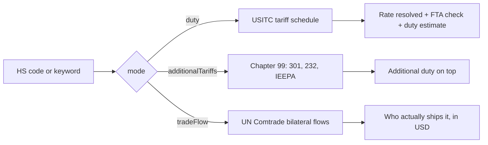

# Import Duty & Tariff Calculator, HS Code Lookup

Find out **what it actually costs to import something into the US**. Look up an HS code or a product name, get the duty rate that applies, check whether a trade agreement makes it cheaper, and estimate the duty on a real shipment value.

No login, no API key, no proxy. The actor reads the official keyless USITC Harmonized Tariff Schedule API and the keyless UN Comtrade API, so runs are fast and cheap.

## The problem this solves

The tariff schedule publishes duty rates on the **8-digit** subheading. The **10-digit** statistical lines underneath it, which are the ones you actually declare at entry, come back with their rate cells **empty** because they inherit from the line above.

So if you look up `8541.43.00.10` on its own, the honest answer from the raw data is "no duty rate", and that is the case for most of the tariff schedule. This actor walks the tree, resolves the inherited rate, and tells you on every row whether the rate was stated on that line or inherited from a parent:

```json
{
  "htsCode": "8541.43.00.10",
  "generalRateText": "Free",
  "generalRateSource": "inherited",
  "generalRateInheritedFrom": "8541.43.00"
}
```

## What you get

One row per tariff line.

| Field | Description |
| --- | --- |
| `htsCode` / `htsCodeDigits` | Dotted and digits-only form |
| `codeLevel` / `isStatisticalLine` | 4 heading, 6 international, 8 legal rate line, 10 US reporting line |
| `description` / `descriptionPath` / `fullDescription` | The line, its ancestry, and the two joined |
| `unitsOfQuantity` | Units you report at entry, e.g. `["No.", "W"]` |
| `generalRateText` | Normal trade relations rate as published, e.g. `Free`, `16.5%`, `90¢/pr. + 37.5%` |
| `generalRateAdValoremPct` | The percentage part, or `null` if the duty is not charged on value |
| `generalRateSpecific` / `generalRateIsCompound` | The per-unit part, and whether the rate has both |
| `generalRateSource` / `generalRateInheritedFrom` | `own` or `inherited`, and from which line |
| `column2RateText` / `column2RateAdValoremPct` | The rate for countries without normal trade relations |
| `specialPrograms` | Every trade agreement rate on the line, with its program code and name |
| `originEligiblePrograms` | The subset your origin country takes part in |
| `appliedColumn` / `appliedRateText` / `appliedAdValoremPct` | Which column applies and what it costs |
| `estimatedDutyUsd` / `estimatedLandedCostUsd` | Duty on your shipment value, and value plus duty |
| `dutyEstimateComplete` / `dutyEstimateNotes` | Whether the estimate is the whole bill, and what it leaves out |
| `excludesChapter99Tariffs` | Always `true`. See below |
| `scrapedAt` | Run timestamp, ISO 8601 |

### The estimate tells you when it cannot answer

A duty rate is not always a percentage. Roughly a fifth of the schedule is charged **per unit** (`86.5¢/kg`, `90¢/pr.`) or is **compound** (both). This actor is given a shipment value, not a weight or a piece count, so:

- **Ad valorem rate** → full estimate, `dutyEstimateComplete: true`.
- **Compound rate** → the percentage part is estimated, `dutyEstimateComplete: false`, and a note names the per-unit part that is still owed.
- **Per-unit rate only** → `estimatedDutyUsd` is `null`, never `0`, with a note saying why.

```json
{
  "htsCode": "0402.21.25.00",
  "generalRateText": "86.5¢/kg",
  "generalRateAdValoremPct": null,
  "estimatedDutyUsd": null,
  "dutyEstimateComplete": false,
  "dutyEstimateNotes": [
    "Rate \"86.5¢/kg\" is charged per unit of quantity, not on value. Estimating it needs the shipment weight or piece count, which this actor is not given."
  ]
}
```

Reporting `0` there would tell you the goods enter duty free when they do not.

### Section 301, Section 232 and IEEPA are not in the general rate

They are codified in **Chapter 99** and applied **on top** of the rate above. Every duty row carries `excludesChapter99Tariffs: true` so the number is never mistaken for the whole bill. Run the actor in `additionalTariffs` mode to read those headings directly:

```json
{
  "htsCode": "9903.01.01",
  "description": "Except for products described in headings 9903.01.02 ... articles the product of Mexico",
  "rateText": "The duty provided in the applicable subheading + 25%",
  "additionalAdValoremPct": 25,
  "isNoAdditionalDuty": false
}
```

Which goods a Chapter 99 heading covers is written in prose in the US notes to the subchapter, so read the heading text before relying on it.

## Modes



## Input

| Field | Description |
| --- | --- |
| `mode` | `duty` (default), `additionalTariffs`, or `tradeFlow` |
| `hsCodes` | Codes with or without dots: `8541`, `8541.43.00`, `8541430010`. A 4-digit heading returns every line under it |
| `keyword` | Product search, e.g. `solar panel`. In `additionalTariffs` mode this filters Chapter 99 by country or product text |
| `originCountry` | ISO2 of where the goods are made, e.g. `CN`, `MX`, `DE`. Decides which column applies |
| `shipmentValueUsd` | Customs value. Adds the duty estimate and landed cost |
| `forceColumn` | `auto` (default), `general`, `special` or `other`, to compare columns directly |
| `includeStatisticalLines` | Include 10-digit lines (default `true`) |
| `reporterCountry` / `partnerCountry` / `year` / `flow` | Trade flow mode only |
| `maxRows` | Stop after N rows (default 200) |

## Examples

**What do I pay on $50,000 of solar panels from Mexico?**

```json
{ "hsCodes": ["8541.43.00"], "originCountry": "MX", "shipmentValueUsd": "50000" }
```

**What is the duty on sneakers from China vs Korea?**

```json
{ "hsCodes": ["6404.11.79"], "originCountry": "CN", "shipmentValueUsd": "20000" }
```

```json
{
  "htsCode": "6404.11.79",
  "generalRateText": "90¢/pr. + 37.5%",
  "appliedColumn": "general",
  "appliedAdValoremPct": 37.5,
  "estimatedDutyUsd": 7500,
  "estimatedLandedCostUsd": 27500,
  "dutyEstimateComplete": false,
  "dutyEstimateNotes": [
    "Rate \"90¢/pr. + 37.5%\" is compound. This covers only the 37.5% ad valorem part; the 90¢/pr. per-unit part is additional.",
    "Excludes Chapter 99 tariffs (Section 301, Section 232, IEEPA), merchandise processing fee and harbor maintenance fee."
  ]
}
```

Switch `originCountry` to `KR` and the same line comes back `appliedColumn: "special"` at `Free` under KORUS.

**Find the code for a product by name**

```json
{ "keyword": "lithium battery", "maxRows": 50 }
```

**Who ships this to the US, and how much?**

```json
{ "mode": "tradeFlow", "hsCodes": ["854143"], "reporterCountry": "US", "year": 2023 }
```

```json
{
  "partnerName": "World",
  "isWorldAggregate": true,
  "hsCode": "854143",
  "tradeValueUsd": 19272735842,
  "netWeightKg": 3795667103.38,
  "netWeightIsEstimated": true
}
```

The `World` row is an aggregate that sits alongside the bilateral rows, so it is flagged rather than left to double count your totals.

## Who it's for

Importers and ecommerce sellers pricing landed cost before they commit to a supplier, customs brokers and freight forwarders classifying goods, sourcing teams comparing origin countries under tariff changes, and equity analysts modelling the margin hit on companies that import.

## Pricing

Pay per row. The first 3 rows of every run are free so you can validate the output before you pay. Commercial trade databases charge $500 or more per month for the same lookups.

## Limits worth knowing

- **This is not customs advice.** Classification is a legal determination. Use it to narrow candidates and price scenarios, then confirm the code with a broker or a CBP ruling.
- **Trade agreement eligibility is not a ruling.** `originEligiblePrograms` means the country takes part in that program. Qualifying also needs the agreement's rules of origin, which the tariff schedule does not publish. Every row says so.
- **Some programs need active authorization.** GSP and ATPA codes stay printed in the schedule after the authorization lapses, so entries under them carry `requiresActiveAuthorization: true`. Check the program is live before claiming it.
- **Cross references are not rates.** A special entry reading `See 9822.04.15 (AU)` states its rate in another heading. Those come back flagged `isCrossReference: true` with a `null` rate, not as duty free.
- **Comtrade runs about two years behind** and reports at the 6-digit level, so 8 and 10-digit codes are truncated before the query. Its public endpoint also does not carry every commodity code: some return no rows for any reporting country. When that happens the run logs a warning and returns nothing rather than inventing a zero.
- A missing value is always `null`, never `0`.

## Related products

- **[US Treasury Rates](https://apify.com/scrapemint/us-treasury-rates-scraper)** and **[Treasury Auction Results](https://apify.com/scrapemint/treasury-auction-results)** for the rates side of the macro picture
- **[Federal Register Monitor](https://apify.com/scrapemint/federal-register-monitor)** to catch new Section 301 and IEEPA actions the day they publish
- **[Government Tender Finder](https://apify.com/scrapemint/government-tender-finder)** and **[World Bank Projects & Tenders](https://apify.com/scrapemint/world-bank-projects-tenders)** for public procurement
- **[Company Data Worldwide](https://apify.com/scrapemint/company-data-worldwide)** to enrich the suppliers you find in trade flow mode
