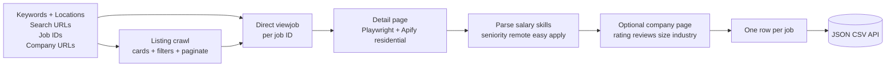
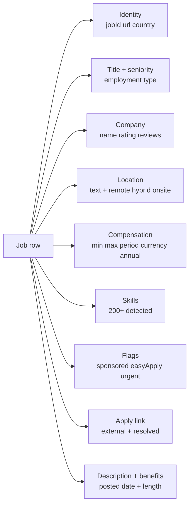

# Indeed Jobs Scraper Pro: Search, Salaries & Company Intel

Scrape Indeed jobs from keywords, search URLs, direct job IDs, or company pages. Each row ships parsed salary, skills, seniority tier, remote/hybrid signal, Easy Apply flag, sponsored flag, and optional company enrichment with rating, reviews, size, industry, and founded year. 18 countries. Pay per row.

**Built for** sales teams sourcing leads at hiring companies, recruiters benchmarking salary bands, talent acquisition tracking competitor reqs, market research firms watching hiring trends, BI teams piping job market data into a warehouse, and lead-gen platforms enriching company records with active req counts.

**Keywords this actor ranks for:** indeed scraper, indeed jobs scraper, indeed scraper api, indeed job listings, indeed salary scraper, indeed company scraper, indeed jobs to JSON, indeed lead finder, hiring intent signals, recruiting intelligence, job board scraper, indeed scraping tool.

---

## Why this actor

| Other Indeed scrapers | **This actor** |
|---|---|
| Single search URL input | Four input modes: keywords + locations, search URLs, direct job IDs, company pages |
| Title and link only | Parsed salary into min, max, period, currency, and normalized annual estimate |
| No skills detection | 200+ tech and business skills detected from the description |
| US only | 18 countries with proper regional domains |
| No seniority tagging | Auto classified into intern, entry, mid, senior, lead, principal, staff, manager, director, vp, c level |
| No remote signal | Parses location and description to flag remote, hybrid, or on site |
| No company enrichment | Optional company rating, review count, size band, industry, founded year |
| Sponsored mixed with organic | Sponsored vs organic flag on every row |
| Single nationwide search | Optional split by city across the country's top metros for high volume runs |

---

## How it works



Pages render with Playwright behind rotating residential proxy with browser fingerprinting and per-session homepage warmup. Cloudflare interstitials resolve automatically.

---

## What you get per row



Toggle on `scrapeCompanyDetails` and the run also pushes one company row per unique employer with rating, review count, size band, industry, founded year, headquarters, revenue, and website.

---

## Quick start

**Search keywords across multiple locations**

```json
{
  "keywords": ["software engineer", "data engineer"],
  "locations": ["New York, NY", "Boston, MA", "Remote"],
  "country": "US",
  "maxJobs": 200,
  "datePosted": "7",
  "remoteFilter": "remote"
}
```

**Direct job IDs for fast lookup**

```json
{
  "jobIds": ["abc123def456", "789ghi012jkl"],
  "country": "US",
  "scrapeCompanyDetails": true
}
```

**Track a single company's catalog**

```json
{
  "companyUrls": ["https://www.indeed.com/cmp/Anthropic"],
  "maxJobs": 50,
  "extractSkills": true,
  "scrapeCompanyDetails": true
}
```

**Multi country (UK + Germany + India)**

```json
{
  "keywords": ["product manager"],
  "country": "GB",
  "locations": ["London", "Manchester"],
  "maxJobs": 100,
  "datePosted": "14",
  "scrapeCompanyDetails": true
}
```

**Nationwide split across top US cities**

```json
{
  "keywords": ["machine learning engineer"],
  "country": "US",
  "splitByCity": true,
  "maxJobs": 500,
  "remoteFilter": "any",
  "minSalary": 150000
}
```

---

## Sample output

```json
{
  "jobId": "abc123def456",
  "url": "https://www.indeed.com/viewjob?jk=abc123def456",
  "country": "US",
  "title": "Senior Product Manager, AI Platform",
  "company": {
    "name": "Anthropic",
    "indeedUrl": "https://www.indeed.com/cmp/Anthropic",
    "slug": "Anthropic",
    "ratingStars": 4.6,
    "reviewCount": 142
  },
  "location": {
    "text": "San Francisco, CA · Hybrid",
    "workMode": "hybrid"
  },
  "employment": {
    "type": "fulltime",
    "seniority": "senior"
  },
  "compensation": {
    "rawText": "$220,000 - $280,000 a year",
    "currency": "USD",
    "period": "year",
    "min": 220000,
    "max": 280000,
    "annualEstimate": 280000,
    "isEstimated": false,
    "isListed": true
  },
  "flags": {
    "sponsored": false,
    "easyApply": true,
    "urgentlyHiring": false
  },
  "applyLink": {
    "external": "https://anthropic.com/careers/...",
    "resolved": null
  },
  "skills": ["python", "sql", "saas", "b2b", "product management", "agile", "okrs"],
  "benefitsText": "401(k), Health insurance, Paid time off",
  "descriptionLength": 4128,
  "postedDateText": "3 days ago",
  "postedDate": "2026-04-24T18:22:00.000Z",
  "searchContext": {
    "keyword": "product manager",
    "location": "San Francisco, CA"
  },
  "scrapedAt": "2026-04-27T18:00:00.000Z"
}
```

---

## Who uses this

| Role | Use case |
|---|---|
| Sales / lead gen | Companies hiring SDRs, AEs, or marketers signal growth. Build prospect lists from active reqs. |
| Recruiter | Watch competitor reqs. Salary benchmarking by title and city. |
| Talent acquisition | Track who is hiring for the same roles you are. Adjust comp bands monthly. |
| Market researcher | Hiring pulse by industry, region, and seniority tier. Top-down growth signal. |
| BI / data team | Pipe job catalog into Snowflake or BigQuery. Each row API ready. |
| Career coach | Salary calibration for clients across cities and titles. |
| Recruitment agency | Source candidates by detecting urgent hires and Easy Apply jobs. |

---

## Input reference

| Field | Type | What it does |
|---|---|---|
| `keywords` | string[] | Position or skill keywords. |
| `locations` | string[] | Cities, states, countries. Cartesian product with keywords. |
| `country` | enum | 18 country domains. |
| `searchUrls` | string[] | Paste any Indeed search URL directly. |
| `jobIds` | string[] | Direct jk= IDs. Fastest input mode. |
| `companyUrls` | string[] | Indeed `/cmp/...` URLs. |
| `maxJobs` | integer | Cap on jobs across all queries. |
| `datePosted` | enum | any, 1, 3, 7, 14 days. |
| `jobType` | enum | fulltime, parttime, contract, temporary, internship. |
| `experienceLevel` | enum | entry_level, mid_level, senior_level. |
| `remoteFilter` | enum | remote, hybrid, onsite. |
| `minSalary` | integer | Minimum salary in local currency. |
| `radius` | integer | Search radius in miles (0, 5, 10, 15, 25, 50, 100). |
| `splitByCity` | boolean | Fan a nationwide search across top metros. |
| `scrapeCompanyDetails` | boolean | Pull rating, reviews, size, industry, founded year per company. |
| `extractSkills` | boolean | Detect 200+ tech and business skills. |
| `parseSalary` | boolean | Convert salary text into structured fields. |
| `classifySeniority` | boolean | Tag intern through C level. |
| `detectEasyApply` | boolean | Flag Indeed Easy Apply jobs. |
| `detectRemoteHybrid` | boolean | Set workMode based on location and description. |
| `followApplyRedirect` | boolean | Resolve external Apply URL through Indeed's redirect chain. |
| `dedupe` | boolean | Skip job IDs from previous runs. |
| `concurrency` | integer | Parallel pages. Three to five is safe. |
| `proxyConfiguration` | object | Apify proxy. Residential is required for Indeed. |

---

## API call

```bash
curl -X POST \
  "https://api.apify.com/v2/acts/YOUR_USER~indeed-jobs-scraper/runs?token=YOUR_TOKEN" \
  -H "Content-Type: application/json" \
  -d '{
    "keywords": ["data engineer"],
    "locations": ["San Francisco, CA", "Remote"],
    "country": "US",
    "maxJobs": 100,
    "datePosted": "7",
    "scrapeCompanyDetails": true
  }'
```

---

## Pricing

The first few jobs per run are free so you can validate the output before paying. After that, one charge per job row. Skills detection, seniority classification, salary parsing, and remote signal are all included at no extra cost. Company enrichment adds one charge per unique company.

---

## FAQ

### What is the difference between this and the official Indeed Publisher API?

Indeed sunset the public Publisher API in 2023. The current options are unofficial scraping or partner-tier deals at $100K+ per year. This actor reads HTML any anonymous web visitor sees, with no key required, no quota, and 18 country domains.

### Why does Indeed block scrapers?

Indeed sits behind Cloudflare with aggressive bot detection. The actor uses fingerprinted Chrome with rotating residential proxies, per-session homepage warmup, and Cloudflare interstitial resolution. Most challenges resolve within two retries.

### Can I scrape salaries that Indeed estimates?

Yes. The `compensation.isListed` flag tells you whether the employer listed the salary or whether Indeed estimated it. Both ship with min, max, period, currency, and a normalized annual estimate.

### How accurate is the seniority classifier?

Title based, deterministic, eleven tiers. Catches "Sr.", "Jr.", "Lead", "Staff", "Principal", "Manager", "Director", "VP", "Head of", "Chief" patterns plus localized variants. False positives are rare; misses come from unusual title styles.

### Does it handle multi country searches?

Yes. Pass any of 18 country codes and the actor switches to that regional domain (uk.indeed.com, de.indeed.com, in.indeed.com, etc.). Salary parsing detects the local currency automatically.

### Can it pull every job from a single company?

Yes. Pass the company's Indeed `/cmp/CompanyName` URL in `companyUrls`. The actor walks the company's job list and returns every posting up to `maxJobs`.

### What is the splitByCity option?

Indeed caps each search at about 1000 results. For large nationwide pulls, enable `splitByCity` and the actor expands the query across the country's top metro areas, multiplying total reach.

### Is Indeed scraping legal?

This actor reads HTML any anonymous web visitor can see. Respect Indeed's terms and rate limit sensibly. Do not use scraped contact info for unsolicited messaging in jurisdictions where that violates law.

---

## Related actors

- **LinkedIn Jobs Scraper Pro & Recruiter Contacts**. Search URL, company URL, and recruiter contact extraction.
- **HackerNews Lead Monitor**. Alerts for hiring threads matching your skills.
- **Upwork Opportunity Alert**. Live alerts for new freelance jobs matching your stack.
- **Stack Overflow Lead Monitor**. Detect technical questions from buyers in your niche.
- **Website Content Crawler**. Companies websites to clean Markdown with token counts.
- **Amazon Product Scraper**. Product catalog for ecommerce ops teams.
