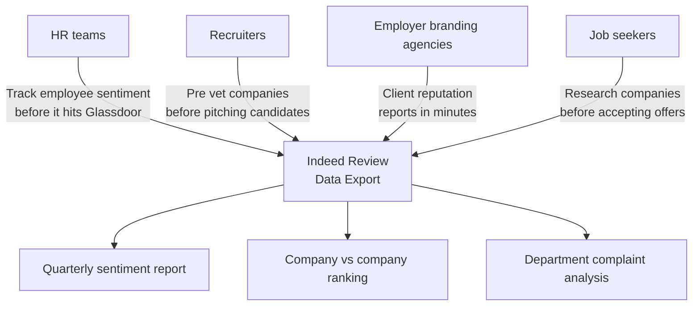
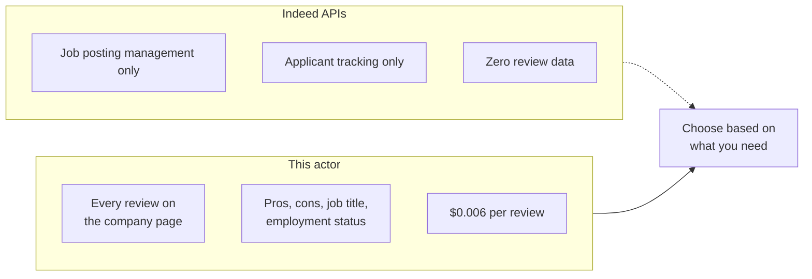
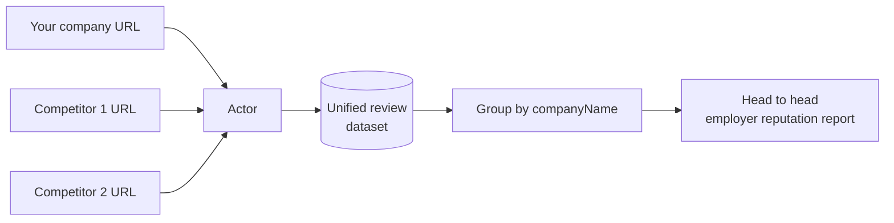
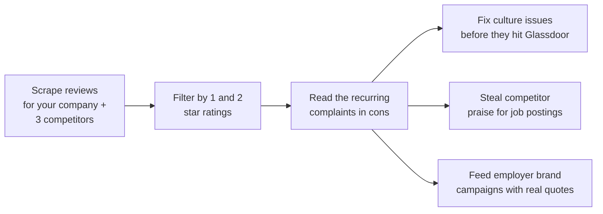
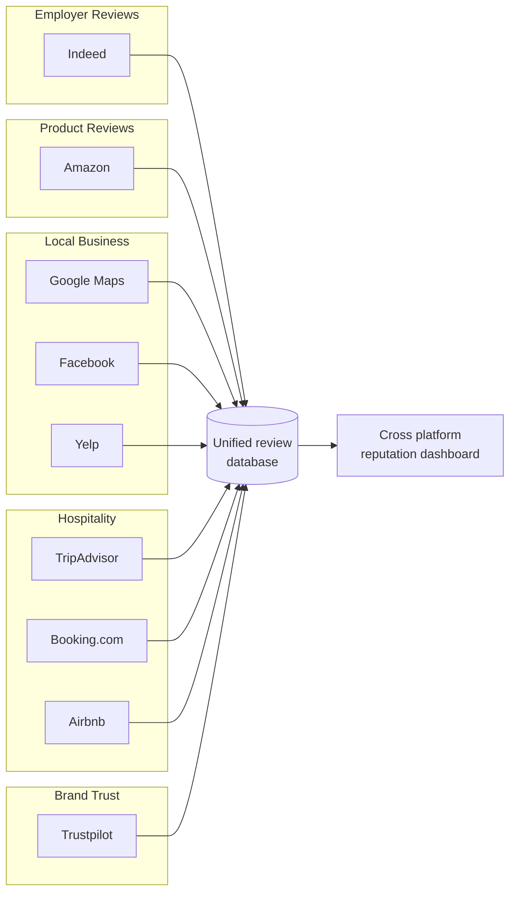

# Indeed Company Review Scraper and Export Tool for Employer Reviews

Export every Indeed company review into a clean JSON, CSV, or Excel file. Pull star ratings, review titles, pros, cons, job titles, employment status (current or former employee), locations, dates, helpful vote counts, and employer responses for any company on Indeed.

Built for HR teams, recruiters, employer branding agencies, talent acquisition leaders, and job seekers who need Indeed review data without reading hundreds of pages by hand or paying $30 per month for a subscription scraper.

---

## Who uses this Indeed review scraper



| Role | What the export unlocks |
|---|---|
| **HR team** | Every 1 and 2 star review with pros and cons so you can spot culture problems by department |
| **Recruiter** | Side by side company comparison when pitching candidates on competing offers |
| **Employer branding agency** | Pull 10 client companies in one session, generate reputation reports from one file |
| **Talent acquisition leader** | Track your employer brand vs 5 competitors over time with scheduled runs |
| **Job seeker** | Export all reviews for a company, filter by your job title, read the real story |

---

## How the Indeed review export works


The actor opens each Indeed company review page in a real browser, parses the server rendered HTML directly, and extracts structured data from each review card. It paginates through `?start=N` (20 reviews per page) with built in delays to stay under Cloudflare rate limits.

---

## Indeed has no public API for reviews



| Feature | Indeed official APIs | This actor |
|---|---|---|
| Review data | Not available | Full review history |
| Pros and cons | Not available | Separate structured fields |
| Job title per review | Not available | Yes |
| Employment status | Not available | Current or former employee |
| Employer responses | Not available | Yes |
| Helpful vote count | Not available | Yes |
| Price | Enterprise pricing | $0.006 per review, first 50 free |

---

## Quick start

Export recent reviews for one company:

```bash
curl -X POST "https://api.apify.com/v2/acts/scrapemint~indeed-review-intelligence/run-sync-get-dataset-items?token=YOUR_TOKEN" \
  -H "Content-Type: application/json" \
  -d '{
    "companyUrls": [
      { "url": "https://www.indeed.com/cmp/Google/reviews" }
    ],
    "maxReviews": 200,
    "sortBy": "NEWEST"
  }'
```

Compare your company against 2 competitors, pulling only 1 and 2 star reviews:

```json
{
  "companyUrls": [
    { "url": "https://www.indeed.com/cmp/Google/reviews" },
    { "url": "https://www.indeed.com/cmp/Microsoft/reviews" },
    { "url": "https://www.indeed.com/cmp/Amazon-com/reviews" }
  ],
  "maxReviews": 200,
  "filterByRating": "1"
}
```

Pull only the most helpful reviews sorted by votes:

```json
{
  "companyUrls": [
    { "url": "https://www.indeed.com/cmp/Tesla/reviews" }
  ],
  "maxReviews": 100,
  "sortBy": "MOST_HELPFUL"
}
```

---

## What one review record looks like

```json
{
  "rating": 4,
  "reviewTitle": "Great engineering culture but work life balance varies",
  "pros": "Smart coworkers, interesting projects, good compensation, free food and perks",
  "cons": "Long hours during launch periods, promotion process can feel opaque",
  "reviewText": null,
  "jobTitle": "Software Engineer",
  "employmentStatus": "Current Employee",
  "location": "Mountain View, CA",
  "reviewDate": "March 12, 2026",
  "helpfulCount": 23,
  "hasCompanyResponse": false,
  "companyResponseText": null,
  "companyName": "Google",
  "companyIndustry": "Internet & Technology",
  "companySize": "10,000+ employees",
  "companyLocation": "Mountain View, CA",
  "overallRating": 4.3,
  "totalReviewCount": 42156,
  "sourceUrl": "https://www.indeed.com/cmp/Google/reviews",
  "scrapedAt": "2026-04-17T10:15:33.221Z"
}
```

Pros and cons are separate fields so you can analyze them independently. Filter pros for what employees love, filter cons for recurring complaints. Every record also carries the company metadata for easy grouping across multi company exports.

---

## Inputs

| Field | Type | Default | What it does |
|---|---|---|---|
| `companyUrls` | array | `[]` | Indeed company review page URLs |
| `companyUrl` | string | `null` | Single URL shortcut |
| `maxReviews` | integer | `200` | Hard cap per company. Controls cost. |
| `sortBy` | string | `NEWEST` | `NEWEST`, `HIGHEST_RATED`, `LOWEST_RATED`, `MOST_HELPFUL` |
| `filterByRating` | string | `""` | Only return reviews with this star rating (`1`, `2`, `3`, `4`, or `5`) |
| `proxyConfiguration` | object | Residential | Apify proxy settings. Indeed uses Cloudflare. |

---

## Pricing

Pay per review. Free tier lets you verify the output before spending anything.

| Tier | Price | Best for |
|---|---|---|
| Free | First 50 reviews per run | Verifying the output format |
| Standard | $0.006 per review | Ongoing monitoring and benchmarking |

2,000 reviews across 5 companies: **$11.70 once**. Employer reputation SaaS tools: $200 to $500 per month. The main competitor on the Apify Store charges $30 per month as a flat subscription.

---

## Benchmark employers in one run



Every record includes `companyName`, `companyIndustry`, and `overallRating`, so grouping in Excel, Sheets, or a BI tool takes seconds. Filter by `jobTitle` to compare how engineers rate your company vs the competition.

---

## From reviews to employer brand decisions



---

## Common workflows

- **Quarterly employer brand audit.** Schedule this actor on your own company page every quarter. Pull all reviews. Track how pros and cons shift over time. Spot department problems before they become attrition.
- **Competitive talent intelligence.** Pull your company plus 5 talent competitors. Filter by engineering, sales, or any role. See what employees praise about the rival that you don't offer yet.
- **Recruiter pre vetting.** Before pitching a candidate on a company, pull the latest 50 reviews. Filter by their role. Send the candidate a summary of what real employees say.
- **Agency reporting.** Pull 10 client companies in one session. Build a quarterly employer reputation report for each from the same dataset.
- **Job seeker research.** Export all reviews for a company you're considering. Filter by your target role and location. Read the real story, not the careers page.

---

## Cross platform review pipeline



Feed Indeed employer reviews into the same pipeline as Google, Amazon, Yelp, and six other platforms. One export format across all nine actors, so your BI tool or spreadsheet can rank reputation across every review source.

---

## Related tools in the review intelligence suite

* [**Google Reviews Intelligence**](https://apify.com/scrapemint/google-reviews-intelligence): Google Maps reviews with full history export
* [**Amazon Review Intelligence**](https://apify.com/scrapemint/amazon-review-intelligence): Amazon product reviews across 10 marketplaces
* [**Facebook Review Intelligence**](https://apify.com/scrapemint/facebook-review-intelligence): Facebook business page recommendations
* [**Yelp Review Intelligence**](https://apify.com/scrapemint/yelp-review-intelligence): Yelp reviews with elite reviewer tracking
* [**TripAdvisor Review Intelligence**](https://apify.com/scrapemint/tripadvisor-review-intelligence): hotel, restaurant, and attraction reviews
* [**Booking Review Intelligence**](https://apify.com/scrapemint/booking-review-intelligence): hotel guest reviews with sentiment scores
* [**Trustpilot Brand Reputation**](https://apify.com/scrapemint/trustpilot-brand-reputation): brand trust scores and verification status
* [**Airbnb Market Intelligence**](https://apify.com/scrapemint/airbnb-market-intelligence): rental pricing and guest review data

Nine actors covering Indeed, Amazon, Google, Facebook, Yelp, TripAdvisor, Booking, Trustpilot, and Airbnb. Product reviews, employer reviews, local business reviews, and hospitality reviews in one suite.

---

## Frequently asked questions

**How do I scrape Indeed company reviews into a CSV or Excel file?**
Run this actor with an Indeed company review page URL and a review cap. Export the dataset as CSV or Excel from the Apify console or pull it via the API.

**Is there an Indeed API that returns company reviews?**
No. Indeed's official APIs cover job posting management and applicant tracking only. They do not expose company review data. This actor scrapes the public review pages directly.

**How do I export Indeed reviews for my company?**
Paste your company's Indeed review page URL into `companyUrls`. The actor loads every review page, extracts ratings, pros, cons, job titles, and employment status, and exports the full dataset.

**How do I monitor my employer brand on Indeed?**
Schedule this actor on the Apify platform to run weekly or quarterly. Each run exports your latest reviews. Diff against the previous export to catch shifts in employee sentiment.

**Can I compare multiple companies in one run?**
Yes. Pass every URL in `companyUrls`. Every record includes `companyName` and `companyIndustry` for easy grouping and ranking.

**Can I filter by job title or department?**
The exported data includes a `jobTitle` field for each review. Filter the dataset by job title in your spreadsheet or BI tool to analyze sentiment for specific roles.

**How do I find only negative Indeed reviews?**
Set `filterByRating` to `1` or `2` to pull only reviews with that star rating. Or export all reviews and filter by the `rating` field afterward.

**What is the difference between pros and cons fields?**
Indeed reviews have separate "Pros" and "Cons" sections. This actor exports them as two independent fields so you can analyze what employees like and dislike separately.

**How many reviews can I get per company?**
Indeed shows up to 1,000 reviews per company through their public pages. Set `maxReviews` to control the cap.

**How fresh is the data?**
Live at query time. Every run pulls straight from Indeed.

**Why residential proxies?**
Indeed uses Cloudflare protection. Datacenter proxies get challenged within a few requests. Residential proxies keep runs clean, and the actor ships with residential defaults.

**What does "Attention Required" or "Just a moment" mean in the logs?**
Cloudflare detected the request as suspicious and served a challenge page. Switch to residential proxies in the input. The actor logs a warning and skips the blocked page.

**How do I download Indeed reviews to Excel?**
Run the actor, then open your dataset in the Apify console. Click "Export" and choose Excel. You get one row per review with all fields: rating, pros, cons, job title, employment status, location, date, and helpful votes.

**Can I track Indeed review sentiment over time?**
Schedule the actor to run weekly or monthly. Each run captures a `scrapedAt` timestamp. Append each export to your master file and chart average ratings, pros keywords, or cons keywords over time to spot trends.

**How are Indeed reviews different from Glassdoor reviews?**
Indeed reviews split feedback into separate "Pros" and "Cons" fields, include helpful vote counts, and show employer responses. This actor exports all of those as structured data. Glassdoor reviews are on a different platform and require a separate tool.
