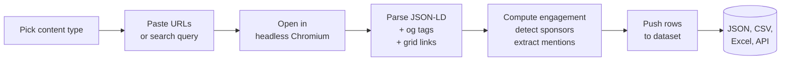
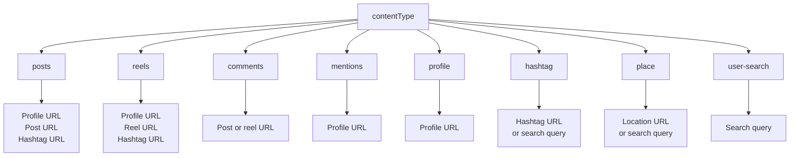
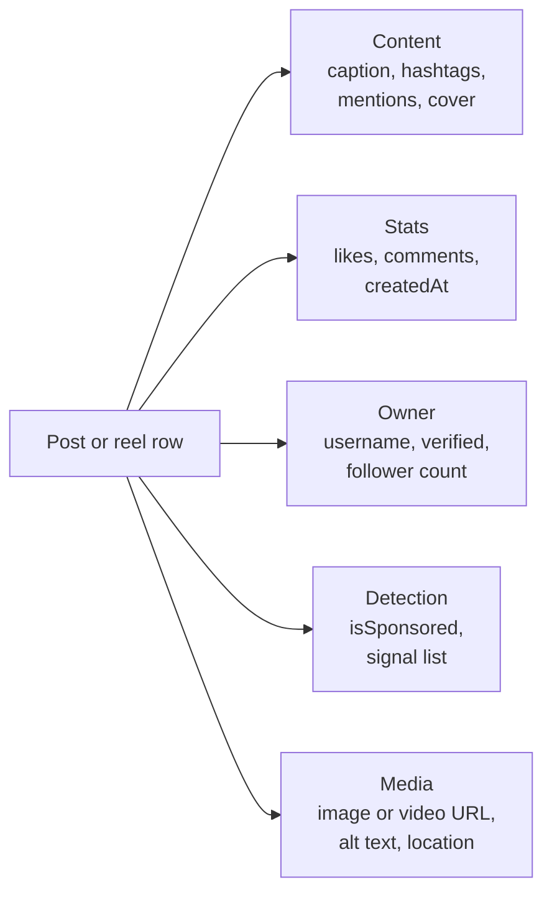

# Instagram Influencer Analyzer & Sponsored Post Tracker

Rank Instagram creators by real engagement rate. Flag sponsored and paid partnership posts. Track mentions of your brand across every profile, post, reel, and comment. Eight content types in one actor: posts, reels, comments, mentions, profiles, hashtags, places, user search. Every profile row ships with engagement rate and posting cadence. Every post row ships with a sponsored content flag. One clean JSON row per item. Pay only for what you keep.

Built for talent agencies, brand marketers, ad intelligence teams, FTC compliance auditors, and PR teams who need Instagram data without the official Graph API gate.

**Ranks for:** Instagram influencer analyzer, Instagram influencer finder, Instagram creator analytics, Instagram engagement rate calculator, Instagram sponsored post tracker, Instagram sponsored post detector, Instagram brand monitoring, Instagram paid partnership audit, Instagram influencer database, Instagram scraper, Instagram API alternative, Instagram API free, scrape Instagram posts, Instagram profile scraper, Instagram follower count, Instagram hashtag tracker, Instagram reels scraper, Instagram comments scraper, Instagram to CSV, Instagram to JSON.

---

## What makes this different

Most Instagram scrapers stop at raw data. This one computes the answers buyers actually want:

1. **Engagement rate and posting cadence** on every profile row. Average likes, average comments, engagement rate as a percent of followers, and posts per week. Ready for agency decks and influencer databases. Zero post processing.
2. **Sponsored post detection** on every post row. Flags `#ad`, `#sponsored`, `#paidpartnership`, Instagram's paid partnership label, and brand tag patterns. Returns a boolean plus the signal list. Perfect for ad intelligence and FTC compliance monitoring.
3. **One actor, every content type.** Posts, reels, comments, mentions, profile info, hashtag volume, place details, user search. No juggling five separate scrapers.

---

## How it works



Pick one of eight content types in the dropdown. Drop matching Instagram URLs or enter search terms. The actor walks each page, reads embedded structured data, and returns one row per result.

---

## 8 content types in one actor



---

## What works today

| Content type | Status | Input | What you get |
|---|---|---|---|
| `profile` | Reliable | Profile URL | Username, full name, bio, followers, following, post count, verified flag, recent posts sample, engagement rate, posts per week. |
| `posts` | Reliable | Profile URL | Post rows from the profile grid: caption, likes, comments, hashtags, mentions, media URL, sponsored flag. |
| `reels` | Reliable | Profile URL or reel URL | Same fields as posts plus kind reel. |
| `comments` | Reliable | Post or reel URL | Author, text, profile URL per comment. |
| `mentions` | Reliable | Profile URL | Ranked list of @ mentions from a profile's recent posts with count and post references. |
| `hashtag` | Limited | Hashtag URL or query | Instagram restricts anonymous hashtag pages. Expect partial data without a session. |
| `place` | Limited | Location URL or query | Same restriction as hashtag pages. |
| `user-search` | Limited | Search query | Anonymous topsearch often returns empty results. |

> **Best practice:** most agencies run `profile` with a list of creator URLs, get engagement rates out of the box, then run `posts` on the winners for deeper caption and media data.

---

## Quick start

**Creator audit with engagement rate:**

```json
{
  "contentType": "profile",
  "urls": [
    "https://www.instagram.com/humansofny/",
    "https://www.instagram.com/natgeo/"
  ],
  "resultsLimit": 30,
  "includeEngagementMetrics": true
}
```

**Track sponsored posts for a creator:**

```json
{
  "contentType": "posts",
  "urls": ["https://www.instagram.com/kyliejenner/"],
  "resultsLimit": 50,
  "detectSponsoredPosts": true
}
```

**Scrape comments for a single post:**

```json
{
  "contentType": "comments",
  "urls": ["https://www.instagram.com/p/SHORTCODE/"],
  "resultsLimit": 200
}
```

**Find brands a creator tags most:**

```json
{
  "contentType": "mentions",
  "urls": ["https://www.instagram.com/chrissyteigen/"],
  "resultsLimit": 25
}
```

---

## Sample output

Per profile row with engagement metrics:

```json
{
  "type": "profile",
  "id": "17841401870966586",
  "username": "humansofny",
  "fullName": "Humans of New York",
  "biography": "Stories of people on the streets of New York.",
  "verified": true,
  "followers": 12400000,
  "following": 8,
  "postsCount": 9200,
  "profilePicUrl": "https://scontent.cdninstagram.com/...",
  "engagement": {
    "avgLikes": 184000,
    "avgComments": 3200,
    "engagementRate": 1.511,
    "postsPerWeek": 2.4,
    "sampleSize": 30
  },
  "scrapedAt": "2026-04-24T12:00:00.000Z"
}
```

Per post row with sponsored detection:

```json
{
  "type": "post",
  "id": "CxYz123abc",
  "shortcode": "CxYz123abc",
  "url": "https://www.instagram.com/p/CxYz123abc/",
  "caption": "loving this hydrator from @glossier #ad",
  "hashtags": ["ad"],
  "mentions": ["glossier"],
  "likes": 42180,
  "comments": 1822,
  "createdAt": "2026-04-22T18:11:00.000Z",
  "ownerUsername": "someuser",
  "locationName": "New York, New York",
  "image": "https://scontent.cdninstagram.com/...",
  "isSponsored": true,
  "sponsorSignals": ["#ad"]
}
```

Per mention row:

```json
{
  "type": "mention",
  "sourceProfile": "chrissyteigen",
  "mentionedUsername": "cravingsbychrissy",
  "count": 14,
  "posts": [
    { "id": "Cabc", "url": "https://www.instagram.com/p/Cabc/", "createdAt": "2026-04-20T10:00:00.000Z" }
  ]
}
```

---

## What you get per row



---

## Who uses this

| Role | Use case |
|---|---|
| Talent agency | Rank creators by real engagement rate, not vanity follower counts. |
| Brand marketer | Monitor branded hashtag reach and UGC volume. |
| Social listening | Feed posts and comments into sentiment and share of voice models. |
| Ad intelligence | Track competitor sponsored posts with isSponsored flag. |
| FTC compliance | Audit paid partnership disclosures across a creator roster. |
| PR and crisis team | Watch mentions of a brand or public figure in near real time. |
| Data journalist | Pull structured Instagram data for investigations. |
| E commerce ops | Find creators tagging your brand and measure their audience overlap. |

---

## Input reference

| Field | Type | Purpose |
|---|---|---|
| `contentType` | enum | What to scrape. Drives URL and query parsing. |
| `urls` | string[] | Instagram URLs. Priority over queries. |
| `searchQueries` | string[] | Keywords for hashtag, place, or user search. |
| `resultsLimit` | integer | Cap per URL or query. Default 100. |
| `filterByDate` | string | `YYYY-MM-DD` or `7 days ago`. UTC. |
| `includeEngagementMetrics` | boolean | Compute avg likes, avg comments, engagement rate, posts per week. |
| `detectSponsoredPosts` | boolean | Flag `#ad`, `#sponsored`, `#paidpartnership`, partnership labels. |
| `downloadMedia` | boolean | Save images and videos to the key value store. |
| `scrapeCommentsPerPost` | integer | Top N comments per post. 0 disables. |
| `includeMediaMetadata` | boolean | Add dimensions, alt text, tagged location. |
| `dedupe` | boolean | Skip IDs from previous runs. |
| `maxItemsTotal` | integer | Hard cap across all sources. Default 500. |
| `proxyConfiguration` | object | Apify proxy. Residential recommended. |

---

## API example

```bash
curl -X POST \
  "https://api.apify.com/v2/acts/YOUR_USER~instagram-scraper/runs?token=YOUR_TOKEN" \
  -H "Content-Type: application/json" \
  -d '{
    "contentType": "profile",
    "urls": ["https://www.instagram.com/humansofny/"],
    "resultsLimit": 30
  }'
```

---

## How this compares

|  | Official Instagram Graph API | Generic Instagram scrapers | **This actor** |
|---|---|---|---|
| Access | App review + business verification | Per actor setup | Anyone |
| Engagement rate | You calculate it | Separate tool | Built in |
| Sponsored post flag | No | Separate tool | Built in |
| All content types | Partial | Need 4 to 6 actors | One actor |
| Cost model | Per call quota | Often per run | Pay per result row |
| Setup time | Weeks | Days | 60 seconds |

---

## Pricing

First 2 items per run are free so you can try before paying. After that you pay per result row. Engagement metrics, sponsored detection, mention rollups, and hashtag arrays are included at no extra cost. Media downloads and comment scraping add a small per unit cost when enabled.

---

## FAQ

**Is there a free Instagram API?**
Instagram's Graph API is gated behind app review and a verified business account. This actor gives anyone public Instagram data with pay per use and no app approval needed.

**How do I scrape Instagram without an API key?**
Pick a content type, paste profile or post URLs, hit Start. Residential proxy and fingerprint rotation are handled.

**How do you calculate Instagram engagement rate?**
Engagement rate is the average of (likes + comments) per recent post divided by follower count, expressed as a percentage. The actor samples up to `resultsLimit` recent posts from the profile grid. Industry standard is 1 to 3 percent for mid tier creators and under 1 percent for mega creators.

**How accurate is the sponsored post flag?**
High precision on caption signals (`#ad`, `#sponsored`, `#paidpartnership`, paid partnership labels) and moderate precision on brand tag heuristics. Treat it as a fast filter, not a legal determination.

**Can I download Instagram photos and videos?**
Yes. Turn on `downloadMedia`. Each row includes a `downloadUrl` link to the source media.

**Can I scrape Instagram comments?**
Yes. Use `contentType: comments` with a post or reel URL, or set `scrapeCommentsPerPost` on a posts or reels run.

**Why do hashtag and place searches sometimes return empty?**
Instagram restricts anonymous access to hashtag and location pages. Use profile URLs for reliable results. Hashtag volume and top posts come back when Instagram serves the page to signed out visitors, which varies by region and IP reputation.

**Does it work for private accounts?**
No. Only public profiles, posts, reels, hashtags, and places that Instagram exposes to signed out visitors.

**Can I run this on a schedule?**
Yes. Use the Apify scheduler for hourly, daily, or weekly runs. Turn `dedupe` off if you want a fresh snapshot for trend tracking.

**Does it work in any country?**
Yes. The actor ships with residential proxy rotation. Your results reflect what a visitor in the proxy region sees.

**Is scraping Instagram allowed?**
This actor reads public HTML any web visitor can see. Respect Instagram's terms and rate limit sensibly. Do not store or redistribute content you do not have the right to use.

---

## Related actors

- **Reddit Lead Monitor: Subreddit and Keyword Alert Feed** for subreddit mentions and high intent leads
- **Google Maps Scraper** for local business data and reviews
- **TripAdvisor Review Intelligence** for hotel and restaurant review monitoring
