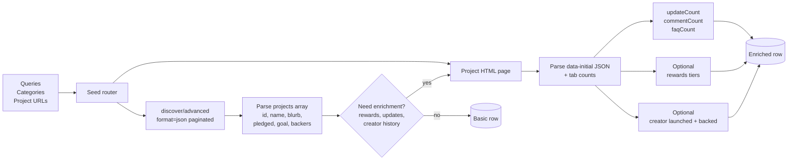
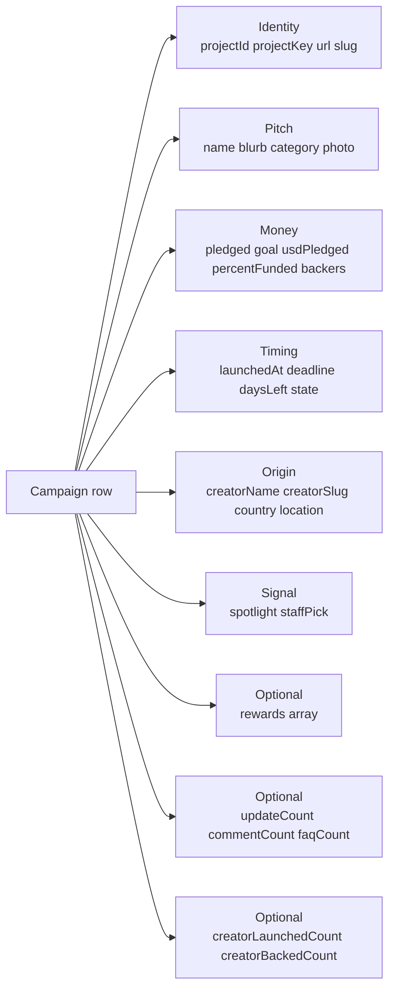

# Kickstarter Campaign Intelligence: Live Funding, Backer Velocity, Trend Alerts

Track live and recently funded Kickstarter campaigns at scale. Each row carries the campaign identity, blurb, category, creator, country, pledge totals, backer counts, funding percent, launch date, deadline, days left, spotlight and staff pick flags, and source filter context. Optional enrichment adds full pledge reward tiers, update counts, comment counts, FAQ counts, and creator history (lifetime launched + backed). Pay per campaign row.

**Built for** product scouts at brands sourcing white label opportunities, manufacturers hunting for products to license, trend hunters watching category breakouts, e-commerce founders studying competitive launches, hardware VCs scoring early stage deal flow, supply chain teams tracking demand signals before retail, agencies pitching crowdfunding clients, and analysts building category reports for trade publications.

**Keywords this actor ranks for:** kickstarter api, kickstarter scraper, crowdfunding intelligence, kickstarter campaign tracker, crowdfunding deal flow, kickstarter trend tracker, kickstarter live campaigns, kickstarter funding tracker, kickstarter alert, kickstarter category report, crowdfunding market research, kickstarter competitor analysis, hardware deal flow, product scouting tool.

---

## Why this actor

| Other crowdfunding tools | **This actor** |
|---|---|
| Kicktraq, BackerKit Launch: $99 to $500 per month per seat | Pay per row scraped. No seat license. |
| Manual Kickstarter discover page browsing | Structured JSON one row per campaign. |
| All time only | Filter by state: live, successful, failed, canceled, upcoming. |
| English / US only | Filter by country code or pull worldwide. |
| Top level data only | Optional pledge tier extraction with price, backers per tier, delivery dates, shipping options. |
| Drop creator context | Optional creator history fetch returns lifetime launched and backed counts. |
| No category filter | Filter by any of 15 Kickstarter top categories. |
| No funding threshold filter | Filter by minimum percent funded, minimum backers, minimum USD pledged. |

---

## How it works



The discover JSON endpoint returns up to 12 projects per page with funding totals, deadlines, creator, category, and country. We seed one URL per (state, category, term, country) combination and paginate until `has_more` is false or the cap is reached. Enrichment toggles trigger one extra request per campaign for pledge tiers, update counts, or creator history.

---

## What you get per row



Use `projectKey` (creator slug + project slug) as the canonical identifier across reissues. Use `projectId` for raw Kickstarter ID joins.

---

## Quick start

**Daily watchlist of live tech campaigns above 100 percent funded**

```json
{
  "categories": ["technology"],
  "states": ["live"],
  "minPercentFunded": 100,
  "sort": "most_funded",
  "maxCampaigns": 50
}
```

**Successful games campaigns launched in the last 30 days, with reward tiers**

```json
{
  "categories": ["games"],
  "states": ["successful"],
  "launchedAfterDays": 30,
  "fetchRewards": true,
  "maxCampaigns": 100
}
```

**Search term across all states**

```json
{
  "queries": ["smart home", "modular desk"],
  "states": ["live", "successful"],
  "sort": "most_backed",
  "maxCampaigns": 100
}
```

**Direct project URLs with full enrichment**

```json
{
  "projectUrls": [
    "https://www.kickstarter.com/projects/creator/slug-one",
    "https://www.kickstarter.com/projects/creator/slug-two"
  ],
  "fetchRewards": true,
  "fetchUpdates": true,
  "fetchCreator": true
}
```

**Country filter: live design campaigns from Japan**

```json
{
  "categories": ["design"],
  "states": ["live"],
  "country": "JP",
  "maxCampaigns": 100
}
```

**Upcoming campaigns (prelaunch) for early scouting**

```json
{
  "categories": ["technology", "design"],
  "states": ["upcoming"],
  "sort": "newest",
  "maxCampaigns": 100
}
```

---

## Sample output

```json
{
  "projectId": "1234567890",
  "projectKey": "ledgerco/modular-edc-wallet",
  "name": "Modular EDC Wallet",
  "slug": "modular-edc-wallet",
  "blurb": "A titanium card wallet that adapts to your daily carry. RFID safe. Lifetime warranty.",
  "url": "https://www.kickstarter.com/projects/ledgerco/modular-edc-wallet",
  "projectPath": "/projects/ledgerco/modular-edc-wallet",
  "state": "live",
  "country": "US",
  "countryName": "United States",
  "currency": "USD",
  "currencySymbol": "$",
  "pledged": 248530.12,
  "goal": 25000,
  "usdPledged": 248530.12,
  "percentFunded": 994.1,
  "backers": 3214,
  "spotlight": false,
  "staffPick": true,
  "launchedAt": "2026-04-18T16:00:00.000Z",
  "deadline": "2026-06-02T16:00:00.000Z",
  "daysLeft": 18,
  "createdAt": "2026-03-29T20:00:00.000Z",
  "stateChangedAt": "2026-04-18T16:00:00.000Z",
  "category": "Product Design",
  "categorySlug": "design/product-design",
  "parentCategory": "Design",
  "creatorId": 9876543,
  "creatorName": "Ledger Co",
  "creatorSlug": "ledgerco",
  "creatorUrl": "https://www.kickstarter.com/profile/ledgerco",
  "photo": "https://ksr-ugc.imgix.net/.../modular-edc-wallet-hero.jpg",
  "location": "Brooklyn, NY",
  "sourceState": "live",
  "sourceCategorySlug": "design",
  "sourceTerm": null,
  "updateCount": 8,
  "commentCount": 412,
  "faqCount": 14,
  "rewards": [
    {
      "id": "reward-1",
      "title": "Early Bird Single Wallet",
      "priceText": "$59",
      "priceUsd": 59,
      "description": "One Modular EDC Wallet in your choice of titanium finish.",
      "backers": 412,
      "limitText": "Limited (88 left of 500)",
      "estimatedDelivery": "Aug 2026",
      "shipping": "Ships worldwide"
    }
  ],
  "creatorLaunchedCount": 3,
  "creatorBackedCount": 47,
  "scrapedAt": "2026-05-15T10:00:00.000Z"
}
```

---

## Who uses this

| Role | Use case |
|---|---|
| Product scout | Find white label candidates by category + percent funded. Outreach to creators near goal. |
| Manufacturer | Track design and tech campaigns. Pitch fulfillment when creators hit funding. |
| Trend hunter | Weekly digest of breakout categories. Watch "spotlight + staffPick" for editorially flagged winners. |
| E-commerce founder | Study competitor launches in your niche. Reverse engineer pricing ladders from reward tiers. |
| Hardware VC | Hardware deal flow by category + funding velocity. Filter for proven creators via creator history. |
| Supply chain analyst | Demand signal feed for early stage products. Forecast retail launches 6 to 12 months out. |
| Agency | Pitch crowdfunding services to live campaigns under 50 percent funded. |
| Trade publisher | Build category report data: median goal, median backers, top creators per quarter. |
| Backer scout | Track campaigns from creators with strong launched history (creatorLaunchedCount above 2). |

---

## Input reference

| Field | Type | What it does |
|---|---|---|
| `queries` | string[] | Free text Kickstarter search terms. Example: ["smart home", "board game"]. |
| `categories` | string[] | Top level category slugs. Empty means all categories. |
| `projectUrls` | string[] | Direct kickstarter.com project URLs. Skips discovery, jumps to enrichment. |
| `states` | string[] | Lifecycle states: live, successful, failed, canceled, submitted, upcoming. |
| `sort` | enum | magic, popularity, newest, end_date, most_funded, most_backed. |
| `country` | string | ISO 3166-1 alpha-2 country code. Empty means worldwide. |
| `minPercentFunded` | integer | Floor on funding percent. 100 means fully funded only. |
| `minBackers` | integer | Floor on backer count. |
| `minPledgedUsd` | integer | Floor on USD pledged amount. |
| `launchedAfterDays` | integer | Only campaigns launched within last N days. 0 disables. |
| `fetchRewards` | boolean | Pull full reward tiers per campaign. One extra request per row. |
| `fetchUpdates` | boolean | Pull update / comment / FAQ counts per campaign. |
| `fetchCreator` | boolean | Pull creator lifetime launched and backed counts. |
| `maxCampaigns` | integer | Hard cap on rows per run. 0 means unlimited. |
| `maxPagesPerSeed` | integer | Pages of 12 results to walk per seed combo. |
| `dedupe` | boolean | Skip project IDs already pushed in previous runs. |
| `navigationDelayMs` | integer | Pause between requests. 1500 to 4000 ms is safe. |
| `concurrency` | integer | Parallel HTTP requests. Keep at 2 to 4 unless on residential pool. |
| `proxyConfiguration` | object | Apify proxy. Datacenter for low volume, residential past a few hundred requests. |

---

## API call

```bash
curl -X POST \
  "https://api.apify.com/v2/acts/YOUR_USER~kickstarter-campaign-tracker/runs?token=YOUR_TOKEN" \
  -H "Content-Type: application/json" \
  -d '{
    "categories": ["technology", "design"],
    "states": ["live"],
    "sort": "most_funded",
    "minPercentFunded": 100,
    "fetchRewards": true,
    "maxCampaigns": 100
  }'
```

---

## Pricing

The first 5 campaign rows per run are free so you can validate the schema before paying. After that, one charge per campaign row regardless of how many enrichment fields you turn on. Rewards, update counts, and creator history are included at no extra per row charge.

---

## FAQ

### Do I need a Kickstarter account?

No. The actor only touches public HTML and the public discover JSON endpoint that any anonymous web visitor can see.

### How is this different from Kicktraq?

Kicktraq charges a monthly subscription per seat and locks data behind a UI. This actor pushes structured JSON straight to your warehouse with no per seat license. Pay per row.

### Which campaign states are supported?

Six: live (taking pledges now), successful (funded and closed), failed (closed unfunded), canceled, submitted (pending review), upcoming (prelaunch page live). Combine in one run.

### Can I track a campaign's funding over time?

Run the actor on an Apify schedule and store snapshots. The dataset will have one row per scrape per campaign, keyed on `projectId`. Plot `pledged`, `backers`, `percentFunded` over time.

### How do I get reward tier data?

Set `fetchRewards: true`. Each campaign row will include a `rewards[]` array with title, price, USD price, description, backer count, limit text, estimated delivery, and shipping summary.

### How fresh is the data?

Each run hits the live Kickstarter discover endpoint and project pages. Funding totals, backer counts, and deadlines reflect what Kickstarter shows at scrape time.

### Will Kickstarter block me?

The actor uses Apify residential proxy by default with a 2 second navigation delay. Datacenter IPs are accepted for low volume runs. Past a few hundred requests in a short window Kickstarter throttles datacenter ranges. Residential rotates per request.

### Can I filter to a specific country?

Yes. Set `country: "US"`, `country: "GB"`, `country: "DE"`, `country: "JP"`, etc. ISO 3166-1 alpha-2 codes.

### Does it cover prelaunch (upcoming) pages?

Yes. Pass `states: ["upcoming"]` to scout campaigns before they go live. The prelaunch row has `launchedAt: null` and `deadline: null` but carries the creator and category for early outreach.

### How do I find proven creators?

Combine `fetchCreator: true` with a filter on `creatorLaunchedCount >= 2` after the run. Repeat creators raise more on average and are more likely to deliver. You can also filter by `staffPick: true` for editorially flagged campaigns.

### Can I deduplicate across runs?

Yes. `dedupe: true` (default) skips project IDs already pushed in previous runs of the same actor instance. The state lives in a named key value store. Turn off to refresh stale rows on a daily schedule.

---

## Related actors

- **ProductHunt Launch Tracker**. Pair Kickstarter funding signals with ProductHunt launch data for full product launch coverage.
- **Amazon Product Scraper**. Pipe funded Kickstarter products into Amazon search to see who is already shipping the category.
- **Etsy Listings & Seller Intel**. Cross check Kickstarter design and crafts campaigns against Etsy comp listings.
- **GitHub Trending Scraper**. Catch software side of crowdfunding: many Kickstarter tech projects have an open source repo.
- **HN Lead Monitor**. Track Hacker News mentions of breakout campaigns for early buyer signal.
- **Reddit Lead Monitor**. Same applied to Reddit. r/Kickstarter, r/Gadgets, and category subreddits surface early product chatter.
- **Lead Enrichment Pipeline**. Pipe creator emails (when public) through the enrichment pipeline for direct outreach lists.
