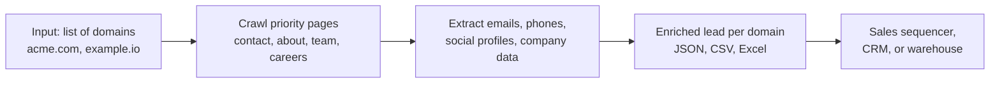
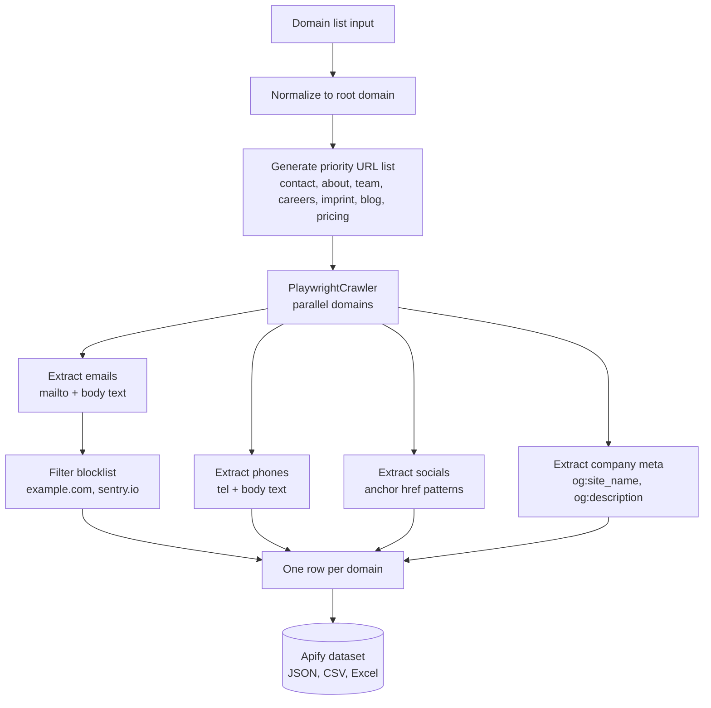

# Lead Enrichment Pipeline: Domain to Emails, Phones, Socials, and Company Data

Turn a list of company domains into a clean lead file. Per domain you get every email and phone number we can find on the public site, every social profile (LinkedIn, Twitter, Instagram, Facebook, YouTube, GitHub, TikTok), and company signals (name, tagline, has blog, has careers page, has pricing page). One row per domain. Pay per enriched result.

**Built for** sales teams, BD reps, and agencies running cold outbound at volume. Drop a list of 500 domains in, get back a CSV with contact data ready to paste into your sequencer.

---

## What you get in 30 seconds



Paste a domain list. Get one enriched lead per domain. No subscription, no monthly seat fees, no credit math.

---

## Who this is for

| Role | What you use it for |
|---|---|
| **SDR / outbound rep** | Enrich a fresh ZoomInfo or Apollo export with the contact emails published on each company site |
| **BD lead at an agency** | Build a 5,000 row prospect file from a list of target accounts in one run |
| **Founder doing manual outbound** | Skip the $99 a month Hunter subscription, pay per result |
| **RevOps team** | Pipe new SFDC accounts through this actor for daily contact refresh |
| **Recruiter** | Source agency partners by pulling careers and contact pages across a target list |

---

## Pricing vs typical alternatives

| Tool | Plan | Effective price per enriched contact |
|---|---|---|
| Hunter.io | Starter, 500 searches per month, $49 | $0.098 |
| Snov.io | Starter, 1,000 credits per month, $39 | $0.039 |
| Apollo | Basic, 1,200 credits per year on free tier, paid tiers credit gated | varies |
| Clearbit / Reveal | Custom contracts | $$$ |
| **This actor** | Pay per result, no subscription | **$0.06** |

Pay only for results we return. Unreachable domains are free, and so is the first enriched lead of every run, so you can try a domain you know before committing a list. Domains with no contacts found cost $0.01 (a sixth of an enriched result).

---

## Sample output

```json
{
  "domain": "acme.com",
  "url_canonical": "https://www.acme.com/",
  "company": {
    "name": "Acme Corp",
    "tagline": "Tools that ship work, not meetings",
    "description": "Acme builds collaboration software for distributed product teams.",
    "linkedin_url": "https://www.linkedin.com/company/acme",
    "github_org": "https://github.com/acme"
  },
  "emails": [
    { "value": "hello@acme.com", "source_url": "https://www.acme.com/contact", "context": "mailto" },
    { "value": "press@acme.com", "source_url": "https://www.acme.com/about", "context": "page text" }
  ],
  "phones": [
    { "value": "+1 415 555 0143", "source_url": "https://www.acme.com/contact", "context": "tel" }
  ],
  "socials": {
    "linkedin": "https://www.linkedin.com/company/acme",
    "twitter": "https://x.com/acme",
    "instagram": null,
    "facebook": "https://www.facebook.com/acmecorp",
    "youtube": null,
    "github": "https://github.com/acme",
    "tiktok": null
  },
  "tech_signals": {
    "has_blog": true,
    "has_careers_page": true,
    "has_pricing_page": true
  },
  "pages_scanned": 6,
  "scraped_at": "2026-05-07T18:42:11.421Z"
}
```

---

## How it works



The actor crawls a fixed priority list of paths (`/`, `/contact`, `/about`, `/team`, `/careers`, `/imprint`, plus tech signal pages like `/blog` and `/pricing`). It stops once `maxPagesPerDomain` is hit. Domains run in parallel via the configured concurrency. Robots.txt is obeyed by default.

---

## Input fields

| Field | Type | Default | Notes |
|---|---|---|---|
| `domains` | array of strings | required | Plain domains or full URLs. Up to 10,000 per run. |
| `maxPagesPerDomain` | integer | 8 | Cap on pages crawled per domain. Range 1 to 25. |
| `includeSocialDiscovery` | boolean | true | Pull LinkedIn, Twitter, IG, FB, YT, GitHub, TikTok URLs. No extra requests. |
| `includeCompanyData` | boolean | true | Pull name, tagline, description from homepage meta tags. |
| `obeyRobotsTxt` | boolean | true | Skip pages disallowed in robots.txt. |
| `navigationDelayMs` | integer | 1500 | Polite delay between page loads. |
| `concurrency` | integer | 4 | Parallel domains. Range 1 to 20. |
| `proxyConfiguration` | object | Apify proxy on | Residential proxies recommended for protected sites. |

---

## Run it from the API

```bash
curl -X POST "https://api.apify.com/v2/acts/scrapemint~lead-enrichment-pipeline/runs?token=YOUR_TOKEN" \
  -H "Content-Type: application/json" \
  -d '{
    "domains": ["stripe.com", "linear.app", "vercel.com"],
    "maxPagesPerDomain": 6
  }'
```

Result is written to the run's default dataset. Pull it as JSON, CSV, or Excel:

```bash
curl "https://api.apify.com/v2/datasets/RUN_DATASET_ID/items?format=csv&token=YOUR_TOKEN" > leads.csv
```

---

## Why we built it

Every other lead enrichment tool we looked at locks contact data behind a $49 to $99 monthly subscription, then makes you reason about credits. If you only need to enrich 200 domains this month, you do not want a 1,000 credit per month plan. Pay per result is the right shape for spiky, project based outbound work.

The output is intentionally raw. We do not score, we do not guess emails using `firstname.lastname@domain` patterns, and we do not invent data. Everything in the output came from a real public page on the company's own site.

---

## What this actor does NOT do (yet)

- **Email pattern guessing.** No `first.last@domain` synthesis. Guessed emails are spam grade and tank deliverability for buyers.
- **Person level enrichment.** This is company level. For named contact lookup at a target company, see Apollo or Hunter for now.
- **LinkedIn page scraping.** We discover the LinkedIn company URL from the target site's links. We do not crawl LinkedIn itself, which gets accounts banned.
- **Phone number validation.** Phones are returned as found. Validate with a separate tool before dialing if compliance matters.

---

## Cross sell

Pair this actor with:

- **Website Content Crawler** for full text content of every page on each domain
- **GitHub Issue Monitor** to track when target accounts publish new code or issues
- **HN Lead Monitor** to catch the moment a target account posts on Show HN

---

## Compliance posture

Everything we extract is data the target company already publishes on its public website. We obey robots.txt by default. We do not crawl LinkedIn, Facebook, or any other platform that requires authentication. If a buyer plans to use the output for cold email in EU jurisdictions, they remain responsible for GDPR compliant outreach (legitimate interest, opt out, etc.). This actor is a data extraction tool, not a sender.
