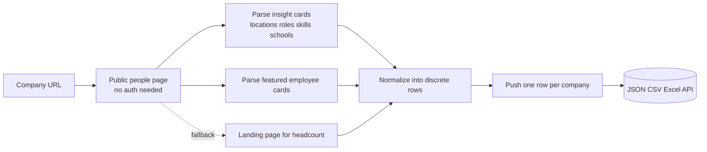
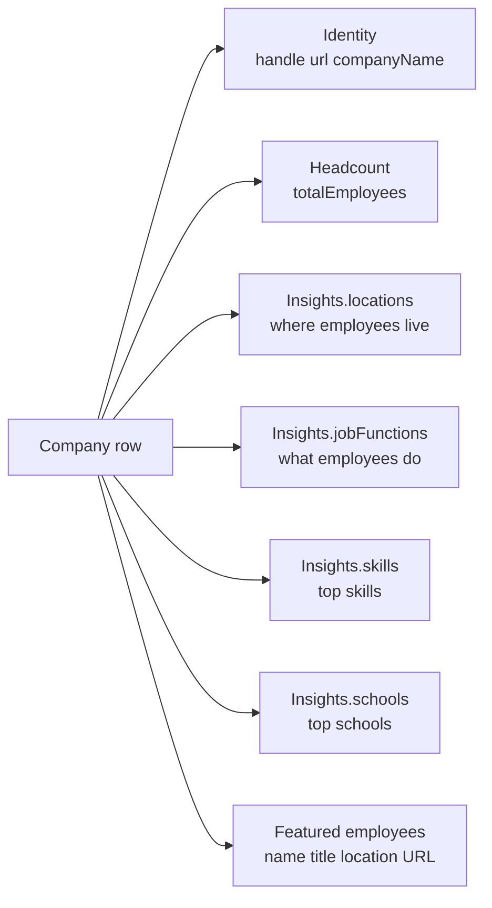

# LinkedIn Company Employees Intelligence (No Login Required)

Pull public employee insights from any LinkedIn company page. No cookies. No login. No Sales Navigator seat. Each row ships the total headcount, distributions of employees by location, role, top skill, and top school, plus any employee profile cards LinkedIn renders to anonymous visitors. Pay per company.

**Built for** B2B sales teams, recruiters, sourcers, agencies, and competitive intel pipelines that need fast workforce snapshots for prospecting, talent mapping, and account research.

**Keywords this actor ranks for:** linkedin company employees intelligence, linkedin headcount tracker, linkedin people insights api, linkedin talent mapping, linkedin workforce intelligence, linkedin employee distribution, linkedin company size intelligence, linkedin people search no login, sourcing linkedin employees, linkedin top skills by company, linkedin top schools by company, account research linkedin.

---

## Why this actor

| Other LinkedIn employee scrapers | **This actor** |
|---|---|
| Need your session cookie | Zero cookies, zero login |
| Risk your account on every run | Touches only public surfaces |
| Return raw HTML blobs | Distributions parsed into discrete rows with counts |
| Drop featured employee cards | Featured profile cards shipped with name, title, location, URL |
| Charge per profile inspected | Charge per company, get the whole snapshot |

---

## How it works



The actor hits the public people page first. If LinkedIn gates that surface for your IP, it falls back to the company landing page and pulls total headcount and company name from public meta tags. No cookie passes through the actor at any stage.

---

## What you get per row



Pipe straight into a sourcing tool, a CRM enrichment job, or a talent map.

---

## Quick start

**Talent map a target account list**

```json
{
  "companyUrls": [
    "https://www.linkedin.com/company/microsoft/",
    "https://www.linkedin.com/company/openai/",
    "https://www.linkedin.com/company/anthropic/"
  ]
}
```

**Sales prospecting (skip insights to keep rows lean)**

```json
{
  "companyUrls": ["https://www.linkedin.com/company/stripe/"],
  "includeInsights": false,
  "includeFeaturedEmployees": true
}
```

**Recruiter research (every distribution, every featured profile)**

```json
{
  "companyUrls": [
    "https://www.linkedin.com/company/perplexity-ai/",
    "https://www.linkedin.com/company/mistralai/"
  ],
  "includeInsights": true,
  "includeFeaturedEmployees": true
}
```

---

## Sample output

```json
{
  "handle": "openai",
  "kind": "company",
  "url": "https://www.linkedin.com/company/openai/people/",
  "companyUrl": "https://www.linkedin.com/company/openai/",
  "companyName": "OpenAI",
  "totalEmployees": 3200,
  "insights": {
    "locations": [
      { "label": "San Francisco Bay Area", "count": 1820 },
      { "label": "New York City Metropolitan Area", "count": 240 },
      { "label": "London Area, United Kingdom", "count": 180 }
    ],
    "jobFunctions": [
      { "label": "Engineering", "count": 1450 },
      { "label": "Research", "count": 520 },
      { "label": "Operations", "count": 310 }
    ],
    "skills": [
      { "label": "Machine Learning", "count": 920 },
      { "label": "Python", "count": 880 },
      { "label": "Deep Learning", "count": 640 }
    ],
    "schools": [
      { "label": "Stanford University", "count": 210 },
      { "label": "UC Berkeley", "count": 140 }
    ]
  },
  "featuredEmployees": [
    {
      "name": "Sam Altman",
      "title": "CEO at OpenAI",
      "location": "San Francisco, California",
      "profileUrl": "https://www.linkedin.com/in/samaltman/",
      "photoUrl": "https://media.licdn.com/dms/image/..."
    }
  ],
  "scrapedAt": "2026-05-09T10:00:00.000Z"
}
```

---

## Who uses this

| Role | Use case |
|---|---|
| B2B sales | Score target accounts by engineering vs sales headcount before outreach |
| Recruiter | Surface top schools and skills for sourcing lookalike candidates |
| Sourcer | Map talent footprint by city to plan local outreach campaigns |
| Founder | Track competitor hiring trends and team composition over time |
| Investor | Read engineering ratio, location split, and growth signals into a watchlist |
| ABM lead | Cluster accounts by skill and function for tiered outbound plays |

---

## Input reference

| Field | Type | What it does |
|---|---|---|
| `companyUrls` | string[] | LinkedIn company, school, or showcase URLs. Required. |
| `includeInsights` | boolean | Keep the locations, jobFunctions, skills, and schools distributions. Default true. |
| `includeFeaturedEmployees` | boolean | Keep the featured employee cards array. Default true. |
| `concurrency` | integer | Companies processed in parallel. Six is the safe default. |
| `proxyConfiguration` | object | Apify proxy. Residential is required at any meaningful volume. |

---

## API call

```bash
curl -X POST \
  "https://api.apify.com/v2/acts/YOUR_USER~linkedin-company-employees-scraper/runs?token=YOUR_TOKEN" \
  -H "Content-Type: application/json" \
  -d '{
    "companyUrls": [
      "https://www.linkedin.com/company/microsoft/",
      "https://www.linkedin.com/company/openai/"
    ]
  }'
```

---

## Pricing

The first few companies per run are free so you can validate output before paying. After that, each company row is charged. No surprise add on charges.

---

## FAQ

### Do I need a LinkedIn account or cookie?

No. The actor only touches LinkedIn's public people and landing pages. Your account is never touched.

### Can I get the full employee list of a 50,000 person company?

No. The full employee list is gated behind a logged in session and is not exposed publicly. This actor returns the public distribution counts (locations, roles, skills, schools) plus whatever featured employee cards LinkedIn renders to anonymous visitors. For most companies that is a small set of profiles, not the whole roster.

### What if the people page is gated for anonymous viewers?

The actor falls back to the company landing page and pulls total headcount and company name from JSON-LD and Open Graph tags. The insights and featured employee arrays may be empty in that path.

### Can I pull schools or showcase pages?

Yes. URLs in the form `linkedin.com/school/{handle}/` and `linkedin.com/showcase/{handle}/` are supported alongside `linkedin.com/company/{handle}/`.

### How fresh is the data?

Each run hits the live people page, so headcount and distribution counts reflect what LinkedIn renders at pull time. Schedule weekly runs to track hiring trends and team composition over time.

### Is pulling LinkedIn allowed?

This actor reads HTML any anonymous web visitor can see. Respect LinkedIn's terms and rate limit sensibly. Do not redistribute personal data you have no lawful basis to process.

---

## Related actors

- **LinkedIn Company Profile Intelligence (No Cookies)** , pull industry, headcount range, HQ, founded year, specialties, website per company
- **LinkedIn Profile Intelligence (No Cookies)** , pull a single profile's experience, education, and skills
- **LinkedIn Hiring Tracker & Salary Intelligence** , parsed salary, tech stack, and seniority on every job row
- **Lead Enrichment Pipeline** , multi source enrichment for a list of company domains
- **Reddit Brand Monitor & Lead Finder** , subreddit mentions and high intent leads
