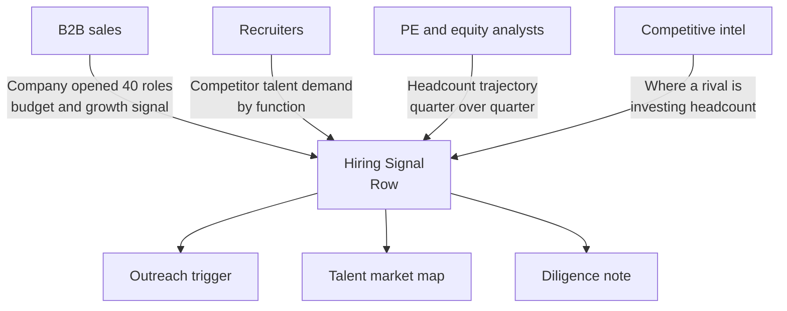
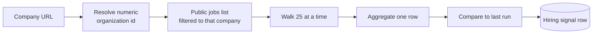
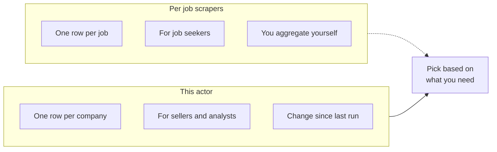

# LinkedIn Company Hiring Signal Tracker and Export Tool

Paste a list of LinkedIn company URLs and get one hiring signal row per company. Total open roles, broken down by seniority, function, and location, the date of the newest role, and the change since the last run when you schedule it. Output as JSON, CSV, or Excel. No cookie, no login.

Built for B2B sales teams, recruiters, equity and PE analysts, and competitive intelligence people who treat a hiring spike as a buying signal and want it as data, not a dashboard they pay a seat for.

---

## Who uses this hiring tracker



| Role | What this tracker unlocks |
|---|---|
| **B2B sales** | A hiring ramp is budget plus growth, the cleanest time to reach out |
| **Recruiter** | Where a competitor is opening roles, by function and seniority |
| **PE or equity analyst** | Headcount trajectory of a target across scheduled runs |
| **Competitive intel** | Which function a rival is staffing up tells you their next move |
| **Founder** | Watch the companies in your space ramp or slow in one feed |

---

## How the hiring tracker works



The actor resolves each company page to its numeric organization id, then walks the public job list filtered to that company, twenty five roles at a time. It counts every open role and buckets each by seniority, function, and location from the title and location text. With change tracking on, it stores the count between runs, so a scheduled run reports how many roles the company added or cut since last time. That velocity is the whole point.

This reads only the public job endpoint LinkedIn serves without a login. It is not a job board scraper for job seekers. It is a per company signal for people who sell, recruit, or invest.

---

## Job feed vs hiring signal



| Feature | Per job scraper | This actor |
|---|---|---|
| Output unit | One row per job | One row per company |
| Built for | Job seekers, aggregators | Sales, recruiting, analysts |
| Velocity | You compute it | Reported per scheduled run |
| Breakdown | You group later | Seniority, function, location ready |
| Pricing | Pay per job | Pay per company, first 3 per run free |

Pair this with Scrapemint LinkedIn Hiring Tracker and Salary Intelligence when you want the individual roles behind a signal.

---

## Quick start

Track three companies once:

```bash
curl -X POST "https://api.apify.com/v2/acts/scrapemint~linkedin-company-hiring-tracker/run-sync-get-dataset-items?token=YOUR_TOKEN" \
  -H "Content-Type: application/json" \
  -d '{
    "companyUrls": [
      "https://www.linkedin.com/company/anthropicresearch/",
      "https://www.linkedin.com/company/stripe/",
      "https://www.linkedin.com/company/databricks/"
    ]
  }'
```

Watch only engineering hiring at one company on a daily schedule:

```json
{
  "companyUrls": ["https://www.linkedin.com/company/databricks/"],
  "roleKeyword": "engineer",
  "trackDeltas": true,
  "maxRolesScanPerCompany": 1000
}
```

Run it on the Apify Scheduler daily and the delta field fills in from the second run on.

---

## What one company record looks like

```json
{
  "company": "Anthropic",
  "companySlug": "anthropicresearch",
  "companyId": "74126343",
  "companyUrl": "https://www.linkedin.com/company/anthropicresearch/",
  "totalOpenRoles": 312,
  "previousTotal": 280,
  "delta": 32,
  "deltaPct": 11.4,
  "hiringTrend": "ramping",
  "bySeniority": { "senior": 110, "mid": 96, "staff": 41, "director": 22 },
  "byFunction": { "engineering": 140, "sales": 38, "operations": 27 },
  "topLocations": [
    { "location": "San Francisco, CA", "count": 121 },
    { "location": "Remote", "count": 64 }
  ],
  "newestRolePostedAt": "2026-05-17",
  "sampleTitles": ["Staff Software Engineer", "Recruiter, Technical"],
  "scrapedAt": "2026-05-18T19:30:00.000Z"
}
```

`delta`, `previousTotal`, and `deltaPct` are null on the first run and fill in from the second scheduled run on.

---

## Pricing

First 3 companies per run are free. After that you pay per company tracked, breakdown and change figure included. No seat licenses. Tracking 100 companies a day lands around $3 a day on the Apify free plan.

---

## FAQ

**How is this different from a LinkedIn jobs scraper?**
A jobs scraper gives one row per job for job seekers. This gives one row per company for people who sell, recruit, or invest, with the count already bucketed and the change since last run.

**Do I need a LinkedIn login or cookie?**
No. The actor resolves the public company page and reads the public jobs endpoint. No session, no Sales Navigator seat.

**How do I get the change figure?**
Keep change tracking on and run the actor on the Apify Scheduler. The first run sets a baseline. Every run after reports the delta versus the previous run.

**Will it count every open role?**
It walks the public list up to the scan cap you set. Raise the cap for very large employers. The row flags when the cap was hit so you know the count is a floor.

**What company input formats work?**
A LinkedIn company URL like `linkedin.com/company/{slug}`, or the raw numeric organization id for advanced use.

**Can I track only one function?**
Yes. Set a role keyword like `engineer` or `sales` and only matching titles are counted.

**Is this legal?**
The company page and the jobs endpoint are public surfaces LinkedIn serves without a login. Use the output in line with your own policies and applicable law.

---

## Related actors by Scrapemint

- **LinkedIn Hiring Tracker & Salary Intelligence** for the individual roles behind a signal
- **Lead Enrichment Pipeline** to push a ramping company into outreach

Stack these to go from a hiring spike to an enriched account plan.
