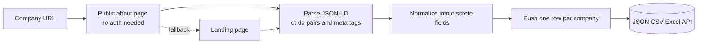
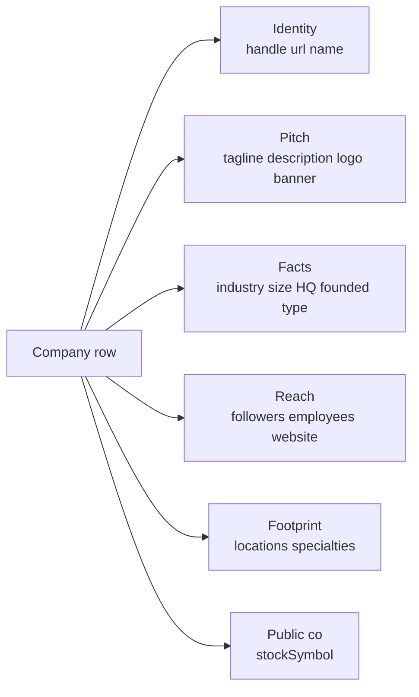

# LinkedIn Company Profile Intelligence (No Login Required)

Pull structured company facts from any LinkedIn company page. No cookies. No login. No Sales Navigator seat. Each row ships the company name, tagline, description, industry, headcount range, headquarters, founded year, specialties, website, follower count, and every office location LinkedIn lists. Pay per company.

**Built for** B2B sales teams, recruiters, agencies, founders, and CRM enrichment pipelines that need clean structured company records for prospecting, account research, and lead scoring.

**Keywords this actor ranks for:** linkedin company intelligence, linkedin company profile api, pull linkedin company without cookie, linkedin company info api, linkedin headcount tracker, linkedin company size intelligence, linkedin company about page, crm enrichment linkedin, account research linkedin, linkedin intelligence no login, linkedin company specialties, linkedin company website intelligence.

---

## Why this actor

| Other LinkedIn company scrapers | **This actor** |
|---|---|
| Need your session cookie | Zero cookies, zero login |
| Risk your account on every run | Touches only public surfaces |
| Single description blob | Industry, headcount, HQ, founded, specialties, type all parsed into discrete fields |
| Locations dropped | Every office location LinkedIn lists shipped as nested rows |
| Stock symbol missing for public co's | Ticker pulled when present |

---

## How it works



The actor hits the public about page first. If LinkedIn gates that surface for your IP, it falls back to the company landing page and pulls what it can from JSON-LD plus Open Graph meta tags. No cookie passes through the actor at any stage.

---

## What you get per row



Pipe straight into a CRM, an account scoring model, or a sourcing pipeline.

---

## Quick start

**Enrich a list of accounts**

```json
{
  "companyUrls": [
    "https://www.linkedin.com/company/microsoft/",
    "https://www.linkedin.com/company/openai/",
    "https://www.linkedin.com/company/anthropic/"
  ]
}
```

**Sales prospecting (skip locations to keep rows lean)**

```json
{
  "companyUrls": ["https://www.linkedin.com/company/stripe/"],
  "includeLocations": false,
  "includeSpecialties": true
}
```

**M&A scout (every office, every specialty)**

```json
{
  "companyUrls": [
    "https://www.linkedin.com/company/perplexity-ai/",
    "https://www.linkedin.com/company/mistralai/"
  ],
  "includeLocations": true,
  "includeSpecialties": true
}
```

---

## Sample output

```json
{
  "handle": "openai",
  "kind": "company",
  "url": "https://www.linkedin.com/company/openai/",
  "name": "OpenAI",
  "tagline": "Creating safe AGI that benefits all of humanity",
  "description": "OpenAI is an AI research and deployment company...",
  "logoUrl": "https://media.licdn.com/dms/image/...",
  "bannerUrl": "https://media.licdn.com/dms/image/...",
  "industry": "Research Services",
  "companySize": "1,001-5,000 employees",
  "employeeCount": 3200,
  "followerCount": 4800000,
  "headquarters": "San Francisco, California",
  "founded": "2015",
  "type": "Privately Held",
  "website": "https://openai.com",
  "stockSymbol": null,
  "specialties": ["Artificial Intelligence", "Machine Learning", "Research"],
  "locations": [
    { "line1": "3180 18th Street", "line2": "San Francisco, CA 94110", "country": "US", "raw": "..." }
  ],
  "scrapedAt": "2026-05-08T10:00:00.000Z"
}
```

---

## Who uses this

| Role | Use case |
|---|---|
| B2B sales | Enrich a target account list with industry, size, HQ before outreach |
| RevOps | Backfill missing firmographics in a CRM without paying a data vendor seat |
| Recruiter | Score target employers by size, growth, and footprint |
| Founder | Map a competitive landscape with specialties pulled directly from the source |
| M&A scout | Track headcount range and office footprint changes across a watchlist |
| ABM lead | Cluster accounts by industry and specialty for tiered campaigns |

---

## Input reference

| Field | Type | What it does |
|---|---|---|
| `companyUrls` | string[] | LinkedIn company, school, or showcase URLs. Required. |
| `includeLocations` | boolean | Keep the locations array on each row. Default true. |
| `includeSpecialties` | boolean | Keep the specialties array on each row. Default true. |
| `concurrency` | integer | Companies processed in parallel. Six is the safe default. |
| `proxyConfiguration` | object | Apify proxy. Residential is required at any meaningful volume. |

---

## API call

```bash
curl -X POST \
  "https://api.apify.com/v2/acts/YOUR_USER~linkedin-company-profile-scraper/runs?token=YOUR_TOKEN" \
  -H "Content-Type: application/json" \
  -d '{
    "companyUrls": [
      "https://www.linkedin.com/company/microsoft/",
      "https://www.linkedin.com/company/openai/"
    ]
  }'
```

---

## Pricing

The first few companies per run are free so you can validate output before paying. After that, each company row is charged. No surprise add on charges.

---

## FAQ

### Do I need a LinkedIn account or cookie?

No. The actor only touches LinkedIn's public about and landing pages. Your account is never touched.

### What if the about page is gated for anonymous viewers?

The actor falls back to the company landing page and pulls what is available there from JSON-LD and Open Graph tags. Name, tagline, logo, follower count, and website still ship in that path.

### Can I pull schools or showcase pages?

Yes. URLs in the form `linkedin.com/school/{handle}/` and `linkedin.com/showcase/{handle}/` are supported alongside `linkedin.com/company/{handle}/`.

### How fresh is the data?

Each run hits the live about page, so headcount range, follower count, and locations reflect what LinkedIn renders at pull time. Schedule weekly runs to track changes over time.

### Why is `companySize` a range and not a number?

LinkedIn publishes the headcount range publicly (for example "1,001-5,000 employees") and the precise headcount only behind an authenticated view. The actor ships both the range and a parsed `employeeCount` when LinkedIn renders it.

### Is pulling LinkedIn allowed?

This actor reads HTML any anonymous web visitor can see. Respect LinkedIn's terms and rate limit sensibly. Do not redistribute data you have no lawful basis to process.

---

## Related actors

- **LinkedIn Profile & Company Post Tracker** , pull posts from any profile or company without a cookie
- **LinkedIn Hiring Tracker & Salary Intelligence** , parsed salary, tech stack, and seniority on every job row
- **Lead Enrichment Pipeline** , multi source enrichment for a list of company domains
- **HN Lead Monitor** , Hacker News mentions and high intent leads
- **Reddit Brand Monitor & Lead Finder** , subreddit mentions and high intent leads
