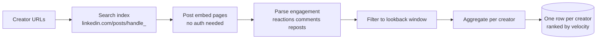
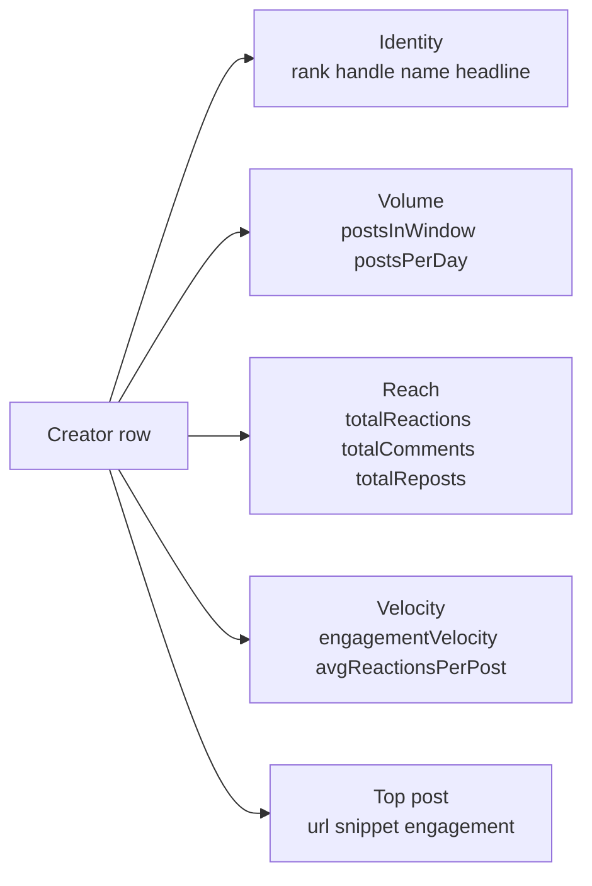

# LinkedIn Top Voice & Creator Engagement Ranker (No Login Required)

Pass a list of LinkedIn creators (profiles or company pages). Get back one row per creator with engagement velocity, total reactions, average reactions per post, the top performing post, and posts-per-day inside a lookback window. No cookies. No login. No Sales Navigator seat. Pay per creator.

**Built for** B2B influencer marketing, brand partnership teams, agencies sourcing sponsored creators, recruiters scouting thought leaders, and content marketers benchmarking competitors.

**Keywords this actor ranks for:** linkedin top voice, linkedin influencer scraper, linkedin creator ranker, linkedin engagement tracker, linkedin engagement velocity, b2b influencer discovery, linkedin thought leader, linkedin engagement rate, linkedin posts per day, linkedin scraper no login.

---

## Why this actor

| Other LinkedIn engagement tools | **This actor** |
|---|---|
| Need your session cookie | Zero cookies, zero login |
| Charge a seat license per month | Pay per ranked creator |
| Output one row per post, you do the math | Output one row per creator with velocity, top post, and per-day cadence |
| Lock you into a roster of pre-curated creators | Bring your own list |
| Hide the underlying post URLs | Top post URL and reaction breakdown shipped on every row |

---

## How it works



The actor finds each creator's recent public posts via search, then loads each post via LinkedIn's anonymous embed endpoint to read the engagement counters. No cookie passes through the actor at any stage.

---

## What you get per row



Pipe straight into a creator partnership shortlist, an executive thought-leadership scorecard, or a sponsorship target audit.

---

## Quick start

**Score a target creator list**

```json
{
  "creatorUrls": [
    "https://www.linkedin.com/in/satyanadella/",
    "https://www.linkedin.com/in/jeffweiner08/",
    "https://www.linkedin.com/in/sundarpichai/"
  ],
  "lookbackDays": 30
}
```

**Tighter window for trend tracking**

```json
{
  "creatorUrls": ["https://www.linkedin.com/in/williamhgates/"],
  "lookbackDays": 7,
  "maxPostsPerCreator": 50
}
```

**Long horizon for executive comp benchmarks**

```json
{
  "creatorUrls": [
    "https://www.linkedin.com/company/openai/",
    "https://www.linkedin.com/company/anthropic/"
  ],
  "lookbackDays": 90,
  "maxPostsPerCreator": 100
}
```

---

## Sample output

```json
{
  "rank": 1,
  "handle": "satyanadella",
  "kind": "person",
  "url": "https://www.linkedin.com/in/satyanadella/",
  "creatorName": "Satya Nadella",
  "creatorHeadline": "Chairman and CEO at Microsoft",
  "lookbackDays": 30,
  "postsInWindow": 12,
  "postsDiscovered": 18,
  "totalReactions": 84200,
  "totalComments": 3100,
  "totalReposts": 980,
  "totalEngagement": 88280,
  "avgReactionsPerPost": 7017,
  "avgEngagementPerPost": 7357,
  "postsPerDay": 0.4,
  "engagementVelocity": 2943,
  "topPost": {
    "url": "https://www.linkedin.com/posts/satyanadella_...",
    "postedAt": "2026-04-22T15:00:00.000Z",
    "reactions": 21000,
    "comments": 480,
    "reposts": 220,
    "total": 21700,
    "textSnippet": "Today we are launching..."
  },
  "scrapedAt": "2026-05-09T10:00:00.000Z"
}
```

---

## Who uses this

| Role | Use case |
|---|---|
| Influencer marketing manager | Score a shortlist of creators by real engagement velocity, not vanity follower count |
| Brand partnership lead | Audit which executives or creators are worth a paid promotion deal |
| Content marketer | Benchmark your own posting cadence and engagement against competitors in your category |
| Recruiter | Find the loudest voices in a target industry to fill thought leadership roles |
| Comms team | Track which company executives are landing the most engagement on owned posts |
| ABM lead | Identify the executives at target accounts who actually use LinkedIn (worth a comment-engagement play) |

---

## Input reference

| Field | Type | What it does |
|---|---|---|
| `creatorUrls` | string[] | LinkedIn profile or company URLs to rank. |
| `lookbackDays` | integer | Window of recent posts to count. Default 30. |
| `maxPostsPerCreator` | integer | Cap on posts pulled per creator. Default 30. |
| `concurrency` | integer | Pages processed in parallel. Six is the safe default. |
| `proxyConfiguration` | object | Apify proxy. Residential is required at any meaningful volume. |

---

## API call

```bash
curl -X POST \
  "https://api.apify.com/v2/acts/YOUR_USER~linkedin-creator-ranker/runs?token=YOUR_TOKEN" \
  -H "Content-Type: application/json" \
  -d '{
    "creatorUrls": [
      "https://www.linkedin.com/in/satyanadella/",
      "https://www.linkedin.com/in/jeffweiner08/"
    ],
    "lookbackDays": 30
  }'
```

---

## Pricing

The first three creators per run are free so you can validate output before paying. After that, each ranked creator row is charged. No surprise add on charges.

---

## FAQ

### Do I need a LinkedIn account or cookie?

No. The actor only touches public post embed pages. Your account is never touched.

### How does engagement velocity differ from total reactions?

Total reactions is a stock metric. Engagement velocity is reactions plus comments plus reposts divided by the lookback window in days. A creator with 5 huge posts last week beats a creator with 50 tiny posts over six months on velocity, even if their totals match.

### Why is `postsDiscovered` higher than `postsInWindow` sometimes?

`postsDiscovered` counts every post the actor found via search. `postsInWindow` counts only the ones whose timestamp falls inside the lookback window. Older posts are excluded from the ranking but the discovery count tells you how complete the search was.

### Can I rank companies, not just people?

Yes. URLs in the form `linkedin.com/company/{handle}/` and `linkedin.com/showcase/{handle}/` are supported alongside `linkedin.com/in/{handle}/`.

### What if a creator has no posts in the window?

The row still ships with zeros for every counter and `postsInWindow: 0`. That tells you the creator went dark in the period, which is itself useful signal.

### Is scraping LinkedIn allowed?

This actor reads HTML any anonymous web visitor can see. Respect LinkedIn's terms and rate limit sensibly. Do not redistribute data you have no lawful basis to process.

---

## Related actors

- **LinkedIn Profile Scraper** — pull headline, current title, and summary for any creator
- **LinkedIn Profile & Company Post Tracker** — pull every post one at a time instead of aggregated
- **LinkedIn Pulse Articles Scraper** — long form articles per author or topic
- **LinkedIn Company Profile Scraper** — firmographics for the companies a creator works at
- **LinkedIn Hiring Tracker & Salary Intelligence** — open roles plus parsed salary per company
