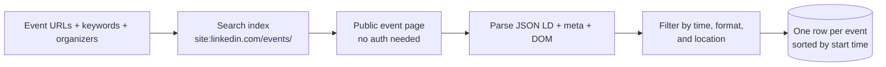
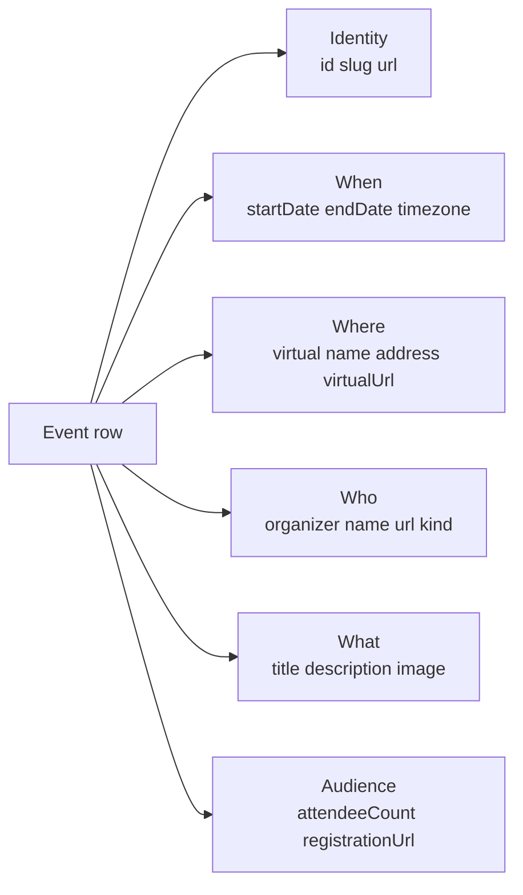

# LinkedIn Events Scraper (No Login Required)

Pass a list of LinkedIn event URLs, keyword queries, or organizer pages. Get back one row per public LinkedIn event with title, start time, location, virtual flag, organizer, description, image, attendee count, and registration link. No cookies. No login. No Sales Navigator seat. Pay per event.

**Built for** B2B event marketers, sponsorship sales teams, sales prospecting hunting active buyers, competitive intelligence teams tracking what rivals run, community managers, recruiters watching where their target talent shows up, and content teams sourcing speakers.

**Keywords this actor ranks for:** linkedin events scraper, linkedin event tracker, linkedin webinar scraper, linkedin summit tracker, b2b event intelligence, linkedin event discovery, linkedin organizer events, virtual event tracker linkedin.

---

## Why this actor

| Other LinkedIn event tools | **This actor** |
|---|---|
| Need your session cookie | Zero cookies, zero login |
| Seat licence per month | Pay per event returned |
| Limited to events you already follow | Discover by keyword, organizer, or direct URL |
| Output noisy raw feeds | Pre filter by time window, format, and location |
| Bury event URLs behind dashboards | Direct public event URL on every row |

---

## How it works



The actor finds candidate public event URLs through search, loads each public event page anonymously, parses JSON LD plus OpenGraph plus DOM, then filters the winners. No cookie passes through the actor at any stage.

---

## What you get per row



Pipe straight into a sponsorship target list, a sales prospecting workflow, a competitive event calendar, or a speaker bench shortlist.

---

## Quick start

**Find upcoming AI webinars**

```json
{
  "keywords": ["ai webinar", "generative ai summit"],
  "timeWindow": "next30days",
  "eventType": "virtual",
  "maxEventsPerSource": 25
}
```

**Track what one competitor is running**

```json
{
  "organizerUrls": ["https://www.linkedin.com/company/hubspot/"],
  "timeWindow": "upcoming",
  "maxEventsPerSource": 100
}
```

**London in person events this quarter**

```json
{
  "keywords": ["fintech", "saas", "marketing"],
  "timeWindow": "next90days",
  "eventType": "in_person",
  "locationContains": "london",
  "maxEventsPerSource": 50
}
```

**Parse a known event URL**

```json
{
  "eventUrls": [
    "https://www.linkedin.com/events/7186214038214238208/"
  ]
}
```

---

## Sample output

```json
{
  "id": "7186214038214238208",
  "slug": "ai-product-summit-2026-7186214038214238208",
  "url": "https://www.linkedin.com/events/ai-product-summit-2026-7186214038214238208/",
  "title": "AI Product Summit 2026",
  "description": "Two days of talks from product leaders building with LLMs in production.",
  "startDate": "2026-06-14T09:00:00.000Z",
  "endDate": "2026-06-15T17:00:00.000Z",
  "timezone": "Z",
  "location": {
    "virtual": false,
    "name": "ExCeL London",
    "address": "Royal Victoria Dock, London, E16 1XL, United Kingdom",
    "virtualUrl": null
  },
  "organizer": {
    "name": "Acme Events",
    "url": "https://www.linkedin.com/company/acme-events/",
    "kind": "company"
  },
  "attendeeCount": 1820,
  "attendeeText": "1,820 attendees",
  "image": "https://media.licdn.com/.../event-banner.jpg",
  "registrationUrl": "https://acme-events.com/ai-summit",
  "discoveredVia": { "kind": "keyword", "value": "ai summit" },
  "rankInSource": 3,
  "scrapedAt": "2026-05-12T10:00:00.000Z"
}
```

---

## Who uses this

| Role | Use case |
|---|---|
| Event marketer | Build a calendar of every event your category runs each quarter |
| Sponsorship sales | Source event organizers that match your sponsor profile by topic and audience size |
| Sales prospecting | Identify active buyers attending or speaking at a topical event |
| Competitive intel | Track every event a named competitor is running for the next 90 days |
| Community lead | Find third party meetups your community should show up at |
| Recruiter | Spot industry meetups where your target talent already gathers |
| Content team | Build a speaker bench by mapping who keynotes which event |

---

## Input reference

| Field | Type | What it does |
|---|---|---|
| `eventUrls` | string[] | Direct LinkedIn event URLs to parse. |
| `keywords` | string[] | Topic queries used to discover events through public web search. |
| `organizerUrls` | string[] | LinkedIn company or person URLs whose events you want. |
| `maxEventsPerSource` | integer | Cap per keyword or organizer. Default 25. Zero means take everything. |
| `timeWindow` | enum | `any` (default), `upcoming`, `past`, `next30days`, `next90days`. |
| `eventType` | enum | `any` (default), `virtual`, `in_person`. |
| `locationContains` | string | Substring filter against parsed location string. |
| `searchDepth` | integer | Search result pages walked per keyword or organizer. Default 5. |
| `concurrency` | integer | Pages processed in parallel. Default 6. |
| `proxyConfiguration` | object | Apify proxy. Residential is required at any meaningful volume. |

---

## API call

```bash
curl -X POST \
  "https://api.apify.com/v2/acts/YOUR_USER~linkedin-events-scraper/runs?token=YOUR_TOKEN" \
  -H "Content-Type: application/json" \
  -d '{
    "keywords": ["ai webinar"],
    "timeWindow": "next30days",
    "eventType": "virtual",
    "maxEventsPerSource": 25
  }'
```

---

## Pricing

The first three events per run are free so you can validate output before paying. After that, each event row is charged. No surprise add on charges.

---

## FAQ

### Do I need a LinkedIn account or cookie?

No. The actor only touches public event pages and a public search engine. Your account is never touched.

### How is this different from the LinkedIn Company Profile Scraper?

Company Profile Scraper returns firmographics for a company. This actor returns the *events* that companies and people run. Use them together to enrich each organizer with full firmographics.

### Why are some events missing from the results?

LinkedIn only exposes events at a public URL when the organizer keeps the event public. Events restricted to a company page, a group, or a private invite list never appear in search and are never fetched by this actor.

### How accurate is the attendee count?

LinkedIn rounds public attendee counts above a thousand. The actor parses the rendered count, so very large events may be rounded.

### Can I detect virtual events reliably?

The actor looks at three signals: the JSON LD `VirtualLocation` block, the `eventAttendanceMode` field, and keyword cues in title and description (online, virtual, webinar, livestream, zoom, teams). When `eventType` is `virtual`, all three signals are checked.

### Is pulling LinkedIn allowed?

This actor reads HTML any anonymous web visitor can see. Respect LinkedIn's terms and rate limit sensibly. Do not redistribute data you have no lawful basis to process.

---

## Related actors

- **LinkedIn Company Profile Intelligence** , firmographics for the companies organizing each event
- **LinkedIn Company Employees Intelligence** , find who at the organizer to message about sponsoring
- **LinkedIn Profile Post Tracker** , monitor what speakers post in the run up to their event
- **LinkedIn Hashtag & Topic Post Tracker** , track topical conversation around your event tag
- **LinkedIn Top Voice & Creator Engagement Ranker** , build a speaker bench from topical creators
