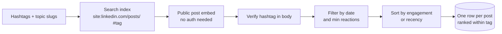
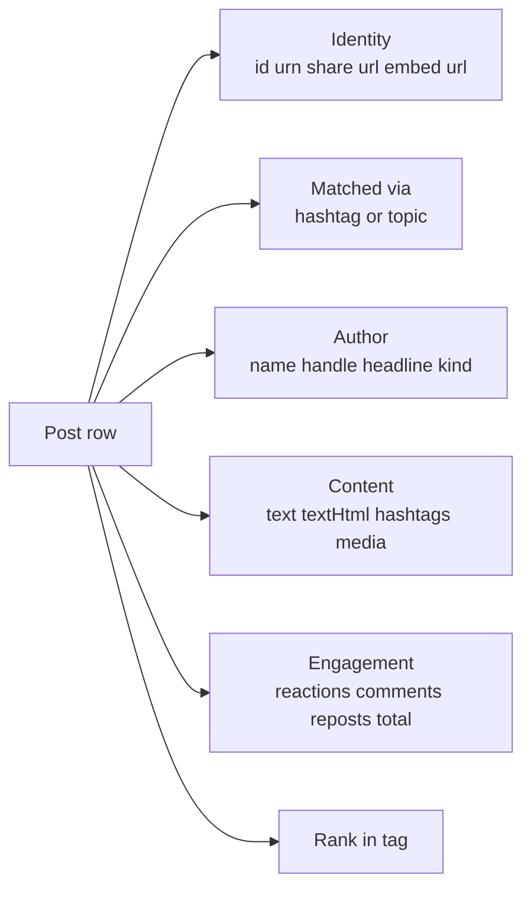

# LinkedIn Hashtag & Topic Post Tracker (No Login Required)

Pass a list of LinkedIn hashtags or topic slugs. Get back the top public posts per tag ranked by engagement or recency. One row per post with author, full text, posted date, reactions, comments, reposts, media, and the matched hashtag. No cookies. No login. No Sales Navigator seat. Pay per post.

**Built for** B2B content marketers, social listening teams, brand managers, agencies pitching thought leadership campaigns, demand gen leads sourcing topical creators, and PR teams tracking conversation around a tag.

**Keywords this actor ranks for:** linkedin hashtag scraper, linkedin topic scraper, linkedin posts by hashtag, linkedin social listening, linkedin trend tracker, linkedin hashtag tracker no cookie, linkedin top posts by tag, b2b social listening tool, linkedin content discovery.

---

## Why this actor

| Other LinkedIn social listening tools | **This actor** |
|---|---|
| Need your session cookie | Zero cookies, zero login |
| Seat licence per month | Pay per post returned |
| Lock you into preset topic categories | Bring your own hashtag and slug list |
| Output noisy raw feeds | Pre filter by minimum reactions, date window, and sort order |
| Bury post URLs behind dashboards | Direct embed and share URLs on every row |

---

## How it works



The actor finds candidate public post URLs through search, loads each post via LinkedIn's anonymous embed endpoint, verifies the hashtag is actually in the rendered body, then sorts the winners per tag. No cookie passes through the actor at any stage.

---

## What you get per row



Pipe straight into a social listening dashboard, a topical creator shortlist, a competitive content audit, or a paid sponsorship target list.

---

## Quick start

**Track AI conversation on LinkedIn this month**

```json
{
  "hashtags": ["ai", "machinelearning", "genai"],
  "maxPostsPerHashtag": 25,
  "postedLimitDate": "2026-04-10",
  "sortBy": "engagement"
}
```

**High signal only**

```json
{
  "hashtags": ["devrel", "developermarketing"],
  "minReactions": 50,
  "maxPostsPerHashtag": 20,
  "sortBy": "engagement"
}
```

**Newest first, broad sweep**

```json
{
  "hashtags": ["fintech"],
  "maxPostsPerHashtag": 100,
  "searchDepth": 10,
  "sortBy": "recency"
}
```

**Topic slug instead of hashtag**

```json
{
  "topicSlugs": ["artificial-intelligence", "leadership-development"],
  "maxPostsPerHashtag": 25
}
```

---

## Sample output

```json
{
  "id": "7186214038214238208",
  "urn": "urn:li:activity:7186214038214238208",
  "url": "https://www.linkedin.com/posts/jane-doe_ai-genai-activity-7186214038214238208-AbCd",
  "embedUrl": "https://www.linkedin.com/embed/feed/update/urn:li:activity:7186214038214238208/",
  "matchedVia": { "kind": "hashtag", "value": "ai" },
  "rankInTag": 1,
  "hashtags": ["ai", "genai", "llm"],
  "author": {
    "name": "Jane Doe",
    "url": "https://www.linkedin.com/in/jane-doe/",
    "headline": "VP Product at Acme. Ex Google.",
    "kind": "person"
  },
  "text": "Three things every product team should stop doing in 2026 about #ai...",
  "postedAt": "2026-05-04T15:00:00.000Z",
  "postedText": "1w",
  "engagement": {
    "reactions": 4820,
    "comments": 312,
    "reposts": 188,
    "total": 5320
  },
  "media": {
    "images": ["https://media.licdn.com/.../image.jpg"],
    "videoUrl": null,
    "articleUrl": null,
    "ogImage": "https://media.licdn.com/.../og.jpg"
  },
  "scrapedAt": "2026-05-10T10:00:00.000Z"
}
```

---

## Who uses this

| Role | Use case |
|---|---|
| Content marketer | Find the top performing posts in your category to model future content against |
| Social listening lead | Track conversation volume and tone around a brand, product, or industry tag |
| Brand manager | Spot a rising hashtag early and brief the creative team before the wave peaks |
| Agency strategist | Build a "what is working on LinkedIn right now" report per client industry |
| Demand gen lead | Discover topical creators worth a paid promotion before they are saturated |
| PR team | Monitor third party voices weighing in on a launch, an outage, or a crisis |
| Recruiter | Identify the loudest people in a niche to fill thought leadership roles |

---

## Input reference

| Field | Type | What it does |
|---|---|---|
| `hashtags` | string[] | LinkedIn hashtags to track. Leading '#' optional. |
| `topicSlugs` | string[] | Optional topic slugs from `linkedin.com/pulse/topics/{slug}`. |
| `maxPostsPerHashtag` | integer | Cap on posts per tag. Default 25. Zero means take everything. |
| `postedLimitDate` | string | Skip posts older than this date (ISO or epoch ms). |
| `minReactions` | integer | Drop posts below this reaction count. Default 0. |
| `sortBy` | enum | `engagement` (default) or `recency`. |
| `searchDepth` | integer | Search result pages walked per tag. Default 5. |
| `concurrency` | integer | Pages processed in parallel. Default 6. |
| `proxyConfiguration` | object | Apify proxy. Residential is required at any meaningful volume. |

---

## API call

```bash
curl -X POST \
  "https://api.apify.com/v2/acts/YOUR_USER~linkedin-hashtag-posts-scraper/runs?token=YOUR_TOKEN" \
  -H "Content-Type: application/json" \
  -d '{
    "hashtags": ["ai", "devrel"],
    "minReactions": 100,
    "maxPostsPerHashtag": 25
  }'
```

---

## Pricing

The first three posts per run are free so you can validate output before paying. After that, each post row is charged. No surprise add on charges.

---

## FAQ

### Do I need a LinkedIn account or cookie?

No. The actor only touches public post embed pages and a public search engine. Your account is never touched.

### How is this different from the LinkedIn Profile Post Tracker?

The Profile Post Tracker discovers posts by *author*. This actor discovers posts by *topic*. Use Profile Post Tracker when you already know whose posts you want; use this when you want the top voices around a tag regardless of who posted them.

### Why are some posts missing from the results?

LinkedIn only exposes posts via the public share URL when the author keeps the post public. Posts behind connection only or company only visibility never appear in search and are never fetched by this actor.

### How accurate is the engagement count?

LinkedIn rounds public engagement counts above a thousand (for example "1,234 reactions" may render as "1.2K"). The actor parses the rendered count, so very high engagement posts may be rounded.

### Why does the actor verify the hashtag against the post body?

Search engines sometimes return loosely related posts that mention a tag in a comment rather than in the post itself. The actor reads the rendered body and the hashtag link list and only keeps posts where the tag is present in the post itself.

### Is scraping LinkedIn allowed?

This actor reads HTML any anonymous web visitor can see. Respect LinkedIn's terms and rate limit sensibly. Do not redistribute data you have no lawful basis to process.

---

## Related actors

- **LinkedIn Hiring Tracker & Salary Intelligence**, open roles plus parsed salary per company
- **LinkedIn Events Discovery and Lead Feed (No Cookies)**, the events where the loudest voices are speaking
- **LinkedIn Company Hiring Signal Tracker**, firmographics and hiring pace for the companies behind those posts
