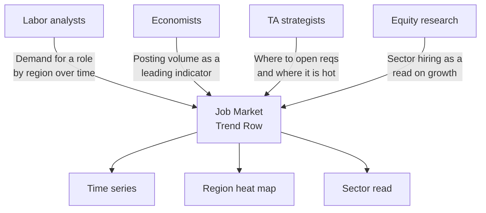
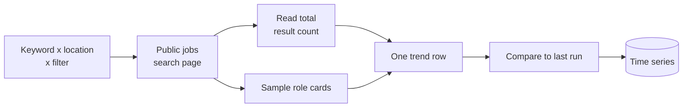
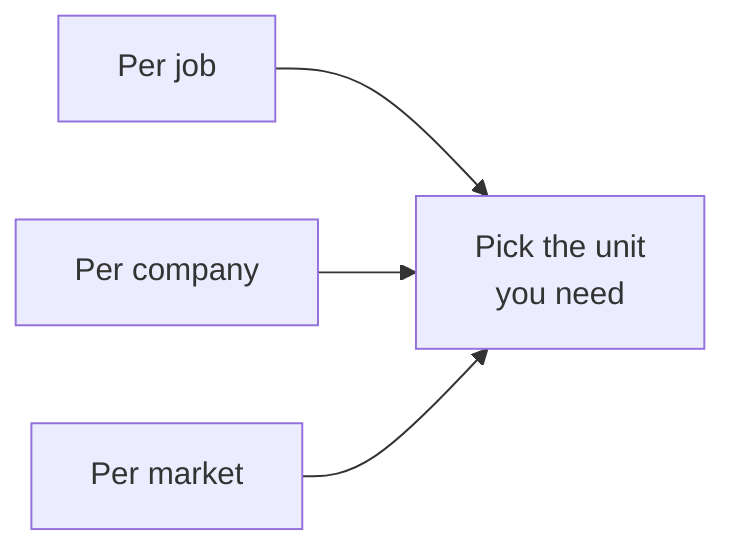

# LinkedIn Job Market Trend Intelligence and Labor Index Export

Define the job market segments you care about and get one trend row per segment. Total open roles on LinkedIn for a keyword, location, and filter set, a seniority and function split, and the change since the last run when you schedule it. Output as JSON, CSV, or Excel. No cookie, no login.

Built for labor market analysts, economists, workforce planners, talent acquisition strategists, and macro and equity researchers who treat job posting volume as a leading indicator and want it as a clean time series, not a dashboard seat.

---

## Who uses this job market tracker



| Role | What this tracker unlocks |
|---|---|
| **Labor analyst** | Demand for a role across regions as a clean weekly series |
| **Economist** | Job posting volume, a known leading indicator, without a data vendor |
| **TA strategist** | Where a skill is hot and where it has cooled before you open reqs |
| **Equity or macro researcher** | Sector hiring as a read on growth between earnings |
| **Workforce planner** | Supply pressure on a role by market over time |

---

## How the trend tracker works



For each keyword and location pair, plus any experience, type, remote, or recency filter, the actor reads the public jobs search page and pulls the total result count LinkedIn shows in the header. It also samples the rendered role cards to add a seniority and function split. With change tracking on, it stores the count between runs, so a scheduled run reports how the segment moved since last time. That movement is the whole point.

This reads only the public jobs search page LinkedIn serves without a login. It is not a per job scraper and not a per company tracker. It is a market level index.

---

## Three jobs lenses



| Actor | Output unit | Built for |
|---|---|---|
| LinkedIn Hiring Tracker and Salary Intelligence | One row per job | Recruiters, comp researchers |
| LinkedIn Company Hiring Signal Tracker | One row per company | Sales, talent intel |
| **This actor** | One row per market segment | Analysts, economists, planners |

Run all three when you need the macro trend, the companies driving it, and the roles behind it.

---

## Quick start

Track three role markets in the US once:

```bash
curl -X POST "https://api.apify.com/v2/acts/scrapemint~linkedin-job-market-trend-scraper/run-sync-get-dataset-items?token=YOUR_TOKEN" \
  -H "Content-Type: application/json" \
  -d '{
    "keywords": ["data engineer", "registered nurse", "product manager"],
    "locations": ["United States"]
  }'
```

Track one skill across three regions, remote only, on a weekly schedule:

```json
{
  "keywords": ["machine learning engineer"],
  "locations": ["United States", "Germany", "India"],
  "remoteFilter": "remote",
  "trackDeltas": true
}
```

Run it on the Apify Scheduler and the delta field fills in from the second run on.

---

## What one trend record looks like

```json
{
  "keyword": "data engineer",
  "location": "Germany",
  "filters": { "remoteFilter": "remote", "postedSince": null },
  "totalJobs": 6000,
  "totalJobsText": "6,000+",
  "isApproximate": true,
  "previousTotal": 5600,
  "delta": 400,
  "deltaPct": 7.1,
  "trend": "growing",
  "sampleSize": 56,
  "bySeniority": { "senior": 21, "mid": 19, "lead": 8 },
  "byFunction": { "engineering": 33, "data": 18 },
  "scrapedAt": "2026-05-18T19:30:00.000Z"
}
```

LinkedIn reports large counts rounded with a plus, so `isApproximate` flags when the count is a floor. `delta`, `previousTotal`, and `deltaPct` are null on the first run and fill in from the second scheduled run on.

---

## Pricing

First 5 queries per run are free. After that you pay per query tracked, breakdown and change figure included. No seat licenses. Tracking 50 segments daily lands well under $1 a day on the Apify free plan.

---

## FAQ

**How is this different from a LinkedIn jobs scraper?**
A jobs scraper returns one row per job. This returns one row per market segment, the total count with a seniority and function split, and the change since last run. It is a labor index, not a job feed.

**Do I need a LinkedIn login or cookie?**
No. The actor reads the public jobs search page. No session, no Sales Navigator seat.

**Why is the count rounded?**
LinkedIn rounds large result counts and adds a plus, so the number is a reliable floor. The actor flags this with `isApproximate` and the trend still tracks cleanly run over run.

**How do I get the change figure?**
Keep change tracking on and run on the Apify Scheduler. The first run sets a baseline. Every run after reports the delta versus the previous run.

**Can I track a 24 hour new postings rate?**
Yes. Set posted since to past 24 hours and run daily for a clean new-postings velocity per segment.

**Is this legal?**
The jobs search page is a public surface LinkedIn serves without a login. Use the output in line with your own policies and applicable law.

---

## Related actors by Scrapemint

- **LinkedIn Hiring Tracker and Salary Intelligence** for the individual roles behind a trend
- **LinkedIn Company Hiring Signal Tracker** for the companies driving a trend
- **Indeed Jobs Scraper** to triangulate the same market on a second source
- **Lead Enrichment Pipeline** to act on a heating segment
- **Glassdoor Company Salary Scraper** to pair demand with pay

Stack these to turn a market signal into a hiring or investment decision.
