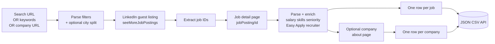
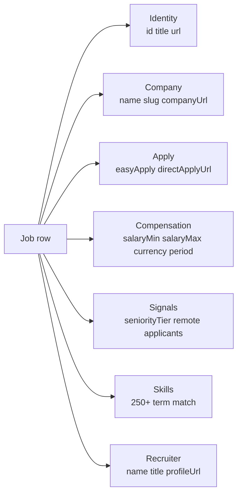

# LinkedIn Jobs Intelligence Pro , Company Enrichment & Recruiter Contacts

Pull LinkedIn jobs from search URLs, keywords, or company pages without a cookie or login. Each row ships parsed salary, skill array, seniority tier, Easy Apply flag, recruiter contact, and direct apply URL. Optional company enrichment pulls industry, size, headcount range, founded year, and headquarters. City splitting breaks past LinkedIn's 1000 result cap. Pay per row.

**Built for** technical recruiters, sales teams selling to tech buyers, M&A scouts watching hiring velocity, comp researchers benchmarking pay bands, and founders vetting competitor hiring pipelines.

**Keywords this actor ranks for:** linkedin jobs scraper, linkedin jobs api, scrape linkedin jobs no login, linkedin jobs search url scraper, linkedin company jobs scraper, linkedin recruiter contact scraper, linkedin job skills scraper, linkedin jobs to JSON, linkedin jobs to CSV, linkedin salary scraper, linkedin hiring tracker, linkedin jobs by company, linkedin recruiter intel, easy apply detection, linkedin jobs API alternative.

---

## Why this actor

| Other LinkedIn jobs scrapers | **This actor** |
|---|---|
| Single input mode (keywords or URL only) | Three modes: search URLs, keywords, OR company URLs |
| Raw description, no parsing | Parsed salary, 250+ skill array, seniority tier, Easy Apply flag |
| 1000 result cap leaves you stuck | City splitting breaks past the cap automatically |
| No company context | Optional enrichment with industry, size, headcount, founded, HQ, hiring velocity |
| No recruiter info | Optional recruiter name, title, and profile URL pulled from the job page |
| No direct apply URL | Direct apply URL extracted when the company uses an external ATS |

---

## How it works



No cookie at any stage. Works against the same public guest endpoints Google uses when indexing jobs. Filters from your search URL flow straight through.

---

## What you get per row



Each unique company can also push as its own row with `kind: "company"`, carrying industry, headcount range, founded year, headquarters, specialties, and follower count.

---

## Quick start

**Paste a search URL from your browser**

```json
{
  "searchUrls": [
    "https://www.linkedin.com/jobs/search/?keywords=software%20engineer&location=United%20States&f_TPR=r604800"
  ],
  "maxJobs": 100,
  "scrapeCompanyDetails": true
}
```

**Watch every job at three target companies**

```json
{
  "companyUrls": [
    "https://www.linkedin.com/company/openai/",
    "https://www.linkedin.com/company/anthropic/",
    "https://www.linkedin.com/company/databricks/"
  ],
  "scrapeCompanyDetails": true,
  "scrapeRecruiterContact": true
}
```

**High volume run with city splitting (breaks past the 1000 cap)**

```json
{
  "keywords": ["staff software engineer"],
  "splitByCity": true,
  "country": "United States",
  "maxJobs": 5000,
  "scrapeCompanyDetails": false
}
```

**Recruiter sourcing run with recruiter contact extraction**

```json
{
  "searchUrls": [
    "https://www.linkedin.com/jobs/search/?keywords=product%20manager&location=California"
  ],
  "scrapeRecruiterContact": true,
  "maxJobs": 200
}
```

---

## Sample output

**Job row**

```json
{
  "kind": "job",
  "id": "4406118990",
  "url": "https://www.linkedin.com/jobs/view/4406118990/",
  "title": "Software Engineer, New Grad",
  "company": "Notion",
  "companySlug": "notionhq",
  "companyUrl": "https://www.linkedin.com/company/notionhq",
  "location": "San Francisco, CA",
  "remote": "onsite",
  "postedAt": "2026-04-24T21:22:48.000Z",
  "applicants": 200,
  "easyApply": false,
  "directApplyUrl": null,
  "applyUrl": "https://www.notion.com/careers/...",
  "seniorityLevel": "Entry level",
  "seniorityTier": "entry",
  "employmentType": "Full-time",
  "salaryMin": 126000,
  "salaryMax": 146000,
  "salaryCurrency": "USD",
  "salaryPeriod": "annual",
  "skills": ["claude", "css", "elasticsearch", "figma", "javascript", "mongodb", "mysql", "node.js", "openai", "postgresql", "python", "react", "typescript"],
  "experienceYearsMin": null,
  "scrapedAt": "2026-04-26T08:00:00.000Z"
}
```

**Company row** (when `scrapeCompanyDetails` is on)

```json
{
  "kind": "company",
  "slug": "notionhq",
  "url": "https://www.linkedin.com/company/notionhq/",
  "name": "Notion",
  "tagline": "One workspace. Every team.",
  "industry": "Software Development",
  "size": "1,001-5,000 employees",
  "headcountMin": 1001,
  "headcountMax": 5000,
  "founded": 2013,
  "headquarters": "San Francisco, California",
  "specialties": ["productivity", "collaboration", "knowledge management"],
  "followers": 245000,
  "scrapedAt": "2026-04-26T08:00:00.000Z"
}
```

**Recruiter contact** (when `scrapeRecruiterContact` is on, attached to job row)

```json
{
  "recruiter": {
    "name": "Jane Doe",
    "title": "Senior Technical Recruiter",
    "profileUrl": "https://www.linkedin.com/in/janedoe/"
  }
}
```

---

## Who uses this

| Role | Use case |
|---|---|
| Technical recruiter | Watch open reqs at target companies. Pull the recruiter contact directly from the job page. |
| Sales team | Spot companies hiring roles that imply need for your product (Snowflake hiring = data warehouse migration). |
| Comp researcher | Benchmark pay bands by title, seniority, geography, and skill stack across thousands of jobs. |
| M&A scout | Track hiring velocity at private companies. Combine job count with company size for a growth signal. |
| Founder | Watch a competitor's open reqs as a real time pipeline of strategy and team shape. |
| BI analyst | Pipe parsed salary, skills, and seniority into a dashboard or warehouse. |

---

## Input reference

| Field | Type | What it does |
|---|---|---|
| `searchUrls` | string[] | LinkedIn jobs search URLs from your browser. |
| `keywords` | string[] | Alternative to URLs. Each keyword runs as its own search. |
| `locations` | string[] | Locations combined with keywords. |
| `companyUrls` | string[] | LinkedIn company URLs to find every open job at the firm. |
| `maxJobs` | integer | Hard cap on jobs returned. 0 means everything LinkedIn exposes. |
| `experienceLevel` | enum | internship, entry, associate, mid-senior, director, executive. |
| `jobType` | enum | full-time, part-time, contract, temporary, volunteer, internship. |
| `remoteFilter` | enum | onsite, remote, hybrid. |
| `postedSince` | enum | 1d, 1w, 1m. |
| `splitByCity` | boolean | Split each search across the top cities of the country to break past the 1000 cap. |
| `country` | enum | Country whose top cities are used when splitByCity is on. |
| `scrapeCompanyDetails` | boolean | Pull each unique company's about page. |
| `scrapeRecruiterContact` | boolean | Extract recruiter name, title, and profile URL. |
| `extractSkills` | boolean | Scan description for 250+ skills across tech, business, and soft. |
| `parseSalary` | boolean | Parsed salary range, currency, and period. |
| `classifySeniority` | boolean | Map title to one of ten seniority buckets. |
| `detectEasyApply` | boolean | Flag Easy Apply vs external ATS jobs. |
| `dedupe` | boolean | Skip job IDs from previous runs. |
| `concurrency` | integer | Pages processed in parallel. |
| `proxyConfiguration` | object | Apify proxy. Residential is required at scale. |

---

## API call

```bash
curl -X POST \
  "https://api.apify.com/v2/acts/YOUR_USER~linkedin-jobs-scraper-pro/runs?token=YOUR_TOKEN" \
  -H "Content-Type: application/json" \
  -d '{
    "searchUrls": ["https://www.linkedin.com/jobs/search/?keywords=staff%20engineer&location=California"],
    "maxJobs": 200,
    "scrapeCompanyDetails": true
  }'
```

---

## Pricing

The first few rows per run are free so you can validate output. After that, each job row is charged. Company rows and recruiter rows are billed separately and only when those toggles are on, so the base cost stays low when you only need job data.

---

## FAQ

### Do I need a LinkedIn account or cookie?

No. The actor only touches LinkedIn's public guest endpoints, the same ones Google uses to index public job listings.

### What is the difference between this and a basic LinkedIn jobs scraper?

This one accepts three input modes (search URLs, keywords, company URLs), splits searches by city to break past the 1000 result cap, enriches with company about page data, extracts recruiter contact info, parses salary and skills on every row, and detects Easy Apply vs external ATS jobs.

### How does the search URL input work?

Open LinkedIn jobs in incognito, set your filters (location, experience, posted in last week, remote), and copy the URL. The actor parses query parameters and runs the same filters against the public guest API.

### Why does LinkedIn cap results at about 1000 per search?

That is a LinkedIn product limit on the guest search API. Turn on `splitByCity` and the actor splits each keyword across the top cities of your chosen country. Twenty cities means up to 20,000 results before the cap kicks in per city.

### How accurate is the salary parser?

Strong on jobs that publish a range in the description (mandatory under California, New York, Washington, and Colorado pay transparency laws). Currency support: USD, EUR, GBP, CAD, AUD, INR, CHF. Plausibility checks reject outliers like gift card amounts. Jobs without a published range return `salaryMin: null`.

### What does Easy Apply detection actually catch?

Jobs that route through LinkedIn's one click apply flow, which typically receive 3 to 5 times more applicants than jobs that link to an external ATS. Recruiters use this signal to spot lower competition reqs. Sales teams use it to spot companies still using LinkedIn's funnel vs a custom ATS like Greenhouse or Lever.

### Where does the recruiter contact come from?

The "Meet the hiring team" block on the job detail page. Some jobs show the in house recruiter, some show the hiring manager, and some show neither. Turn on `scrapeRecruiterContact` and rows with this block populate the `recruiter` field.

### Can I track every open role at a target company?

Yes. Paste the company URL into `companyUrls`. The actor walks every active job posting at that company and returns each as a job row. Combined with `scrapeCompanyDetails`, you also get one company row with size, industry, founded, and HQ.

### Can I run this on a schedule?

Yes. Use the Apify scheduler for hourly, daily, or weekly runs. Combined with `dedupe: true`, only new job IDs are pushed. Great for competitor hiring watch and recruiter alerting.

### Is pulling LinkedIn allowed?

This actor reads HTML any anonymous web visitor can see. Respect LinkedIn's terms and rate limit sensibly. Do not redistribute job descriptions or recruiter contact info you have no lawful basis to publish.

---

## Related actors

- **LinkedIn Hiring Tracker & Salary Intelligence** , keyword driven version with deeper salary parsing and tech stack focus
- **TripAdvisor Property Rank Tracker** , daily rank, rating drift, and competitor signals for hotels and restaurants
- **Website Content Scraper: Clean Markdown for AI and RAG** , websites to clean Markdown with token counts and RAG ready chunks
- **Reddit Lead Monitor: Subreddit and Keyword Alert Feed** , subreddit mentions and high intent leads
