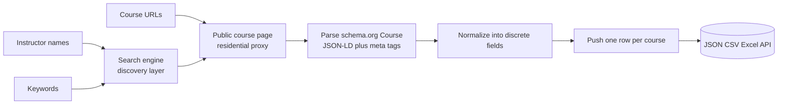
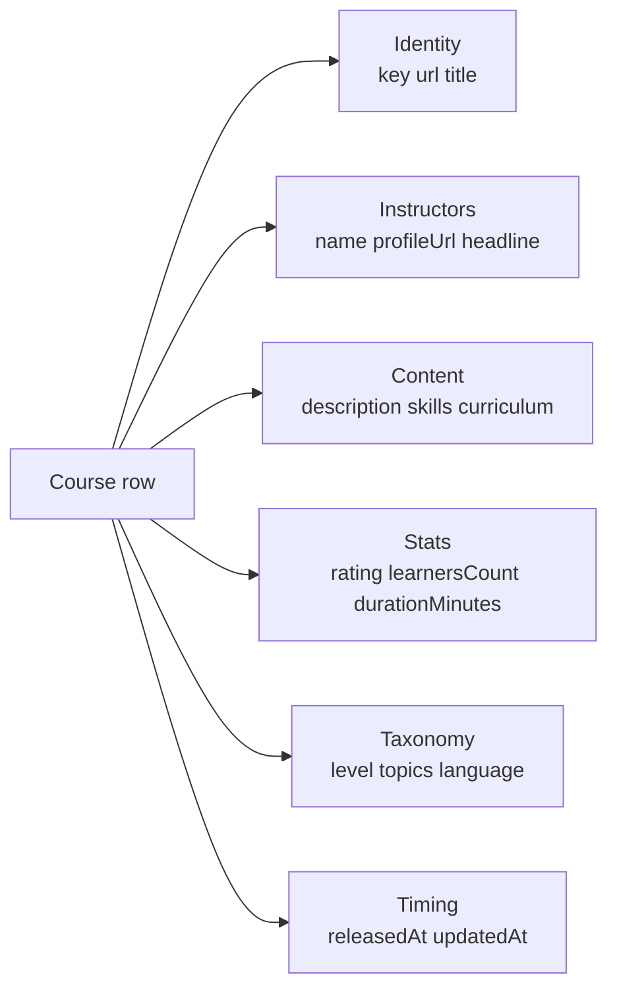

# LinkedIn Learning Course Intelligence (No Login Required)

Pull structured LinkedIn Learning course data by instructor, by topic, or from a known URL list. No cookies. No login. No subscription seat. Each row ships the title, full description, instructors, skills covered, level, duration, release date, rating, learner count, language, and the full chapter and lesson curriculum. Pay per course.

**Built for** L&D teams, course competitors, instructional designers, and analysts who need clean structured access to the LinkedIn Learning catalog for skills-gap analysis, competitive benchmarking, and content planning.

**Keywords this actor ranks for:** linkedin learning scraper, linkedin learning api, linkedin course data, linkedin learning catalog export, course curriculum scraper, skills taxonomy scraper, linkedin learning to json, online course benchmarking, l&d competitive intelligence, course catalog monitoring, instructor course tracker, elearning content intel.

---

## Why this actor

| Other course scrapers | **This actor** |
|---|---|
| Need your session cookie | Zero cookies, zero login |
| Risk your seat on every run | Touches only public catalog pages with residential proxy |
| Single text blob per course | Title, description, instructors, skills, level, curriculum all parsed into discrete fields |
| Only accept direct URLs | Discover by instructor, by keyword, or paste URLs |
| Drop the curriculum | Full chapter and lesson breakdown on every row |

---

## How it works



Discovery happens through search engines that already index public LinkedIn Learning course URLs. Each course is then fetched with a real Chrome browser fingerprint behind a residential proxy. The actor parses the schema.org `Course` JSON-LD first, then falls back to Open Graph meta tags and DOM extraction. Instructor discovery is verified against the instructors listed on each course page, so an instructor query never returns courses they did not teach.

---

## What you get per row



---

## Quick start

**Track every course from one instructor or studio**

```json
{
  "instructorNames": ["Madecraft"],
  "maxCourses": 50
}
```

**Topic discovery (find courses on a skill)**

```json
{
  "keywords": ["prompt engineering", "python data analysis"],
  "maxCourses": 25
}
```

**Enrich a known course list**

```json
{
  "courseUrls": [
    "https://www.linkedin.com/learning/learning-python"
  ]
}
```

---

## Sample output

```json
{
  "key": "learning-python",
  "url": "https://www.linkedin.com/learning/learning-python",
  "discoveredVia": { "kind": "keyword", "value": "keyword:python data analysis" },
  "title": "Learning Python",
  "description": "Get started with Python, the popular and highly readable object-oriented language...",
  "instructors": [
    {
      "name": "Joe Marini",
      "profileUrl": "https://www.linkedin.com/learning/instructors/joe-marini",
      "headline": "Product and engineering leader"
    }
  ],
  "skills": ["Python", "Object-Oriented Programming"],
  "topics": ["Software Development"],
  "level": "Beginner",
  "durationSeconds": 8520,
  "durationMinutes": 142,
  "releasedAt": "2026-02-11T00:00:00.000Z",
  "updatedAt": null,
  "rating": { "value": 4.7, "count": 18432 },
  "learnersCount": 1240000,
  "language": "en",
  "thumbnail": "https://media.licdn.com/dms/image/...",
  "curriculum": [
    {
      "section": "1. Python Basics",
      "lessons": [
        { "title": "Building your first Python program", "durationText": "4m 12s" }
      ]
    }
  ],
  "relatedCourses": ["python-quick-start", "advanced-python"],
  "scrapedAt": "2026-05-16T10:00:00.000Z"
}
```

---

## Who uses this

| Role | Use case |
|---|---|
| L&D lead | Map a skills taxonomy across a topic to plan internal training |
| Course competitor | Track what a rival instructor or studio is publishing and how it rates |
| Instructional designer | Study curriculum structure across top rated courses before authoring |
| Talent analyst | Benchmark which skills the market is teaching and at what depth |
| Content strategist | Topic monitoring across a keyword list to spot emerging skill demand |
| Researcher | Build a structured course dataset without paying a catalog vendor |

---

## Input reference

| Field | Type | What it does |
|---|---|---|
| `courseUrls` | string[] | Direct LinkedIn Learning course URLs. |
| `instructorNames` | string[] | Instructors to discover courses by. Verified on each course page. |
| `keywords` | string[] | Topics to discover courses for via public search. |
| `maxCourses` | integer | Cap per instructor or keyword. 0 means everything we can discover. |
| `includeCurriculum` | boolean | Keep the chapter and lesson breakdown on each row. Default true. |
| `concurrency` | integer | Pages processed in parallel. Six is the safe default. |
| `proxyConfiguration` | object | Apify proxy. Residential is required at any meaningful volume. |

---

## API call

```bash
curl -X POST \
  "https://api.apify.com/v2/acts/YOUR_USER~linkedin-learning-course-scraper/runs?token=YOUR_TOKEN" \
  -H "Content-Type: application/json" \
  -d '{
    "keywords": ["prompt engineering"],
    "maxCourses": 25
  }'
```

---

## Pricing

The first 3 courses per run are free so you can validate output before paying. After that, each course row is charged. No surprise add on charges.

---

## FAQ

### Do I need a LinkedIn Learning account or cookie?

No. The actor only touches the public LinkedIn Learning course pages from a residential proxy with a real Chrome fingerprint. Your account is never touched.

### How does discovery work without my cookie?

A search engine site query finds public LinkedIn Learning course URLs from the target instructor or topic. These pages are designed to be indexed which is why courses show up in Google. The actor pulls each course from its public page after that.

### Why do I need residential proxy?

LinkedIn aggressively blocks datacenter IPs. Residential proxy is the only configuration that consistently returns the course data to anonymous viewers. Apify residential proxy is preconfigured by default.

### How fresh is the data?

Each run hits the live course page so rating, learner count, and updated dates reflect what LinkedIn renders at pull time.

### Is pulling LinkedIn allowed?

This actor reads HTML any anonymous web visitor can see. Respect LinkedIn's terms and rate limit sensibly. Do not redistribute instructor identities you have no lawful basis to process.

---

## Related actors

- **LinkedIn Pulse Articles Intelligence** , long-form articles from any author or topic without a cookie
- **LinkedIn Profile & Company Post Tracker** , pull posts from any profile or company
- **LinkedIn Company Profile Intelligence** , name, industry, headcount range, HQ, specialties on every company row
- **Google Scholar Intelligence** , academic papers, citations, and author metrics
- **PubMed Clinical Trials Intelligence** , structured biomedical research and trial data
