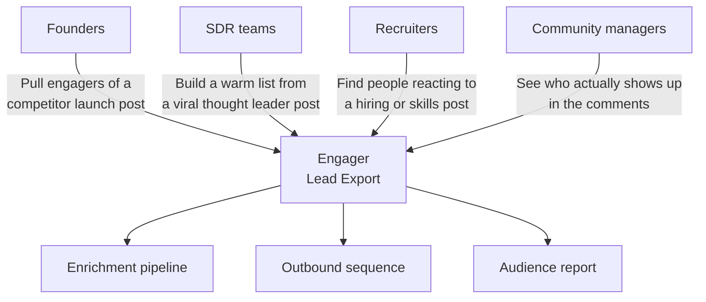
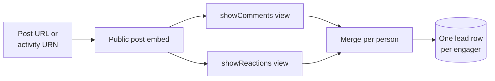
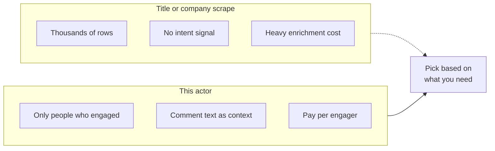

# LinkedIn Post Engagers Scraper and Lead Export Tool

Paste a LinkedIn post URL and export everyone who engaged with it. People who commented and people who reacted, merged into one clean lead row per person, with name, profile URL, headline, the comment they left, and the reaction they gave. Output as JSON, CSV, or Excel. No cookie, no login, no Sales Navigator seat.

Built for founders, SDR teams, demand gen marketers, recruiters, and community managers who want the warm audience already raising a hand on a post instead of cold scraping a whole title or company.

---

## Who uses this LinkedIn engagers scraper



| Role | What this scraper unlocks |
|---|---|
| **Founder** | The people who engaged with a competitor announcement, ready for a soft pitch |
| **SDR** | A warm list off a viral post in your category instead of a cold title scrape |
| **Demand gen** | Retargeting seed audience of self selected engaged accounts |
| **Recruiter** | People reacting to a skills, hiring, or layoff post in your space |
| **Community manager** | Who really shows up under your posts versus quiet followers |

---

## How the engagers scraper works



LinkedIn's authenticated API needs a session cookie. The public post embed does not. The actor reads the cookieless embed three times per post: the base card for author and counts, the comments view, and the reactions view. It then merges the two lists on profile URL, so a person who both commented and reacted becomes one row tagged with both signals, not two duplicate rows. That dedupe is the whole point of an engagers product.

Paste post URLs or raw activity URNs. Mix many posts in one run. Each engager row carries the post it came from, so a multi post run still sorts cleanly by campaign.

---

## Cold scrape vs engager scrape



| Feature | Cold list scrape | This actor |
|---|---|---|
| Intent | None, you guess fit | Person engaged with a relevant post |
| Context | Title only | Their comment text and reaction type |
| Volume | Huge, mostly noise | Tight, self selected |
| Pricing | Pay per profile regardless | Pay per engager, first 25 per run free |
| Access | Often needs a logged in cookie | Public embed, no cookie |

---

## Quick start

Pull every engager on one post:

```bash
curl -X POST "https://api.apify.com/v2/acts/scrapemint~linkedin-post-engagers-scraper/run-sync-get-dataset-items?token=YOUR_TOKEN" \
  -H "Content-Type: application/json" \
  -d '{
    "postUrls": [
      "https://www.linkedin.com/feed/update/urn:li:activity:7180000000000000000/"
    ]
  }'
```

Commenters only across three competitor posts, capped at 200 each:

```json
{
  "postUrls": [
    "https://www.linkedin.com/posts/competitor-one_launch-activity-7180000000000000000-abcd",
    "https://www.linkedin.com/posts/competitor-two_news-activity-7181000000000000000-efgh",
    "urn:li:activity:7182000000000000000"
  ],
  "scrapeComments": true,
  "scrapeReactions": false,
  "maxEngagersPerPost": 200
}
```

---

## What one engager record looks like

```json
{
  "kind": "engager",
  "postId": "7180000000000000000",
  "postUrl": "https://www.linkedin.com/feed/update/urn:li:activity:7180000000000000000/",
  "postAuthor": "Jane Founder",
  "name": "Sam Buyer",
  "profileUrl": "https://www.linkedin.com/in/sambuyer/",
  "headline": "Head of Growth at Acme",
  "engagedVia": ["comment", "reaction"],
  "commentText": "This is exactly the problem we hit last quarter.",
  "commentedAt": "2026-05-12T09:14:00.000Z",
  "reactionType": "INTEREST",
  "scrapedAt": "2026-05-18T19:30:00.000Z"
}
```

Every run also pushes one `kind: "post"` summary row per post with the author, a body snippet, and total reaction, comment, and repost counts so each lead has context. That summary row is not charged.

---

## A note on coverage

This actor reads the public post embed, not the logged in feed. The embed exposes the public commenter and reaction lists, which for most public posts is the full set and for very high volume posts is a large public sample. It does not bypass LinkedIn login or scrape anything that requires a member session. Use the Apify residential proxy for reliable rendering at volume.

---

## Pricing

First 25 engagers per run are free. After that you pay per engager extracted, deduped so a person who both commented and reacted is charged once. The post summary row is never charged. 1000 engagers lands under $5 on the Apify free plan.

---

## FAQ

**Can this get the people who liked a LinkedIn post?**
Yes. Turn on reactors and each row carries the reaction type. Turn on commenters for the comment text. Most users keep both on and let the actor merge them.

**Does a person who both commented and reacted show up twice?**
No. They merge into one row with `engagedVia` listing both. That dedupe is the core of the product.

**Do I need a LinkedIn login or cookie?**
No. The actor uses the public post embed. No session, no Sales Navigator seat.

**What post URL formats work?**
Full share URLs like `linkedin.com/posts/{handle}_..._activity-{id}-{code}`, feed update URLs, and raw `urn:li:activity:{id}` strings.

**Is scraping LinkedIn post engagement legal?**
The post embed is a public surface LinkedIn itself serves without login. Only use the output in line with your own policies and applicable law.

**How do I enrich these leads with email?**
Pipe the dataset into Scrapemint Lead Enrichment Pipeline keyed on the profile URL.

**Can I run this on a schedule?**
Yes. Use the Apify Scheduler to re run a post daily and capture new engagers as they trickle in, then webhook fresh rows to your CRM.

---

## Related actors by Scrapemint

- **LinkedIn Profile & Company Post Tracker** to find the posts worth pulling engagers from
- **LinkedIn Creator Ranker** to surface the viral posts in a niche first
- **LinkedIn Company Employees Scraper** for org wide prospecting
- **Lead Enrichment Pipeline** to add email and firmographics to each engager
- **LinkedIn Profile Scraper** for full detail on a shortlisted engager

Stack these to go from a single viral post to an enriched outbound list.
