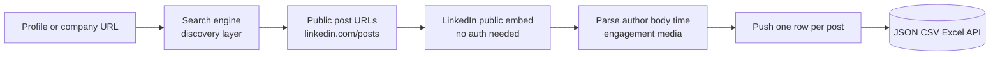
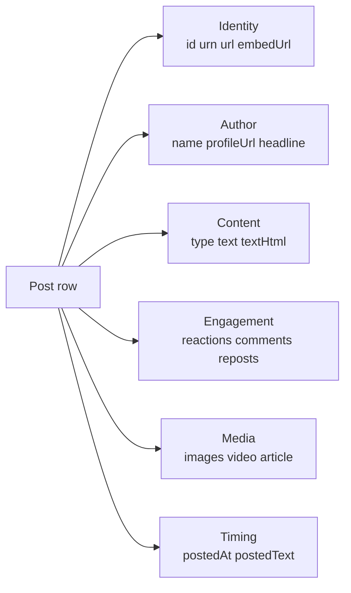

# LinkedIn Posts Scraper — Profile & Company Post Tracker (No Login Required)

Pull every public post from any LinkedIn profile or company page. No cookies. No login. No Sales Navigator seat. Each row ships the post text, the author block, the post type (original, quote, repost), engagement counts, media URLs, and a parsed timestamp. Pay per post. Optional reactions and comments billed separately.

**Built for** B2B sales teams, recruiters, agencies, founders, and competitive intelligence teams who want a clean structured feed of LinkedIn content for outreach, lead generation, and content benchmarking.

**Keywords this actor ranks for:** linkedin posts scraper, linkedin profile scraper no login, linkedin company posts api, scrape linkedin without cookie, linkedin post scraper api, linkedin engagement tracker, linkedin reactions scraper, linkedin comments scraper, linkedin posts to json, linkedin lead scraper, linkedin reposts scraper, linkedin executive content tracker, linkedin post monitoring tool, linkedin scraper free.

---

## Why this actor

| Other LinkedIn scrapers | **This actor** |
|---|---|
| Need your session cookie | Zero cookies, zero login |
| Risk your account on every run | Touches only public surfaces |
| One blob of fields per post | Three post types tagged: original, quote, repost |
| Reactions and comments rarely included | Each reactor and commenter pushed as its own row |
| Timestamps go missing on older posts | Snowflake id decoded as fallback so every row has a date |

---

## How it works



Discovery happens through search engines that already index public LinkedIn posts (the same way Google shows your name in results). Each post is then fetched from LinkedIn's own embed endpoint, the URL pattern third party sites use to embed a LinkedIn post on their own pages. No cookie passes through the actor at any stage.

---

## What you get per row



Turn on `scrapeReactions` or `scrapeComments` and each reactor and each commenter ships as their own dataset row with profile URL attached. Pipe straight into a CRM, a lookalike audience builder, or a sourcing pipeline.

---

## Quick start

**Track posts from one CEO and one company**

```json
{
  "targetUrls": [
    "https://www.linkedin.com/in/satyanadella/",
    "https://www.linkedin.com/company/openai/"
  ],
  "maxPosts": 25
}
```

**Sales prospecting (last 30 days, original posts only)**

```json
{
  "targetUrls": ["https://www.linkedin.com/in/jeffweiner08/"],
  "maxPosts": 50,
  "postedLimitDate": "2026-03-25",
  "includeReposts": false,
  "includeQuotePosts": false
}
```

**Engagement audit (pull reactions and comments per post)**

```json
{
  "targetUrls": ["https://www.linkedin.com/company/anthropic/"],
  "maxPosts": 10,
  "scrapeReactions": true,
  "maxReactions": 100,
  "scrapeComments": true,
  "maxComments": 100
}
```

**Recruiter sourcing (find people who reacted to a hiring exec)**

```json
{
  "targetUrls": ["https://www.linkedin.com/in/aaronlevie/"],
  "maxPosts": 20,
  "scrapeReactions": true,
  "maxReactions": 50
}
```

---

## Sample output

**Post row**

```json
{
  "id": "7188910214502764544",
  "url": "https://www.linkedin.com/posts/satyanadella_the-future-of-ai-activity-7188910214502764544",
  "type": "original",
  "author": {
    "name": "Satya Nadella",
    "url": "https://www.linkedin.com/in/satyanadella/",
    "headline": "Chairman and CEO at Microsoft"
  },
  "text": "AI is the new electricity ...",
  "postedAt": "2026-04-21T14:00:00.000Z",
  "engagement": { "reactions": 12400, "comments": 318, "reposts": 540, "total": 13258 },
  "media": { "images": ["https://media.licdn.com/dms/image/..."], "videoUrl": null },
  "scrapedAt": "2026-04-25T10:00:00.000Z"
}
```

**Reaction row** (only when `scrapeReactions` is on)

```json
{
  "kind": "reaction",
  "postId": "7188910214502764544",
  "reactor": { "name": "Reid Hoffman", "profileUrl": "https://www.linkedin.com/in/reidhoffman/" },
  "reactionType": "praise"
}
```

**Comment row** (only when `scrapeComments` is on)

```json
{
  "kind": "comment",
  "postId": "7188910214502764544",
  "commenter": { "name": "Lisa Su", "profileUrl": "https://www.linkedin.com/in/lisa-su/" },
  "text": "Couldn't agree more. The compute story is just getting started."
}
```

---

## Who uses this

| Role | Use case |
|---|---|
| B2B sales | Track an executive buyer's posts for fresh outreach hooks |
| Demand gen | Pull reactors on a competitor's launch and pipe to a lookalike audience |
| Recruiter | Watch a hiring manager's posts, then enrich the comments to find candidates |
| Agency | Build engagement dashboards for client executives without asking for cookies |
| Founder | Watch competitor CEOs ship narratives in real time |
| M&A scout | Use founder posts at private companies as a signal layer next to hiring data |
| Content team | Benchmark format performance across a peer set with reactions and comments split out |

---

## Input reference

| Field | Type | What it does |
|---|---|---|
| `targetUrls` | string[] | LinkedIn profile or company URLs. Required. |
| `maxPosts` | integer | Cap per target URL. 0 means everything we can discover. |
| `postedLimitDate` | string | Drop posts older than this date. ISO date or millisecond timestamp. |
| `includeQuotePosts` | boolean | Include reshares with new commentary. Default true. |
| `includeReposts` | boolean | Include reshares with no commentary. Default true. |
| `scrapeReactions` | boolean | Push one row per reactor. Charged per reaction row. |
| `maxReactions` | integer | Cap reactions per post. 0 means every reaction LinkedIn exposes. |
| `scrapeComments` | boolean | Push one row per commenter. Charged per comment row. |
| `maxComments` | integer | Cap comments per post. 0 means every comment LinkedIn exposes. |
| `concurrency` | integer | Profiles processed in parallel. Six is the safe default. |
| `proxyConfiguration` | object | Apify proxy. Residential is required at any meaningful volume. |

---

## API call

```bash
curl -X POST \
  "https://api.apify.com/v2/acts/YOUR_USER~linkedin-profile-posts-scraper/runs?token=YOUR_TOKEN" \
  -H "Content-Type: application/json" \
  -d '{
    "targetUrls": ["https://www.linkedin.com/in/satyanadella/"],
    "maxPosts": 50,
    "postedLimitDate": "2026-03-01"
  }'
```

---

## Pricing

The first few posts per run are free so you can validate output before paying. After that, each post row is charged. Reaction rows and comment rows are billed separately and only when those toggles are on, so the base run cost stays low when you only need post text and engagement counts.

---

## FAQ

### Do I need a LinkedIn account or cookie?

No. The actor only touches LinkedIn's public embed endpoint and post share URLs that LinkedIn lets search engines index. Your account is never touched.

### How does discovery work without my cookie?

A search engine site query finds public LinkedIn post URLs from the target profile or company. Public LinkedIn post URLs are designed to be indexed, which is why your own posts show up in Google when people search your name. The actor pulls each post from LinkedIn's public embed endpoint after that.

### Will I find every post a profile has ever published?

You will find every post that has been indexed publicly. Very recent posts may take a day or two to appear. Posts behind a login wall to anonymous viewers will not be discoverable.

### How fresh is the data?

Each run hits the live embed page for every post, so reaction counts, comment counts, and repost counts are current at scrape time. Schedule daily runs to track velocity over time.

### Can I scrape comments and reactions on every post?

Yes. Turn on `scrapeReactions` and `scrapeComments`. Each reactor and each commenter ships as their own row so you can pipe them straight into a CRM or audience tool.

### Why is the post type tagged "quote" or "repost"?

LinkedIn lets users reshare a post. With added commentary it is a quote post. With no commentary it is a repost. Both are useful signals and both can be filtered out at input time.

### Why is `engagement.reactions` sometimes null?

LinkedIn does not always render the reaction counter on the embed page when traffic on a post is low. The body, author, and timestamp will still be populated.

### Can I run this on a schedule?

Yes. Use the Apify scheduler for hourly or daily runs. Combine with `postedLimitDate` to only push fresh posts since the last run.

### Is scraping LinkedIn allowed?

This actor reads HTML any anonymous web visitor can see. Respect LinkedIn's terms and rate limit sensibly. Do not redistribute commenter or reactor identities you have no lawful basis to process.

---

## Related actors

- **LinkedIn Hiring Tracker & Salary Intelligence** — parsed salary, tech stack, and seniority on every job row
- **Reddit Brand Monitor & Lead Finder** — subreddit mentions and high intent leads
- **Instagram Influencer Analyzer & Sponsored Post Tracker** — creator engagement and paid partnership detection
- **TikTok Scraper** — creator stats, reels, and music data
- **Google Maps Scraper** — local business data and reviews
